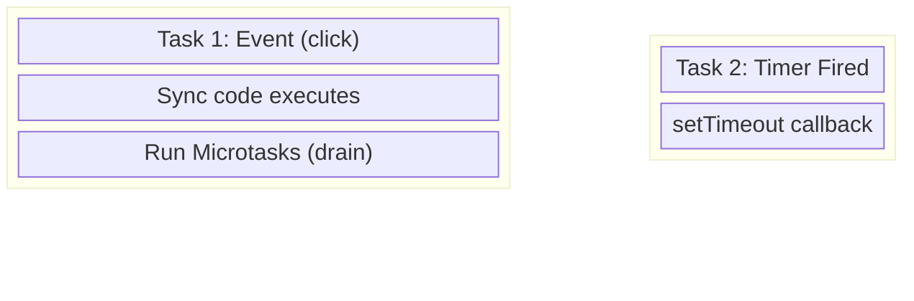
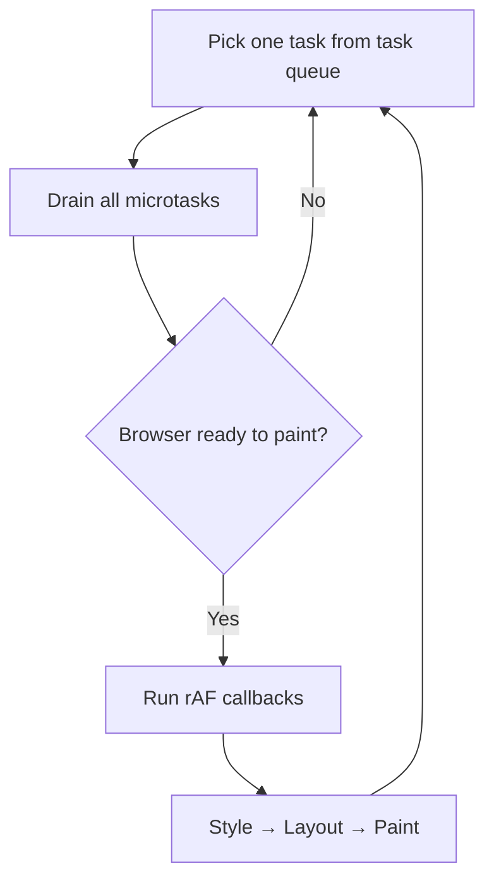

# Animations & requestAnimationFrame

**TL;DR:** `requestAnimationFrame` (rAF) runs callbacks during the render step — after microtasks drain, before paint. It syncs to the display's refresh rate, pauses in background tabs, and provides a high-resolution timestamp for frame-rate-independent animation. `setInterval` for animation is broken by design: it drifts from vsync, wastes work, and produces jitter.

## Debugging Async in DevTools

Two tools make the event loop model visible:

### Async stack traces (Sources tab)

Set a breakpoint inside an async callback (e.g. inside a `setTimeout`). The Call Stack panel shows:

```
(anonymous)              ← the callback, currently paused
--- setTimeout ---       ← async boundary marker
(anonymous)              ← the code that originally called setTimeout
```

Below the boundary: frames that existed when the async operation was registered — reconstructed by DevTools. At runtime those frames are gone (the stack emptied before the callback ran). DevTools stitches them back so you can trace the causal chain across async boundaries.

### Performance tab (Main thread)

Record a page interaction. The Main thread lane shows:

- **Yellow blocks** — tasks (one per task queue entry)
- **Nested bars inside** — function calls within that task
- **"Run Microtasks" sub-block** — the microtask drain, visible inside the task block
- **Green blocks/strip** — paint/render step
- **Gaps between task blocks** — event loop cycling

For a click handler with microtasks and a setTimeout:



Microtasks are **inside** Task 1 (they drain before the task ends). The setTimeout callback is a **separate task block**. The gap between them is where the render step lives.

## Why `setInterval` Breaks Animation

```js
let x = 0;
setInterval(() => {
  x += 1;
  box.style.left = x + "px";
}, 16); // aiming for 60fps
```

Four problems:

| Problem                | Cause                                                                                                      |
| ---------------------- | ---------------------------------------------------------------------------------------------------------- |
| Refresh rate mismatch  | 16ms ≠ 8.3ms (120Hz) or 6.9ms (144Hz). Hard-coded interval skips frames on fast displays.                  |
| Vsync drift            | Timer fires on its own clock, not synced to when the browser paints. Updates land between frames → jitter. |
| Background waste       | Tab hidden? Timer keeps firing. CPU and battery burned for invisible work.                                 |
| No render coordination | Update might force re-layout at the wrong time in the pipeline (layout thrashing).                         |

The fundamental issue: `setInterval` is a **task queue** primitive. It knows nothing about the render pipeline. Animation needs to be synced to paint, not to an arbitrary timer.

## `requestAnimationFrame`

### Where it lives in the event loop



rAF callbacks fire during the **render step** — after microtasks drain, before paint. The browser doesn't render every loop iteration; it renders at the display's refresh rate. Between renders, tasks and microtasks run freely.

### Scheduling priority proof

```js
console.log("sync");
requestAnimationFrame(() => console.log("raf"));
Promise.resolve().then(() => console.log("micro"));
setTimeout(() => console.log("task"), 0);
// Output: sync, micro, raf, task
```

Confirms the order: sync → microtask drain → rAF (render step) → next task.

### API

```js
const id = requestAnimationFrame(callback);
cancelAnimationFrame(id);
```

- `callback` receives a `DOMHighResTimeStamp` — ms since page load, sub-millisecond precision.
- Fires **once**. For a loop, re-schedule inside the callback.
- Pauses when the tab is hidden. Resumes when visible.

### The animation loop pattern

```js
let x = 0;

function step(timestamp) {
  x += 1;
  box.style.left = x + "px";
  if (x < 500) requestAnimationFrame(step);
}

requestAnimationFrame(step);
```

Each call: update DOM → request next frame. Browser paints after `step` returns. Next vsync → `step` runs again.

### Frame-rate independence

`x += 2` per frame means 120fps moves twice as fast as 60fps. The animation is frame-count-dependent.

Fix: compute position from elapsed wall-clock time using the timestamp parameter.

```js
let start;
function step(timestamp) {
  if (!start) start = timestamp;
  const speed = (2 * 60) / 1000; // 2px/frame × 60fps = 120px/sec = 0.12 px/ms
  const elapsed = timestamp - start;
  const x = Math.min(elapsed * speed, 400); // caps at 400px
  box.style.left = x + "px";
  if (x < 400) requestAnimationFrame(step);
}
requestAnimationFrame(step);
```

Same animation duration regardless of refresh rate. The timestamp is the source of truth, not the frame count.

### When NOT to use rAF

- Non-visual work (polling, retries) → use `setTimeout`
- Work that must run in background tabs → `setTimeout` (rAF pauses)
- Immediate async scheduling → `queueMicrotask` or `Promise.resolve().then()`

## Why Microtask-Based "Animation" Fails

```js
function animate() {
  x += 2;
  box.style.left = x + "px";
  if (x < 400) Promise.resolve().then(animate);
}
animate();
```

Each call schedules the next as a microtask. The microtask drain runs all 200 iterations before the render step gets a turn. Result: the box teleports from 0 to 400px in one paint. No visible animation — just a freeze then a jump.

The render step lives **after** the microtask drain. If the drain never finishes (or runs hundreds of iterations), no paint happens until it's done.

## Scheduling Summary

| API                     | Queue/Phase     | Fires                  | Use for                                     |
| ----------------------- | --------------- | ---------------------- | ------------------------------------------- |
| `setTimeout`            | Task queue      | Once, after ≥ delay    | Deferred work, yielding for responsiveness  |
| `setInterval`           | Task queue      | Repeatedly             | Polling (not animation)                     |
| `queueMicrotask`        | Microtask queue | Once, before next task | High-priority continuation                  |
| `requestAnimationFrame` | Render step     | Once per paint         | Animation, DOM reads/writes synced to paint |
