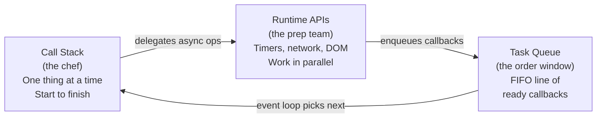

# Event Loop Basics

**TL;DR:** The event loop is a simple loop: check if the call stack is empty → if yes, take the next callback from the task queue and push it onto the stack. Nothing runs while the stack is occupied. The task queue is FIFO — callbacks execute in the order they were enqueued.

## The Call Stack

A LIFO (last in, first out) structure tracking which function is currently executing. Every function call pushes a frame; every return pops one.

```js
function greet(name) {
  return `Hello, ${name}`;
}

function processUser(name) {
  const greeting = greet(name);
  console.log(greeting);
}

processUser("Alice");
```

Stack at each step:

```
1. [processUser]
2. [processUser, greet]          ← greet called
3. [processUser]                  ← greet returns
4. [processUser, console.log]    ← console.log called
5. [processUser]                  ← console.log returns
6. []                             ← processUser returns
```

The key rule: **nothing else can run while the stack is non-empty.** The event loop waits. Queued callbacks wait. DOM events wait. Repaints wait. Everything waits for the stack to drain.

## The Task Queue (Callback Queue)

When the runtime finishes an async operation (timer fires, network response arrives, click happens), it places the associated callback into the **task queue** — a FIFO (first in, first out) queue.

The event loop algorithm:

1. Is the call stack empty?
2. If yes → take the **first** callback from the task queue, push it onto the call stack.
3. Repeat.

One callback per iteration. After each callback finishes and the stack empties, the event loop checks again.

## Tracing Execution

```js
console.log("Start");
setTimeout(() => console.log("Timeout"), 0);
console.log("End");
```

| Step | Call Stack                      | Task Queue | What Happens                                                                               |
| ---- | ------------------------------- | ---------- | ------------------------------------------------------------------------------------------ |
| 1    | `console.log("Start")`          | —          | Prints "Start", pops                                                                       |
| 2    | `setTimeout(cb, 0)`             | —          | Engine calls runtime's timer API. Runtime starts 0ms timer. `setTimeout` pops immediately. |
| 3    | `console.log("End")`            | `[cb]`     | Timer fires on runtime thread, `cb` enqueued. Engine prints "End", pops.                   |
| 4    | `cb` → `console.log("Timeout")` | —          | Stack empty → event loop picks `cb`. Prints "Timeout".                                     |

Output: `Start`, `End`, `Timeout`.

Steps 2–3 overlap in real time: the runtime's timer thread fires while the engine is still executing synchronous code. But the callback **cannot run** until the stack is empty.

## setTimeout Delay Is a Minimum

```js
function heavyWork() {
  const start = Date.now();
  while (Date.now() - start < 3000) {} // spin 3 seconds
}

setTimeout(() => console.log("Timer"), 0);
heavyWork();
console.log("After");
```

Output: (3 second freeze), `After`, `Timer`.

The timer fires almost immediately, but the callback sits in the queue for 3 seconds because `heavyWork()` is hogging the stack. Actual delay = specified delay + time for the stack to empty.

## Ordering Guarantees

Two `setTimeout` calls with the same delay: callbacks are **guaranteed** to run in registration order. The task queue is FIFO, and the runtime enqueues in the order the timers were registered.

```js
setTimeout(() => console.log("A"), 0);
setTimeout(() => console.log("B"), 0);
// Always: A, B
```

Where ordering gets unpredictable: mixing **different** async sources (timer + click event + network response resolving around the same time). Those come from different runtime subsystems, and interleaving isn't guaranteed.

## Mental Model



- **Call stack** = the chef. One dish at a time, never interrupted mid-dish.
- **Runtime APIs** = the prep team. Multiple workers, handling I/O in parallel.
- **Task queue** = the order window. Finished items line up, first in first out.
- **Event loop** = the expediter. Checks: is the chef free? If yes, hand them the next item.

The chef never gets interrupted. The prep team works independently. The expediter only passes work when the chef's hands are empty.
