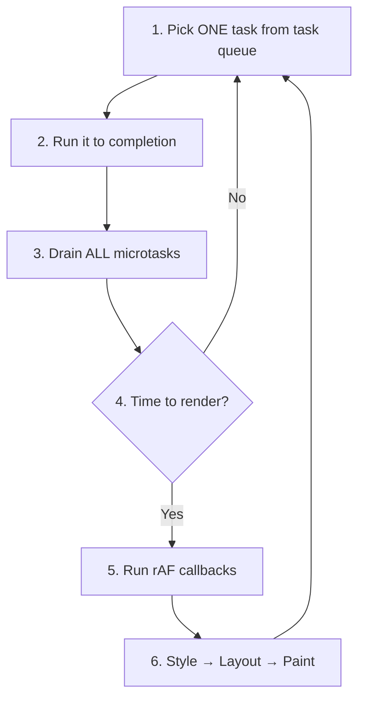

# The Complete Event Loop Model

**TL;DR:** The browser event loop is a six-step cycle: pick one task → run it → drain all microtasks → (if time to paint) run rAF callbacks → style/layout/paint → repeat. Every async behavior — callback ordering, promise atomicity, animation smoothness, page freezes — is a consequence of this loop.

## The Loop

Six steps. That's it.

## The Three Layers

| Layer                         | What                                                            | Solves      |
| ----------------------------- | --------------------------------------------------------------- | ----------- |
| **Engine** (V8, SpiderMonkey) | Call stack, executes JS one frame at a time                     | Computation |
| **Runtime** (browser/Node)    | Web APIs, thread pool, I/O — delegates work off the main thread | Blocking    |
| **Event loop**                | Coordinates when callbacks re-enter the engine                  | Ordering    |

The engine is single-threaded. The runtime is not. The event loop is the bridge — it decides _when_ completed async work gets back onto the call stack.

## The Scheduling Hierarchy

From highest to lowest priority:

1. **Sync code** — runs now, blocks everything.
2. **Microtasks** — drain completely after every task. Promise chains, `await` continuations, `queueMicrotask`.
3. **Render step** — rAF callbacks, style/layout/paint. Only when the browser decides to paint.
4. **Tasks** — one per loop iteration. `setTimeout`, DOM events, I/O.

Microtasks are "finish what you started" (high priority, same logical unit). Tasks are "start something new" (lower priority, separate logical unit).

## The Rules That Explain Everything

1. **The stack must be empty** before any callback runs.
2. **Microtasks drain fully** before the next task or render — including microtasks spawned during the drain.
3. **One task per cycle** — then microtasks, then maybe render, then next task.
4. **try/catch can't cross async boundaries** — the original stack is gone by the time the callback runs.
5. **Yielding for responsiveness requires the task queue** — microtask yielding starves the page.

## What Changed From the Simple Model

The [simple model](event-loop-basics.md) was: call stack + one task queue + event loop picks callbacks when the stack is empty. What got added:

- **Microtask queue** — explains why promises run before timers, why chains are atomic. See [microtasks](microtasks.md).
- **Render step** — explains where rAF lives, why `setInterval` animation jitters. See [animations](animations.md).
- **"Time to render?" decision** — the browser doesn't paint every cycle, only at refresh rate.

The simple model wasn't wrong — it was incomplete. The full model is the same loop with two more stops.

## The Course Arc in One Paragraph

Async exists because the engine is single-threaded but the world isn't. [Callbacks](callbacks.md) were the first solution — simple but composability nightmares. [Promises](promise-fundamentals.md) added a language-level primitive with state machines and microtask scheduling — composable, chainable, catchable. [Async/await](async-await.md) is syntax sugar over promises — same scheduling, cleaner code. The event loop with its two queues and render step is the execution model underneath all of it. Everything is "later, not parallel" — and the loop decides what "later" means.
