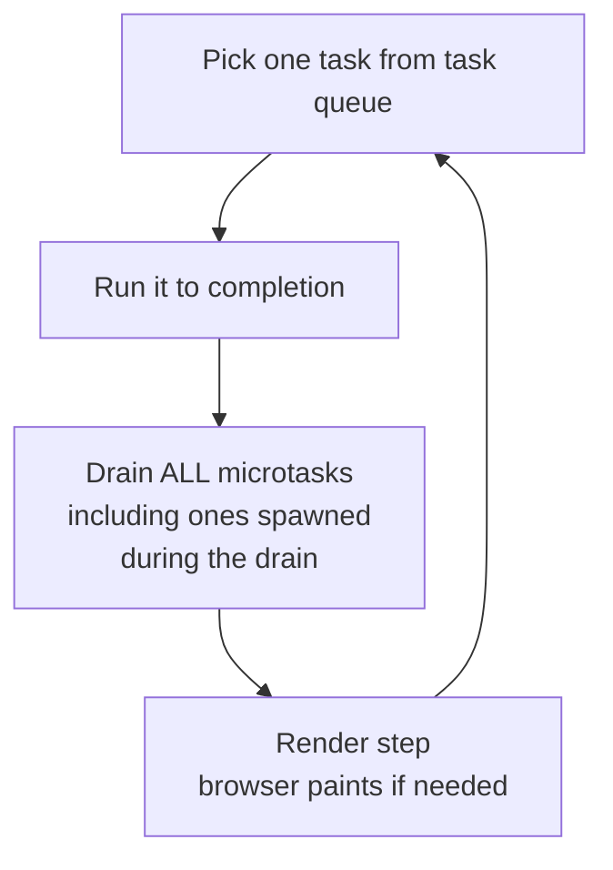

# Microtasks & Task Priorities

**TL;DR:** The event loop has two queues, not one. The task queue (`setTimeout`, DOM events, I/O) runs one callback per cycle. The microtask queue (promise `.then`, `await` continuations, `queueMicrotask`) fully drains between every task. Microtasks always finish before the next task or render — which makes promise chains atomic with respect to external events, but also means microtasks can starve the page.

## The Two-Queue Model

The [simple model](event-loop-basics.md) — one task queue, FIFO — can't explain this:

```js
console.log("1");
setTimeout(() => console.log("2"), 0);
Promise.resolve().then(() => console.log("3"));
console.log("4");
// Output: 1, 4, 3, 2
```

The promise callback ran before the timer callback, even though both were enqueued during the same sync phase. They're in different queues.

- **Task queue** (aka macrotask queue) — `setTimeout`, `setInterval`, DOM events, I/O callbacks.
- **Microtask queue** — `.then()` / `.catch()` / `.finally()`, `await` continuations, `queueMicrotask()`, `MutationObserver`.

Updated event loop algorithm:



Key rule: **microtasks always drain completely before the next task or render**. The queue must be empty before the loop moves on — so microtasks spawned by microtasks run in the same drain cycle.

## Why Two Queues

Not arbitrary. The design encodes a priority decision:

- **Microtasks = finish what you started.** A promise settled — the code waiting on it should run _now_, before the world changes. Nothing external (no timer, click, or network) gets to interleave.
- **Tasks = start something new.** External events each get their own turn, one at a time.

The consequence: promise chains run as a continuous logical unit. Between one `.then()` and the next, no task runs, no rendering happens. The whole chain is atomic with respect to the outside world.

## Deriving the Scheduling Behavior

Two fundamentals explain every promise scheduling quirk:

### Fundamental 1: A promise is a state machine with a reactions list

```
promise = {
  state: "pending" | "fulfilled" | "rejected",
  result: <value or reason>,
  reactions: [handler, handler, ...]  // callbacks waiting for settlement
}
```

A sign-up sheet for when the value arrives.

### Fundamental 2: `.then(handler)` either schedules now or registers for later

```
then(handler):
  if promise is already settled:
    microtaskQueue.enqueue(handler)   // run soon
  else:  // pending
    promise.reactions.push(handler)   // wait for settlement
```

That's the entire algorithm. No third case.

Settlement is the other half:

```
settle(promise, value):
  promise.state = "fulfilled"
  promise.result = value
  for handler in promise.reactions:
    microtaskQueue.enqueue(handler)
  promise.reactions = []
```

Settlement walks the reactions list exactly once, draining it into the microtask queue.

### Applying the fundamentals to a chain

Split execution into two phases to see it clearly: **SETUP** (the sync pass when the code is first reached) and **LATER** (the microtask drain).

`.then()` itself is a synchronous method call — it runs during SETUP, not LATER. What runs LATER is the _handler_ it registered. Conflating the two is the usual source of confusion.

```js
Promise.resolve() // SETUP: P0 = { state: fulfilled, reactions: [] }
  .then(cbB) // SETUP: P0 is settled → cbB enqueued to microtask queue now
  //         returns P1 = { state: pending, reactions: [] }
  .then(cbD); // SETUP: P1 is pending → cbD pushed onto P1.reactions
//            returns P2 = { state: pending, reactions: [] }
```

State at the end of SETUP:

- Microtask queue: `[cbB]`
- `P1.reactions = [cbD]`
- `cbD` is **not** in any queue yet.

LATER (microtask drain begins):

1. `cbB` runs, returns a value. Engine calls `settle(P1, value)` as bookkeeping.
2. Settlement walks `P1.reactions`, enqueues `cbD` onto the microtask queue.
3. Drain loop picks `cbD` on the next iteration — still inside the same drain.

This is not a special "chain behavior" — it's fundamentals 1 and 2 composed. No tick boundary, no yield, no gap. `cbD`'s appearance in the queue is a side effect of `cbB` returning, bookkept by the engine synchronously as part of settlement.

The SETUP/LATER split generalizes: whenever you see a chain, ask _what ran during SETUP_ (all the `.then()` calls, plus handlers on already-settled promises get enqueued) vs _what runs LATER_ (everything else, triggered by settlement cascades during the drain).

### `await` uses the same machinery

`await expr` desugars roughly to:

```
Promise.resolve(expr).then(continuation);
suspend the async function;
```

So `await null` wraps `null` in a fulfilled promise and calls `.then()` on it — the continuation goes to the microtask queue by fundamental 2. There's no separate "await scheduling mechanism" — everything is promises under the hood.

## Microtasks Spawn Microtasks

Since settlement enqueues during a drain that's still running, handlers can cascade without yielding:

```js
Promise.resolve().then(() => {
  console.log("A");
  Promise.resolve().then(() => console.log("B"));
});
setTimeout(() => console.log("C"), 0);
// Output: A, B, C
```

The `A` microtask schedules `B` while the drain loop is still running. The loop sees `B` on its next iteration. Only after the queue is empty does `C` (the task) run.

This can starve the task queue entirely:

```js
function forever() {
  Promise.resolve().then(forever);
}
forever(); // page freezes — render and tasks never get a turn
```

Each call schedules another microtask before returning. The drain loop never terminates. No render, no input, nothing. The microtask equivalent of `while(true)`.

## Handling Long Tasks

Long sync work blocks the event loop — no microtasks, no rendering, no input. The fix is to break work into chunks and yield between them. The catch: **you must yield to the task queue, not the microtask queue.**

### Wrong: promise-based yielding

```js
function processItems(items) {
  let i = 0;
  function nextChunk() {
    const end = Math.min(i + 100, items.length);
    while (i < end) doWork(items[i++]);
    if (i < items.length) Promise.resolve().then(nextChunk); // ❌
  }
  nextChunk();
}
```

Each `Promise.resolve().then(nextChunk)` schedules a microtask. The drain loop runs all of them back-to-back, because microtasks drain fully before the render step. Same freeze as a single long task.

### Right: task-based yielding

```js
function processItems(items) {
  let i = 0;
  function nextChunk() {
    const end = Math.min(i + 100, items.length);
    while (i < end) doWork(items[i++]);
    if (i < items.length) setTimeout(nextChunk, 0); // ✓
  }
  nextChunk();
}
```

`setTimeout` schedules a new **task**. Between tasks, the event loop drains microtasks, renders, and handles input. Total work is the same, but the page stays responsive.

Rule: if you want the browser to breathe (paint, react to clicks), yield to the task queue. Microtask yielding is useless for responsiveness.

## `queueMicrotask()`

An explicit way to schedule a microtask without creating a promise for it:

```js
queueMicrotask(() => {
  console.log("runs after current sync code, before next task");
});
```

Behaves identically to `Promise.resolve().then(fn)` for scheduling. Cleaner when you want microtask priority but don't need a promise.

Not to be confused with yielding for long tasks — `queueMicrotask` has the same starvation problem as `.then()` chains.

## Event Handler Atomicity

A user clicks twice in quick succession:

```js
button.addEventListener("click", () => {
  console.log("start");
  Promise.resolve().then(() => console.log("promise"));
  console.log("end");
});
```

Output (click 1): `start, end, promise`. Output (click 2): `start, end, promise`. Never interleaved.

The guarantee is structural, not timing-based:

- Each click handler invocation is its own **task**.
- The event loop runs one task to completion, drains microtasks, then picks the next task.
- Click 2's task cannot start until click 1's task finishes AND its microtasks drain.

Even if both clicks landed instantaneously, the order would be the same. There's no slot in the event loop model for "interleave two tasks." JS is single-threaded; tasks are atomic; microtasks drain between them.

This is why you can rely on promise chains triggered by an event to complete before the next event handler sees the world.

## Scheduling Sources Summary

| Source                                                    | Queue       | Priority                         |
| --------------------------------------------------------- | ----------- | -------------------------------- |
| `setTimeout` / `setInterval`                              | Task        | Normal — waits its turn          |
| DOM events (click, input, etc.)                           | Task        | Normal                           |
| I/O callbacks (network, file)                             | Task        | Normal                           |
| `.then()` / `.catch()` / `.finally()`                     | Microtask   | High — drains before next task   |
| `await` continuation                                      | Microtask   | High (same as `.then()`)         |
| `queueMicrotask()`                                        | Microtask   | High                             |
| `MutationObserver`                                        | Microtask   | High                             |
| `requestAnimationFrame` (see [animations](animations.md)) | Render step | Between microtasks and next task |

## Mental Checklist for Ordering Questions

When reasoning about execution order:

1. List the sync code — runs first.
2. Identify scheduling points (`setTimeout`, `.then`, `await`, events). For each, ask: _which queue?_
3. Drain the microtask queue before any task.
4. Task queue: FIFO, one per cycle.
5. Nested scheduling: microtasks spawned during drain stay in the drain; tasks spawned during a task wait for the next cycle.

Every execution-order puzzle reduces to applying these rules mechanically.
