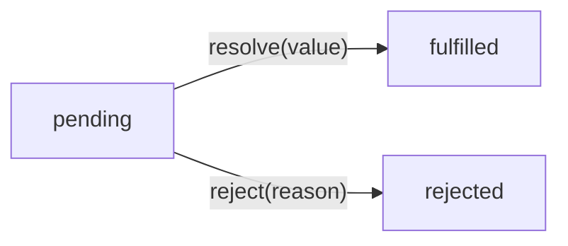

# Promise Fundamentals

**TL;DR:** A promise is a state machine (`pending → fulfilled | rejected`) that settles exactly once — the language-level fix for callback inversion of control. The executor runs synchronously; `.then()` handlers always run asynchronously (as microtasks). Rejections propagate through the chain until handled — missing a handler doesn't swallow the error, it passes it along.

## What Problem Promises Solve

Callbacks have three structural problems: inside-out composition, scattered error handling, and inversion of control (see [callback-problems.md](callback-problems.md)). Promises flip the model — instead of handing your callback to someone else, the async function gives _you_ an object representing the future result. You decide what to do with it.

## Promise States

A promise is a state machine with three states:



- **Pending** — initial state, async work in progress.
- **Fulfilled** — work succeeded, promise holds a result value.
- **Rejected** — work failed, promise holds a reason (typically an `Error`).

Once a promise moves to fulfilled or rejected, it's **settled**. The critical guarantee: **a promise settles exactly once.** Can't go back to pending, can't settle twice, can't switch from fulfilled to rejected. This is the structural fix for inversion of control — callbacks could be called twice or never; a promise settles once, enforced by the language.

## Creating a Promise

The `Promise` constructor takes an **executor** function that receives `resolve` and `reject`:

```js
const promise = new Promise((resolve, reject) => {
  // async work...
  // resolve(value) on success
  // reject(reason) on failure
});
```

The executor runs **immediately and synchronously** — a common misconception is that creating a promise defers execution. It doesn't. What's deferred is the `.then()` handler reaction.

```js
console.log("before");
const p = new Promise((resolve) => {
  console.log("inside executor"); // runs synchronously
  resolve("done");
});
console.log("after");
// Output: before, inside executor, after
```

## resolve and reject

Two levers that move the promise out of pending:

```js
const success = new Promise((resolve, reject) => {
  resolve(42); // fulfilled with value 42
});

const failure = new Promise((resolve, reject) => {
  reject(new Error("something broke")); // rejected with an Error
});
```

Key behaviors:

- **Only the first call matters.** `resolve()` then `reject()` → fulfilled. The reject is ignored. Vice versa. This is the settle-once guarantee.
- **`resolve` doesn't always mean fulfilled** — resolving with another promise makes the outer promise adopt the inner one's state (relevant for chaining).
- **`reject` should receive an `Error` object** — for stack traces and `instanceof` checks, same reasoning as the error-first convention.

### resolve/reject don't stop execution

`resolve()` and `reject()` are regular function calls, not control flow. Code after them keeps running:

```js
const p = new Promise((resolve, reject) => {
  resolve("done");
  console.log("still runs"); // prints!
  someArray.push("side effect"); // happens!
  reject(new Error("ignored")); // executes, no effect on promise
});
```

The later `resolve`/`reject` calls are harmless _to the promise_, but other code between them runs and can cause side effects. The `return resolve(...)` pattern prevents this:

```js
const p = new Promise((resolve, reject) => {
  if (badInput) return reject(new Error("bad"));
  // nothing below runs if we rejected
  doExpensiveWork();
  resolve(result);
});
```

`return` and `resolve`/`reject` are independent — `return` exits the executor, `resolve`/`reject` settles the promise. The Promise constructor ignores the executor's return value.

## Consuming with `.then()`

`.then()` attaches reactions to a promise:

```js
promise.then(onFulfilled, onRejected);
```

- `onFulfilled` — called if the promise fulfills, receives the value.
- `onRejected` — called if the promise rejects, receives the reason.

```js
const promise = new Promise((resolve) => {
  setTimeout(() => resolve("data loaded"), 1000);
});

promise.then(
  (value) => console.log(value), // "data loaded" — after 1 second
  (reason) => console.error(reason), // not called
);
```

### `.then()` handlers always run asynchronously

Even if the promise is already settled when `.then()` is attached, the handler is enqueued as a **microtask** — never called synchronously:

```js
const p = Promise.resolve("instant");
p.then((v) => console.log(v));
console.log("after .then()");
// Output: "after .then()", "instant"
```

This is a design choice for consistency — you never have to wonder "did this run sync or async?" like with callbacks.

### Enqueuing trigger

Whichever happens second — settling or attaching — triggers the microtask enqueue:

- **`resolve()` before `.then()`:** `.then()` sees the promise is already settled → enqueues the handler immediately.
- **`.then()` before `resolve()`:** `.then()` registers the handler and waits → `resolve()` settles the promise, sees a registered handler → enqueues it.

Either way, the handler runs after the stack drains.

## `.then()` Always Returns a New Promise

Every `.then()` call **always returns a new promise** — immediately, synchronously, at chain construction time. This happens before any handler runs. The handler's return value doesn't replace the promise — it determines what that already-existing promise **settles to**.

Two separate moments:

1. **Chain construction (synchronous):** `.then()` creates and returns a new promise. The next `.then()` is called on that promise — not on the handler's return value.
2. **Handler execution (async, microtask):** the handler runs, returns a value, and that value settles the promise that was already created in step 1.

```js
// These promises are created synchronously, right now:
const pB = promiseA.then(handler1); // pB exists immediately
const pC = pB.then(handler2); // called on pB, not on handler1's return value

// Later, when handler1 runs and returns 42:
// pB (which already exists) fulfills with 42
// handler2 receives 42 as its argument
```

What the handler returns controls the settlement:

| Handler returns       | `.then()` promise becomes                            |
| --------------------- | ---------------------------------------------------- |
| A regular value       | Fulfilled with that value                            |
| A promise             | Adopts that promise's state (waits for it to settle) |
| Throws an error       | Rejected with that error                             |
| Nothing (`undefined`) | Fulfilled with `undefined`                           |

The second row is the key to chaining async operations — when a handler returns a promise, the chain **waits** for it to settle before the next `.then()` handler fires.

## Rejection Propagation

When `.then()` has no `onRejected` handler, the rejection **propagates** — it passes through to the promise `.then()` returns and keeps flowing until something handles it:

```js
Promise.reject(new Error("oops"))
  .then((v) => console.log(v)) // no onRejected → passes through
  .then((v) => console.log(v)) // no onRejected → passes through
  .then(null, (e) => console.log(e.message)); // caught: "oops"
```

If nothing handles it, the runtime raises an **unhandled promise rejection** warning (browsers log it, Node.js can crash). This is a key improvement over callbacks, where forgetting `if (err)` meant errors silently vanished.

**Missing handler vs empty handler:**

```js
// A — missing handler: rejection propagates
p.then((val) => console.log(val));

// B — empty handler: rejection is swallowed (caught and ignored)
p.then(
  (val) => console.log(val),
  () => {},
);
```

Missing handler = propagation. Empty handler = swallowing.

## How Promises Fix Callback Problems

| Callback problem                                     | Promise solution                                 |
| ---------------------------------------------------- | ------------------------------------------------ |
| Inversion of control — trust the receiver            | Promise settles once, guaranteed by the language |
| Scattered error handling — `if (err)` at every level | Rejections propagate; handle in one place        |
| Inside-out composition — nested callbacks            | `.then()` returns a new promise → flat chaining  |

## Sidenote: Promises as Monads

> 📌 **Rabbit hole for later.** This isn't needed to use promises — it's a breadcrumb for when you want the deeper "why does this shape keep showing up" insight.

A promise is a value wrapped in a context (the async/pending/settled lifecycle) plus a way to chain operations over that value (`.then()`). That pattern — **a value in a context + a way to chain operations that also return values in contexts** — is a monad.

The monad interface, in its most distilled form, has two operations:

- **Wrap** a plain value into the context — `Promise.resolve(42)` puts `42` into the promise context.
- **Chain** (often called `flatMap` or `bind`) — `.then(fn)` takes a function that receives the unwrapped value and returns a new promise. The chain flattens: you get back a single promise, not a promise-of-a-promise.

That flattening is the key. Without it, chaining async operations would nest: `Promise<Promise<Promise<value>>>`. `.then()` automatically unwraps one layer, keeping the chain flat — exactly what `flatMap` does for arrays, `Option` types, `Result` types, and other monads.

**Related abstractions worth exploring later:**

- **Functor** — a value in a context + `.map()` (transform the value, stay in the context). Promises blur this — `.then()` acts as both `map` and `flatMap` depending on what the handler returns.
- **Applicative** — apply a function inside a context to a value inside a context. `Promise.all` is close: it takes multiple promise-wrapped values and combines them.
- **Monad laws** — three rules (left identity, right identity, associativity) that any well-behaved monad should satisfy. JS promises _almost_ satisfy them but break associativity in edge cases due to the auto-flattening behavior of `.then()`.

These concepts come from category theory via Haskell, but they show up everywhere: `Array.flatMap`, Rust's `Result`/`Option`, reactive streams (`Observable.pipe`). Understanding the pattern once makes all of them click.
