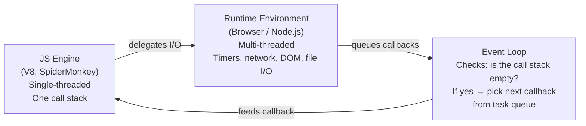

# What Is Asynchronicity?

**TL;DR:** JS engines are single-threaded (one call stack, one thing at a time). Async doesn't mean "runs in parallel" — it means "runs later, after the current work finishes." The runtime (browser/Node) handles slow I/O on separate threads; the event loop bridges results back to the engine.

## The Problem Async Solves

The JS engine (V8, SpiderMonkey, etc.) executes code on a **single thread** — one call stack, one operation at a time. If a slow operation like a network request ran synchronously, everything would block: no clicks, no rendering, no animations. The page freezes.

Async is the answer: _start the slow thing, keep doing other work, come back when it's done._

## Synchronous vs Asynchronous

**Synchronous** — line by line, each finishes before the next starts:

```js
console.log("A");
console.log("B");
console.log("C");
// Output: A, B, C — always.
```

**Asynchronous** — starts now, finishes later:

```js
console.log("A");
setTimeout(() => console.log("B"), 0);
console.log("C");
// Output: A, C, B — even with 0ms delay.
```

The 0ms `setTimeout` is the classic surprise. The callback `() => console.log("B")` gets handed to the runtime's timer mechanism. Even with 0ms delay, the runtime places the callback into the **task queue**, and the event loop only picks it up after the call stack is empty. So `C` prints first.

> The delay in `setTimeout` is a _minimum_, not a guarantee. 0ms means "as soon as possible after current work finishes," not "immediately."

## The Three-Part Model



- **JS engine:** executes your code. Single-threaded, one call stack. This is V8 (Chrome, Node), SpiderMonkey (Firefox), JavaScriptCore (Safari).
- **Runtime environment:** wraps the engine. Provides APIs like `setTimeout`, `fetch`, DOM events — these are **not** part of the engine. The runtime handles them on separate threads.
- **Event loop:** the bridge. When the runtime finishes an async operation, it places the callback in a task queue. The event loop checks: is the call stack empty? If yes, it picks the next callback and hands it to the engine.

## Why Single-Threaded (and That's Fine)

JS was designed for the browser — manipulating the DOM. Multiple threads writing to the DOM simultaneously would require locks, synchronization, and race condition handling. A single thread avoids all of that.

"Single-threaded" doesn't mean "can only do one thing ever." The _engine_ is single-threaded. The _runtime_ is not. When you call `fetch()`, the engine delegates the network I/O to the runtime and keeps executing whatever's next on the call stack. When the response arrives, the runtime queues a callback, and the event loop feeds it back to the engine when the stack is clear.
