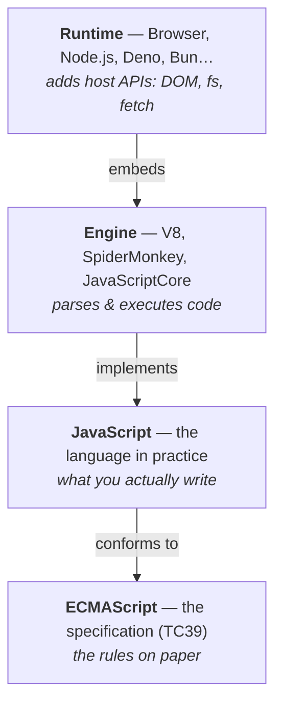
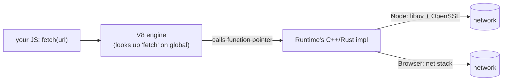

# ECMAScript, JavaScript, Engine, Runtime

**TL;DR**

- **ECMAScript** = the language *spec* (TC39). **JavaScript** = the language in practice. The name split is a trademark/historical accident, not a technical one.
- **Engine** = the program that runs ECMAScript (V8, SpiderMonkey, JavaScriptCore). Pure language calculator — no I/O, no timers, no DOM.
- **Runtime** = the host that embeds an engine and adds APIs for talking to the world (browser, Node, Deno, Bun).
- Mental model: **if it computes, it's in the engine. If it touches the outside world (time, network, disk, screen, user), it's in the runtime.**
- Same code can behave differently across runtimes with the *same engine* — because what differs is the host APIs, not the language.

---

## Why there's a split at all

JavaScript was born at Netscape in 1995 for interactive web pages. Microsoft cloned it as JScript for IE, the web started fracturing, and Netscape handed the language to **Ecma International** for neutral standardization. That spec couldn't be called "JavaScript" — the name was a Sun/Netscape trademark (today owned by Oracle). It got the committee-flavored name **ECMAScript** instead.

That's the origin of the split: **one name for the standard, another for the language as shipped.** The separate "engine" and "runtime" layers came from the same pragmatic pressure — the spec needed to be implementable by anyone, in any host context (not just a browser), so the language was kept narrow and everything environmental was pushed out to the host.

## The four layers



**ECMAScript** — the spec, maintained by TC39, released yearly (ES2015, ES2016, …). Defines syntax, semantics, and pure-language built-ins.

**JavaScript** — the language as used. Effectively ≈ ECMAScript; the distinction mostly matters for branding/trademark.

**Engine** — executes ECMAScript. Parser + bytecode interpreter + JIT + GC.

| Engine | Where it runs |
|---|---|
| V8 | Chrome, Node.js, Deno, Electron, Cloudflare Workers |
| SpiderMonkey | Firefox |
| JavaScriptCore (Nitro) | Safari, Bun |

**Runtime** (aka *host environment*) — embeds an engine and registers native APIs so JS can actually do something useful (I/O, DOM, network, timers, etc.). Also owns **the event loop**.

## What's actually in the engine (= all of ECMAScript)

Every conforming engine ships exactly this. If it's here, it works in *any* JS environment.

| Category | Members |
|---|---|
| Primitive wrappers | `String`, `Number`, `Boolean`, `BigInt`, `Symbol` |
| Collections | `Object`, `Array`, `Map`, `Set`, `WeakMap`, `WeakSet` |
| Functions & meta | `Function`, `Reflect`, `Proxy` |
| Errors | `Error`, `TypeError`, `RangeError`, `SyntaxError`, … |
| Async primitives | `Promise` (the type), generators, `async`/`await`, `queueMicrotask`\* |
| Binary data | `ArrayBuffer`, `SharedArrayBuffer`, `DataView`, typed arrays (`Uint8Array`…), `Atomics` |
| Utilities | `JSON`, `Math`, `Date`, `RegExp` |
| i18n | `Intl.*` |
| Globals | `globalThis`, `undefined`, `NaN`, `Infinity` |
| Syntax | `class`, `async/await`, `import/export`, optional chaining, … |

\* `queueMicrotask` is technically from HTML, but it wraps the engine's Job queue, which *is* in ECMAScript.

**Notice what's missing:** no I/O, no timers, no network, no DOM, no filesystem, no `console`, no module resolver. The engine is a language calculator. It doesn't know how to talk to the world.

## What the runtime adds

### Browser

| API | What it does |
|---|---|
| `window`, `document`, `navigator`, `location`, `history` | DOM + browsing context |
| `fetch`, `XMLHttpRequest`, `WebSocket`, `EventSource` | Network |
| `localStorage`, `sessionStorage`, `IndexedDB` | Persistence |
| `setTimeout`, `setInterval`, `requestAnimationFrame`, `requestIdleCallback` | Scheduling |
| `console`, `alert`, `prompt`, `confirm` | Dev + user I/O |
| `Worker`, `SharedWorker`, `ServiceWorker`, `BroadcastChannel` | Concurrency / background |
| `crypto`, `crypto.subtle`, `performance`, `structuredClone` | Misc platform |

Specified in **WHATWG/W3C** specs (HTML, DOM, Fetch, URL, Streams, …). The browser implements them in C++/Rust and exposes them as JS-callable globals.

### Node.js

| API | What it does |
|---|---|
| `process`, `__dirname`, `__filename`, `require`, `module` | Host + CommonJS |
| `Buffer` | Pre-ES binary type (now `extends Uint8Array`) |
| `fs`, `path`, `os` | Filesystem + platform |
| `http`, `https`, `net`, `dgram`, `tls` | Network |
| `crypto`, `zlib`, `stream` | Crypto, compression, streams |
| `child_process`, `worker_threads`, `cluster` | Concurrency |
| `events` (`EventEmitter`) | Node's pub/sub primitive |

Most are imported explicitly (`import fs from 'node:fs'`), not globals — the opposite of the browser, where everything is on `window`.

### Modern convergence (WinterCG)

Historically, browser and Node disagreed on everything (`XMLHttpRequest` vs `http.request`, `atob` vs `Buffer`). Code didn't port.

Recently, **WinterCG** pushed non-browser runtimes (Node, Deno, Bun, Cloudflare Workers, Vercel Edge) to adopt a common **web-interoperable** subset:

```
fetch, Request, Response, Headers
URL, URLSearchParams
TextEncoder, TextDecoder
ReadableStream, WritableStream, TransformStream
Blob, File, FormData
crypto (WebCrypto), crypto.subtle
structuredClone, AbortController, AbortSignal
setTimeout / setInterval / queueMicrotask
console, performance
```

> Rule of thumb: if the API is on MDN under "Web APIs" and isn't DOM-specific, modern non-browser runtimes probably have it too.

## How the engine actually calls `fetch`

The mechanical bit people rarely see. An engine like V8 is a C++ library with an **embedding API**. A runtime is a C++/Rust program that:

1. Creates a V8 *isolate* (a sandbox with its own heap).
2. Creates a *context* (a fresh global object).
3. Registers native functions onto that global — pseudocode:
   ```cpp
   global->Set("fetch", FunctionTemplate::New(isolate, NodeFetchImpl));
   global->Set("console", ConsoleObject(isolate));
   ```
4. Loads your JS and tells V8 to run it.

When your JS does `fetch("https://…")`, V8 looks up `fetch` on the global, finds that function pointer, and calls it. The implementation lives in the runtime — libuv + OpenSSL in Node, the browser's network stack in Chrome.



**The engine never *implements* `fetch` — it only *dispatches* to whatever the host registered.** Same name, different code, slightly different semantics.

## The microtask exception

The event loop is *mostly* a host concern (HTML spec for browsers, libuv for Node). **But** ECMAScript defines **Jobs** — the queue that runs Promise continuations. That's why `.then()` callbacks run at a consistent point (the "microtask" phase) across all runtimes: the engine owns that queue. Macrotasks like `setTimeout` are the host's job.

> Deeper event-loop details (microtasks vs macrotasks vs `process.nextTick`, ordering across browser and Node) deserve their own note — not covered here.

## Analogies

> **Musical:** ECMAScript is the sheet music. JavaScript is the piece. The engine is the musician reading and playing. The runtime is the venue — grand piano in a concert hall (browser: DOM, fetch) vs. drum kit in a jazz club (Node: fs, streams). Same piece, different sound.

> **Systems:** ECMAScript ≈ ISO C standard. Engine ≈ GCC/Clang. Runtime ≈ OS + libc + linked libraries. The compiler turns `+` into an instruction; the OS is what gives `open()` meaning.

## Gotchas

- **`console` is not in ECMAScript.** Feels universal because every runtime ships it (there's a separate WHATWG "Console Standard"), but the engine itself has no concept of logging.
- **`setTimeout(fn, 0)` isn't 0ms.** Browsers clamp (typically ≥4ms after nested calls); Node differs again. The delay is host-defined because *the host owns the clock*.
- **Same engine ≠ portable code.** Chrome and Node both run V8; a browser script still doesn't run in Node. Portability is a *runtime* question, not an engine one.
- **`require` vs `import`.** `import` is ECMAScript (ESM). `require` is CommonJS — a pre-standard Node invention. Modern Node supports both; browsers only do `import`.
- **`Buffer` is legacy.** Predates typed arrays. Today it `extends Uint8Array`, so prefer `Uint8Array` for cross-runtime code.
- **`globalThis` is the portable global.** `window` (browser), `global` (Node), `self` (web workers) all exist for legacy reasons. `globalThis` was added in ES2020 precisely so you don't have to pick.
- **Modules: syntax vs. resolution.** `import x from 'foo'` — the *syntax* is ECMAScript. But "where does `'foo'` resolve to?" is the host's problem. Browsers want a URL; Node walks `node_modules`; Deno fetches from a URL; bundlers invent their own rules. Same syntax, wildly different semantics.
- **Stdlibs differ even when names match.** Node's `crypto` ≠ browser's `crypto`. `crypto.randomBytes(n)` is Node-only; `crypto.getRandomValues(uint8)` is the web-interop version that works in both.
- **TypeScript is not a runtime.** It's a compile-time layer that emits JavaScript. Node/Deno/Bun run the emitted JS. (Deno/Bun can transpile on the fly, but that's them acting as a build tool.)

---

## Related

- [JS class semantics](./js-class-semantics.md) — why DOM methods live on prototypes, not instances. Reinforces that "engine provides the language, host provides the types populated with methods."
- [DOM: Node, Element, and Collections](./dom-node-element-collections.md) — concrete example of what the *browser* runtime adds.
- [EventTarget and the Web's Event System](./event-target-and-events.md) — the browser-runtime event model.
