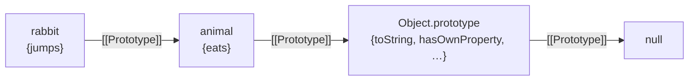

## Inheritance in JavaScript

**TL;DR**

- Inheritance in JS is built on one mechanism: every object has a hidden internal slot `[[Prototype]]` — a link to another object or `null`. Property **reads** walk this chain until found; writes don't walk.
- The chain is a singly-linked list of objects. Property lookup is a linear walk. `class`, `new`, and `extends` are sugar over this. The historical progression (Functional → Functional-shared → Prototypal → Pseudoclassical → Class) shows _why_ the chain exists: each pattern solves the previous one's pain point.
- `class Foo { ... }` lays down two objects: `Foo` (the constructor function) and `Foo.prototype` (the object instances delegate to). Methods declared in the class body live on `Foo.prototype` — one shared copy. Class fields (`x = 1`) and `this.x = ...` become **own properties** on each instance.
- `this` is resolved at the **call site**, not at attribute access — JS's biggest break from class-based languages like Python, where `obj.method` returns a pre-bound method object.

---

## Why JS inheritance looks weird

JS borrowed its object model from **Self**, not Java. Self's idea: skip the separate concept of "class" — let objects directly delegate to other objects. If you ask an object for something it doesn't have, it asks the object it's linked to. Inheritance falls out for free, no class machinery needed.

`class` syntax came later (ES6) but is sugar over the same delegation mechanism — the chain is still the underlying primitive. To understand any class in JS, you have to understand the chain first.

## The prototype chain

Every object has a hidden `[[Prototype]]` slot pointing to another object, or `null`. When you read `obj.foo`:

1. Look on `obj` itself.
2. Not there? Follow `[[Prototype]]` and look on that object.
3. Repeat until found, or until `null` → result is `undefined`.

```js
const animal = { eats: true };
const rabbit = Object.create(animal); // rabbit's [[Prototype]] = animal
rabbit.jumps = true;

rabbit.jumps; // true       — own property
rabbit.eats; // true        — found on animal via the chain
rabbit.flies; // undefined  — walked the chain, hit null
```

The chain:



`Object.prototype` here is the built-in object that every plain object delegates to by default — it's where `.toString()` and friends live. (It's named `prototype` because it's the property called `prototype` on the global `Object` constructor — a separate concept from the `[[Prototype]]` slot itself. Both senses appear constantly; the connection is detailed in the **Classes** section below.)

**Mental model:** an object is a bag of properties plus a link to another object it delegates to. Everything else is a different way of setting up that link.

## Reads walk; writes don't

Reads walk the chain. **Writes don't.**

```js
rabbit.eats = false; // creates an OWN property `eats` on rabbit
animal.eats; // still true — animal is untouched
```

Writing creates a new own property that **shadows** the inherited one. This is what makes one prototype safe to share across thousands of "instances" — they each shadow as needed without stepping on each other. The same rule applies in class form later (`f.x = 99` shadows `Foo.prototype.x`); it's the same mechanism.

> Subtle exception: if the prototype defines a **setter** for that key, the write triggers the setter instead of creating an own property. Rare in hand-written code; common with DOM properties (e.g. `el.id = "x"` runs a setter on `Element.prototype`).

## How we got here: instantiation patterns

The prototype chain didn't arrive with a manual — JS developers discovered _why_ they needed it by hitting walls. Walking through the historical patterns makes the chain feel inevitable rather than arbitrary.

### Functional

The simplest possible approach: a plain function that creates an object, attaches properties and methods, and returns it.

```js
function makeCat(name) {
  const cat = {};
  cat.name = name;
  cat.meow = function () {
    return `${this.name} says meow`;
  };
  return cat;
}
const a = makeCat("Milo");
const b = makeCat("Luna");
```

Works, but `a.meow` and `b.meow` are **separate function objects** doing the same thing. Make 10,000 cats and you get 10,000 copies of `meow` in memory. Methods don't change per instance — duplicating them is pure waste.

### Functional-shared

Extract the shared methods into a separate object and copy references onto each instance:

```js
const catMethods = {
  meow() {
    return `${this.name} says meow`;
  },
};

function makeCat(name) {
  const cat = {};
  cat.name = name;
  cat.meow = catMethods.meow; // reference, not copy
  return cat;
}
```

Now all cats share one `meow` function. But the wiring is manual — every new method means another `cat.x = catMethods.x` line. And if you add a method to `catMethods` _after_ creating an instance, existing instances don't see it. The link is a snapshot, not live.

### Prototypal — the chain enters

What if the object could just _ask another object_ at lookup time? That's exactly what `[[Prototype]]` does:

```js
const catMethods = {
  meow() {
    return `${this.name} says meow`;
  },
};

function makeCat(name) {
  const cat = Object.create(catMethods); // live delegation link
  cat.name = name;
  return cat;
}
```

No manual copying. Methods added to `catMethods` later are visible to all existing cats instantly — the link is live. This is the pattern that made the prototype chain worth having.

### Pseudoclassical — `new` automates the boilerplate

The prototypal pattern still has ceremony: create via `Object.create`, assign properties, return. The `new` keyword automates all three steps:

```js
function Cat(name) {
  this.name = name; // `new` already created the object and bound `this`
}
Cat.prototype.meow = function () {
  return `${this.name} says meow`;
};

const c = new Cat("Milo"); // new: create obj → link to Cat.prototype → run body → return
```

`new` creates the empty object, sets its `[[Prototype]]` to `Cat.prototype`, runs the function body with `this` bound to the new object, and returns it. The developer only writes the interesting parts.

The cost: `new` is invisible magic. Forget it and `this` points somewhere wrong (covered in the [`this` section](#this-is-resolved-at-the-call-site) below). The `Foo.prototype` naming collision with `[[Prototype]]` adds confusion.

### Classes — sugar over pseudoclassical

ES6 `class` is the same pseudoclassical pattern with cleaner syntax and guardrails:

```js
class Cat {
  constructor(name) {
    this.name = name;
  }
  meow() {
    return `${this.name} says meow`;
  }
}
```

Under the hood, identical to the pseudoclassical version: `Cat.prototype.meow` exists, `new` does the same three steps. But calling without `new` throws instead of silently corrupting globals, and the syntax groups constructor + methods in one block.

### The progression at a glance

| Pattern           | Shared methods? | Live link? | Boilerplate |
| ----------------- | --------------- | ---------- | ----------- |
| Functional        | No — duplicated | —          | Low         |
| Functional-shared | Yes — copied    | No         | Medium      |
| Prototypal        | Yes — delegated | Yes        | Medium      |
| Pseudoclassical   | Yes — delegated | Yes        | Low         |
| Class             | Yes — delegated | Yes        | Lowest      |

Each step solves the previous step's pain. The prototype chain is the mechanism that made the jump from "copied references" to "live delegation" — everything after that is ergonomic sugar on top.

## Setting up the chain directly

Four ways to set `[[Prototype]]` without going through `class` or `new`:

### 1. `Object.create(proto)` — explicit

```js
const animal = { eats: true };
const rabbit = Object.create(animal); // [[Prototype]] = animal
```

The clearest tool when you want to think about prototypes directly. `Object.create(null)` opts out entirely — no prototype, no inherited `toString` / `hasOwnProperty`. Useful for dictionaries where you don't want collisions with inherited names:

```js
const dict = Object.create(null);
dict.hasOwnProperty; // undefined — truly empty
```

### 2. Object literal with `__proto__`

```js
const rabbit = { __proto__: animal, jumps: true };
```

Equivalent to `Object.create(animal)` plus assignments, in one expression. Inside an object literal, `__proto__` is a special syntax that sets `[[Prototype]]` directly.

> Outside literals — `obj.__proto__ = ...` or `obj.__proto__` as a getter — is a legacy accessor. Use `Object.getPrototypeOf` / `Object.setPrototypeOf` instead.

### 3. Plain `{}` — implicit default

```js
const obj = {};
Object.getPrototypeOf(obj) === Object.prototype; // true
```

A bare `{}` isn't "no prototype" — its `[[Prototype]]` defaults to `Object.prototype`. That's why `({}).toString()` works without anyone defining it.

### 4. `Object.setPrototypeOf(obj, proto)` — avoid

```js
Object.setPrototypeOf(rabbit, animal); // re-link an existing object
```

Works, but engines optimize objects assuming a stable prototype; mutating it after creation forces them off the fast path and is genuinely slow. Treat as a "fix legacy code" tool. Prefer to set the link at creation time.

## Classes and `new`

The [instantiation patterns](#how-we-got-here-instantiation-patterns) above showed what `class` and `new` _do_. This section unpacks the naming confusion underneath them. To untangle it you have to keep two named things separate:

- `[[Prototype]]` — the **hidden internal slot** on every object (the chain link).
- `Foo.prototype` — a **regular, visible property** that exists on functions. It's the object that future instances of that function will delegate to.

Same word, two unrelated concepts. The naming is a 1995 mistake we live with.

When you write:

```js
class Foo {
  constructor() {
    this.x = 1;
  }
  bar() {}
}
const f = new Foo();
```

JS lays down two objects:

1. `Foo` itself — a constructor function. Its `.prototype` property points to a fresh object `Foo.prototype`.
2. `Foo.prototype` — an object holding `bar` (and `constructor`, which points back to `Foo`).

Then `new Foo()` creates a fresh empty object, sets its `[[Prototype]]` to `Foo.prototype`, and runs the constructor body with `this` bound to the new object. So:

- `f.bar` is found via `f.[[Prototype]] === Foo.prototype` — chain walk hits `bar` on the prototype.
- `f.x` is an own property created by `this.x = 1`.

In short: `Foo.prototype` is just an ordinary object whose `[[Prototype]]` link is what makes inheritance work. The two senses of "prototype" connect at exactly this point — `Foo.prototype` (the property) is what gets installed as the `[[Prototype]]` (the slot) of new instances.

### What lives where

| Lives as **own property**             | Lives on **prototype**                 |
| ------------------------------------- | -------------------------------------- |
| `this.x = ...` in constructor         | Methods declared in class body         |
| Class fields: `class Foo { x = 1 }`   | Getters/setters declared in class body |
| Properties added later: `obj.foo = 1` | `constructor` itself                   |
| Array elements, Map/Set entries       | Inherited methods from parent classes  |

> **Class fields are sugar for `this.x = ...` in the constructor** — so they're own properties, _not_ on the prototype. Easy to misread.

```js
class Foo {
  constructor() {
    this.x = 1; // own property
    this.greet = () => {}; // own property (arrow on instance)
  }
  bar() {} // Foo.prototype.bar
  get y() {
    return 2;
  } // getter on Foo.prototype
  static baz() {} // Foo.baz (on the class itself)
}

const f = new Foo();
Object.hasOwn(f, "x"); // true
Object.hasOwn(f, "bar"); // false → on Foo.prototype
```

### Why this split

- **Shared behavior** (methods, getters) → prototype. One function shared by all instances.
- **Per-instance state** → own properties. Each instance's value differs.
- **Memory:** without prototypes, every DOM node would carry its own copy of `appendChild`.
- **Patchability:** monkey-patching `Document.prototype.createElement` affects every document.

## DOM as a real-world example

```js
const div = document.createElement("div");

Object.keys(div); // []  ← no own enumerable properties
```

`div.id` looks like a normal property, but it's actually a **getter/setter on `Element.prototype`** that proxies the underlying attribute. Almost everything on DOM objects lives on prototypes:

```
HTMLDivElement.prototype  → (mostly empty)
HTMLElement.prototype     → .click(), .focus(), .dataset, .style
Element.prototype         → .id, .className, .classList, .getAttribute, .querySelector
Node.prototype            → .appendChild, .childNodes, .parentNode
EventTarget.prototype     → .addEventListener, .dispatchEvent
```

That's why `document.createElement` isn't an own property of `document` — it lives on `Document.prototype` and is found via chain lookup. The whole DOM "API" is just a tower of `[[Prototype]]` links.

## `this` is resolved at the call site

JS's biggest divergence from class-based languages: methods don't carry their receiver. `obj.method` returns the raw function; what `this` ends up being depends on **how** you call it.

```js
const m = counter.increment;
m(); // TypeError or wrong `this`
counter.increment.call(counter); // works
setTimeout(counter.increment.bind(counter), 0); // classic fix
```

### How `this` is decided — the four rules

For regular (non-arrow) functions, `this` is resolved by four rules. When multiple could apply, **higher priority wins**:

| Priority | Rule                | Call form                                  | `this` is                                    |
| -------- | ------------------- | ------------------------------------------ | -------------------------------------------- |
| 1        | `new` binding       | `new F()`                                  | the fresh object being constructed           |
| 2        | Explicit binding    | `f.call(x)` / `f.apply(x)` / `f.bind(x)()` | `x` (`.bind` is permanent)                   |
| 3        | Implicit (dot rule) | `obj.m()`                                  | `obj` — whatever is left of the dot          |
| 4        | Default (fallback)  | `f()` — bare call                          | `undefined` (strict) / `globalThis` (sloppy) |

The algorithm: ask in order — is it `new`? explicit? dot? If none, it's the default. Stop at the first match.

Rule 3 has a crucial corollary: **the binding is lost the moment the function is detached from its dot:**

```js
const fn = cat.meow;
fn(); // Rule 3 doesn't apply → falls through to Rule 4
// strict: undefined  |  sloppy: globalThis
```

Same function, different call site, completely different `this`. The function doesn't "remember" `cat`.

#### Arrow functions: the exception to all four rules

Arrow functions don't get their own `this`. They capture `this` **lexically** from the enclosing scope at definition time — all four rules above are ignored.

```js
const obj = {
  name: "Duong",
  regular() {
    return this.name;
  }, // Rule 3 → "Duong"
  arrow: () => this.name, // lexical → this from enclosing scope (NOT obj)
};
obj.regular(); // "Duong"
obj.arrow(); // undefined — arrow ignored the dot
```

Two hard constraints follow from this:

- **No `[[Construct]]` slot, no `.prototype` property.** `new (() => {})` throws — arrows can't be constructors because there's no mechanism to bind `this` to a new object.
- **Never use arrows as methods that need `this`.** They won't bind to the instance.

The flip side: arrows are perfect for callbacks _inside_ methods, where you want to keep the outer `this`:

```js
function Dog(name) {
  this.name = name;
  setTimeout(() => console.log(this.name), 100); // arrow keeps Dog's `this`
}
new Dog("Rex"); // logs "Rex"
```

### Constructors without `new` — the chain collapses

A constructor function is a regular function that uses `this` to mean "the new object." Without `new` triggering Rule 1, `this` falls back to Rule 4, and every line in the body either pollutes globals or crashes:

```js
function Dog(name) {
  this.name = name;
  this.bark = function () {
    return `${this.name} says woof`;
  };
}

// With new — Rule 1 wins ✓
const rex = new Dog("Rex");
rex.bark(); // "Rex says woof"

// Without new — Rule 4 wins ✗
const oops = Dog("Rex");
oops; // undefined (no explicit return)
globalThis.name; // "Rex" — polluted the global (sloppy mode)
globalThis.bark(); // "Rex says woof" — method landed on global too
```

The dependency chain: `new` → fresh `this` → properties attach → return value is the instance → `instance.method()` works via Rule 3. Skip `new`, and it collapses at step 1.

Some built-in constructors (`Array`, `Object`, `Number`) detect missing `new` internally and fix it up — `Array(3)` works the same as `new Array(3)`. Your own constructors don't do this by default. The old-school guard:

```js
function Dog(name) {
  if (!(this instanceof Dog)) return new Dog(name); // re-call with new
  this.name = name;
}
Dog("Rex").name; // "Rex" — works either way
```

ES6 `class` removed the need for this — calling a class without `new` throws immediately, no footgun.

### Three common fixes

1. **`.bind(this)` in constructor:** `this.inc = this.inc.bind(this)`. Permanently bound; costs one function per instance.
2. **Arrow class field:** `inc = () => { this.n++ }`. Own property, lexical `this`. Can't be overridden via `super` in subclasses — that's the tradeoff.
3. **Wrap at call site:** `btn.addEventListener('click', () => c.inc())`. Keeps `inc` on the prototype; binding lives with the caller.

### Why JS chose dynamic `this`

Not a mistake — a deliberate tradeoff that enables patterns class-based languages can't express cleanly:

- **Function borrowing.** Any function can be called against any receiver, so methods from one type can operate on another:

  ```js
  Array.prototype.slice.call(arguments);                 // turn arguments into a real array
  [].forEach.call(document.querySelectorAll("p"), …);    // iterate NodeList pre-ES6
  Object.prototype.toString.call(x);                     // reliable type tag: "[object Array]"
  ```

- **Callbacks and event handlers control `this` for you.** jQuery, DOM handlers, and `Array.prototype.forEach`'s `thisArg` all _set_ `this` at call time — `this` inside a click handler is the element that fired the event:

  ```js
  $("button").on("click", function () {
    this.disabled = true;
  });
  ```

- **Mixins and composition without inheritance.** Copy a method onto any object and it just works — the object doesn't need to be an instance of a particular class:

  ```js
  Object.assign(target, {
    greet() {
      return `hi ${this.name}`;
    },
  });
  ```

- **`new` reuses the same function as a constructor.** Because `this` is decided at the call site, `F()` and `new F()` can mean different things with the same function body.

- **Arrow functions opted out later.** ES6 added lexical `this` precisely for the callback case where you _don't_ want dynamic binding. So JS now has both tools: dynamic `this` for flexibility, arrows for auto-binding.

The footgun (losing `this` in a callback) is the same property that enables borrowing, mixins, and `this`-as-receiver event handlers.

## Statics — class-level

```js
class Foo {
  static x = 1;
  static baz() {}
}
Foo.x; // 1
Foo.baz();
```

`static` puts the property on the class itself (`Foo`), not on `Foo.prototype` and not on instances. Each subclass inherits statics by reference until it shadows them — `Sub.count` reads `Parent.count` until you write to `Sub.count`. Be explicit when you want each subclass to have its own.

### Best practices: where to put data

Rule of thumb: **pick the narrowest scope that fits the data's lifetime.**

| Data is...                                   | Put it on...   | How                                   |
| -------------------------------------------- | -------------- | ------------------------------------- |
| Different per instance                       | Instance (own) | `x = 1` field or `this.x = 1`         |
| Same for every instance, read-only behavior  | Prototype      | method in class body, or `static get` |
| Config/counter/registry for the class itself | Class (static) | `static x = 1`                        |
| Truly global                                 | Module scope   | `const X = 1` outside the class       |

Guidelines:

- **Default to instance fields for state.** Reach for `static` only when the value is genuinely about the _class_, not any instance (e.g. `User.tableName`, `HttpClient.defaultTimeout`, an id counter).
- **Never put mutable objects on the prototype or as a `static` default that instances will mutate.** `Foo.prototype.items = []` or exposing `static items = []` and having instances push into it creates shared-state bugs. If it's mutable per-instance, make it an instance field.
- **Read statics via the class name, not `this`.** `User.tableName` is clearer than `this.constructor.tableName` and avoids surprises from subclass shadowing — unless subclass override is exactly what you want, in which case `this.constructor.x` is the right tool.
- **Don't reassign `static` fields to simulate globals.** If multiple unrelated callers mutate `Foo.count`, that's a module-level variable wearing a class costume. Move it out.
- **Prefer methods on the prototype (class body) over assigning functions in the constructor.** `this.greet = () => {...}` creates a new function per instance — fine when you need lexical `this` capture, wasteful otherwise.
- **Freeze statics that are meant as constants.** `static STATUSES = Object.freeze(['a','b'])` prevents accidental mutation.

## JavaScript vs Python

Same conceptual split (instance attrs vs class attrs), different mechanism.

| JavaScript                   | Python                                                        |
| ---------------------------- | ------------------------------------------------------------- |
| Own property                 | Instance attribute (`self.__dict__`)                          |
| Prototype property           | Class attribute (`Cls.__dict__`)                              |
| `Object.getPrototypeOf(obj)` | `type(obj)` then walks `Cls.__mro__`                          |
| Prototype chain (objects)    | MRO (classes, with C3 linearization for multiple inheritance) |

### The big trap: class-body field declarations

```python
class Foo:
    x = []          # CLASS attribute — SHARED across all instances!

a, b = Foo(), Foo()
a.x.append(1)
b.x   # [1]  ← surprise
```

```js
class Foo {
  x = []; // INSTANCE field — fresh array per instance
}
const a = new Foo(),
  b = new Foo();
a.x.push(1);
b.x; // []
```

In Python you must do `self.x = []` in `__init__` for per-instance state. The mutable-default-on-the-class footgun bites Python beginners constantly. JS picks the safer default — class fields are per-instance.

### Assignment shadows in both languages

Writing `obj.attr = ...` always creates an attribute on the **instance**, never on the class/prototype.

```python
class Foo: x = 1
f = Foo()
f.x = 99           # creates instance attribute, shadows class attribute
Foo.x              # still 1
del f.x; f.x       # 1 (back to class attribute)
```

```js
class Foo {}
Foo.prototype.x = 1;
const f = new Foo();
f.x = 99; // own property, shadows prototype
Foo.prototype.x; // still 1
delete f.x;
f.x; // 1
```

### Lookup chain shape

- **JS:** chain of _objects_ (`obj → __proto__ → ... → null`). Single inheritance at the prototype level.
- **Python:** chain of _classes_ via MRO. Genuine multiple inheritance, linearized by C3.

### Method binding mental model

The deepest difference: **Python binds `self` at attribute access; JS resolves `this` at call site.**

- **Python:** `obj.method` returns a _bound method_ object — `self` is pre-packaged via the descriptor protocol. Storing and calling later just works.
- **JS:** `obj.method` returns the raw function. `this` is decided by **how** you call it.

```python
m = counter.increment
m()                           # works, self is bound
counter.increment.__self__    # → counter
counter.increment.__func__    # → the underlying function
```

So:

- **Python:** `obj.method` = "give me a thing I can call later, `self` included."
- **JS:** `obj.method` = "give me the function; `this` is whatever the call site says."

Python's safety comes from giving up the flexibility (function borrowing, mixins, dynamic receivers) that JS preserves.

### Static / class-level

| Goal                    | JS                            | Python                                    |
| ----------------------- | ----------------------------- | ----------------------------------------- |
| Per-class shared method | `static foo()`                | `@staticmethod` / `@classmethod`          |
| Per-class shared data   | `Foo.x = 1` or `static x = 1` | `class Foo: x = 1` (the natural default!) |

## Inspecting the chain

```js
Object.getPrototypeOf(rabbit); // → animal
Object.getPrototypeOf(animal); // → Object.prototype
Object.getPrototypeOf(Object.prototype); // → null

Object.getOwnPropertyNames(obj); // own (incl. non-enumerable)
Object.keys(obj); // own enumerable only

// Walk the whole chain:
let p = obj;
while (p) {
  console.log(p.constructor?.name, Object.getOwnPropertyNames(p));
  p = Object.getPrototypeOf(p);
}
```

> Prototype methods are **non-enumerable** by default — `Object.keys(Cls.prototype)` returns `[]`. Use `getOwnPropertyNames` to see them.

### Cheatsheet

| Goal               | JS                                          | Python              |
| ------------------ | ------------------------------------------- | ------------------- |
| Own/instance attrs | `Object.getOwnPropertyNames(obj)`           | `obj.__dict__`      |
| Class/proto attrs  | `Object.getOwnPropertyNames(Cls.prototype)` | `Cls.__dict__`      |
| Walk the chain     | `Object.getPrototypeOf` repeatedly          | `type(obj).__mro__` |

## Related

- [shapes-inline-caches.md](./shapes-inline-caches.md) — how engines actually implement these chains efficiently (and why mutating prototypes is slow).
- [dom-collections.md](./dom-collections.md) — concrete example of how DOM relies entirely on prototype methods.
