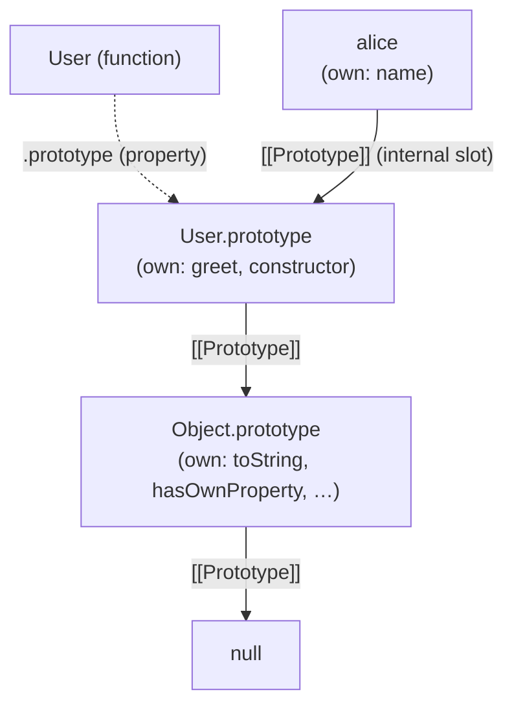

# The `.prototype` Property

> **TL;DR:** `.prototype` is a regular property that only functions (with `[[Construct]]`) have. It holds the object that `new` will wire as `[[Prototype]]` for future instances. It does nothing on its own — `new` is the bridge. Don't confuse it with `[[Prototype]]`, the internal slot on every object that drives the chain walk.

## Two things called "prototype"

|                     | `[[Prototype]]`                              | `.prototype`                        |
| ------------------- | -------------------------------------------- | ----------------------------------- |
| **What has it**     | Every object                                 | Only functions with `[[Construct]]` |
| **What it is**      | Internal slot — engine metadata              | Regular property — a plain object   |
| **What it does**    | Drives the chain walk during property lookup | Nothing on its own                  |
| **When it matters** | Every property access                        | Only when `new` is called           |

"What's Foo's prototype?" is ambiguous. Two different questions:

- `Foo.prototype` — the property, for Foo's future instances.
- `Object.getPrototypeOf(Foo)` — the internal slot, for Foo itself (which is `Function.prototype`, since Foo is a function).

## Only functions get `.prototype`

When the engine creates a function, it attaches a `.prototype` property — a plain object with one property: `.constructor` pointing back to the function.

```js
function Dog(name) {
  this.name = name;
}

Dog.prototype; // { constructor: Dog }
Dog.prototype.constructor === Dog; // true
```

Regular objects don't have it:

```js
const obj = {};
obj.prototype; // undefined — just a failed property lookup
```

### Exceptions — functions without `.prototype`

Functions that lack the `[[Construct]]` internal method don't get `.prototype`:

| Function type                     | `[[Call]]`               | `[[Construct]]` | Has `.prototype` |
| --------------------------------- | ------------------------ | --------------- | ---------------- |
| `function` declaration/expression | ✓                        | ✓               | ✓                |
| `class`                           | ✗ (throws without `new`) | ✓               | ✓                |
| Arrow function                    | ✓                        | ✗               | ✗                |
| Method shorthand                  | ✓                        | ✗               | ✗                |

Arrow functions and method shorthands can't be used with `new` — no `[[Construct]]`, no `.prototype`, `new` throws `TypeError`.

`class` is the odd one: `[[Construct]]` exists but `[[Call]]` throws — that's how `new` is enforced.

## `.constructor` — informational, not magical

The `.constructor` property on `Constructor.prototype` points back to the function. Instances find it via chain walk:

```js
function Cat(name) {
  this.name = name;
}
const whiskers = new Cat("Whiskers");

whiskers.constructor === Cat; // true — found on Cat.prototype
```

The engine doesn't use `.constructor` for anything internally — `instanceof`, `new`, chain walk all ignore it. It's a regular, writable, configurable property.

### Overwriting `.prototype` loses `.constructor`

Replacing the entire `.prototype` object drops the `.constructor` link:

```js
function User(name) {
  this.name = name;
}

User.prototype = {
  greet() {
    return `Hi, I'm ${this.name}`;
  },
};

const alice = new User("Alice");
alice.constructor === User; // false
alice.constructor === Object; // true — chain-walked to Object.prototype
```

The new object literal doesn't have `.constructor`. The chain walk falls through to `Object.prototype.constructor` → `Object`. You get the wrong constructor silently, not `undefined`.

Fix — restore the link:

```js
User.prototype = {
  constructor: User,
  greet() {
    return `Hi, I'm ${this.name}`;
  },
};
```

Or match original behavior (non-enumerable):

```js
Object.defineProperty(User.prototype, "constructor", {
  value: User,
  enumerable: false,
  writable: true,
  configurable: true,
});
```

## The full picture

When `new User("Alice")` runs:



- **Dotted arrow:** `.prototype` — a regular property on the function. Only matters at `new` time.
- **Solid arrows:** `[[Prototype]]` — the internal slot driving every property lookup.

`User.prototype` and `alice.[[Prototype]]` point to the **same object** — not a copy. Methods added to `User.prototype` after creation are visible to existing instances via chain walk.

## `Object.prototype` — the top

`Object` is a function, so it has `.prototype`. That `.prototype` is `Object.prototype` — the object at the top of almost every chain, and the only built-in whose `[[Prototype]]` is `null`.

```js
typeof Object; // "function"
Object.getPrototypeOf(Object.prototype); // null
```

## A constructor function has both

A function has its own `[[Prototype]]` (for itself as an object) **and** a `.prototype` property (for its future instances). Two separate chains, two separate purposes:

```js
function Dog() {}

// Dog's own [[Prototype]] — where Dog gets function methods
Object.getPrototypeOf(Dog) === Function.prototype; // true
Dog.call; // [Function] — found via Dog → Function.prototype

// Dog.prototype — where Dog's instances get their methods
Dog.prototype; // { constructor: Dog }
```
