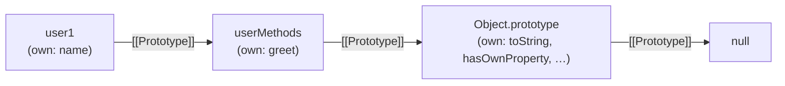

# Foundations

> **TL;DR:** JavaScript shares behavior across objects via **prototypes** — hidden links between objects. Property access is a chain walk: look on the object itself, then follow `[[Prototype]]` links until found or `null`. Almost every object's chain ends at `Object.prototype`.

## The problem prototypes solve

JS has no traditional classes (even `class` is syntactic sugar over prototypes). You still need to share behavior across objects. Without prototypes, two bad options:

1. **Copy methods onto every object** — 1000 user objects = 1000 copies of the same function in memory. Wasteful.
2. **Global helpers** — `greetUser(user)` works but loses `user.greet()` ergonomics and doesn't scale to hierarchies.

Prototypes are JS's answer: **delegate, don't copy.** Every object can have a hidden link to another object. When a property isn't found on the object itself, JS follows that link and looks there instead. That linked object is the **prototype**.

```js
const userMethods = {
  greet() {
    return `Hi, I'm ${this.name}`;
  },
};

const user1 = Object.create(userMethods);
user1.name = "Alice";

user1.greet(); // "Hi, I'm Alice"
// greet doesn't live on user1 — JS followed the hidden link to userMethods
```

`Object.create(userMethods)` creates a new empty object whose `[[Prototype]]` (the hidden link) points to `userMethods`. No method was copied — `user1` delegates to `userMethods` at lookup time.

## The chain-walk invariant

This is the single idea everything else in prototypal inheritance hangs on:

**Property access in JS is always a chain walk.** Look on the object → not found → follow the `[[Prototype]]` link → look there → not found → follow _that_ object's `[[Prototype]]` → ... → hit `null` → return `undefined`.

For method calls, if the lookup returns `undefined` and you try to invoke it, you get a `TypeError: x is not a function`.



Every step in this diagram is a `[[Prototype]]` link. The engine walks left to right until it finds the property or hits `null`.

## Everything ends at `Object.prototype`

Unless you deliberately opt out (via `Object.create(null)`), every ordinary object's chain eventually reaches `Object.prototype`. That's why every plain object has `.toString()`, `.hasOwnProperty()`, `.valueOf()`, etc. — those methods live on `Object.prototype`, not on your objects.

```js
const obj = { a: 1 };

obj.hasOwnProperty("a"); // true
// obj doesn't define hasOwnProperty — it's found on Object.prototype
```

`Object.create(null)` creates a "bare" object with no prototype at all — no `.toString()`, no `.hasOwnProperty()`, nothing inherited. Useful for pure dictionaries (e.g. lookup maps) where you don't want inherited keys polluting the object.

```js
const bare = Object.create(null);
bare.toString; // undefined — no chain to walk
```

## Key takeaways

- **Delegation, not copying** — prototypes share behavior by linking objects, not duplicating methods.
- **`[[Prototype]]`** — a hidden, internal link every object has (pointing to another object or `null`).
- **Chain walk** — property lookup follows `[[Prototype]]` links until found or `null`. This is the core mechanic behind all JS inheritance.
- **`Object.prototype`** — the common ancestor at the end of almost every chain. Provides the built-in methods all objects seem to have.
- **`Object.create(proto)`** — creates a new object with its `[[Prototype]]` set to `proto`. The simplest way to wire the link manually.
