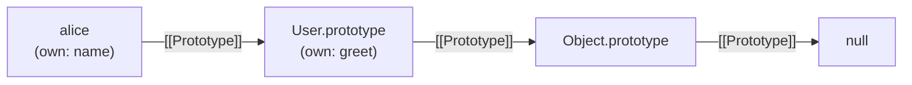
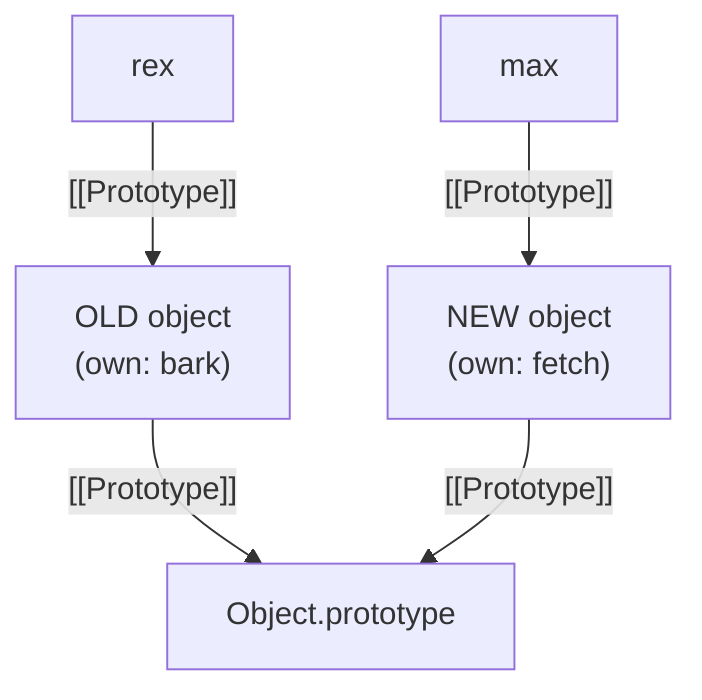

# Instantiation Patterns

> **TL;DR:** Five patterns for creating objects and wiring prototype chains, each solving the previous one's problem: functional (simple, wasteful) → functional shared (shared methods, no live link) → prototypal (`Object.create`, live delegation) → pseudoclassical (`new` automates the wiring) → class (sugar over pseudoclassical, enforces `new`). All prototype-based patterns produce the same chain — they differ in boilerplate and safety. Class fields (`=` syntax) are own properties per instance, not prototype methods.

## The evolution

Each pattern is a response to a concrete problem in the one before it.

### 1. Functional

A plain function creates an object, attaches everything, returns it.

```js
function createUser(name) {
  const user = {};
  user.name = name;
  user.greet = function () {
    return `Hi, I'm ${this.name}`;
  };
  return user;
}
```

No prototypes involved. Every instance gets its own copy of every method — 1000 users = 1000 identical `greet` functions in memory.

### 2. Functional shared

Pull shared methods into a separate object, copy references at creation time.

```js
const userMethods = {
  greet() {
    return `Hi, I'm ${this.name}`;
  },
};

function createUser(name) {
  const user = {};
  user.name = name;
  Object.assign(user, userMethods);
  return user;
}
```

Methods aren't duplicated — `Object.assign` copies references. But it's a **one-time snapshot**. Methods added to `userMethods` after creation don't propagate to existing instances. No live link.

### 3. Prototypal (`Object.create`)

Wire the chain directly — live delegation, not copying.

```js
const userMethods = {
  greet() {
    return `Hi, I'm ${this.name}`;
  },
};

function createUser(name) {
  const user = Object.create(userMethods);
  user.name = name;
  return user;
}
```

`Object.create(userMethods)` creates an empty object with `[[Prototype]]` → `userMethods`. Methods added later to `userMethods` are visible to all existing instances via chain walk. The live link that functional shared was missing.

### 4. Pseudoclassical (`new` + constructor)

`new` automates what the prototypal pattern does manually. Four steps:

1. Creates a new empty object.
2. Sets its `[[Prototype]]` to `Constructor.prototype`.
3. Binds `this` to the new object inside the constructor.
4. Returns the object (unless you explicitly return a different object).

```js
function User(name) {
  // new already did: const this = Object.create(User.prototype);
  this.name = name;
  // new will do: return this;
}

User.prototype.greet = function () {
  return `Hi, I'm ${this.name}`;
};

const alice = new User("Alice");
```



Footgun: forgetting `new` makes `this` be `undefined` (strict) or `globalThis` (sloppy) — silent, nasty bug.

### 5. Class (ES6)

Syntactic sugar over pseudoclassical. Same chain, same wiring, cleaner syntax.

```js
class User {
  constructor(name) {
    this.name = name;
  }

  greet() {
    return `Hi, I'm ${this.name}`;
  }
}
```

Under the hood: `User` is still a function, `greet` lives on `User.prototype`, `new` wires `[[Prototype]]` the same way. Key improvements over pseudoclassical:

- **`new` enforced** — calling without `new` throws `TypeError`.
- **Methods are non-enumerable** — matches built-in behavior.
- **Strict mode by default** — class bodies are always strict.
- **`extends`** for multi-level chains (covered in a later note).

## Comparison

| Pattern           | Shared methods?            | Live link?    | Boilerplate | Footguns              |
| ----------------- | -------------------------- | ------------- | ----------- | --------------------- |
| Functional        | No — copied per instance   | N/A           | Low         | None                  |
| Functional shared | Yes — `Object.assign`      | No — snapshot | Medium      | Stale instances       |
| Prototypal        | Yes — `Object.create`      | Yes           | Medium      | Manual return         |
| Pseudoclassical   | Yes — `new` + `.prototype` | Yes           | Low         | Forget `new`          |
| Class             | Yes — `class` body         | Yes           | Lowest      | None (enforces `new`) |

## Class fields vs prototype methods

The `=` sign in a class body is the tell. It determines where a property lands:

| Syntax in class body | Where it lands                      | Shared?                        |
| -------------------- | ----------------------------------- | ------------------------------ |
| `method() {}`        | `Constructor.prototype`             | Yes — one copy, delegated      |
| `prop = value`       | Each instance (`this.prop = value`) | No — own property per instance |

```js
class User {
  constructor(name) {
    this.name = name;
  }
  protoMethod() {} // → User.prototype.protoMethod
  fieldMethod = () => {}; // → own property on each instance
}

const u = new User("Alice");
u.hasOwnProperty("protoMethod"); // false — on prototype
u.hasOwnProperty("fieldMethod"); // true — own property
```

Class fields execute as if they were assignments inside the constructor (`this.fieldMethod = () => {}`). The **writes stay put** rule applies — assignment to `this` creates an own property.

Arrow function fields capture `this` lexically, making them safe to detach (useful for callbacks/event handlers). The tradeoff: you lose shared-method memory efficiency — each instance gets its own function object.

## `[[Prototype]]` is a pointer to an object, not a variable

`new` reads `Constructor.prototype` at the moment of the call and wires `[[Prototype]]` to that specific object. Reassigning `Constructor.prototype` later doesn't update existing instances — they still point to the old object.

```js
function Dog(name) {
  this.name = name;
}
Dog.prototype.bark = function () {
  return `${this.name} says woof`;
};

const rex = new Dog("Rex"); // rex.[[Prototype]] → old object (has bark)

Dog.prototype = {
  fetch() {
    return `${this.name} fetches`;
  },
};

const max = new Dog("Max"); // max.[[Prototype]] → new object (has fetch)
```



`rex.fetch()` fails — old object doesn't have it. `max.bark()` fails — new object doesn't have it. Reassigning the variable swaps what it points to; it doesn't chase existing pointers.
