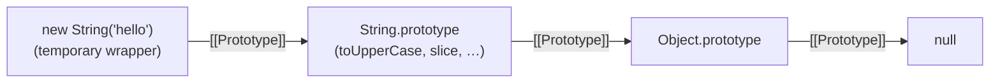
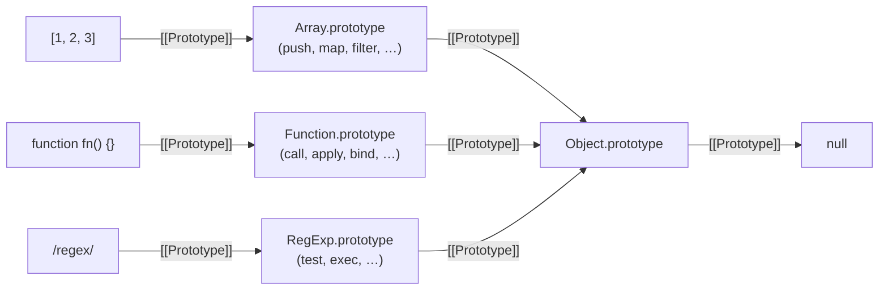

# [[Prototype]] Deep Dive

> **TL;DR:** `[[Prototype]]` is an internal slot (engine metadata, not a property) that links one object to another. You interact with it via `Object.getPrototypeOf()` / `Object.setPrototypeOf()`, `Object.create()`, or the legacy `__proto__`. Primitives lack this slot — the engine auto-boxes them into temporary wrapper objects to resolve method calls, then discards the wrapper. Every built-in type (`Array`, `Function`, `RegExp`, …) fans into `Object.prototype` one link up.

## Internal slot, not a property

`[[Prototype]]` is **not** in the object's property table. It's an internal slot — engine-level metadata _about_ the object, not data _in_ it. The double-bracket notation is spec language, not syntax you can use.

Consequences:

- `Object.keys(obj)` won't show it (only own enumerable properties).
- `Object.getOwnPropertyNames(obj)` won't show it (only own properties, enumerable or not).
- `for...in` won't yield it (it yields properties _found via_ the link, not the link itself).
- You can't delete it, configure it, or interact with it through normal property APIs.

Three ways to interact with it:

| API                                                                | What it does                                                                              |
| ------------------------------------------------------------------ | ----------------------------------------------------------------------------------------- |
| `Object.getPrototypeOf(obj)` / `Object.setPrototypeOf(obj, proto)` | Read/write the slot on an existing object. Modern, spec-blessed.                          |
| `obj.__proto__`                                                    | Legacy accessor on `Object.prototype`. Deprecated — covered in a later note.              |
| `Object.create(proto)`                                             | Creates a new object with `[[Prototype]]` already wired. Doesn't modify existing objects. |

## `Object.keys` vs `for...in` — own-only vs chain-walking

```js
const parent = {
  greet() {
    return "hi";
  },
};
const child = Object.create(parent);
child.name = "Alice";

Object.keys(child); // ["name"]
Object.getOwnPropertyNames(child); // ["name"]

for (const key in child) {
  console.log(key); // "name", then "greet"
}
```

`Object.keys` and `Object.getOwnPropertyNames` stay on one object's property table. `for...in` walks the entire prototype chain, yielding every **enumerable** property it finds. `Object.prototype`'s built-ins (`toString`, `hasOwnProperty`, …) are all non-enumerable, so they don't appear.

This is why older code often guards `for...in` with `hasOwnProperty`:

```js
for (const key in child) {
  if (child.hasOwnProperty(key)) {
    // now equivalent to Object.keys behavior
  }
}
```

`Object.keys()` (ES5) was added to replace that pattern.

| Tool                           | Scope        | Enumerability filter              |
| ------------------------------ | ------------ | --------------------------------- |
| `Object.keys()`                | Own only     | Enumerable only                   |
| `Object.getOwnPropertyNames()` | Own only     | All (enumerable + non-enumerable) |
| `for...in`                     | Entire chain | Enumerable only                   |

## Primitives and auto-boxing

The six primitives (`string`, `number`, `boolean`, `undefined`, `null`, `symbol`, plus `bigint`) are not objects — no `[[Prototype]]`, no property table.

Yet `"hello".toUpperCase()` works. The engine performs **auto-boxing**: it creates a temporary wrapper object (`new String("hello")`), calls the method through the wrapper's prototype chain, then **discards the wrapper immediately**.



The discard step is the gotcha:

```js
const s = "hello";
s.custom = "test"; // wrapper created, property set on it, wrapper discarded
s.custom; // new wrapper created — never had .custom → undefined
```

No error, no warning — the property silently vanishes. Each property access on a primitive creates a fresh wrapper.

Two primitives have **no wrapper constructor**: `undefined` and `null`. Calling a method on either throws `TypeError` — the engine has nothing to wrap them with.

## Object literal default wiring

```js
const obj = { a: 1 };
```

An object literal `{}` creates an ordinary object whose `[[Prototype]]` is `Object.prototype` — that's the spec default. Equivalent to `new Object()`, but nobody writes that. This is why every plain object has `.toString()`, `.hasOwnProperty()`, etc. — one chain-walk link away.

## Built-in prototype fan

Every built-in type follows the same two-link pattern to reach `Object.prototype`:



Arrays have array methods _and_ object methods because the chain walk finds `Array.prototype` first, then falls through to `Object.prototype`. Same for functions, regexes, dates, etc. — a flat fan converging on `Object.prototype`.

## Custom prototypes and `this` binding

Multiple objects can delegate to the same prototype — one copy of shared methods in memory:

```js
const animal = {
  speak() {
    return `${this.name} makes a sound`;
  },
};

const dog = Object.create(animal);
dog.name = "Rex";

const cat = Object.create(animal);
cat.name = "Whiskers";

dog.speak(); // "Rex makes a sound"
cat.speak(); // "Whiskers makes a sound"
```

`this` is determined by the **call site** (what's left of the dot), not by where the method is stored. Without this rule, shared methods would always reference the prototype's own properties instead of the caller's.

| Call                            | `this`               | `this.name` | Why                                            |
| ------------------------------- | -------------------- | ----------- | ---------------------------------------------- |
| `dog.speak()`                   | `dog`                | `"Rex"`     | `dog` is left of the dot                       |
| `animal.speak()`                | `animal`             | `undefined` | `animal` is left of the dot, but has no `name` |
| `const fn = animal.speak; fn()` | global / `undefined` | depends     | no dot — default binding                       |

Detaching a method from its object loses the receiver — that's where `bind`, arrow functions, and explicit `this`-binding come in.
