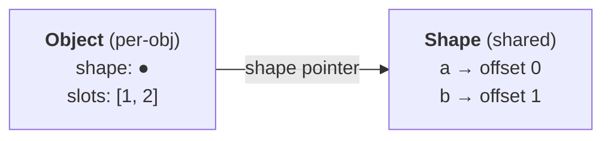
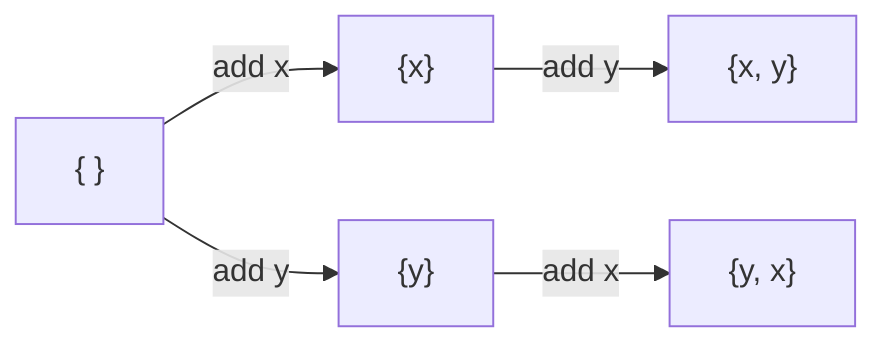

# Object Shapes and Inline Caches

**TL;DR**

- Semantically, JS objects are hash maps. In practice, engines run them near C-struct speed by separating **shape** (the schema) from the object's **slot array** (the values).
- A shape maps `key → offset`. Many structurally-identical objects share one shape; each object still gets offset-based access *individually* from its shape, even when nothing is shared.
- Adding a property creates a **shape transition**. `{x,y}` and `{y,x}` are different shapes — the insertion order defines identity, not the key set.
- Property-access sites install an **inline cache (IC)** that remembers the shape they saw. **Monomorphic** (1 shape): fastest. **Polymorphic** (2–4): still fast. **Megamorphic** (many): slow, falls back to runtime lookup.
- The IC doesn't *speed up* lookup — it *eliminates* it. What's left is a shape-pointer check plus a fixed-offset load.
- Nothing in the ECMAScript spec mandates any of this. Every major engine (V8, SpiderMonkey, JavaScriptCore, Hermes) implements it independently.
- Practical upshot for `Object` vs `Map`: use `{}` for **records** (schema keys — known at write time), use `Map` for **dictionaries** (data keys — runtime-generated, unbounded, or non-string). Using `{}` as a dictionary pushes it into dictionary mode anyway.

---

## Why shapes exist

A naive JS object: one hash map per object. Every `obj.x` hashes the key, walks buckets, compares strings, returns the value. Every access, every time.

But hot `obj.x` in real JS costs a few cycles — comparable to a C struct field access. Shapes + inline caches are how that happens.

## The core idea: split schema from values



- **Object** = shape pointer + array of raw values.
- **Shape** = the `key → offset` table. One copy, shared by all structurally-identical objects.

```js
const a = { x: 1, y: 2 };
const b = { x: 3, y: 4 };   // same shape as a — same keys, same order
```

Without the split, each object would carry its own schema. The split is what makes the schema cheap enough to share *and* stable enough to cache against.

## Shape transitions

Adding a property moves an object to a new shape. Transitions form a tree rooted at the empty shape:



**`{x,y}` and `{y,x}` are different shapes.** Identity is defined by the insertion sequence, not the key set. Two objects with the same keys in different orders cannot share an IC.

Object literals walk the transitions in source order: `{a:1, b:2}` ≡ `o={}; o.a=1; o.b=2`.

## Per-object benefit is separate from sharing

With three objects that have *nothing* in common:

```js
const o1 = { a: 1, b: 2 };
const o2 = { a: 10, c: "string1" };
const o3 = { d: "string2", e: true };
```

each gets its own shape — and that shape is still doing useful work *for that object*. It's what enables offset-based access instead of a hash lookup. Shapes aren't only a sharing mechanism; they're also what gives any single object its struct-like layout.

Sharing still happens constantly in real code — just usually via factories/constructors, not identical literals:

```js
function point(x, y) { return { x, y }; }
point(1,2); point(3,4); point(5,6);   // all share one shape
```

Note: `a` is at offset 0 in both `o1`'s shape and `o2`'s shape, but they're still distinct shapes. A shape is defined by the whole key sequence, so `o1.a` and `o2.a` cannot share an IC entry.

## Inline caches

When the JIT compiles `obj.x`, it emits code that remembers the shape it saw at that site:

```asm
cmp  [o + shape_offset], S1   ; is this the shape I saw before?
jne  slow_path                ; no → fall back
mov  rax, [o + slots + 8]     ; yes → load baked-in offset
```

- **Monomorphic** (1 shape ever seen here): one compare + one load. Fastest.
- **Polymorphic** (2–4 shapes): small lookup table of shape→offset. Still fast.
- **Megamorphic** (many shapes): engine gives up, falls back to generic runtime lookup. Slow, and the JIT stops inlining through the site.

The threshold is engine-specific; "~4 shapes" is the right mental model.

The performance question is never "how many distinct objects?" — it's **"how many shapes flow through this specific property-access site?"**

## Cold vs warm: worked example

Setup:

```js
const o2 = { a: 10, c: "string1" };   // shape S2:  a → 0,  c → 1
function getC(o) { return o.c; }
```

**First call — cold path** (no IC yet):

```
1. Follow o2.shape                 → S2
2. Lookup "c" in S2's property table → offset 1     ← the slow step
3. Load o2.slots[1]                → "string1"
4. Install IC: "shape S2 → offset 1"
```

Step 2 means: hash the string `"c"`, index into the shape's table, walk the bucket, compare names — all in a C++ runtime helper. Roughly 30–100 cycles.

**Every subsequent call — warm path** (object is still shape S2):

```
1. Compare o.shape vs cached S2    → match
2. Load o.slots[1]                 → "string1"
```

Stays in JIT machine code. Roughly 2–5 cycles. The `1` is literally baked into the instruction stream.

**Key insight:** the IC doesn't make the lookup faster — it **replaces** the lookup with a guard. The expensive "where does `c` live?" question was answered once and written into the machine code.

## Three implementations compared

| Aspect | Naive hashmap-per-object | Shape + IC — cold | Shape + IC — warm |
|---|---|---|---|
| Per-object data | Own hashmap | Shape pointer + slots | Shape pointer + slots |
| Steps for `o.c` | hash → bucket walk → value | shape → hash → bucket walk → offset → slot load | shape compare → slot load |
| Hash the key `"c"` | Every access | Once per (site, shape) | Skipped |
| Table walk | Every access | Once | Skipped |
| Where code runs | C++ runtime helper | C++ runtime helper | Pure JIT machine code |
| Rough cost | ~30–100 cycles | ~30–100 cycles | ~2–5 cycles |
| 1000th access | Full cost | — | ~2–5 cycles |
| JS engine analog | Dictionary mode | First-time IC miss | Monomorphic hot IC |

One-line per case:

- **Naive:** always pays full cost — no way to remember across accesses.
- **Cold:** same work as naive, but the answer gets cached.
- **Warm:** the cached answer replaces the work. Only a guard is left.

## Dictionary mode: the fallback

Engines abandon shapes when the object itself looks too dynamic. Triggers:

- Many property additions over time (dozens of transitions on one object).
- Keys that look like data — long or runtime-generated strings (UUIDs, IDs).
- `delete` used on properties.
- Object grows past a size threshold.

The object flips to a real hashmap. Every access becomes cold-path-speed, forever.

**This is often the right call.** Using an object as a dictionary (`cache[userId] = …`) legitimately needs hashmap semantics — the engine picking that representation is doing its job. The lesson isn't "avoid dictionary mode" but: **don't put dictionary-mode objects on hot property-access paths.** If you want a dictionary, prefer `Map` — clearer intent, optimized for the use case.

## When to reach for `Map` instead

Dictionary mode is exactly why `Map` exists. The shape model gives you a clean decision rule:

> **Are your keys schema, or are they data?**

- **Schema keys** (`name`, `email`, `role` — known at write time, part of the type) → `{}`. Shape is maintained, access is IC-cached, `.x` syntax is ergonomic.
- **Data keys** (user IDs, session tokens, DOM elements, anything runtime-generated or unbounded) → `Map`. Objects would flip to dictionary mode anyway; `Map` is the version designed for the job.

That single question resolves most real cases.

### How `Map` is implemented (and why it matters here)

`Map` is a real **hash table**. It doesn't use shapes, and there's no inline-cache equivalent for its operations. Every access follows the classic dictionary recipe:

```
map.get(k):
  1. hash(k)              → bucket index
  2. walk bucket chain    → find entry where key === k
  3. return entry.value
```

Why no IC? Two structural reasons:

- The "key" in `map.get(userId)` is typically **runtime data** — the JIT has no constant to bake into the machine code, so there's nothing to cache.
- Even if the key were a constant, the value doesn't live at a stable offset — it's wherever the hash function + bucket allocator put it, and that can move when the table resizes.

So `Map` access cost is roughly **the same as dictionary-mode Object access** (or the cold path of shape + IC): every time, you pay hashing + bucket walk. There's no warm-path speedup — by design.

That's what makes the tradeoff so clean:

- **When keys are compile-time constants, accessed repeatedly** — Object's IC collapses the cost to ~2 cycles per access. Map can't do that; every `.get` still hashes. Object wins by a wide margin.
- **When keys are runtime data** — Object can't use ICs either (the key is different every time, and the object's likely in dictionary mode anyway). Map is doing the same work as dictionary-mode Object, but with a purpose-built hash table, none of the prototype/`__proto__` footguns, and a real `size`.

**One-line version:** ICs help when the key is a constant; hash tables are needed when the key is data. Pick the structure whose optimization matches your access pattern.

### Dictionary-mode Object vs `Map` — what actually differs

Once an Object flips to dictionary mode, the hash-table core is *very similar* to what `Map` uses. The difference is the ECMAScript object machinery that Object carries on top — things `Map` simply doesn't have.

| Feature | Dictionary-mode Object | Map |
|---|---|---|
| Hash table keyed by identity/string hash | ✓ | ✓ |
| **Prototype chain lookup** — miss in own table falls through to `__proto__` | ✓ | ✗ |
| **Property descriptors** (`writable`, `enumerable`, `configurable`) per entry | ✓ | ✗ |
| **Accessor properties** — `get`/`set` functions that run on access | ✓ | ✗ |
| **Allowed key types** | strings + symbols only (everything else coerced) | any value |
| **Integer-like keys sort first** in iteration | ✓ (the weird rule) | ✗ (pure insertion order) |
| **`Proxy` traps** intercept access | ✓ | ✗ (traps fire on the Map object, not its entries) |

One-line framing:

> **Dictionary-mode Object ≈ Map + prototype chain + descriptors + accessors + string-only keys + quirky iteration order.**

Strip those away from a dict-mode object and you're essentially left with a `Map`.

This reframes two things that otherwise look like separate facts:

1. **Why `{}` as a dictionary has so many footguns** (prototype pollution, `"[object Object]"` key collisions, `hasOwnProperty` traps). They aren't bugs in the hash-table part — they're Object's extra machinery *leaking through* when you try to use it as a pure dictionary.
2. **Why engines can still optimize dict-mode Object reasonably well** — the hash-table core is shared with Map. What makes dict-mode slow compared to *shape-mode* Object isn't the hash table itself; it's that shape-mode skips the hash table entirely via ICs.

Internally, engines often use different hash-table implementations for each — V8 for instance has `OrderedHashMap` for `Map` and `NameDictionary` for dict-mode objects — tuned differently but conceptually the same data structure.

### Representation summary

```
shape-mode Object       = shared schema + slot array + prototype + descriptors
dictionary-mode Object  = hash table + prototype + descriptors + accessors
Map                     = hash table (and that's it)
```

`Map` is the minimalist version. Object is "hash table, plus all the ECMAScript object-ness built on top." Shape-mode is Object's *fast* representation; dictionary-mode is its *flexible* representation. `Map` has only one representation — the flexible one — and isn't trying to be anything else.

### Performance intuition

| Situation | Pick |
|---|---|
| Fixed set of known string keys, hot access | **Object** — IC-backed `.x` beats `.get('x')` method dispatch |
| Dynamic / runtime-generated keys | **Map** — neither side gets ICs; Map is the structure designed for this |
| Heavy insertion / deletion over lifetime | **Map** — objects suffer shape churn + the `delete` penalty |
| Non-string keys (objects, numbers kept as numbers) | **Map** — `{}` only takes string/symbol keys |

Common mistake: reaching for `Map` to "optimize" a fixed-schema record. You lose IC-backed access and the `.x` syntax. `{ x: 1, y: 2 }` is the right tool for a point; `new Map([['x',1],['y',2]])` is not.

### Other reasons to prefer `Map` (beyond perf)

Even when perf is a wash, `Map` avoids long-standing object-as-dictionary footguns:

- **Prototype pollution.** `obj["toString"]` collides with inherited methods; `map.get("toString")` is just a key.
- **Non-string keys.** `obj[someObj]` stringifies to `"[object Object]"` — different objects collide. `map.get(someObj)` uses reference identity.
- **`.size` is O(1).** On objects, `Object.keys(o).length` is O(n) and allocates.
- **Saner iteration order.** Map is always insertion order. Object puts integer-like keys first, sorted numerically — rarely what you want.

### Gotcha: JSON serialization

```js
JSON.stringify({ a: 1 });              // '{"a":1}'
JSON.stringify(new Map([['a', 1]]));   // '{}'  — Map has no own enumerable props
```

To serialize a Map: `JSON.stringify([...map])` gives `[["a",1]]`. Often the decisive factor for storage / API code: **Object for the wire format, Map for in-memory lookup.**

## Spec vs implementation

- **ECMAScript** says nothing about shapes, hidden classes, or ICs. The spec defines observable behavior; the mechanism is an implementation detail.
- **Every major engine implements it**, under different names:

| Engine | Name | Used by |
|---|---|---|
| V8 | hidden class / map | Chrome, Node, Deno, Edge, Electron, Cloudflare Workers |
| SpiderMonkey | shape | Firefox |
| JavaScriptCore | structure | Safari, Bun |
| Hermes | hidden class | React Native |

You can assume it's there. Few engine details are universal enough to reason about portably; this is one of them.

> **Scope note.** This note is about the representation of Object *properties*. Arrays have their own parallel optimization system (**element kinds** — packed vs holey, SMI vs double vs tagged) that behaves differently and deserves a separate note. If you see advice like "don't mix numbers and strings in the same array" or "avoid creating holes with `arr[100] = x`," that's the array system, not this one.

## Practical takeaways — writing shape-friendly code

Knowing the mechanics mostly cashes out as a handful of concrete habits, plus a diagnostic lens when code is mysteriously slow. Not every codebase needs this — but on hot paths (render loops, request handlers, tight data-processing), these make a measurable difference.

### 1. Initialize all fields up front, in a consistent order

```js
// ❌ two shapes: admins have `role`, others don't
function makeUser(data) {
  const u = { name: data.name };
  if (data.email)   u.email = data.email;
  if (data.isAdmin) u.role  = 'admin';
  return u;
}

// ✅ one shape, always
function makeUser(data) {
  return {
    name:  data.name,
    email: data.email ?? null,
    role:  data.isAdmin ? 'admin' : null,
  };
}
```

**Why:** a shape's identity is the full key sequence ([Shape transitions](#shape-transitions)). Conditional additions create divergent lineages, and any consumer that sees both variants at the same access site drifts monomorphic → polymorphic → megamorphic. One shape keeps ICs hot.

### 2. Use `Map` when keys are data, not schema

See [When to reach for `Map` instead](#when-to-reach-for-map-instead).

**Why (one line):** an object with runtime keys flips to dictionary mode anyway; `Map` is the data structure designed for that pattern, and its own hash table has none of the prototype/`__proto__` traps.

### 3. Replace `delete` with assignment

```js
// ❌ usually forces dictionary mode, and the object doesn't come back
delete user.session;

// ✅
user.session = null;
```

**Why:** `delete` is one of the signals engines use to decide "this object is being used dynamically" and flip it to dictionary mode. Assignment keeps the shape intact, the IC valid, and the object in the fast representation.

### 4. Keep the type of each property stable

```js
// ❌ sometimes string, sometimes object — bust any IC that specialized on type
result.value = err ? err.message : data;

// ✅ two stable shapes, each property with one type
result = err
  ? { ok: false, error: err.message, data: null }
  : { ok: true,  error: null,        data };
```

**Why:** ICs often specialize not just on shape but on the *type* stored at each offset (small integer vs heap object vs string). Writing a different type to the same property invalidates that specialization and can trigger a deoptimization on the JIT-compiled code around it.

### 5. Avoid conditional spreads that fork shapes

```js
// ❌ two shapes — one with ssl, one without
const config = {
  host,
  port,
  ...(enableSSL && { ssl: true }),
};

// ✅
const config = { host, port, ssl: enableSSL };
```

**Why:** conditional spreads are conditional property addition in disguise. Three optional fields added this way give up to 2³ = 8 distinct shapes; downstream consumers see all of them.

### 6. Prefer constructors / factories over ad-hoc literals in hot code

```js
class Point { constructor(x, y) { this.x = x; this.y = y; } }
// or
const makePoint = (x, y) => ({ x, y });
```

**Why:** a single creation path enforces a single shape. Ad-hoc `{ x, y }` literals scattered across files can drift in key order or optional-field presence without warning — and the engine can't tell "this `{x,y}` is the same as that `{x,y}`" if the shape transition chains differ.

### 7. Normalize external data at the boundary

```js
// ❌ downstream code sees whatever shape the API happened to send
const users = await res.json();

// ✅ one normalized shape across your entire pipeline
const users = (await res.json()).map(u => ({
  id:    u.id,
  name:  u.name  ?? null,
  email: u.email ?? null,
}));
```

**Why:** external sources (APIs, third-party libs, JSON on disk) don't follow your shape discipline. Varying key orders or intermittent optional fields produce multiple shapes. Normalize once on ingest; the rest of the code sees uniform objects.

### 8. Never mutate `__proto__` on a live object

```js
// ❌ worst thing you can do to a hot object
Object.setPrototypeOf(obj, NewProto);
```

**Why:** the prototype is part of the shape. Changing it invalidates every IC that ever touched the object and can force a wholesale deoptimization of code specialized on that shape. Pick the prototype at creation time — `class`, factory returning `Object.create(Proto)`, etc.

### Reading profiler output

When Chrome DevTools shows a **deopt** marker, or `node --trace-deopt` / `--trace-ic` prints messages like these, you now know what they name:

| Message | Means |
|---|---|
| "wrong map" / "wrong hidden class" | IC's shape guard failed — site was specialized for one shape, got another |
| "polymorphic" | Site has started seeing multiple shapes; still fast, but flag it if on a hot path |
| "megamorphic" | Too many shapes; engine gave up on inlining → generic runtime lookup |
| "convert to dictionary" | Object flipped into dictionary mode — usually triggered by rules #1, #3, or #8 |

Each one points back at a concrete rule above. Without the mental model these messages are noise; with it, they're a punch list.

### Where this does NOT help

Be honest about the scope:

- **Setup / config code.** Runs once, shape churn is free.
- **Tests, build scripts, one-off utilities.** Clarity beats shape-awareness.
- **Cold paths.** A function that runs a few times per page load gains nothing measurable.
- **Tiny short-lived objects.** No shape reuse to preserve; engine won't even bother optimizing.

Don't contort readable code for zero-impact "optimization." These rules pay off where the loop is tight.

### The 80/20

> **Initialize all fields in one place, keep their types stable, avoid `delete`, and reach for `Map` when keys are data.** That's most of the practical benefit. The rest is diagnostic — knowing what the profiler is telling you when something is actually slow.

Two of those (consistent init, `Map` for dictionaries) are things you'd probably do anyway for readability. The shape knowledge just confirms the performance reasoning is real, not superstition.

## Mental model

> **Shape** — the schema lives *outside* the object, so many objects can share it, and so a call site can remember it and skip the lookup next time.

> **Inline cache** — replace a variable-cost lookup with a fixed-cost guard plus a direct access.

The two together are why JS is fast. Neither works alone: shapes without ICs are only a memory-saving trick, and ICs without shapes have no cheap identity to guard on.

## Related

- [ECMAScript, JavaScript, Engine, Runtime](./ecmascript-engine-runtime.md) — the layer where shapes live. They're an engine concern, *below* the language.
- [JS class semantics](./js-class-semantics.md) — classes and factory functions naturally produce shared shapes; ad-hoc property assignment fights that.
