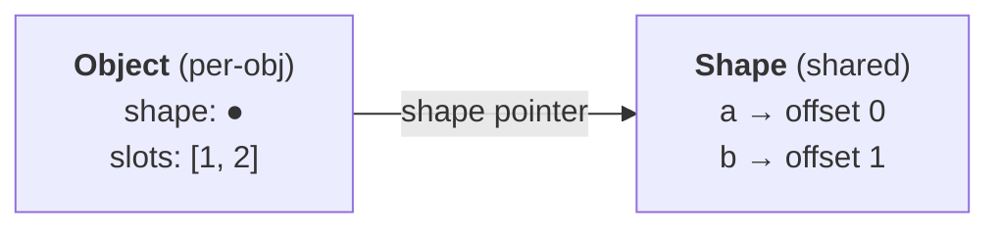
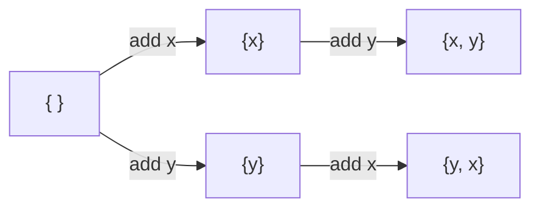

# Object Shapes and Inline Caches

**TL;DR**

- Semantically, JS objects are hash maps. In practice, engines run them near C-struct speed by separating **shape** (the schema) from the object's **slot array** (the values).
- A shape maps `key → offset`. Many structurally-identical objects share one shape; each object still gets offset-based access *individually* from its shape, even when nothing is shared.
- Adding a property creates a **shape transition**. `{x,y}` and `{y,x}` are different shapes — the insertion order defines identity, not the key set.
- Property-access sites install an **inline cache (IC)** that remembers the shape they saw. **Monomorphic** (1 shape): fastest. **Polymorphic** (2–4): still fast. **Megamorphic** (many): slow, falls back to runtime lookup.
- The IC doesn't *speed up* lookup — it *eliminates* it. What's left is a shape-pointer check plus a fixed-offset load.
- Nothing in the ECMAScript spec mandates any of this. Every major engine (V8, SpiderMonkey, JavaScriptCore, Hermes) implements it independently.

---

## Why shapes exist

A naive JS object: one hash map per object. Every `obj.x` hashes the key, walks buckets, compares strings, returns the value. Every access, every time.

But hot `obj.x` in real JS costs a few cycles — comparable to a C struct field access. Shapes + inline caches are how that happens.

## The core idea: split schema from values



- **Object** = shape pointer + array of raw values.
- **Shape** = the `key → offset` table. One copy, shared by all structurally-identical objects.

```js
const a = { x: 1, y: 2 };
const b = { x: 3, y: 4 };   // same shape as a — same keys, same order
```

Without the split, each object would carry its own schema. The split is what makes the schema cheap enough to share *and* stable enough to cache against.

## Shape transitions

Adding a property moves an object to a new shape. Transitions form a tree rooted at the empty shape:



**`{x,y}` and `{y,x}` are different shapes.** Identity is defined by the insertion sequence, not the key set. Two objects with the same keys in different orders cannot share an IC.

Object literals walk the transitions in source order: `{a:1, b:2}` ≡ `o={}; o.a=1; o.b=2`.

## Per-object benefit is separate from sharing

With three objects that have *nothing* in common:

```js
const o1 = { a: 1, b: 2 };
const o2 = { a: 10, c: "string1" };
const o3 = { d: "string2", e: true };
```

each gets its own shape — and that shape is still doing useful work *for that object*. It's what enables offset-based access instead of a hash lookup. Shapes aren't only a sharing mechanism; they're also what gives any single object its struct-like layout.

Sharing still happens constantly in real code — just usually via factories/constructors, not identical literals:

```js
function point(x, y) { return { x, y }; }
point(1,2); point(3,4); point(5,6);   // all share one shape
```

Note: `a` is at offset 0 in both `o1`'s shape and `o2`'s shape, but they're still distinct shapes. A shape is defined by the whole key sequence, so `o1.a` and `o2.a` cannot share an IC entry.

## Inline caches

When the JIT compiles `obj.x`, it emits code that remembers the shape it saw at that site:

```asm
cmp  [o + shape_offset], S1   ; is this the shape I saw before?
jne  slow_path                ; no → fall back
mov  rax, [o + slots + 8]     ; yes → load baked-in offset
```

- **Monomorphic** (1 shape ever seen here): one compare + one load. Fastest.
- **Polymorphic** (2–4 shapes): small lookup table of shape→offset. Still fast.
- **Megamorphic** (many shapes): engine gives up, falls back to generic runtime lookup. Slow, and the JIT stops inlining through the site.

The threshold is engine-specific; "~4 shapes" is the right mental model.

The performance question is never "how many distinct objects?" — it's **"how many shapes flow through this specific property-access site?"**

## Cold vs warm: worked example

Setup:

```js
const o2 = { a: 10, c: "string1" };   // shape S2:  a → 0,  c → 1
function getC(o) { return o.c; }
```

**First call — cold path** (no IC yet):

```
1. Follow o2.shape                 → S2
2. Lookup "c" in S2's property table → offset 1     ← the slow step
3. Load o2.slots[1]                → "string1"
4. Install IC: "shape S2 → offset 1"
```

Step 2 means: hash the string `"c"`, index into the shape's table, walk the bucket, compare names — all in a C++ runtime helper. Roughly 30–100 cycles.

**Every subsequent call — warm path** (object is still shape S2):

```
1. Compare o.shape vs cached S2    → match
2. Load o.slots[1]                 → "string1"
```

Stays in JIT machine code. Roughly 2–5 cycles. The `1` is literally baked into the instruction stream.

**Key insight:** the IC doesn't make the lookup faster — it **replaces** the lookup with a guard. The expensive "where does `c` live?" question was answered once and written into the machine code.

## Three implementations compared

| Aspect | Naive hashmap-per-object | Shape + IC — cold | Shape + IC — warm |
|---|---|---|---|
| Per-object data | Own hashmap | Shape pointer + slots | Shape pointer + slots |
| Steps for `o.c` | hash → bucket walk → value | shape → hash → bucket walk → offset → slot load | shape compare → slot load |
| Hash the key `"c"` | Every access | Once per (site, shape) | Skipped |
| Table walk | Every access | Once | Skipped |
| Where code runs | C++ runtime helper | C++ runtime helper | Pure JIT machine code |
| Rough cost | ~30–100 cycles | ~30–100 cycles | ~2–5 cycles |
| 1000th access | Full cost | — | ~2–5 cycles |
| JS engine analog | Dictionary mode | First-time IC miss | Monomorphic hot IC |

One-line per case:

- **Naive:** always pays full cost — no way to remember across accesses.
- **Cold:** same work as naive, but the answer gets cached.
- **Warm:** the cached answer replaces the work. Only a guard is left.

## Dictionary mode: the fallback

Engines abandon shapes when the object itself looks too dynamic. Triggers:

- Many property additions over time (dozens of transitions on one object).
- Keys that look like data — long or runtime-generated strings (UUIDs, IDs).
- `delete` used on properties.
- Object grows past a size threshold.

The object flips to a real hashmap. Every access becomes cold-path-speed, forever.

**This is often the right call.** Using an object as a dictionary (`cache[userId] = …`) legitimately needs hashmap semantics — the engine picking that representation is doing its job. The lesson isn't "avoid dictionary mode" but: **don't put dictionary-mode objects on hot property-access paths.** If you want a dictionary, prefer `Map` — clearer intent, optimized for the use case.

## Spec vs implementation

- **ECMAScript** says nothing about shapes, hidden classes, or ICs. The spec defines observable behavior; the mechanism is an implementation detail.
- **Every major engine implements it**, under different names:

| Engine | Name | Used by |
|---|---|---|
| V8 | hidden class / map | Chrome, Node, Deno, Edge, Electron, Cloudflare Workers |
| SpiderMonkey | shape | Firefox |
| JavaScriptCore | structure | Safari, Bun |
| Hermes | hidden class | React Native |

You can assume it's there. Few engine details are universal enough to reason about portably; this is one of them.

## Gotchas

- **Consistent init order.** A constructor that assigns properties in varying orders (different branches) produces divergent shapes. Initialize all fields up front, same order, every time.
- **Optional properties multiply shapes.** `if (isAdmin) u.role = 'admin'` splits instances across an axis. With several optional fields, you get combinatorial shape explosion. Prefer `null`/`false` defaults so every instance goes through the same transition chain.
- **`delete` is sticky.** Usually forces dictionary mode, and the object typically doesn't come back.
- **Type-inconsistent writes invalidate ICs.** Assigning a number then later a string to the same property can bust a cache that specialized on the old type.
- **`Object.setPrototypeOf` / `__proto__` mutation** is about the most expensive thing you can do to an object. The prototype is part of the shape, so changing it invalidates every IC that ever touched the object.
- **Lazy property addition** (long after creation) is worse than adding the same property during construction — both because each addition is a new transition and because late additions are what trigger the dictionary-mode heuristics.

## Mental model

> **Shape** — the schema lives *outside* the object, so many objects can share it, and so a call site can remember it and skip the lookup next time.

> **Inline cache** — replace a variable-cost lookup with a fixed-cost guard plus a direct access.

The two together are why JS is fast. Neither works alone: shapes without ICs are only a memory-saving trick, and ICs without shapes have no cheap identity to guard on.

## Related

- [ECMAScript, JavaScript, Engine, Runtime](./ecmascript-engine-runtime.md) — the layer where shapes live. They're an engine concern, *below* the language.
- [JS class semantics](./js-class-semantics.md) — classes and factory functions naturally produce shared shapes; ad-hoc property assignment fights that.
