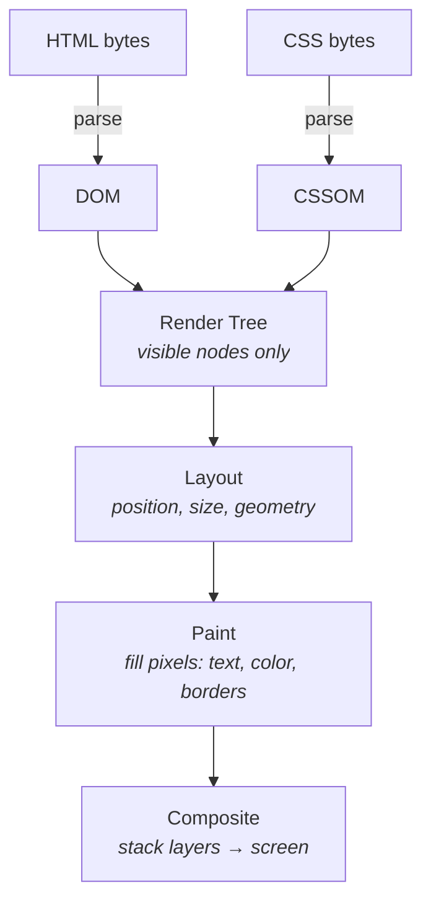

# Critical Rendering Path

**TL;DR**

- The browser turns HTML/CSS/JS text into pixels through a fixed pipeline: **DOM → CSSOM → Render Tree → Layout → Paint → Composite**.
- The pipeline shape is fixed; the *speed* depends on what blocks what.
- Single most useful distinction: **rendering and parsing are separate, blocked by different resources.**
  - **CSS blocks rendering, not parsing.** DOM keeps building; the browser refuses to paint until the CSSOM is ready (to avoid a flash of unstyled content).
  - **JS (default) blocks both.** It also waits for any prior CSS — because `getComputedStyle()` must be correct.
- `async`, `defer`, `preload`, critical CSS, scoped `media` queries are all tactics for unblocking earlier pipeline stages.
- `transform` and `opacity` skip Layout and Paint — only Composite re-runs. That's why CSS animations on those properties are nearly free.

---

## The pipeline



### DOM

Tree representation of the HTML structure. Built **incrementally** as bytes arrive — the parser doesn't wait for the full HTML before starting. Visible in DevTools → Elements.

### CSSOM

Tree of all CSS rules with their **final computed values**. Why a tree of computed values, not a flat list of rules? Because cascade, specificity, and inheritance mean the browser has to *resolve* every element's actual style — a list of rules isn't enough. Visible in DevTools as the "Recalculate Style" event.

### Render tree

DOM + CSSOM merged, including only nodes that will actually paint:

- `display: none` → excluded.
- `visibility: hidden` → **included** (takes up space; just isn't drawn).
- `<head>`, `<script>`, `<meta>` → excluded (structural, not visual).

### Layout (a.k.a. reflow)

Computes geometry — position, width, height, margins — for every node in the render tree. Re-runs whenever something geometric changes: window resize, DOM insertion, font load, changing `width`. Recursive and depends on parent dimensions, so it's expensive.

### Paint

Fills pixels: text, colors, borders, shadows, gradients. May be split across multiple **layers** — fixed-position, transformed, or `will-change` elements get their own layer.

### Composite

Combines painted layers in stacking order to produce the final screen. **Cheap.** Some properties (`transform`, `opacity`) re-run only this stage, skipping Layout and Paint — the basis of cheap CSS animation.

---

## What blocks what

The single most useful idea in CRP: **rendering and parsing are separate, and different resources block them differently.**

| Resource                          | Blocks parsing?            | Blocks rendering?           |
| --------------------------------- | -------------------------- | --------------------------- |
| HTML                              | (it *is* parsing)          | —                           |
| CSS (`<link rel="stylesheet">`)   | ❌                          | ✅                           |
| CSS with non-matching `media`     | ❌                          | ❌                           |
| JS (default)                      | ✅                          | ✅                           |
| JS `async`                        | ⚠️ pauses during execution | ⚠️ same                     |
| JS `defer`                        | ❌                          | ❌ (runs after DOM complete) |
| Images                            | ❌                          | ❌                           |
| Fonts                             | ❌                          | ⚠️ FOIT/FOUT                |

> **FOUC / FOIT / FOUT** — *Flash of Unstyled Content* (page renders before CSS arrives), *Flash of Invisible Text* (text hidden until font loads), *Flash of Unstyled Text* (fallback font shown, swapped when ready). Browsers default to blocking paint on CSS to avoid FOUC; font-display strategies decide between FOIT and FOUT.

### CSS blocks rendering, not parsing

The HTML parser keeps going while CSS downloads. But the browser refuses to paint until the CSSOM is built — to avoid FOUC.

#### Making CSS non-render-blocking

| Technique                                                                       | How it works                                                                       |
| ------------------------------------------------------------------------------- | ---------------------------------------------------------------------------------- |
| `media="print"` / `media="(max-width: 600px)"`                                  | Browser still downloads, but doesn't block rendering when the query doesn't match. |
| `<link rel="stylesheet" href="x.css" media="print" onload="this.media='all'">`  | Async-CSS hack: pretend it's print-only, swap to `all` once loaded.                |
| Inline critical CSS in `<style>` + async-load the rest                          | Gold standard. Above-the-fold styles ship with the HTML; rest loads in parallel.   |
| Route/component splitting                                                       | Build tools (Vite, webpack, Next.js) do this automatically.                        |

The mental shift: **not all CSS is equal.** Above-the-fold styles are critical. Modal CSS, footer CSS, dark-mode CSS, print CSS — none need to block first paint.

### JS is parser-blocking by default

When the parser hits a `<script>` (no `async`, no `defer`):

1. **Pauses HTML parsing.**
2. Downloads the script (if external).
3. Executes it to completion.
4. Resumes parsing.

Two reasons it's that aggressive:

1. **`document.write()`** can inject HTML into the parser's input stream — the parser must be paused so the script can rewrite the document.
2. **DOM access** (`document.querySelector`, etc.) needs the DOM in a known state. If parsing kept going in parallel, query results would be a moving target.

### JS waits for CSS

JS can read computed styles via `getComputedStyle()`. For that to be correct, the CSSOM must be ready. So:

> **One slow stylesheet stalls everything.** Slow CSS → JS execution waits → parser stays paused → DOM stalls → no render.

### Order matters

A `<script>` in `<head>` referencing DOM elements in `<body>` will fail — the elements don't exist yet. Historically why scripts were placed at the end of `<body>`; today `defer` is the better answer (see below).

---

## Loading strategies for JS

### Default (blocking)

```html
<script src="app.js"></script>
```

Parser-blocking. Avoid for app code unless `document.write` is involved (and it shouldn't be).

### Script at end of `<body>`

```html
<body>
  ...content...
  <script src="app.js"></script>
</body>
```

Works. Drawback: download doesn't start until the parser reaches the tag — wasted time.

### `async`

```html
<script src="analytics.js" async></script>
```

- Downloads in parallel with parsing.
- **Executes as soon as download finishes**, interrupting the parser at that moment.
- Order is unpredictable across multiple `async` scripts.
- `document.write()` is ignored; DOM access is unsafe (DOM may be partial).
- Use for: independent scripts (analytics, ad pixels, error trackers) that don't query the DOM.

### `defer`

```html
<script src="app.js" defer></script>
```

- Downloads in parallel with parsing.
- **Executes after the DOM is fully parsed**, just before `DOMContentLoaded`.
- Multiple `defer` scripts run in document order.
- Same execution timing as "script at end of body" — but the download starts as soon as the browser sees the tag in `<head>`, so it's strictly better.
- Use for: app code that depends on the DOM. The boring, correct default.

> `DOMContentLoaded` fires when HTML is fully parsed and `defer` scripts have run. `load` fires later, after all subresources (images, stylesheets) are done.

### `preload`

```html
<link rel="preload" href="font.woff2" as="font" crossorigin>
```

- Tells the browser "fetch this with high priority — you'll need it soon."
- **Does not** make a resource non-blocking. Only changes download timing.
- Useful for resources discovered late (e.g. fonts referenced inside CSS — the browser only learns of them after the CSS is parsed).

### Decision tree

- Does the script need the DOM? → **`defer`**.
- Is the script independent (analytics, ads, trackers)? → **`async`**.
- Both apply or unsure? → **`defer`** is the safer default.

---

## Speculative parsing

Even when the parser is "blocked" by a script, modern browsers don't sit idle. A separate **preload scanner** scans ahead in the HTML, finds `<link>`, `<script>`, `` tags, and **starts downloads in parallel** while the main parser is paused.

Purely a download-speed optimization — it doesn't change the rules about what blocks rendering or DOM construction. But it explains why a 1MB JS file in `<head>` doesn't completely halt the network: the browser is already fetching the next CSS, the next image, etc., behind the scenes.

---

## Cost of CSS changes

| Change                                          | Pipeline stages re-run     |
| ----------------------------------------------- | -------------------------- |
| `transform`, `opacity`                          | Composite only (cheapest)  |
| `background-color`, `color`                     | Paint + Composite          |
| `width`, `height`, `margin`, `top` (geometric)  | Layout + Paint + Composite |

Animating geometric properties triggers Layout every frame. Animating `transform`/`opacity` doesn't. This is why "use `transform` instead of `top`/`left` for animation" is the standard advice.

---

## Performance levers, ranked by impact

1. Inline critical CSS, async-load the rest.
2. `defer` all your app JS.
3. Use `media` to scope non-critical CSS.
4. `preload` late-discovered fonts and resources.
5. Minimize CSS/JS payload size.
6. Avoid `@import` inside CSS — it delays discovery (the browser has to parse the outer CSS before it sees the import).

---

## Gotchas

- **"CSS blocks parsing"** — no. CSS blocks **rendering**. The DOM keeps building.
- **"`async` is just `defer` but faster"** — no. `async` runs whenever its download finishes (could be mid-parse). `defer` waits for the DOM to be done.
- **"`preload` makes a resource non-blocking"** — no. `preload` changes priority, not blocking behavior. A `<link rel="stylesheet">` is still render-blocking even with `preload`.
- **"Putting `<script>` at the end of `<body>` is the modern best practice"** — not anymore. `defer` is strictly better: same execution timing, but download starts as soon as the browser sees the tag in `<head>`.
- **"`async` scripts can safely query the DOM"** — dangerous. The DOM may be partially built. Whether `querySelector` finds an element is a coin flip depending on network speed.
- **"`document.write()` works in any script"** — browsers ignore it from `async`/`defer` scripts. Only blocking scripts can use it (and you shouldn't).
- **"Layout, Paint, Composite are one step"** — three distinct steps with very different costs. CSS animations on `transform`/`opacity` skip Layout and Paint entirely.

---

## Worked example: slow CSS + deferred JS

```html
<head>
  <link rel="stylesheet" href="slow.css">  <!-- 2s -->
  <script src="fast.js" defer></script>    <!-- 0.1s -->
</head>
<body>Hello</body>
```

When does the user see "Hello"? When does `fast.js` execute?

- **"Hello" appears at ~2s.** CSS blocks rendering. The DOM finishes far earlier, but paint waits on the CSSOM.
- **`fast.js` runs just after ~2s.** `defer` waits for the DOM to be parsed. JS execution *also* waits for any pending stylesheet that came before it in the document (because of `getComputedStyle`). So `fast.js` can't run until both conditions are met — fires immediately before `DOMContentLoaded`.

---

## Further exploration

- **`requestAnimationFrame` and the rendering loop.** After initial load, the browser keeps re-rendering at ~60fps. Frame budgets, jank, the 16ms rule.
- **Layer promotion and `will-change`.** When and why the browser puts elements on their own composite layer, and the memory cost of overdoing it.
- **Core Web Vitals (LCP, INP, CLS).** How Google measures CRP performance in practice. LCP especially is a direct consequence of CRP optimization.
- **HTTP/2 and HTTP/3.** Multiplexing changes the cost model of many small CSS/JS files vs. one big bundle. Old "concatenate everything" advice no longer fully applies.
- **Streaming HTML / progressive rendering.** Servers can flush HTML in chunks so the browser starts rendering before the full response arrives. The `<head>` flush pattern.

---

## Related

- [js-engine-runtime.md](./js-engine-runtime.md) — engine vs. runtime. The CRP is what the *rendering* side of the runtime does, alongside the JS engine that executes scripts.
- [dom-collections.md](./dom-collections.md) — what the DOM produced by the parser actually exposes to JS.
- [../css/index.md](../css/index.md) — selectors and the cascade that drive CSSOM construction.
