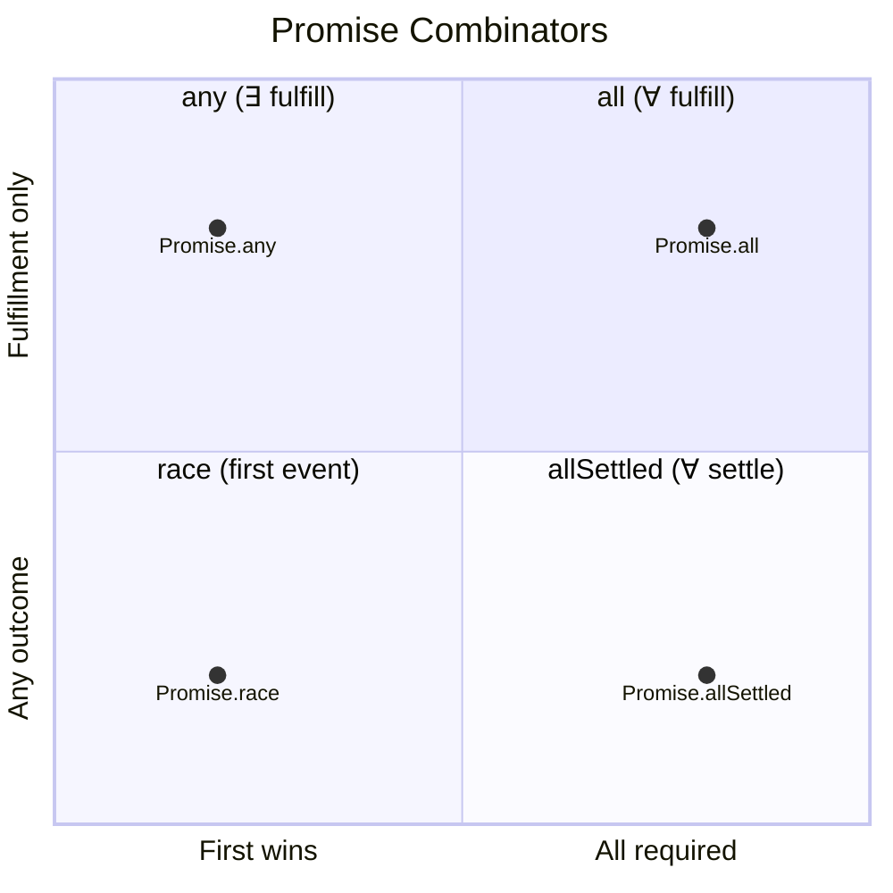

# Race Combinators: Promise.race & Promise.any

**TL;DR:** `Promise.race` mirrors the first promise to settle — fulfillment or rejection, doesn't matter. `Promise.any` waits for the first _fulfillment_ and ignores rejections (rejects with `AggregateError` only if everything fails). Both return a single value, not an array. Neither cancels losing promises.

## The Problem: First Result Wins

`Promise.all` and `Promise.allSettled` wait for _everything_. Sometimes you want the **fastest** result:

- **Timeout pattern** — race a fetch against a timer; whoever settles first wins.
- **Redundant requests** — hit multiple mirrors, use whichever responds first.
- **First success** — try multiple strategies, take the first one that works.

## `Promise.race`

Takes an iterable of promises. Returns a promise that **mirrors the first promise to settle** — whether it fulfills or rejects.

```js
Promise.race([fetch("/api/fast-server"), fetch("/api/slow-server")]).then((response) =>
  console.log("Winner:", response.url),
);
```

### Key Behaviors

**First to settle wins.** If that's a rejection, the race rejects. If it's a fulfillment, the race fulfills. It doesn't care _what_ happened — only _who was first_.

**Remaining promises keep running.** No cancellation in JS. Losing promises still execute — their side effects happen, their `.then()` handlers fire. Only the effect on the outer promise is neutralized by the settle-once guarantee.

**Empty iterable → never settles.** The returned promise stays pending forever. `race` is purely reactive — it waits for a settlement event. With zero inputs, no event can ever arrive, and `race` has no failure condition of its own, so it hangs.

### The Timeout Pattern

The classic `Promise.race` use case — put a ceiling on how long you'll wait:

```js
function fetchWithTimeout(url, ms) {
  const timeout = new Promise((_, reject) => setTimeout(() => reject(new Error("Timed out")), ms));
  return Promise.race([fetch(url), timeout]);
}

fetchWithTimeout("/api/data", 3000)
  .then((response) => response.json())
  .then((data) => console.log(data))
  .catch((err) => console.log(err.message)); // "Timed out" if fetch > 3s
```

If fetch resolves in 1s, it wins. The timeout timer still fires at 3s and calls `reject()`, but the outer promise already settled — no-op.

### From-Scratch Implementation

The simplest combinator to implement — the settle-once guarantee does all the work:

```js
function promiseRace(promises) {
  return new Promise((resolve, reject) => {
    for (const p of promises) {
      Promise.resolve(p).then(resolve, reject);
    }
  });
}
```

Every input promise gets `.then(resolve, reject)` — the _same_ `resolve` and `reject` from the outer promise's executor, captured via closure. Whichever input settles first calls one of them, settling the outer promise. Subsequent calls from other inputs hit an already-settled promise and silently do nothing.

No counter, no results array, no index tracking. The loop body never runs on empty input, so `resolve`/`reject` are never called — that's why `race([])` hangs.

## `Promise.any`

Takes an iterable of promises. Returns a promise that **fulfills with the first fulfillment**. Rejections are collected but don't settle the race.

```js
Promise.any([
  fetch("https://mirror1.example.com/data"),
  fetch("https://mirror2.example.com/data"),
  fetch("https://mirror3.example.com/data"),
]).then((response) => console.log("Fastest success:", response.url));
```

### Key Behaviors

**First fulfillment wins.** Rejections are ignored as long as at least one promise fulfills.

**All reject → `AggregateError`.** If _every_ promise rejects, `Promise.any` rejects with an `AggregateError` — a special error type wrapping all individual rejection reasons in an `errors` array, in input order:

```js
Promise.any([Promise.reject(new Error("A")), Promise.reject(new Error("B")), Promise.reject(new Error("C"))]).catch(
  (err) => {
    console.log(err instanceof AggregateError); // true
    console.log(err.errors.map((e) => e.message)); // ["A", "B", "C"]
  },
);
```

**Empty iterable → rejects immediately** with `AggregateError` (empty `errors` array). Unlike `race([])` which hangs, `any` can determine impossibility upfront — zero inputs means zero possible fulfillments, so it fails decisively.

### From-Scratch Implementation

Mirror image of `Promise.all` — where `all` short-circuits on first _rejection_, `any` short-circuits on first _fulfillment_:

```js
function promiseAny(promises) {
  return new Promise((resolve, reject) => {
    const errors = [];
    let remaining = 0;
    const items = Array.from(promises);

    if (items.length === 0) {
      return reject(new AggregateError([], "All promises were rejected"));
    }

    remaining = items.length;

    items.forEach((item, index) => {
      Promise.resolve(item).then(
        (value) => resolve(value), // first fulfillment wins
        (reason) => {
          errors[index] = reason; // preserve input order
          remaining--;
          if (remaining === 0) {
            reject(new AggregateError(errors, "All promises were rejected"));
          }
        },
      );
    });
  });
}
```

## The Four Combinators — Complete Map

| Combinator           | Waits for         | Short-circuits on | Empty input              |
| -------------------- | ----------------- | ----------------- | ------------------------ |
| `Promise.all`        | All fulfill       | First rejection   | Fulfills `[]`            |
| `Promise.allSettled` | All settle        | Never             | Fulfills `[]`            |
| `Promise.race`       | First to settle   | N/A (first wins)  | Never settles            |
| `Promise.any`        | First fulfillment | First fulfillment | Rejects (AggregateError) |

Two axes to remember:

- **How many matter?** All (`all`, `allSettled`) vs first (`race`, `any`).
- **What counts?** Any settlement (`race`, `allSettled`) vs only fulfillment (`all`, `any`).

The empty-input column isn't arbitrary — it falls out of formal logic. See [Formal Structure](#formal-structure-behind-the-combinators) below.

## Formal Structure Behind the Combinators

The four combinators aren't arbitrary API choices — they implement well-known logical and algebraic operations. Their behaviors (including the "weird" empty-input cases) fall out mechanically from this structure.

### Logical quantifiers

`all` and `any` map directly to the universal (∀) and existential (∃) quantifiers from predicate logic, where the predicate is "fulfills":

| Combinator    | Quantifier  | Question it answers          |
| ------------- | ----------- | ---------------------------- |
| `Promise.all` | ∀ (for all) | "Do all promises fulfill?"   |
| `Promise.any` | ∃ (exists)  | "Does at least one fulfill?" |

This mapping determines short-circuit behavior:

- **∀ short-circuits on counterexample.** One rejection disproves "all fulfill" — no need to wait for the rest. → `all` rejects on first rejection.
- **∃ short-circuits on witness.** One fulfillment proves "at least one fulfills" — done. → `any` resolves on first fulfillment.

### Vacuous truth and empty inputs

The key principle: **a universal statement over an empty set is true; an existential statement over an empty set is false.**

- "All unicorns are blue" (∀x ∈ ∅, P(x)) → **true** — no counterexample exists.
- "Some unicorn is blue" (∃x ∈ ∅, P(x)) → **false** — no witness exists.

Applied directly:

| Expression        | Logic                      | Result                     |
| ----------------- | -------------------------- | -------------------------- |
| `Promise.all([])` | ∀x ∈ ∅, x fulfills → true  | Resolves with `[]`         |
| `Promise.any([])` | ∃x ∈ ∅, x fulfills → false | Rejects (`AggregateError`) |

No special cases — the empty-input behavior is a mechanical consequence of which quantifier the combinator implements.

### Algebraic view: folds with identity elements

Another angle on the same structure — think of each combinator as a fold (reduction) over the input collection:

| Combinator    | Fold operation | Identity element | Empty fold result    |
| ------------- | -------------- | ---------------- | -------------------- |
| `Promise.all` | AND (∧)        | true             | true → resolves `[]` |
| `Promise.any` | OR (∨)         | false            | false → rejects      |

AND's identity is `true` (x ∧ true = x), so folding AND over nothing yields `true`.  
OR's identity is `false` (x ∨ false = x), so folding OR over nothing yields `false`.

Same conclusion, different derivation path. Pick whichever clicks faster in the moment.

### Where `race` and `allSettled` don't fit the logic model

`race` and `allSettled` aren't logical quantifiers — they operate on a different axis:

- **`Promise.race`** — temporal, not logical. It answers "what settles first?" not "do they fulfill?" It has no truth condition and no failure condition of its own. It's purely reactive: wait for an event, mirror it. Empty input → no event can ever arrive → **pending forever**. There's no identity element for "first in time over nothing." And it _can't_ reject as a fallback either — a rejected `race` is indistinguishable from "an input settled with a rejection," which would fabricate an event that never happened. Pending is the only honest state.

- **`Promise.allSettled`** — observational. It answers "what happened to each?" — collecting outcomes without judging them. It's ∀ over _settlement_ (not fulfillment), and since both fulfillment and rejection count as settling, it can never short-circuit. Empty input → ∀x ∈ ∅, x settles → trivially true → **resolves with `[]`**.

### The two axes, formalized



| Axis                 | Values                                                                  |
| -------------------- | ----------------------------------------------------------------------- |
| **How many matter?** | All (`all`, `allSettled`) vs first (`race`, `any`)                      |
| **What counts?**     | Fulfillment only (`all`, `any`) vs any outcome (`race`, `allSettled`)   |
| **Operator type**    | Logical (`all`, `any`) vs temporal/observational (`race`, `allSettled`) |

The logical pair (`all`/`any`) gets clean algebraic behavior and vacuous-truth empty semantics. The temporal/observational pair (`race`/`allSettled`) follows event-system semantics instead — "no events" means either "wait forever" or "trivially done collecting nothing."
