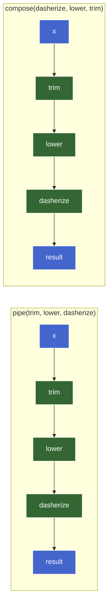
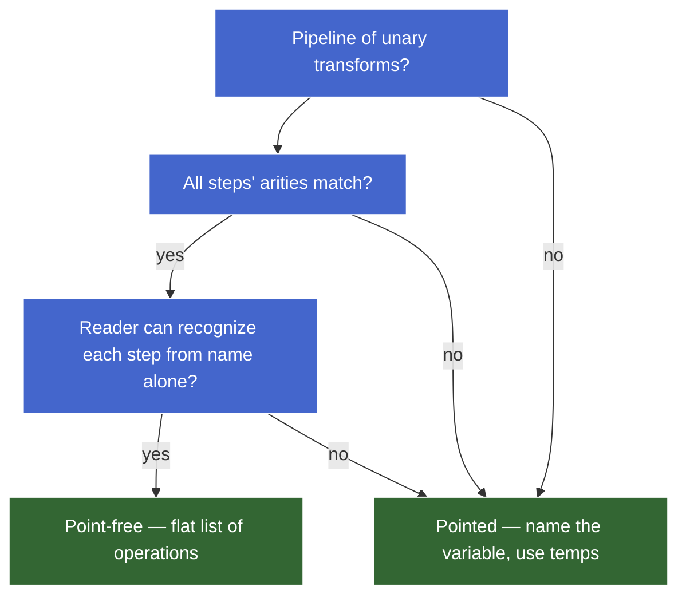

# Composition & Pipelines — teaching draft

## Plan (teaching order)

- [x] 1. Why composition — teaser, motivation, the `f(g(x))` shape
- [x] 2. `compose` and `pipe` from scratch — built on `reduceRight` / `reduce`, associativity
- [ ] 3. Point-free style — what it is, when it pays off, when it obscures
- [ ] 4. Method chaining vs functional composition — same shape, different ergonomics
- [ ] 5. Transducers-lite — fusing map/filter without intermediate arrays

---

## Why composition

### Teaser

You have three transforms — trim a string, lowercase it, replace spaces with hyphens — and you want a single `slugify`:

```js
const trim       = (s) => s.trim();                     // L1
const lower      = (s) => s.toLowerCase();              // L2
const dasherize  = (s) => s.replace(/\s+/g, "-");       // L3
```

Three ways to glue them into a single function:

```js
// Style A — nested calls
const slugifyA = (s) => dasherize(lower(trim(s)));      // L4

// Style B — temp variables
const slugifyB = (s) => {                               // L5
  const a = trim(s);                                    // L6
  const b = lower(a);                                   // L7
  return dasherize(b);                                  // L8
};                                                      // L9

// Style C — a single combinator
const slugifyC = compose(dasherize, lower, trim);       // L10
```

All three produce `"hello-world"` for input `"  Hello  World  "`. The interesting question isn't *what* they output — it's which is the right tool when chains get longer.

### Why nested calls break down at scale

Style A is fine when there are 3 functions. It breaks down as the chain grows:

```js
// 3 functions — readable
dasherize(lower(trim(s)))

// 5 functions — strained
removeStopwords(stem(dasherize(lower(trim(s)))))

// 7 functions — hostile
truncate(40, deduplicate(removeStopwords(stem(dasherize(lower(trim(s)))))))
```

Three compounding problems:

| Problem | Why it hurts |
|---|---|
| **Read order is right-to-left, inside-out** | The first thing applied (`trim`) is buried deepest; the last (`truncate`) is at the outside. You read in the opposite direction of execution. |
| **Each new step adds parens on both sides** | Inserting `normalize` after `trim` rewrites the whole expression. Noisy diffs, merge conflicts. |
| **A flat sequence is encoded as a tree** | `f(g(h(x)))` is AST-shaped. Intent is "do these in order" — a flat list. The shape lies about the structure. |

### Style B — the verbose mid-ground

Temp variables fix the read-order and tree-shape problems:

```js
const slugify = (s) => {
  const a = trim(s);
  const b = lower(a);
  const c = dasherize(b);
  return c;
};
```

But the names `a, b, c` are pure plumbing — they don't carry meaning, they exist to thread data from one step to the next. Six lines for "do these three things in order," and the reader spends cycles tracking single-use bindings. **The names are noise.**

### Style C — flat list of operations

```js
const compose = (...fns) => (x) => fns.reduceRight((acc, f) => f(acc), x);

const slugify = compose(dasherize, lower, trim);
```

`slugify` is now a flat list of operations — exactly the shape that matches the intent.

| Change | Style A | Style C |
|---|---|---|
| Add a step | Re-nest the whole expression | Append to the list |
| Remove a step | Re-nest, count parens | Delete an item |
| Reorder | Re-nest top-to-bottom | Reorder list elements |

The cost is one definition of `compose` (or import it from `lodash/fp`, `ramda`, etc.) — paid once, amortized across every pipeline.

### The shape: `(f ∘ g)(x) = f(g(x))`

Function composition has a name in math: the `∘` operator. For two functions `f` and `g`, the composition `f ∘ g` is the function that takes `x` and returns `f(g(x))`. Read right-to-left: apply `g` first, then `f`.

**The mental model:** composition glues unary functions end-to-end — the output of one becomes the input of the next. `f: A → B`, `g: B → C` ⇒ `g ∘ f: A → C`. The types have to line up at the seams.


`pipe(f, g)` is the same operation written left-to-right: apply `f` first, then `g`. Same data flow; reversed argument order. Both names show up in real code; pick the one whose direction matches how you want to read.

### When composition earns its keep

| Use case | Composition pays? |
|---|---|
| Named, reused pipeline (slugify, normalizer, validator) | ✅ define once, use many times |
| 5+ unary transforms in sequence | ✅ flat reads better than nested |
| One-off, 2–3 functions | ❌ nested calls are fine |
| Mixed-arity steps (some take 2 args mid-chain) | ❌ requires currying first (next chunk) |
| Steps that need to short-circuit on error | ❌ regular composition has no error-channel; needs an `Either`/`Result` monad-shaped wrapper |

So the "merely clever" smell on style C *is* real for a one-off 3-step transform — A is genuinely fine there. Composition earns its keep when chains get longer or get reused.

### Sub-part check

Why does inserting one new function in the middle of a Style A chain (`f(g(h(i(x))))` → `f(g(j(h(i(x)))))`) cause a noisier diff than the same insertion in Style C (`compose(f, g, h, i)` → `compose(f, g, j, h, i)`)?


---

## `compose` and `pipe` from scratch

The two combinators are the same operation written in opposite directions:

```js
// pipe — left-to-right (apply args in argument order)
const pipe    = (...fns) => (x) => fns.reduce     ((acc, f) => f(acc), x);

// compose — right-to-left (math convention: f ∘ g ∘ h)
const compose = (...fns) => (x) => fns.reduceRight((acc, f) => f(acc), x);
```

Same five tokens, one differs: `reduce` vs `reduceRight`.

### Tracing it through reduce

`pipe(trim, lower, dasherize)("  Hello  World  ")` runs as:

```
init       = "  Hello  World  "                  // x, the seed
fns        = [trim, lower, dasherize]
reduce     :
  iter 1   acc="  Hello  World  ", f=trim       → trim(acc)      = "Hello  World"
  iter 2   acc="Hello  World",     f=lower      → lower(acc)     = "hello  world"
  iter 3   acc="hello  world",     f=dasherize  → dasherize(acc) = "hello-world"
result     = "hello-world"
```

The accumulator's role is unusual here — it's not a sum or a list, it's the **value being threaded through the pipeline**. Each callback application is "apply the next function to the running value." `B = T = whatever-flows-through`. Type-uniform fold where the type can drift step-by-step (the *types* of intermediate values can differ even though the runtime accumulator slot is the same).

For `compose`, swap to `reduceRight` and the function list iterates last-to-first — which is why `compose(dasherize, lower, trim)` and `pipe(trim, lower, dasherize)` produce the same result. **Same operation, mirrored argument order.**

### The two reductions in the same picture



Data flow is identical. The only difference is the order in which the functions appear in the argument list. **Pipe matches reading order; compose matches `f(g(h(x)))` written math.**

### Which to reach for

| Use | Reach for | Why |
|---|---|---|
| Application code, JS / TS pipelines | **`pipe`** | Left-to-right matches data flow, prose order, method chaining |
| Translating math (`f ∘ g`) directly | `compose` | Argument order matches written formula |
| `reduceRight` over function-of-functions semantics — see *Composition is right-associative* below | `compose` | The math literally composes that way |

Modern JS code (lodash/fp's `pipe`, Ramda's `pipe`, RxJS `pipe`) defaults to **`pipe`**. `compose` is mostly a hold-out from FP libraries that prioritize math notation.

### Identity (empty composition) and the algebraic structure

What does `pipe()` (with zero functions) do? It returns `(x) => x` — the **identity function**. Same for `compose()`.

This isn't a special case patched in. It falls out of the reduce: `[].reduce((acc, f) => f(acc), x)` returns `x` because there are no callbacks to apply — the seed flows through unchanged. The empty fold returns the identity.

> **Aside — formal layer.** Functions with composition form a **monoid** under composition:
>
> - **Identity element** — `id = (x) => x`. `pipe(id, f)` ≡ `pipe(f, id)` ≡ `f`.
> - **Associativity** — `pipe(pipe(f, g), h)` ≡ `pipe(f, pipe(g, h))` ≡ `pipe(f, g, h)`. Grouping doesn't matter.
> - **Closure** — composing two unary functions gives another unary function.
>
> This is the same monoid pattern as string concat (identity `""`), array concat (identity `[]`), `+` (identity `0`). The *Algebraic structure* chunk later in this course generalizes it: anywhere you have a binary op + identity + associativity, `reduce` is the natural fold over a list of those things.
>
> Practically: associativity is what lets `pipe(...fns)` accept *any* number of arguments and produce a sensible answer regardless of how the call gets refactored. `pipe(f, g, h)` and `pipe(pipe(f, g), h)` are interchangeable — that's not a coincidence, it's the monoid law.

### Composition is right-associative — why `compose` reaches for `reduceRight`

The math reading of `f ∘ g ∘ h` is **right-associative** by convention: `f ∘ (g ∘ h)`. That means:

- The rightmost function `h` runs first.
- Its result feeds `g`, then `f`.

If you write `compose` with plain `reduce` (left-fold) over `[f, g, h]`, the first iteration applies `f` to the seed — wrong direction. `reduceRight` walks the list from right to left, so the first function applied is the rightmost one (`h`) — matching the math.

`pipe` is the mirror: argument order matches application order, so plain `reduce` (left-fold) is the right tool.

> **Aside — when direction matters.** For commutative operations like `+`, `reduce` and `reduceRight` give the same result. **Composition isn't commutative** — `pipe(trim, lower)` ≠ `pipe(lower, trim)` in general (the order of operations matters; they're different functions even when they produce the same answer on a given input). This is the rare case where `reduceRight` does something `reduce` can't replicate without re-reversing the input — the reason it exists in the language.

### Bug demo — passing in a non-unary step

`pipe` and `compose` only work on **unary** functions (one argument, one return). Drop in a binary function and the chain silently breaks:

```js
const add  = (a, b) => a + b;            // L1 — binary
const half = (x) => x / 2;                // L2

const broken = pipe(add, half);            // L3
broken(10, 20);                            // L4 → expected 15, got NaN
```

What happens at L4:

1. `pipe`'s inner is `(x) => fns.reduce((acc, f) => f(acc), x)` — only one parameter, `x`.
2. `broken(10, 20)` binds `x = 10`; the second argument `20` is **dropped on the floor**.
3. Iter 1: `add(10)` — `a = 10`, `b = undefined`, returns `10 + undefined` = `NaN`.
4. Iter 2: `half(NaN)` = `NaN`.

No throw. Just silently wrong output.

Two ways to fix, depending on intent:

```js
// (A) Keep add binary, lift it before composing — currying
const addCurried = (a) => (b) => a + b;          // unary returning unary
const addTen = addCurried(10);                    // unary
pipe(addTen, half)(20);                            // → 15

// (B) Make the pipeline take a tuple
pipe(([a, b]) => a + b, half)([10, 20]);           // → 15
```

(A) is the *currying* approach — the canonical way to feed multi-arg functions into composition. Covered in the next chunk (*Currying & partial application*). (B) is fine for ad hoc cases but doesn't scale.

### Sub-part check

Why does `compose` use `reduceRight` while `pipe` uses `reduce`? (Two valid framings: implementation-mechanical and structural — pick whichever lands more naturally.)


---

## 3. Point-free style

**Point-free** (sometimes "tacit") = defining a function without explicitly mentioning its argument. The "point" is the input variable; "free" means it doesn't appear.

```js
// Pointed — argument named explicitly
const slugify = (s) => pipe(trim, lower, dasherize)(s);

// Point-free — argument not mentioned
const slugify = pipe(trim, lower, dasherize);
```

Both are equivalent. The right-hand side of the second `slugify` *is* a function — `pipe` returned one — so binding it to a name is enough; no need to wrap it in another arrow that just passes through.

### 3.1. The eta-reduction insight

`(s) => f(s)` ≡ `f`. Wrapping a function in an arrow that just forwards its argument is **always** redundant. This is a special case of η-reduction (eta-reduction) from lambda calculus.

```js
// All three are the same function (modulo identity)
const f1 = f;
const f2 = (x) => f(x);
const f3 = (...args) => f(...args);   // for variadic
```

In point-free style, you remove the wrapper because there's no work happening inside it. The function being assigned to the name *is itself* the function you wanted.

### 3.2. When point-free pays off

| Scenario | Why point-free wins |
|---|---|
| Pipeline of unary transforms | Reads as a flat list of operations; no plumbing variable |
| Reusable named pipeline (slugify, normalizer) | One declaration, zero ceremony per use |
| Function-as-value contexts (`map`, `filter`, callbacks) | The composed function is *the value* you're passing |

```js
// Idiomatic
users.map(pipe(prop("email"), trim, lower));

// Verbose equivalent
users.map((u) => {
  const e = prop("email")(u);
  const t = trim(e);
  return lower(t);
});
```

### 3.3. When point-free obscures

Point-free style **assumes you can recognize the data flow without the variable name as a signpost**. When that fails, the style hurts more than it helps.

| Smell | What it does to readers |
|---|---|
| Steps need different *parts* of the input | Forces extra combinators (`fork`, `juxt`, `converge`) the reader probably doesn't recognize |
| Multi-arg steps require partial application or currying | Reader has to mentally apply arguments to figure out what each step receives |
| Mid-pipeline branching (if-this-then-that) | No clean point-free form; you reach for `cond`, `ifElse`, `when` from Ramda |
| Arity matters and isn't obvious from the name | Bugs sneak in (see *parseInt trap* below) |
| Pipeline interleaves logging, debugging, side effects | Pointed style with named intermediates is way easier to step through |

**Heuristic:** if a teammate has to look up Ramda's `converge` to read your function, the function is no longer self-documenting. The verbosity of pointed style is sometimes the right cost to pay for "the reader can read this with no library lookup."

### 3.4. Bug demo — the `parseInt` arity trap

```js
["10", "20", "30"].map(parseInt);    // L1
// → [10, NaN, NaN]
```

Why? `parseInt` is **binary** — `parseInt(string, radix)`. `Array.prototype.map` calls its callback with `(element, index, array)`. So:

| `i` | `element` | `index` | call | result |
|---|---|---|---|---|
| 0 | `"10"` | `0` | `parseInt("10", 0)` — radix `0` means "auto-detect" | `10` |
| 1 | `"20"` | `1` | `parseInt("20", 1)` — radix `1` is invalid | `NaN` |
| 2 | `"30"` | `2` | `parseInt("30", 2)` — radix `2` (binary), `"30"` not valid binary | `NaN` |

This is the cost of going point-free without checking arity. Two safer fixes:

```js
["10", "20", "30"].map((x) => parseInt(x, 10));   // explicit arg, explicit radix
["10", "20", "30"].map(Number);                    // unary; idiomatic for base-10 conversion
```

`Number` is unary, so the trap never fires. The general lesson: **point-free silently bridges arities — when the receiving function takes more arguments than the sending function provides, the extras come from wherever the caller happens to be passing them.** That's a feature when arities match and a bug when they don't.

### 3.5. Decision framework



### 3.6. Status / when to use

Point-free is a **capability with a smell radius** — exactly the kind of feature the writing-style guide flags as needing judgment paired with mechanism.

| Capability | Smell vs OK in |
|---|---|
| Eta-reduction on a clean unary pipeline | ✅ idiomatic, default for named pipelines |
| Eta-reduction on `parseInt`, `JSON.parse`, etc. | ❌ arity trap; wrap in an arrow with explicit args |
| Heavy combinator soup (`converge`, `juxt`, `pluck`) for readability | ❌ smells; prefer pointed + temp names |
| Removing the variable just to look more "functional" | ❌ aesthetic, not communication |

**Default in JS application code:** lean pointed. Reach for point-free when the pipeline is clean, unary, and named-once-used-many-times.

### 3.7. Sub-part check

Why does `["10", "20", "30"].map(parseInt)` produce `[10, NaN, NaN]` and not `[10, 20, 30]`? The structural reason — point at the mechanism, not just the symptom.
