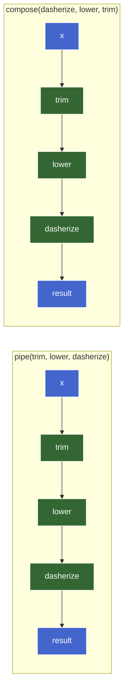
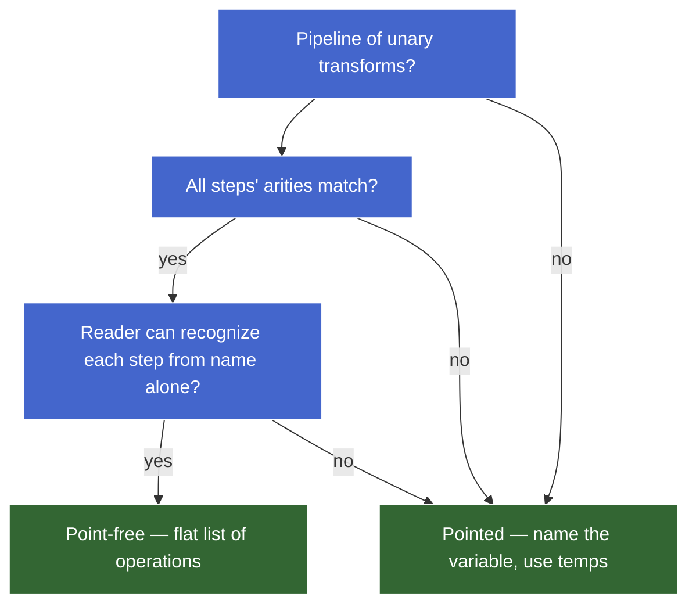

# 1. Composition & Pipelines — teaching draft

## 1.1. Plan (teaching order)

- [x] 1. Why composition — teaser, motivation, the `f(g(x))` shape
- [x] 2. `compose` and `pipe` from scratch — built on `reduceRight` / `reduce`, associativity
- [x] 3. Point-free style — what it is, when it pays off, when it obscures
- [x] 4. Method chaining vs functional composition — same shape, different ergonomics
- [x] 5. Transducers-lite — fusing map/filter without intermediate arrays

---

## 1.2. Why composition

### 1.2.1. Teaser

You have three transforms — trim a string, lowercase it, replace spaces with hyphens — and you want a single `slugify`:

```js
const trim       = (s) => s.trim();                     // L1
const lower      = (s) => s.toLowerCase();              // L2
const dasherize  = (s) => s.replace(/\s+/g, "-");       // L3
```

Three ways to glue them into a single function:

```js
// Style A — nested calls
const slugifyA = (s) => dasherize(lower(trim(s)));      // L4

// Style B — temp variables
const slugifyB = (s) => {                               // L5
  const a = trim(s);                                    // L6
  const b = lower(a);                                   // L7
  return dasherize(b);                                  // L8
};                                                      // L9

// Style C — a single combinator
const slugifyC = compose(dasherize, lower, trim);       // L10
```

All three produce `"hello-world"` for input `"  Hello  World  "`. The interesting question isn't *what* they output — it's which is the right tool when chains get longer.

### 1.2.2. Why nested calls break down at scale

Style A is fine when there are 3 functions. It breaks down as the chain grows:

```js
// 3 functions — readable
dasherize(lower(trim(s)))

// 5 functions — strained
removeStopwords(stem(dasherize(lower(trim(s)))))

// 7 functions — hostile
truncate(40, deduplicate(removeStopwords(stem(dasherize(lower(trim(s)))))))
```

Three compounding problems:

| Problem | Why it hurts |
|---|---|
| **Read order is right-to-left, inside-out** | The first thing applied (`trim`) is buried deepest; the last (`truncate`) is at the outside. You read in the opposite direction of execution. |
| **Each new step adds parens on both sides** | Inserting `normalize` after `trim` rewrites the whole expression. Noisy diffs, merge conflicts. |
| **A flat sequence is encoded as a tree** | `f(g(h(x)))` is AST-shaped. Intent is "do these in order" — a flat list. The shape lies about the structure. |

### 1.2.3. Style B — the verbose mid-ground

Temp variables fix the read-order and tree-shape problems:

```js
const slugify = (s) => {
  const a = trim(s);
  const b = lower(a);
  const c = dasherize(b);
  return c;
};
```

But the names `a, b, c` are pure plumbing — they don't carry meaning, they exist to thread data from one step to the next. Six lines for "do these three things in order," and the reader spends cycles tracking single-use bindings. **The names are noise.**

### 1.2.4. Style C — flat list of operations

```js
const compose = (...fns) => (x) => fns.reduceRight((acc, f) => f(acc), x);

const slugify = compose(dasherize, lower, trim);
```

`slugify` is now a flat list of operations — exactly the shape that matches the intent.

| Change | Style A | Style C |
|---|---|---|
| Add a step | Re-nest the whole expression | Append to the list |
| Remove a step | Re-nest, count parens | Delete an item |
| Reorder | Re-nest top-to-bottom | Reorder list elements |

The cost is one definition of `compose` (or import it from `lodash/fp`, `ramda`, etc.) — paid once, amortized across every pipeline.

### 1.2.5. The shape: `(f ∘ g)(x) = f(g(x))`

Function composition has a name in math: the `∘` operator. For two functions `f` and `g`, the composition `f ∘ g` is the function that takes `x` and returns `f(g(x))`. Read right-to-left: apply `g` first, then `f`.

**The mental model:** composition glues unary functions end-to-end — the output of one becomes the input of the next. `f: A → B`, `g: B → C` ⇒ `g ∘ f: A → C`. The types have to line up at the seams.


`pipe(f, g)` is the same operation written left-to-right: apply `f` first, then `g`. Same data flow; reversed argument order. Both names show up in real code; pick the one whose direction matches how you want to read.

### 1.2.6. When composition earns its keep

| Use case | Composition pays? |
|---|---|
| Named, reused pipeline (slugify, normalizer, validator) | ✅ define once, use many times |
| 5+ unary transforms in sequence | ✅ flat reads better than nested |
| One-off, 2–3 functions | ❌ nested calls are fine |
| Mixed-arity steps (some take 2 args mid-chain) | ❌ requires currying first (next chunk) |
| Steps that need to short-circuit on error | ❌ regular composition has no error-channel; needs an `Either`/`Result` monad-shaped wrapper |

So the "merely clever" smell on style C *is* real for a one-off 3-step transform — A is genuinely fine there. Composition earns its keep when chains get longer or get reused.

### 1.2.7. Sub-part check

Why does inserting one new function in the middle of a Style A chain (`f(g(h(i(x))))` → `f(g(j(h(i(x)))))`) cause a noisier diff than the same insertion in Style C (`compose(f, g, h, i)` → `compose(f, g, j, h, i)`)?


---

## 1.3. `compose` and `pipe` from scratch

The two combinators are the same operation written in opposite directions:

```js
// pipe — left-to-right (apply args in argument order)
const pipe    = (...fns) => (x) => fns.reduce     ((acc, f) => f(acc), x);

// compose — right-to-left (math convention: f ∘ g ∘ h)
const compose = (...fns) => (x) => fns.reduceRight((acc, f) => f(acc), x);
```

Same five tokens, one differs: `reduce` vs `reduceRight`.

### 1.3.1. Tracing it through reduce

`pipe(trim, lower, dasherize)("  Hello  World  ")` runs as:

```
init       = "  Hello  World  "                  // x, the seed
fns        = [trim, lower, dasherize]
reduce     :
  iter 1   acc="  Hello  World  ", f=trim       → trim(acc)      = "Hello  World"
  iter 2   acc="Hello  World",     f=lower      → lower(acc)     = "hello  world"
  iter 3   acc="hello  world",     f=dasherize  → dasherize(acc) = "hello-world"
result     = "hello-world"
```

The accumulator's role is unusual here — it's not a sum or a list, it's the **value being threaded through the pipeline**. Each callback application is "apply the next function to the running value." `B = T = whatever-flows-through`. Type-uniform fold where the type can drift step-by-step (the *types* of intermediate values can differ even though the runtime accumulator slot is the same).

For `compose`, swap to `reduceRight` and the function list iterates last-to-first — which is why `compose(dasherize, lower, trim)` and `pipe(trim, lower, dasherize)` produce the same result. **Same operation, mirrored argument order.**

### 1.3.2. The two reductions in the same picture



Data flow is identical. The only difference is the order in which the functions appear in the argument list. **Pipe matches reading order; compose matches `f(g(h(x)))` written math.**

### 1.3.3. Which to reach for

| Use | Reach for | Why |
|---|---|---|
| Application code, JS / TS pipelines | **`pipe`** | Left-to-right matches data flow, prose order, method chaining |
| Translating math (`f ∘ g`) directly | `compose` | Argument order matches written formula |
| `reduceRight` over function-of-functions semantics — see *Composition is right-associative* below | `compose` | The math literally composes that way |

Modern JS code (lodash/fp's `pipe`, Ramda's `pipe`, RxJS `pipe`) defaults to **`pipe`**. `compose` is mostly a hold-out from FP libraries that prioritize math notation.

### 1.3.4. Identity (empty composition) and the algebraic structure

What does `pipe()` (with zero functions) do? It returns `(x) => x` — the **identity function**. Same for `compose()`.

This isn't a special case patched in. It falls out of the reduce: `[].reduce((acc, f) => f(acc), x)` returns `x` because there are no callbacks to apply — the seed flows through unchanged. The empty fold returns the identity.

> **Aside — formal layer.** Functions with composition form a **monoid** under composition:
>
> - **Identity element** — `id = (x) => x`. `pipe(id, f)` ≡ `pipe(f, id)` ≡ `f`.
> - **Associativity** — `pipe(pipe(f, g), h)` ≡ `pipe(f, pipe(g, h))` ≡ `pipe(f, g, h)`. Grouping doesn't matter.
> - **Closure** — composing two unary functions gives another unary function.
>
> This is the same monoid pattern as string concat (identity `""`), array concat (identity `[]`), `+` (identity `0`). The *Algebraic structure* chunk later in this course generalizes it: anywhere you have a binary op + identity + associativity, `reduce` is the natural fold over a list of those things.
>
> Practically: associativity is what lets `pipe(...fns)` accept *any* number of arguments and produce a sensible answer regardless of how the call gets refactored. `pipe(f, g, h)` and `pipe(pipe(f, g), h)` are interchangeable — that's not a coincidence, it's the monoid law.

### 1.3.5. Composition is right-associative — why `compose` reaches for `reduceRight`

The math reading of `f ∘ g ∘ h` is **right-associative** by convention: `f ∘ (g ∘ h)`. That means:

- The rightmost function `h` runs first.
- Its result feeds `g`, then `f`.

If you write `compose` with plain `reduce` (left-fold) over `[f, g, h]`, the first iteration applies `f` to the seed — wrong direction. `reduceRight` walks the list from right to left, so the first function applied is the rightmost one (`h`) — matching the math.

`pipe` is the mirror: argument order matches application order, so plain `reduce` (left-fold) is the right tool.

> **Aside — when direction matters.** For commutative operations like `+`, `reduce` and `reduceRight` give the same result. **Composition isn't commutative** — `pipe(trim, lower)` ≠ `pipe(lower, trim)` in general (the order of operations matters; they're different functions even when they produce the same answer on a given input). This is the rare case where `reduceRight` does something `reduce` can't replicate without re-reversing the input — the reason it exists in the language.

### 1.3.6. Bug demo — passing in a non-unary step

`pipe` and `compose` only work on **unary** functions (one argument, one return). Drop in a binary function and the chain silently breaks:

```js
const add  = (a, b) => a + b;            // L1 — binary
const half = (x) => x / 2;                // L2

const broken = pipe(add, half);            // L3
broken(10, 20);                            // L4 → expected 15, got NaN
```

What happens at L4:

1. `pipe`'s inner is `(x) => fns.reduce((acc, f) => f(acc), x)` — only one parameter, `x`.
2. `broken(10, 20)` binds `x = 10`; the second argument `20` is **dropped on the floor**.
3. Iter 1: `add(10)` — `a = 10`, `b = undefined`, returns `10 + undefined` = `NaN`.
4. Iter 2: `half(NaN)` = `NaN`.

No throw. Just silently wrong output.

Two ways to fix, depending on intent:

```js
// (A) Keep add binary, lift it before composing — currying
const addCurried = (a) => (b) => a + b;          // unary returning unary
const addTen = addCurried(10);                    // unary
pipe(addTen, half)(20);                            // → 15

// (B) Make the pipeline take a tuple
pipe(([a, b]) => a + b, half)([10, 20]);           // → 15
```

(A) is the *currying* approach — the canonical way to feed multi-arg functions into composition. Covered in the next chunk (*Currying & partial application*). (B) is fine for ad hoc cases but doesn't scale.

### 1.3.7. Sub-part check

Why does `compose` use `reduceRight` while `pipe` uses `reduce`? (Two valid framings: implementation-mechanical and structural — pick whichever lands more naturally.)


---

## 1.4. Point-free style

**Point-free** (sometimes "tacit") = defining a function without explicitly mentioning its argument. The "point" is the input variable; "free" means it doesn't appear.

```js
// Pointed — argument named explicitly
const slugify = (s) => pipe(trim, lower, dasherize)(s);

// Point-free — argument not mentioned
const slugify = pipe(trim, lower, dasherize);
```

Both are equivalent. The right-hand side of the second `slugify` *is* a function — `pipe` returned one — so binding it to a name is enough; no need to wrap it in another arrow that just passes through.

### 1.4.1. The eta-reduction insight

`(s) => f(s)` ≡ `f`. Wrapping a function in an arrow that just forwards its argument is **always** redundant. This is a special case of η-reduction (eta-reduction) from lambda calculus.

```js
// All three are the same function (modulo identity)
const f1 = f;
const f2 = (x) => f(x);
const f3 = (...args) => f(...args);   // for variadic
```

In point-free style, you remove the wrapper because there's no work happening inside it. The function being assigned to the name *is itself* the function you wanted.

### 1.4.2. When point-free pays off

| Scenario | Why point-free wins |
|---|---|
| Pipeline of unary transforms | Reads as a flat list of operations; no plumbing variable |
| Reusable named pipeline (slugify, normalizer) | One declaration, zero ceremony per use |
| Function-as-value contexts (`map`, `filter`, callbacks) | The composed function is *the value* you're passing |

```js
// Idiomatic
users.map(pipe(prop("email"), trim, lower));

// Verbose equivalent
users.map((u) => {
  const e = prop("email")(u);
  const t = trim(e);
  return lower(t);
});
```

### 1.4.3. When point-free obscures

Point-free style **assumes you can recognize the data flow without the variable name as a signpost**. When that fails, the style hurts more than it helps.

| Smell | What it does to readers |
|---|---|
| Steps need different *parts* of the input | Forces extra combinators (`fork`, `juxt`, `converge`) the reader probably doesn't recognize |
| Multi-arg steps require partial application or currying | Reader has to mentally apply arguments to figure out what each step receives |
| Mid-pipeline branching (if-this-then-that) | No clean point-free form; you reach for `cond`, `ifElse`, `when` from Ramda |
| Arity matters and isn't obvious from the name | Bugs sneak in (see *parseInt trap* below) |
| Pipeline interleaves logging, debugging, side effects | Pointed style with named intermediates is way easier to step through |

**Heuristic:** if a teammate has to look up Ramda's `converge` to read your function, the function is no longer self-documenting. The verbosity of pointed style is sometimes the right cost to pay for "the reader can read this with no library lookup."

### 1.4.4. Bug demo — the `parseInt` arity trap

```js
["10", "20", "30"].map(parseInt);    // L1
// → [10, NaN, NaN]
```

Why? `parseInt` is **binary** — `parseInt(string, radix)`. `Array.prototype.map` calls its callback with `(element, index, array)`. So:

| `i` | `element` | `index` | call | result |
|---|---|---|---|---|
| 0 | `"10"` | `0` | `parseInt("10", 0)` — radix `0` means "auto-detect" | `10` |
| 1 | `"20"` | `1` | `parseInt("20", 1)` — radix `1` is invalid | `NaN` |
| 2 | `"30"` | `2` | `parseInt("30", 2)` — radix `2` (binary), `"30"` not valid binary | `NaN` |

This is the cost of going point-free without checking arity. Two safer fixes:

```js
["10", "20", "30"].map((x) => parseInt(x, 10));   // explicit arg, explicit radix
["10", "20", "30"].map(Number);                    // unary; idiomatic for base-10 conversion
```

`Number` is unary, so the trap never fires. The general lesson: **point-free silently bridges arities — when the receiving function takes more arguments than the sending function provides, the extras come from wherever the caller happens to be passing them.** That's a feature when arities match and a bug when they don't.

### 1.4.5. Decision framework



### 1.4.6. Status / when to use

Point-free is a **capability with a smell radius** — exactly the kind of feature the writing-style guide flags as needing judgment paired with mechanism.

| Capability | Smell vs OK in |
|---|---|
| Eta-reduction on a clean unary pipeline | ✅ idiomatic, default for named pipelines |
| Eta-reduction on `parseInt`, `JSON.parse`, etc. | ❌ arity trap; wrap in an arrow with explicit args |
| Heavy combinator soup (`converge`, `juxt`, `pluck`) for readability | ❌ smells; prefer pointed + temp names |
| Removing the variable just to look more "functional" | ❌ aesthetic, not communication |

**Default in JS application code:** lean pointed. Reach for point-free when the pipeline is clean, unary, and named-once-used-many-times.

### 1.4.7. Sub-part check

Why does `["10", "20", "30"].map(parseInt)` produce `[10, NaN, NaN]` and not `[10, 20, 30]`? The structural reason — point at the mechanism, not just the symptom.

---

## 1.5. Method chaining vs functional composition

Same data flow — value threads through a sequence of transforms — but the two styles encode it differently. The choice affects who can be in the chain, who controls extension, and how readable the result is.

### 1.5.1. The two shapes side by side

```js
// Method chaining — each step is a method on the running value
"  Hello  World  "                               // L1
  .trim()                                         // L2
  .toLowerCase()                                  // L3
  .replaceAll(/\s+/g, "-");                       // L4
// → "hello-world"

// Functional composition — each step is a free-standing function
pipe(                                              // L5
  trim,                                            // L6
  lower,                                           // L7
  dasherize,                                       // L8
)("  Hello  World  ");                             // L9
// → "hello-world"
```

Identical output, identical data flow. The structural difference is **where the function lives**:

| Aspect | Method chaining | Functional composition |
|---|---|---|
| Where the step lives | On the prototype of the value's type | As a free-standing function |
| What threads through | `this` (the receiver) | The accumulator value |
| Who can add a step | Whoever owns the prototype | Anyone who can write a unary function |
| Type at each seam | Same type-family (must return something the next method understands) | Any type — seams just have to line up |

### 1.5.2. The closed-set vs open-set axis

This is the load-bearing distinction. Method chaining works **only with methods that exist on the receiver's prototype**. Functional composition works with **any unary function**.

```js
// Want to add a `slugify` step to a string chain
"hello world"
  .trim()
  .slugify();              // ❌ TypeError — String.prototype has no slugify
```

To make method chaining work, you'd have to extend the prototype:

```js
String.prototype.slugify = function () {
  return this.replaceAll(/\s+/g, "-");
};
"hello world".trim().slugify();   // works — but you've mutated a builtin prototype
```

Mutating builtin prototypes is the canonical "monkey-patch" smell — every other piece of code that touches strings now sees your method. (The `js-inheritance` course covers why this is a real-world hazard, not just a stylistic one.) So the *practical* rule is: method chains are limited to whatever the type's author already shipped, plus whatever your codebase has on a wrapper class.

Functional composition has no such wall:

```js
const slugify = (s) => s.replaceAll(/\s+/g, "-");

pipe(trim, lower, slugify)("  Hello  World  ");   // works — `slugify` is just a function
```

`slugify` doesn't need to live on `String.prototype`. It just needs to take a string and return one.

> **Aside — terminology.** The closed-set / open-set framing has a name: the **expression problem**. Method chaining is "easy to add new *types* (just extend the prototype) but hard to add new *operations* across all types." Functional composition is the inverse: "easy to add new operations (just write a function) but hard to make them dispatch on type without extra machinery." Most JS code mixes both — methods for the type's intrinsic operations, free functions for everything else.

### 1.5.3. Bug demo — method chains break on type changes

```js
"hello world"                          // L1 — string
  .split(" ")                          // L2 — now an Array
  .toUpperCase();                      // L3 — ❌ Array has no toUpperCase
```

`split` returns an array, and `Array.prototype` doesn't have `toUpperCase`. The chain breaks at the type boundary. To fix it, you have to either:

- Detour through a `.map(s => s.toUpperCase())` (per-element transform), or
- Re-join (`.join(" ")`) and then continue stringly.

```js
"hello world"
  .split(" ")
  .map((s) => s.toUpperCase())
  .join("-");                          // → "HELLO-WORLD"
```

Functional composition handles type changes natively — each function declares its own input/output types, and the seams just have to line up:

```js
const words      = (s) => s.split(" ");                        // string  → string[]
const upperEach  = (xs) => xs.map((s) => s.toUpperCase());     // string[] → string[]
const joinDash   = (xs) => xs.join("-");                       // string[] → string

pipe(words, upperEach, joinDash)("hello world"); // → "HELLO-WORLD"
```

Type changes through the pipeline are the rule, not the exception. **Composition is more comfortable with shape-shifting data.**

### 1.5.4. Where method chaining wins

Closed-set isn't always a downside. When the operations *belong* to the type, methods communicate the constraint:

| Scenario | Why methods win |
|---|---|
| Operations intrinsic to the type (`Array.prototype.map`, `Date.prototype.toISOString`) | Discoverable via autocomplete; clearly typed; the type "owns" them |
| Builder pattern with a fluent API (`d3.select(...).append(...).attr(...)`) | Each step returns the same builder; the chain encodes the build sequence |
| Library DSLs that intentionally constrain the operation set (jQuery, Knex query builder, RxJS operators on an `Observable`) | Limited vocabulary is a feature — guides users toward correct usage |

The chain is also cheaper at the call site — no `pipe` import, no extra layer. For intrinsic operations on built-in types, `arr.filter(p).map(f).reduce(r, 0)` is more idiomatic than the equivalent `pipe(filter(p), map(f), reduce(r, 0))(arr)`.

### 1.5.5. Where functional composition wins

| Scenario | Why composition wins |
|---|---|
| Domain-specific transforms not on a prototype (`slugify`, `validateEmail`, `parseJWT`) | No prototype to extend; functions are the natural home |
| Pipelines that change types step-to-step | Method chains break at type boundaries; functions don't care |
| Cross-cutting transforms reused across many types | One function works on anything matching its input shape; methods would have to be added everywhere |
| Testing each step in isolation | Free functions are trivial to import and test; methods need a receiver |
| Functions composed dynamically at runtime | `pipe(...steps)` from a variable; chains can't be built that way |

### 1.5.6. The hybrid in practice

Real JS code mixes both axes — and that's the right move:

```js
const normalize = (users) =>
  users
    .filter((u) => u.active)               // L1 — method, intrinsic Array op
    .map((u) => u.email)                    // L2 — method, intrinsic Array op
    .map(pipe(trim, lower, validateEmail)); // L3 — composition, domain transforms inside the method
```

Method chaining for the array operations (they belong to `Array.prototype`); functional composition for the domain-specific string pipeline (it doesn't belong anywhere on a builtin). The two styles aren't competing — they're complementary, and the boundary between them is "is this operation intrinsic to the type or not?"

### 1.5.7. Status / when to use

| Pattern | Smell vs OK in |
|---|---|
| Method chain on intrinsic operations (`arr.map().filter()`, `str.trim().toLowerCase()`) | ✅ idiomatic; cheaper than `pipe` |
| Method chain on a fluent builder DSL (d3, Knex, RxJS) | ✅ that's exactly what the API is for |
| Extending `String.prototype` / `Array.prototype` to enable a chain | ❌ monkey-patching builtins; reach for a function instead |
| Composition of domain transforms (`pipe(trim, lower, dasherize)`) | ✅ canonical home for non-intrinsic operations |
| Composition where every step *is* a method on the same type | ❌ extra ceremony for no gain — chain it directly |
| Mixing both within one expression (chain for builtins, compose inside `.map`) | ✅ idiomatic — match each operation to where it naturally lives |

### 1.5.8. Sub-part check

You're modeling users in an app. You need a normalization pipeline that filters to active users, extracts their email, and runs `trim → lower → validateEmail` on each email. Two implementations:

- **(A)** Add `filterActive`, `extractEmail`, `lower`, `trim`, `validateEmail` as methods on a custom `UserList` / `String` wrapper class so callers can do `new UserList(users).filterActive().extractEmail()....`.
- **(B)** Keep them as free functions and write `users.filter(isActive).map((u) => u.email).map(pipe(trim, lower, validateEmail))`.

Which is structurally better, and why? Frame it around the closed-set vs open-set distinction — don't just say "(B) is more functional."

---

## 1.6. Transducers-lite — fusing map/filter without intermediate arrays

Method-chained pipelines are clean to read and have a real performance cost: each step builds a fresh intermediate array. For one-shot pipelines on small inputs, irrelevant. On hot paths or large datasets, it shows up.

### 1.6.1. The cost — concrete

```js
const result = items                               // L1 — N elements
  .filter(isActive)                                 // L2 — allocates Array #1, length ≤ N
  .map((x) => x.value)                              // L3 — allocates Array #2, length = #1
  .filter((v) => v > 0)                             // L4 — allocates Array #3, length ≤ #2
  .map((v) => v * 2);                               // L5 — allocates Array #4, length = #3
```

Four passes over the data, three intermediate arrays that exist only to be thrown away. For a million-element input, that's ~3 million unnecessary slot writes plus the GC pressure of the discarded arrays.

The **structural** waste isn't the four passes — it's that nothing in the pipeline actually requires a fully-materialized intermediate. Each element flows through the steps independently of the others. We're allocating arrays as a side effect of `Array.prototype.map`/`filter` returning arrays.

### 1.6.2. The naive fix — manual fusion

The minimum-allocation version is one `for`/`reduce` loop that applies all four transforms per element:

```js
const result = items.reduce((acc, x) => {            // L1
  if (!isActive(x)) return acc;                       // L2
  const v = x.value;                                   // L3
  if (v <= 0) return acc;                              // L4
  acc.push(v * 2);                                     // L5
  return acc;                                          // L6
}, []);                                                 // L7
```

One pass, one allocation. Faster — and *much* less readable. The four named operations have collapsed into a procedural blob; the structural intent is gone. **This is the readability cost of inlining.**

The interesting question: can we get the one-pass performance *without* losing the four-named-operations readability? That's what transducers solve.

### 1.6.3. The insight — separate "what each step does" from "what shape we're building"

> **Aside — what `map` and `filter` mean in this section.** From here through the rest of the section, `map` and `filter` (no receiver) name the **abstract operations** — "transform each element" and "keep elements matching a predicate." `Array.prototype.map` and `arr.filter(...)` (with a receiver) are one *implementation* of those shapes — the one that builds and returns a new array. The transducer versions we'll build below (`mapT`, `filterT`) are a *different* implementation of the same shapes — the one that takes a `next` reducer instead of producing an array. When the next paragraphs say "`map` doesn't build anything," that's a statement about the abstract shape and the transducer version, not about `Array.prototype.map` (which obviously does build arrays — that's its job).

Look at what `map` and `filter` actually contribute to the per-element work:

- `map(f)` — transform the incoming `x` to `f(x)`, then forward the result to the next stage.
- `filter(p)` — forward `x` to the next stage only if `p(x)` holds; otherwise skip.

#### 1.6.3.1. One vocabulary word: *reducer*

A **reducer** is any function with the shape `(acc, x) => acc'`. This is exactly the callback shape `Array.prototype.reduce` takes (covered in *Reduce deep dive*). The term does double duty in the next few paragraphs: every stage in the chain *is* a reducer, and every non-final stage *calls* a reducer (the next stage down).

#### 1.6.3.2. What each transform stage does, made precise

- **Forward** — call `next(acc, x)`, where `next` is the reducer one stage down the chain. Transducer literature calls this *emit*. Mechanically it is just a function call.
- **Skip** — return `acc` unchanged. The element contributes nothing, and the next stage is never invoked.

Neither operation **builds** anything. The decision about *what shape we're building* — array, sum, object, observable — lives in a separate place: the **innermost reducer** at the end of the chain. That reducer is the only place an element actually lands. Every stage above it forwards or skips.

#### 1.6.3.3. Factoring `next` out as a parameter

If `map` and `filter` take `next` as a parameter instead of hard-coding the next stage, two consequences follow:

1. Each transform stops knowing what comes after it. `map(f)` and `filter(p)` only know how to call `next`. They are now **shape-agnostic** — they work the same way regardless of what `next` does.
2. The innermost reducer becomes pluggable. The caller picks which reducer sits at the bottom of the chain, and that one choice decides the output shape. The same `map(f)` and `filter(p)` work for every shape.

| Innermost reducer the caller plugs in | What the chain produces |
|---|---|
| `(acc, x) => { acc.push(x); return acc; }` (seed `[]`) | An array |
| `(acc, x) => acc + x` (seed `0`) | A sum |
| `(acc, x) => { acc[x.id] = x; return acc; }` (seed `{}`) | An object indexed by id |
| `(_, x) => observable.next(x)` | Values pushed onto an observable |

> **Aside — terminology gotcha.** *Emit* is shorthand for "call `next(acc, x)`". It is not the per-element transformation — that is `f(x)`, which runs *before* the emit call. It is also not the array-building or sum-accumulating step — that lives in the innermost reducer. Transformation, forwarding, and building are three separate concerns. Each transform stage owns transformation and forwarding; the innermost reducer owns building.

### 1.6.4. Transducers — the type signature

A **transducer** is a function that takes one reducer and returns a transformed reducer. Type:

```
Reducer<Acc, X> = (acc: Acc, x: X) => Acc

transducer(f: A → B) : Reducer<Acc, B>  →  Reducer<Acc, A>
```

Read it left-to-right with concrete types in mind. Suppose the downstream reducer consumes `B`s and builds an `Acc` (an array of `B`s, a sum, an object). A `map(f: A → B)` transducer wraps it and hands back a reducer with these properties:

- **Input type changes** — the new reducer consumes `A`s, not `B`s. Each incoming `A` is passed through `f` to become a `B` before reaching the wrapped reducer.
- **Output type is preserved** — the new reducer still builds the same `Acc`. The wrapping does not change what shape comes out at the end; only what shape goes in at the front.

`filter(p: A → boolean)` is the same shape with input and output types both equal to `A` — the predicate does not transform elements, only decides which ones reach the inner reducer.

This output-preservation property is what makes a chain of transducers end-to-end coherent. Plug in `pushReducer` (which builds an `Acc = B[]`) at the bottom; every transducer above it produces a reducer that still builds a `B[]`, even though each layer may be reading a different element type. The final reducer at the top consumes the original input type and builds the array decided at the bottom — one consistent `Acc` threading through every wrapping layer.

```js
// A reducer for building an array — the canonical one
const pushReducer = (acc, x) => { acc.push(x); return acc; };

// map as a transducer — takes a reducer, returns a reducer
const mapT = (f) => (next) => (acc, x) => next(acc, f(x));

// filter as a transducer
const filterT = (p) => (next) => (acc, x) => p(x) ? next(acc, x) : acc;
```

Read each carefully:

- `mapT(f)(next)` returns a reducer. That reducer's job: when you hand it `(acc, x)`, transform `x` into `f(x)` and pass it down to `next`.
- `filterT(p)(next)` returns a reducer. Its job: when you hand it `(acc, x)`, only call `next(acc, x)` if `p(x)` holds; otherwise return `acc` unchanged (skip).

Neither one mentions arrays. Both compose by **wrapping the next reducer**.

### 1.6.5. Composing transducers — use `compose`, not `pipe`

Because each transducer is `Reducer → Reducer`, they compose under regular function composition. **Important:** transducers are the rare case in JS-land where you reach for `compose`, not `pipe`. The canonical form:

```js
const xform = compose(                              // L1 — listed in data-flow order
  filterT(isActive),                                 // L2 — runs first on each element
  mapT((x) => x.value),                              // L3
  filterT((v) => v > 0),                             // L4
  mapT((v) => v * 2),                                // L5 — runs last
);                                                   // L6

const xreducer = xform(pushReducer);                 // L7 — plug in the array-building reducer
const result   = items.reduce(xreducer, []);         // L8 — one pass, one allocation
```

What L7 produces, conceptually:

```
xreducer(acc, x) =
  filterT(isActive)(
    mapT((x) => x.value)(
      filterT((v) => v > 0)(
        mapT((v) => v * 2)(pushReducer)
      )
    )
  )(acc, x)
```

Each transducer wraps the next inner reducer. When you call `xreducer(acc, x)`, control flows outside-in: `isActive` checks `x`, if it passes the inner `mapT` extracts `.value`, the next `filterT` checks `> 0`, the inner `mapT` doubles, and finally `pushReducer` pushes onto `acc`. **One element, four transforms, no intermediate array.**

#### 1.6.5.1. Bug demo — using `pipe` silently reverses the order

```js
const xform = pipe(                                  // L1 — looks natural, but...
  filterT(isActive),                                 // L2
  mapT((x) => x.value),                              // L3
  filterT((v) => v > 0),                             // L4
  mapT((v) => v * 2),                                // L5
);
items.reduce(xform(pushReducer), []);                // L6 → []  (every item dropped!)
```

Why? `pipe(f, g, h, i)(pushReducer)` applies `f` to `pushReducer` first, then `g` wraps that, then `h`, then `i`. So **`mapT(v => v*2)` ends up as the outermost wrapper** — it tries to double a `User` object, gets `NaN`, the next `filterT(>0)` rejects every `NaN`, nothing survives.

> ⚠️ Corrected during teaching — initial framing said "both `pipe` and `compose` work for transducers, pick whichever direction your team finds clearer." That was wrong. `pipe` over transducers reverses the runtime order because of how reducer-wrapping nests. **Use `compose` for transducers** — that's the universal convention in Clojure (`comp`), Ramda's `R.compose`, `transducers-js`, etc. The wrapping order is `compose`'s natural shape, not `pipe`'s.

##### 1.6.5.1.1. Why `compose` matches and `pipe` reverses

The structural reason, once: `f(g(h(i(x))))` is the only nesting where each function wraps the *next* listed one. `compose(f, g, h, i)(x)` builds exactly that nesting. For transducers — where wrapping order *is* runtime order — that means the first transducer listed becomes the outermost wrapper, which is what you want.

`pipe(f, g, h, i)(x) = i(h(g(f(x))))` builds the *opposite* nesting — last listed is outermost. For functions where the data flows through directly (string transforms, numeric pipelines), this gives natural left-to-right reading. For transducers — where the seed is `pushReducer` and what flows is the *wrapping*, not the data — the directions invert. Same machinery, opposite needs.

### 1.6.6. The runtime picture — three intermediates vs zero

```mermaid
graph TB
  subgraph CHAIN["Method chain — 4 passes, 3 intermediate arrays"]
    A0["items : N"] --> A1["filter"] --> A2["array #1"] --> A3["map"] --> A4["array #2"] --> A5["filter"] --> A6["array #3"] --> A7["map"] --> A8["result"]
  end
  subgraph TRANS["Transducer pipeline — 1 pass, 0 intermediate arrays"]
    B0["items : N"] --> B1["per-element pipeline\nfilter → map → filter → map\n(no allocation)"] --> B2["result"]
  end
  style A0 fill:#46c,stroke:#fff,color:#fff
  style A8 fill:#46c,stroke:#fff,color:#fff
  style A2 fill:#a44,stroke:#fff,color:#fff
  style A4 fill:#a44,stroke:#fff,color:#fff
  style A6 fill:#a44,stroke:#fff,color:#fff
  style A1 fill:#363,stroke:#fff,color:#fff
  style A3 fill:#363,stroke:#fff,color:#fff
  style A5 fill:#363,stroke:#fff,color:#fff
  style A7 fill:#363,stroke:#fff,color:#fff
  style B0 fill:#46c,stroke:#fff,color:#fff
  style B1 fill:#363,stroke:#fff,color:#fff
  style B2 fill:#46c,stroke:#fff,color:#fff
```



Red boxes are the allocations transducers eliminate.

### 1.6.7. Worked synthesis — single-step trace

`items = [{active: true, value: 5}, {active: false, value: 9}, {active: true, value: -1}, {active: true, value: 3}]`

Pipeline: `filterT(isActive) → mapT(.value) → filterT(>0) → mapT(*2)`.

| iter | x | filterT(isActive) | mapT(.value) | filterT(>0) | mapT(*2) | pushReducer | acc after |
|---|---|---|---|---|---|---|---|
| 1 | `{a:T, v:5}` | pass | `5` | pass | `10` | push 10 | `[10]` |
| 2 | `{a:F, v:9}` | skip | — | — | — | — | `[10]` |
| 3 | `{a:T, v:-1}` | pass | `-1` | skip | — | — | `[10]` |
| 4 | `{a:T, v:3}` | pass | `3` | pass | `6` | push 6 | `[10, 6]` |

Each row is one element walking through the four wrapped reducers from outside in. No row allocates an intermediate array — only `pushReducer` ever touches `acc`, and only when an element survives all the filters.

### 1.6.8. Why "transducers-lite" — what we're skipping

The full transducer protocol (Clojure's, or `transducers-js`) handles two things this stripped-down version doesn't:

- **Init step** — reducers can be called with no args to produce an initial accumulator, decoupling the seed from the call site.
- **Completion step** — reducers can have a "flush" callback for stateful transducers (`partition`, `take`, `dedupe-by`) that need to emit a final value when the input ends.

For pure stateless `map` / `filter` chains, neither matters — the simple `(acc, x) => acc'` shape covers it. The version above is enough to fuse those without intermediate arrays.

> 🔖 Later: full transducer protocol (init / step / completion) and stateful transducers like `take`, `partition`, `dedupe`. Worth a deep-dive when streaming or generator-based pipelines come up.

### 1.6.9. Status / when to reach for transducers

| Scenario | Reach for |
|---|---|
| One-shot pipeline, ≤ 10k elements, not on a hot path | **Method chaining** — readability dominates; allocation cost is invisible |
| Reusable named pipelines applied to many inputs | **Method chaining or pipe of unary transforms** — clarity wins |
| Hot paths, large arrays (~100k+), measurable GC pressure | **Transducers** — fuse the passes |
| Need to apply the same `map → filter → map` pipeline to *both* an array and a stream / observable / async iterable | **Transducers** — same pipeline plugs into different "shape" reducers (push, observable.next, generator yield) |
| You're not measuring | **Method chaining** — don't pre-optimize |

The third row is the *performance* case for transducers; the fourth is the *abstraction* case. The fourth is honestly the more interesting one — transducers decouple "what each step does" from "what shape we're building," so the same `xform` works against arrays, lazy sequences, channels, observables. That's the property that makes them more than a micro-optimization.

For most JS app code, **method chaining is the right default**. Transducers earn their keep when you've measured allocation pressure or when you genuinely need one pipeline to drive multiple shapes.

### 1.6.10. Sub-part check

Given:

```js
const mapT    = (f) => (next) => (acc, x) => next(acc, f(x));
const filterT = (p) => (next) => (acc, x) => p(x) ? next(acc, x) : acc;
const pushR   = (acc, x) => { acc.push(x); return acc; };

const xform = compose(filterT((n) => n > 0), mapT((n) => n * 10));
const r     = [3, -1, 5].reduce(xform(pushR), []);
```

Two questions:

1. What's `r`? Trace it element by element — for each iteration, name which transducer's wrapped reducer fires (and what each does to `acc` and `x`).
2. If you swapped `compose` for `pipe` while keeping the listed argument order the same, would `r` be the same or different? Walk through *why* using the wrapping nest, not just by re-running the trace.
