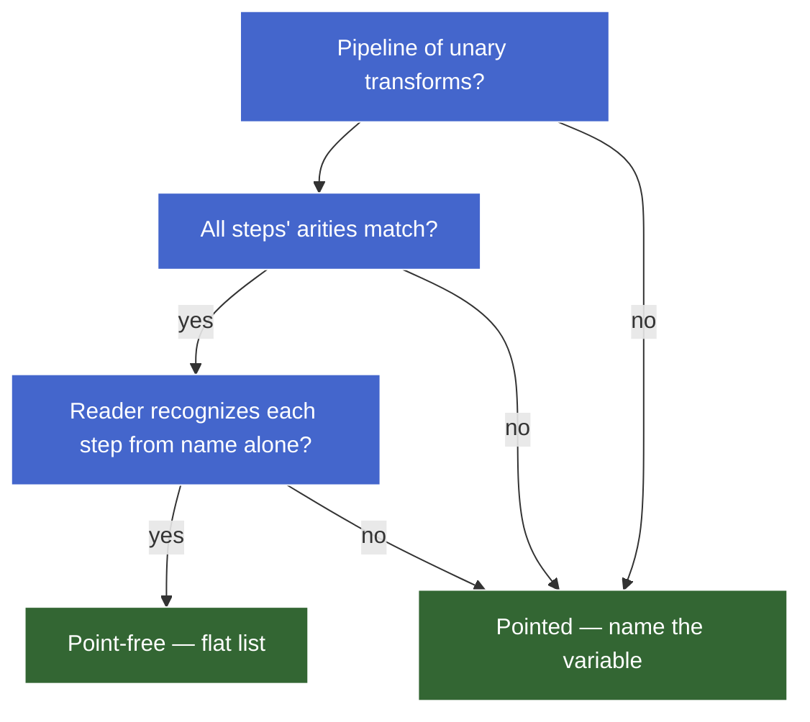

# Composition & Pipelines

**TL;DR.** Function composition glues unary functions end-to-end — the output of one becomes the input of the next. `pipe` (left-to-right) and `compose` (right-to-left) are the same operation with mirrored argument order, both built on `reduce`/`reduceRight`. Point-free style removes the explicit argument when the pipeline *is* the function. Method chaining and functional composition encode the same data flow differently — methods are closed-set (prototype-bound), free functions are open-set (anyone can write one). Transducers decouple "what each step does" from "what shape we're building," fusing multi-pass pipelines into a single pass with zero intermediate allocations.

---

## Why composition — the problem with nesting

Three ways to glue `trim → lower → dasherize` into a single `slugify`:

```js
const trim      = (s) => s.trim();
const lower     = (s) => s.toLowerCase();
const dasherize = (s) => s.replace(/\s+/g, "-");

// Style A — nested calls
const slugifyA = (s) => dasherize(lower(trim(s)));

// Style B — temp variables
const slugifyB = (s) => {
  const a = trim(s);
  const b = lower(a);
  return dasherize(b);
};

// Style C — a single combinator
const slugifyC = compose(dasherize, lower, trim);
```

All produce `"hello-world"` for `"  Hello  World  "`. The question is which scales.

### Why nested calls break down

| Problem | Effect |
|---|---|
| Read order is right-to-left, inside-out | First applied (`trim`) is buried deepest |
| Each new step adds parens on both sides | Inserting a step rewrites the whole expression — noisy diffs |
| A flat sequence is encoded as a tree | Intent is "do these in order" (a list); the shape lies about the structure |

Style B (temp variables) fixes read-order but introduces single-use names that are pure plumbing — noise the reader has to track.

Style C encodes the intent directly: a flat list of operations.

| Change | Style A (nested) | Style C (compose) |
|---|---|---|
| Add a step | Re-nest the whole expression | Append to the list |
| Remove a step | Re-nest, count parens | Delete an item |
| Reorder | Re-nest top-to-bottom | Reorder list elements |

### The shape: `(f ∘ g)(x) = f(g(x))`

Composition glues unary functions so the output of one becomes the input of the next. The types line up at the seams:

```haskell
(.) :: (b -> c) -> (a -> b) -> (a -> c)
```

The shared `b` is the seam — `g`'s output type must equal `f`'s input type. The intermediate `b` disappears from the composed signature.

`pipe(f, g)` is the same operation written left-to-right. Same data flow; reversed argument order.

### When composition earns its keep

| Use case | Composition pays? |
|---|---|
| Named, reused pipeline (slugify, normalizer, validator) | ✅ define once, use many times |
| 5+ unary transforms in sequence | ✅ flat reads better than nested |
| One-off, 2–3 functions | ❌ nested calls are fine |
| Mixed-arity steps (some take 2 args mid-chain) | ❌ requires currying first |
| Steps that need to short-circuit on error | ❌ needs an `Either`/`Result` monad-shaped wrapper |

---

## `compose` and `pipe` from scratch

```js
// pipe — left-to-right (apply in argument order)
const pipe    = (...fns) => (x) => fns.reduce     ((acc, f) => f(acc), x);

// compose — right-to-left (math convention: f ∘ g ∘ h)
const compose = (...fns) => (x) => fns.reduceRight((acc, f) => f(acc), x);
```

Same five tokens, one differs: `reduce` vs `reduceRight`.

### Tracing `pipe` through reduce

`pipe(trim, lower, dasherize)("  Hello  World  ")`:

```
init       = "  Hello  World  "                  // x, the seed
fns        = [trim, lower, dasherize]
reduce:
  iter 1   acc="  Hello  World  ", f=trim       → "Hello  World"
  iter 2   acc="Hello  World",     f=lower      → "hello  world"
  iter 3   acc="hello  world",     f=dasherize  → "hello-world"
result     = "hello-world"
```

The accumulator here is the **value being threaded through the pipeline**. Each callback application is "apply the next function to the running value." The types of intermediate values can differ even though the runtime accumulator slot is the same.

For `compose`, `reduceRight` iterates last-to-first — `compose(dasherize, lower, trim)` and `pipe(trim, lower, dasherize)` produce the same result. Same operation, mirrored argument order.

### Which to reach for

| Use | Reach for | Why |
|---|---|---|
| Application code, JS/TS pipelines | **`pipe`** | Left-to-right matches data flow and prose order |
| Translating math (`f ∘ g`) directly | `compose` | Argument order matches written formula |
| Transducers (reducer-wrapping) | `compose` | Wrapping order is `compose`'s natural shape |

Modern JS code (lodash/fp, Ramda, RxJS) defaults to **`pipe`**.

### Why `compose` uses `reduceRight`

The math reading of `f ∘ g ∘ h` is right-associative: `f ∘ (g ∘ h)`. The rightmost function `h` runs first. `reduceRight` walks the list from right to left, so the first function applied is the rightmost — matching the math. `pipe` is the mirror: argument order matches application order, so plain `reduce` (left-fold) is correct.

> **Aside —** For commutative operations like `+`, `reduce` and `reduceRight` give the same result. Composition isn't commutative — `pipe(trim, lower)` ≠ `pipe(lower, trim)` in general. This is the rare case where `reduceRight` does something `reduce` can't replicate without reversing the input.

### Identity and algebraic structure

`pipe()` with zero functions returns `(x) => x` — the identity function. This falls out of the reduce: `[].reduce((acc, f) => f(acc), x)` returns `x` because there are no callbacks to apply.

```haskell
id :: a -> a
id x = x

-- Laws:
-- f . id  ≡  f        (right identity)
-- id . f  ≡  f        (left identity)
```

> **Aside — formal layer.** Functions with composition form a **monoid**:
>
> - **Identity element** — `id = (x) => x`. `pipe(id, f)` ≡ `pipe(f, id)` ≡ `f`.
> - **Associativity** — `pipe(pipe(f, g), h)` ≡ `pipe(f, pipe(g, h))` ≡ `pipe(f, g, h)`.
> - **Closure** — composing two unary functions gives another unary function.
>
> Same monoid pattern as string concat (identity `""`), array concat (identity `[]`), `+` (identity `0`). Associativity is what lets `pipe(...fns)` accept any number of arguments and produce a sensible answer regardless of grouping.

### Bug demo — non-unary step silently breaks the chain

```js
const add  = (a, b) => a + b;             // binary
const half = (x) => x / 2;

const broken = pipe(add, half);
broken(10, 20);                            // → NaN, not 15
```

`pipe`'s inner function is `(x) => fns.reduce(...)` — one parameter. `broken(10, 20)` binds `x = 10`; `20` is dropped. `add(10)` → `10 + undefined` → `NaN`. No throw, just silently wrong.

Fix: curry the binary function so each step is unary (covered in *Currying & partial application*).

---

## Point-free style

**Point-free** (tacit) = defining a function without explicitly mentioning its argument. The "point" is the input variable; "free" means it doesn't appear.

```js
// Pointed — argument named explicitly
const slugify = (s) => pipe(trim, lower, dasherize)(s);

// Point-free — argument not mentioned
const slugify = pipe(trim, lower, dasherize);
```

Both are equivalent. `pipe` already returned a function — wrapping it in another arrow that just forwards the argument is redundant.

### The eta-reduction insight

`(s) => f(s)` ≡ `f`. Wrapping a function in an arrow that just forwards its argument is always redundant — eta-reduction from lambda calculus.

### When point-free pays off

| Scenario | Why it wins |
|---|---|
| Pipeline of unary transforms | Reads as a flat list; no plumbing variable |
| Reusable named pipeline | One declaration, zero ceremony per use |
| Function-as-value contexts (`map`, `filter`, callbacks) | The composed function *is* the value you're passing |

### When point-free obscures

| Smell | Effect on readers |
|---|---|
| Steps need different *parts* of the input | Forces extra combinators (`fork`, `juxt`, `converge`) readers won't recognize |
| Multi-arg steps require partial application | Reader mentally applies arguments to figure out what each step receives |
| Mid-pipeline branching | No clean point-free form; reaches for `cond`, `ifElse` |
| Arity isn't obvious from the name | Bugs sneak in (see `parseInt` trap below) |
| Pipeline interleaves logging/debugging | Pointed style with named intermediates is easier to step through |

### Bug demo — the `parseInt` arity trap

```js
["10", "20", "30"].map(parseInt);    // → [10, NaN, NaN]
```

`parseInt` is binary (`string, radix`). `Array.prototype.map` calls its callback with `(element, index, array)`. So `index` leaks into the `radix` parameter:

| i | call | result |
|---|---|---|
| 0 | `parseInt("10", 0)` — radix 0 = auto-detect | `10` |
| 1 | `parseInt("20", 1)` — radix 1 invalid | `NaN` |
| 2 | `parseInt("30", 2)` — "30" not valid binary | `NaN` |

Point-free silently bridges arities. When the receiving function takes more arguments than intended, extras come from wherever the caller passes them.

Fixes: `(x) => parseInt(x, 10)` (explicit) or `Number` (unary, idiomatic for base-10).

### Decision framework



### Status / when to use

| Capability | Smell vs OK in |
|---|---|
| Eta-reduction on a clean unary pipeline | ✅ idiomatic, default for named pipelines |
| Eta-reduction on `parseInt`, `JSON.parse`, etc. | ❌ arity trap; wrap in an arrow with explicit args |
| Heavy combinator soup (`converge`, `juxt`) | ❌ smells; prefer pointed + temp names |
| Removing the variable just to look "functional" | ❌ aesthetic, not communication |

**Default in JS application code:** lean pointed. Reach for point-free when the pipeline is clean, unary, and named-once-used-many-times.

---

## Method chaining vs functional composition

Same data flow — value threads through transforms — but encoded differently.

```js
// Method chaining
"  Hello  World  ".trim().toLowerCase().replaceAll(/\s+/g, "-");

// Functional composition
pipe(trim, lower, dasherize)("  Hello  World  ");
```

### The structural difference

| Aspect | Method chaining | Functional composition |
|---|---|---|
| Where the step lives | On the prototype of the value's type | As a free-standing function |
| What threads through | `this` (the receiver) | The accumulator value |
| Who can add a step | Whoever owns the prototype | Anyone who can write a unary function |
| Type at each seam | Same type-family (must return something the next method understands) | Any type — seams just have to line up |

### Closed-set vs open-set — the load-bearing distinction

Method chaining works **only with methods that exist on the receiver's prototype**. Functional composition works with **any unary function**.

Adding `slugify` to a method chain requires extending `String.prototype` — monkey-patching a builtin, visible to all code. Adding `slugify` to a composition pipeline requires writing a function. No prototype mutation, no global side effects.

> **Aside — terminology.** This is the **expression problem**: method chaining is easy to add new *types* (extend the prototype) but hard to add new *operations* across all types. Functional composition is the inverse. Most JS code mixes both.

### Method chains break on type changes

```js
"hello world"
  .split(" ")          // → Array
  .toUpperCase();      // ❌ Array has no toUpperCase
```

Composition handles type changes natively — each function declares its own input/output types:

```js
const words     = (s) => s.split(" ");
const upperEach = (xs) => xs.map((s) => s.toUpperCase());
const joinDash  = (xs) => xs.join("-");

pipe(words, upperEach, joinDash)("hello world"); // → "HELLO-WORLD"
```

### Where method chaining wins

| Scenario | Why |
|---|---|
| Operations intrinsic to the type (`arr.map`, `date.toISOString`) | Discoverable via autocomplete; clearly typed |
| Builder/fluent APIs (d3, Knex, RxJS) | Chain encodes the build sequence; limited vocabulary is a feature |
| No `pipe` import needed | Cheaper at the call site for intrinsic ops |

### Where functional composition wins

| Scenario | Why |
|---|---|
| Domain-specific transforms not on a prototype | No prototype to extend; functions are the natural home |
| Pipelines that change types step-to-step | Method chains break at type boundaries |
| Cross-cutting transforms reused across many types | One function works on anything matching its input shape |
| Testing each step in isolation | Free functions are trivial to import and test |
| Pipelines composed dynamically at runtime | `pipe(...steps)` from a variable; chains can't do this |

### The hybrid in practice

Real JS code mixes both — and that's the right move:

```js
const normalize = (users) =>
  users
    .filter((u) => u.active)               // method — intrinsic Array op
    .map((u) => u.email)                    // method — intrinsic Array op
    .map(pipe(trim, lower, validateEmail)); // composition — domain transforms
```

Method chaining for array operations (they belong to `Array.prototype`); functional composition for domain-specific pipelines (they don't belong on any builtin). The boundary: is this operation intrinsic to the type or not?

### Status / when to use

| Pattern | Smell vs OK in |
|---|---|
| Method chain on intrinsic operations (`arr.map().filter()`) | ✅ idiomatic; cheaper than `pipe` |
| Method chain on a fluent builder DSL | ✅ that's what the API is for |
| Extending builtin prototypes to enable a chain | ❌ monkey-patching; reach for a function |
| Composition of domain transforms | ✅ canonical home for non-intrinsic operations |
| Composition where every step *is* a method on the same type | ❌ extra ceremony for no gain — chain directly |
| Mixing both within one expression | ✅ idiomatic — match each operation to where it naturally lives |

---

## Transducers-lite — fusing map/filter without intermediate arrays

### The cost of method chaining on large inputs

```js
const result = items                    // N elements
  .filter(isActive)                      // allocates Array #1
  .map((x) => x.value)                   // allocates Array #2
  .filter((v) => v > 0)                  // allocates Array #3
  .map((v) => v * 2);                    // allocates Array #4
```

Four passes, three intermediate arrays that exist only to be discarded. The structural waste: nothing in the pipeline requires a fully-materialized intermediate. Each element flows through the steps independently.

### The insight — separate "what each step does" from "what shape we're building"

What `map` and `filter` contribute per element:

- `map(f)` — transform `x` to `f(x)`, forward the result to the next stage.
- `filter(p)` — forward `x` only if `p(x)` holds; otherwise skip (return `acc` unchanged).

Neither operation builds anything. The decision about output shape (array, sum, object, observable) lives in a separate place: the **innermost reducer** at the end of the chain.

A **reducer** is any function with shape `(acc, x) => acc'` — the callback shape `Array.prototype.reduce` takes.

If `map` and `filter` take `next` (the downstream reducer) as a parameter instead of hard-coding the next stage:

1. Each transform becomes **shape-agnostic** — works the same regardless of what `next` does.
2. The innermost reducer becomes pluggable — the caller picks which reducer sits at the bottom, and that choice decides the output shape.

| Innermost reducer plugged in | What the chain produces |
|---|---|
| `(acc, x) => { acc.push(x); return acc; }` (seed `[]`) | An array |
| `(acc, x) => acc + x` (seed `0`) | A sum |
| `(acc, x) => { acc[x.id] = x; return acc; }` (seed `{}`) | An object indexed by id |

### The type signature

A **transducer** is a function that takes one reducer and returns a transformed reducer:

```haskell
type Reducer acc a = acc -> a -> acc

type Transducer a b = forall acc. Reducer acc b -> Reducer acc a
```

Read `Transducer a b`: "give me a reducer that consumes `b`s, I hand back a reducer that consumes `a`s (by transforming each `a` into a `b` before forwarding)." The `forall acc` guarantees shape-agnosticism — the transducer can't inspect or construct `acc`; it can only thread it through.

### Implementation

```js
const pushReducer = (acc, x) => { acc.push(x); return acc; };

// map as a transducer — takes a reducer, returns a reducer
const mapT = (f) => (next) => (acc, x) => next(acc, f(x));

// filter as a transducer
const filterT = (p) => (next) => (acc, x) => p(x) ? next(acc, x) : acc;
```

- `mapT(f)(next)` returns a reducer that transforms `x` into `f(x)` and forwards to `next`.
- `filterT(p)(next)` returns a reducer that only calls `next(acc, x)` if `p(x)` holds; otherwise returns `acc` unchanged.

Neither mentions arrays. Both compose by wrapping the next reducer.

### Composing transducers — use `compose`, not `pipe`

Transducers compose under regular function composition. The canonical form:

```js
const xform = compose(              // listed in data-flow order
  filterT(isActive),                 // runs first on each element
  mapT((x) => x.value),
  filterT((v) => v > 0),
  mapT((v) => v * 2),               // runs last
);

const xreducer = xform(pushReducer); // plug in the array-building reducer
const result   = items.reduce(xreducer, []);  // one pass, one allocation
```

Each transducer wraps the next inner reducer. When `xreducer(acc, x)` is called, control flows outside-in: `isActive` checks first, survivors reach the inner layers, and only `pushReducer` ever touches `acc`.

**Why `compose` and not `pipe`:** `pipe` over transducers reverses the runtime order. `pipe(filterT, mapT)(pushR)` = `mapT(filterT(pushR))` — `mapT` becomes the outermost wrapper, running first. That's the opposite of the listed order. `compose(filterT, mapT)(pushR)` = `filterT(mapT(pushR))` — `filterT` is outermost, matching the listed order.

The structural reason: for transducers, what flows through the composition is the *wrapping* (each function wraps the next reducer), not the data directly. `compose`'s nesting — `f(g(h(x)))` where each function wraps the next — matches the wrapping direction. `pipe`'s nesting inverts it.

### The runtime picture


**† Legend:** Red nodes are intermediate arrays allocated and discarded — the allocations transducers eliminate.

### Worked synthesis — single-element trace

`items = [{active: true, value: 5}, {active: false, value: 9}, {active: true, value: -1}, {active: true, value: 3}]`

Pipeline: `compose(filterT(isActive), mapT(.value), filterT(>0), mapT(*2))`, innermost reducer: `pushReducer`.

| iter | x | filterT(isActive) | mapT(.value) | filterT(>0) | mapT(*2) | pushReducer | acc after |
|---|---|---|---|---|---|---|---|
| 1 | `{a:T, v:5}` | pass | `5` | pass | `10` | push | `[10]` |
| 2 | `{a:F, v:9}` | skip | — | — | — | — | `[10]` |
| 3 | `{a:T, v:-1}` | pass | `-1` | skip | — | — | `[10]` |
| 4 | `{a:T, v:3}` | pass | `3` | pass | `6` | push | `[10, 6]` |

One pass. No intermediate arrays. Each row is one element walking through the wrapped reducers from outside in.

### What "transducers-lite" skips

The full transducer protocol (Clojure's `transducers-js`) adds:

- **Init step** — reducers called with no args to produce an initial accumulator.
- **Completion step** — a "flush" callback for stateful transducers (`take`, `partition`, `dedupe`) that emit a final value when input ends.

For pure stateless `map`/`filter` chains, the simple `(acc, x) => acc'` shape covers it.

> 🔖 Later: full transducer protocol (init / step / completion) and stateful transducers like `take`, `partition`, `dedupe`. Worth a deep-dive when streaming or generator-based pipelines come up.

### Status / when to reach for transducers

| Scenario | Reach for |
|---|---|
| One-shot pipeline, ≤ 10k elements, not on a hot path | **Method chaining** — readability dominates |
| Reusable named pipelines | **Method chaining or pipe** — clarity wins |
| Hot paths, large arrays (~100k+), measurable GC pressure | **Transducers** — fuse the passes |
| Same pipeline applied to both arrays and streams/observables | **Transducers** — same `xform` plugs into different shape reducers |
| You're not measuring | **Method chaining** — don't pre-optimize |

The abstraction case (same pipeline, multiple shapes) is more interesting than the performance case. Transducers decouple "what each step does" from "what shape we're building."

---

## Quick reference

- **`pipe`** — `(...fns) => (x) => fns.reduce((acc, f) => f(acc), x)`. Left-to-right. Default in JS.
- **`compose`** — `(...fns) => (x) => fns.reduceRight((acc, f) => f(acc), x)`. Right-to-left. Use for transducers and math notation.
- **Point-free** — omit the argument when the pipeline *is* the function. Only safe when all steps are unary and recognizable by name.
- **Method chaining vs composition** — methods for intrinsic type operations (closed-set); free functions for domain transforms (open-set). Mix both.
- **Transducers** — `(next) => (acc, x) => ...` shape. Compose with `compose`. Fuse multi-pass pipelines into one pass, zero intermediate allocations. Reach for them on hot paths or when one pipeline must drive multiple output shapes.
- **Arity trap** — point-free silently bridges arities. If the receiving function takes more args than intended, extras leak in from the caller. Wrap in an explicit arrow when arity doesn't match.
