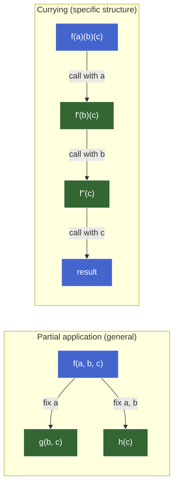
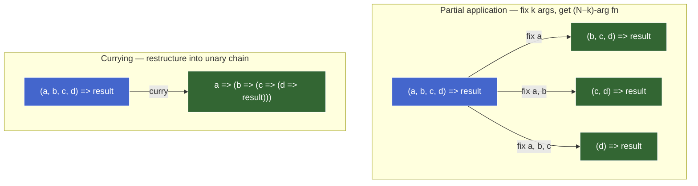

# Currying & Partial Application — teaching draft

## Plan (teaching order)

- [x] 1. Teaser — motivation snippet (the arity wall from composition)
- [x] 2. Partial application — fixing arguments, `bind` as the built-in mechanism, manual wrappers
- [x] 3. Currying — unary chain, manual currying, auto-curry utilities
- [ ] 4. Currying vs partial application — the distinction made precise
- [ ] 5. Arity, variadic functions, and the limits of currying
- [ ] 6. Use cases and decision framework — config factories, event handlers, composition pipelines, when each tool wins

---

## Teaser — motivation snippet

You ended the composition chunk knowing that `pipe`/`compose` only work on unary functions, and that currying is "the fix." Here's the concrete wall:

```js
const pipe = (...fns) => (x) => fns.reduce((acc, f) => f(acc), x);   // L1

const add      = (a, b) => a + b;          // L2 — binary
const multiply = (a, b) => a * b;          // L3 — binary
const negate   = (x) => -x;                // L4 — unary

// Goal: a pipeline that does  x → add(x, 10) → multiply(result, 3) → negate
const transform = pipe(add, multiply, negate);   // L5
transform(5);                                     // L6 — expected: -45, actual: ???
```

Two questions:

1. What does `transform(5)` actually produce, and why?
2. Without changing `pipe`, how would you make `add` and `multiply` fit into the pipeline — what shape do they need to become?

### Reveal

`transform(5)` → `NaN`. Mechanism: `pipe`'s inner function is `(x) => fns.reduce((acc, f) => f(acc), x)` — one parameter. So `add(5)` gets `a = 5, b = undefined`, returns `5 + undefined` = `NaN`. The `NaN` propagates through `multiply` and `negate`.

The fix: rewrite `add` as `(a) => (b) => a + b`. Now `add(10)` returns a unary function `(b) => 10 + b` that slots into `pipe`. This transformation — rewriting a multi-argument function as a chain of single-argument functions — is **currying**. The teaser derived it from the composition constraint: `pipe` demands unary steps; currying is the tool that produces them from multi-argument functions.

But currying isn't the only way to fix arguments ahead of time. The more general operation — fixing *some* arguments of a function to produce a new function with fewer parameters — is **partial application**. Currying is one specific shape of partial application (fix exactly one argument at a time, always from the left). The next sub-part makes the distinction precise by starting with partial application as the broader concept.

---

## Partial application — fixing arguments to reduce arity

### The core idea

**Partial application** = take a function of N arguments, fix some of them now, get back a function that takes the remaining arguments later.

```haskell
-- Conceptual type:
partial :: (a -> b -> c -> d) -> a -> (b -> c -> d)
--         ^^^^^^^^^^^^^^^^     ^^^   ^^^^^^^^^^^^^
--         original function    fixed  residual function (fewer params)
```

The fixed arguments are "baked in" via closure. The residual function remembers them and waits for the rest.

### `Function.prototype.bind` — JS's built-in partial application

`bind` is primarily taught as a `this`-fixer (from `js-values-fn-this`), but its second role is partial application:

```js
const add = (a, b) => a + b;                    // L1

const add10 = add.bind(null, 10);               // L2 — fix `a = 10`, ignore `this`
add10(5);                                        // L3 → 15
add10(100);                                      // L4 → 110
```

`bind(thisArg, ...fixedArgs)` returns a new function where:

- `this` is locked to `thisArg` (irrelevant for arrows, but required syntactically).
- The fixed args are prepended to whatever the caller passes later.

So `add.bind(null, 10)` produces a function equivalent to `(b) => add(10, b)` — partial application from the left.

#### Fixing multiple arguments

```js
const clamp = (min, max, value) => Math.max(min, Math.min(max, value));  // L1

const clampPercent = clamp.bind(null, 0, 100);   // L2 — fix min=0, max=100
clampPercent(150);                                // L3 → 100
clampPercent(-20);                                // L4 → 0
clampPercent(42);                                 // L5 → 42
```

`clamp` is ternary (3 args). After fixing two, `clampPercent` is unary — ready for `pipe`.

#### Limitations of `bind` for partial application

| Limitation | Why it matters |
|---|---|
| Only fixes from the left | Can't skip `a` and fix `b` — must fix in positional order |
| Requires `null` as first arg (for `this`) | Noisy; easy to forget; confusing for readers unfamiliar with `bind`'s dual role |
| Returns a function with no visible `.length` reflecting the residual arity | Introspection-based tools (auto-curry utilities, some frameworks) can't detect how many args remain |
| Can't "un-bind" | Once fixed, the argument is sealed — no way to override it later |

### Manual partial application — the arrow wrapper

When `bind`'s left-only constraint doesn't fit, write an arrow:

```js
// Fix the *second* argument of a binary function
const div = (a, b) => a / b;                     // L1

const divBy2 = (a) => div(a, 2);                 // L2 — fix b=2, leave a free
divBy2(10);                                       // L3 → 5
```

This is still partial application — you fixed one argument and got a function with fewer parameters. The closure captures `2`; the residual function takes `a`.

### A generic `partial` utility

```js
const partial = (fn, ...fixed) => (...rest) => fn(...fixed, ...rest);   // L1

const add10 = partial(add, 10);                  // L2
add10(5);                                         // L3 → 15

const clampPercent = partial(clamp, 0, 100);     // L4
clampPercent(42);                                 // L5 → 42
```

Same as `bind` minus the `this` noise. Still left-only — fixing from the right or middle requires a custom wrapper (or a library like Ramda's `R.partialRight`, `R.__` placeholder).

### Partial application in the wild — event handlers and config

Two patterns where partial application shows up constantly:

**1. Event handlers that need extra context:**

```js
// Without partial application — closure over `id` via an arrow in JSX / addEventListener
button.addEventListener("click", (e) => handleClick(userId, e));

// With partial application — same thing, named
const onClick = partial(handleClick, userId);
button.addEventListener("click", onClick);
// Bonus: `onClick` is a stable reference — removable with removeEventListener
```

**2. Config factories — fix config once, use the configured function many times:**

```js
const fetchWithAuth = partial(fetch, { headers: { Authorization: `Bearer ${token}` } });
// ↑ Not quite right (fetch's API doesn't work this way), but the *pattern* is:
//   fix the config, get back a function that only needs the varying part.

// More realistic:
const createFetcher = (baseUrl, headers) => (path) =>
  fetch(`${baseUrl}${path}`, { headers });

const apiFetch = createFetcher("https://api.example.com", { Authorization: `Bearer ${token}` });
apiFetch("/users");    // only the varying part
apiFetch("/posts");
```

The `createFetcher` example is partial application done manually — fix `baseUrl` and `headers`, get back a unary function of `path`. The closure is the mechanism; partial application is the pattern.

### The key properties — what partial application guarantees

1. **Arity reduction.** The residual function has fewer parameters than the original.
2. **Closure capture.** Fixed arguments are remembered via closure — no global state, no mutation.
3. **Positional (usually left-to-right).** `bind` and `partial` fix from the left. Fixing from other positions requires a manual wrapper or placeholder-based libraries.
4. **One shot.** You fix some args and get a new function. You don't get a chain of single-arg functions — that's currying's shape (next sub-part).


---

## Currying — a chain of unary functions

### The definition

**Currying** = transforming a function of N arguments into a chain of N nested unary functions, each taking one argument and returning the next function in the chain (until the last one returns the result).

```haskell
-- Uncurried (takes a tuple):
add :: (Int, Int) -> Int

-- Curried (chain of unary functions):
add :: Int -> Int -> Int
--     ^^^    ^^^    ^^^
--     takes a, returns (Int -> Int)
--            takes b, returns Int
```

In Haskell, **all functions are curried by default** — `add 3 5` is actually `(add 3) 5`: apply `add` to `3`, get back a function, apply *that* to `5`. JS doesn't do this automatically — you have to write the nested arrows yourself or use a utility.

### Manual currying in JS

You already derived this in the teaser:

```js
// Uncurried
const add = (a, b) => a + b;                    // L1 — binary

// Manually curried
const addC = (a) => (b) => a + b;               // L2 — unary chain
```

`addC(10)` returns `(b) => 10 + b` — a unary function. `addC(10)(5)` returns `15`. Each call peels off one argument and returns the next function in the chain.

For a ternary function:

```js
// Uncurried
const clamp = (min, max, value) => Math.max(min, Math.min(max, value));   // L1

// Manually curried
const clampC = (min) => (max) => (value) => Math.max(min, Math.min(max, value));  // L2

clampC(0)(100)(42);          // L3 → 42
clampC(0)(100)(150);         // L4 → 100

const clampPercent = clampC(0)(100);   // L5 — partially applied: unary function of value
clampPercent(42);                       // L6 → 42
```

Notice L5: calling a curried function with fewer than all arguments **is** partial application. Currying *enables* partial application at every prefix — you get it for free at each step in the chain.

### The relationship: currying enables incremental partial application

| Concept | What it does | Shape |
|---|---|---|
| Partial application | Fix some args, get a function taking the rest | One step: N-arg → (N-k)-arg |
| Currying | Restructure so *every* prefix is a partial application | Chain: N-arg → 1-arg → 1-arg → … → result |

Currying is a **specific structure** that makes partial application available at every argument boundary without writing a custom wrapper each time. Partial application is the **general operation** — currying is one way to make it frictionless.



### Auto-curry utility

Manually currying every function is tedious. A `curry` utility does it automatically:

```js
const curry = (fn) => {                                    // L1
  const arity = fn.length;                                 // L2 — how many args fn expects
  const curried = (...args) =>                             // L3
    args.length >= arity                                   // L4 — got enough args?
      ? fn(...args)                                        // L5 — yes: call the original
      : (...more) => curried(...args, ...more);            // L6 — no: accumulate and wait
  return curried;                                          // L7
};
```

How it works:

1. `fn.length` reads the function's declared parameter count (its arity).
2. Each call accumulates arguments. If enough have been collected (≥ arity), call the original function.
3. If not enough, return a new function that remembers what's been collected and waits for more.

```js
const add = curry((a, b) => a + b);              // L1
add(10)(5);                                       // L2 → 15 (two calls, one arg each)
add(10, 5);                                       // L3 → 15 (one call, both args — still works)

const add10 = add(10);                            // L4 — partial application, free
add10(5);                                         // L5 → 15

const clamp = curry((min, max, value) => Math.max(min, Math.min(max, value)));
clamp(0)(100)(42);                                // → 42
clamp(0, 100)(42);                                // → 42 (can pass multiple at once)
clamp(0, 100, 42);                                // → 42 (all at once — behaves like uncurried)
```

The auto-curried version is **flexible** — you can pass arguments one at a time, in groups, or all at once. It collapses to the original behavior when called with all arguments.

### How `curry` differs from `partial`

| | `partial(fn, ...fixed)` | `curry(fn)` |
|---|---|---|
| When you fix args | At the `partial` call site — one shot | At any call — incrementally |
| What you get back | A function taking the *remaining* args | A function that keeps accepting args until it has enough |
| Flexibility | Fixed set decided up front | Caller decides how many to pass at each step |
| Multiple partial applications | Need nested `partial` calls | Just keep calling with fewer args |

```js
// partial — one-shot fix
const add10 = partial(add, 10);       // decided here: a=10
add10(5);                              // → 15

// curry — incremental
const addC = curry(add);
const add10 = addC(10);               // decided here: a=10
add10(5);                              // → 15
// But also:
addC(10, 5);                           // → 15 (skip the intermediate)
```

### Why Haskell curries by default (and JS doesn't)

In Haskell, every function is automatically curried — `f a b c` is `((f a) b) c`. This works because:

1. **No variadic functions.** Every function has a fixed arity known at compile time.
2. **Type inference.** The compiler tracks what each intermediate function expects.
3. **No `this`.** No receiver semantics to complicate partial application.

JS has none of these properties — functions can be variadic (`...args`), arity is a runtime property (`fn.length`), and `this` binding adds a dimension `curry` has to ignore or handle. So JS requires an explicit `curry` utility, and that utility relies on `fn.length` — which breaks for variadic functions (next sub-part).

### Currying and composition — the payoff

The composition chunk's arity wall is now solved cleanly:

```js
const add      = curry((a, b) => a + b);
const multiply = curry((a, b) => a * b);
const negate   = (x) => -x;

const transform = pipe(add(10), multiply(3), negate);
transform(5);   // → -45
```

`add(10)` and `multiply(3)` are partial applications that produce unary functions — exactly what `pipe` needs. **Currying is the bridge between multi-argument functions and unary composition.**

### Parameter order matters for currying

When you design a function that will be curried, put the **most-likely-to-be-fixed** argument first and the **data** (the thing that varies per call) last:

```js
// Good order for currying — config first, data last
const map    = curry((fn, arr) => arr.map(fn));
const filter = curry((pred, arr) => arr.filter(pred));

// Now these compose naturally:
const getActiveEmails = pipe(
  filter((u) => u.active),    // data (arr) is last — left free for pipe
  map((u) => u.email),
);
getActiveEmails(users);
```

```js
// Bad order — data first, config last
const mapBad = curry((arr, fn) => arr.map(fn));
// mapBad(???)((u) => u.email) — can't partially apply the fn without the arr
```

This is why Ramda and lodash/fp put the data argument **last** in every function — it makes curried composition natural. The convention: **configuration → data**.


---

## Currying vs partial application — the distinction made precise

These two terms get conflated constantly in JS blog posts. They are **distinct operations** that happen to overlap in one specific case.

### The axioms

| | Partial application | Currying |
|---|---|---|
| **What it does** | Fixes *k* arguments of an N-arg function → produces an (N−k)-arg function | Restructures an N-arg function into N nested unary functions |
| **Input** | A function + some fixed arguments | A function (no arguments yet) |
| **Output** | A new function with fewer parameters | A new function that accepts args one-at-a-time |
| **How many times you can do it** | Once per `partial`/`bind` call (one shot) | Every call is an implicit partial application |
| **Requires the function to be curried first?** | No — works on any function | N/A — currying *is* the restructuring |

### The overlap

When you call a curried function with fewer than all arguments, the result **is** a partial application:

```js
const addC = curry((a, b) => a + b);
const add10 = addC(10);    // ← this IS partial application (fixed a=10, residual takes b)
```

So currying *enables* partial application at every argument boundary. But partial application doesn't require currying — `bind`, manual wrappers, and `partial()` all do it on uncurried functions.

### The Python comparison

Python has `functools.partial` — explicit partial application, no currying:

```python
from functools import partial

def add(a, b):
    return a + b

add10 = partial(add, 10)   # fix a=10
add10(5)                    # → 15
```

Python doesn't have auto-currying (and doesn't need it — Python's ecosystem doesn't lean on point-free composition the way FP-flavored JS does). The `partial` utility is the whole story there.

In Haskell, currying is the default — `partial` doesn't exist as a concept because every function application with fewer args *is* partial application automatically.

JS sits in the middle: neither auto-curried nor equipped with a built-in `partial` beyond `bind`. Libraries (Ramda, lodash/fp) add `curry` to get the Haskell-like ergonomics.

### When the conflation causes real confusion

People say "just curry it" when they mean "partially apply it." The distinction matters when:

1. **Argument order.** Currying fixes from the left, one at a time. If you need to fix a *non-leftmost* argument, currying alone can't help — you need a manual wrapper (partial application from an arbitrary position).

2. **Multiple args at once.** `partial(fn, a, b)` fixes two args in one call. A strictly curried function requires two separate calls: `fn(a)(b)`. (JS auto-curry utilities blur this by accepting multiple args per call — but that's the utility being lenient, not currying's definition.)

3. **Variadic functions.** Currying relies on knowing the arity. Variadic functions (`...args`) have `fn.length === 0` — auto-curry can't know when to stop accumulating. Partial application doesn't have this problem (you fix what you fix; the rest passes through).

### Summary diagram



**Two-line axiom:**

- `f(a, b, c, d)` → partial with `a` → `fa(b, c, d)` — fix some, get the rest.
- `f(a, b, c, d)` → curry → `f(a)(b)(c)(d)` — restructure into unary chain. Each call is an implicit partial application.

Partial application is the umbrella. Currying is one specific structure that makes partial application frictionless at every prefix. `bind`, manual wrappers, and `partial()` are other ways to achieve partial application without currying.
