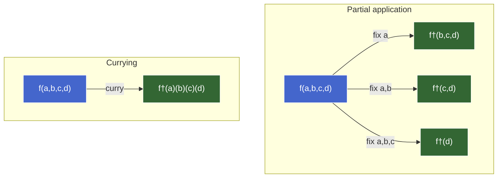

# Currying & Partial Application

**TL;DR.** Partial application fixes some arguments of a function now, producing a new function that takes the rest later — the general operation. Currying restructures an N-argument function into a chain of N nested unary functions, making partial application available at every prefix for free. Currying is the bridge between multi-argument functions and unary composition (`pipe`/`compose`). Parameter order matters: config first, data last. Currying requires fixed arity — variadic functions need `partial`, `bind`, or manual wrappers instead.

---

## Partial application — fixing arguments to reduce arity

**Partial application** = take a function of N arguments, fix some of them now, get back a function that takes the remaining arguments later. The fixed arguments are captured via closure.

```haskell
partial :: (a -> b -> c -> d) -> a -> (b -> c -> d)
```

### `Function.prototype.bind` — JS's built-in mechanism

`bind(thisArg, ...fixedArgs)` returns a new function with `this` locked and fixed args prepended:

```js
const add = (a, b) => a + b;
const add10 = add.bind(null, 10);    // fix a=10
add10(5);                             // → 15

const clamp = (min, max, value) => Math.max(min, Math.min(max, value));
const clampPercent = clamp.bind(null, 0, 100);   // fix min=0, max=100
clampPercent(150);                                // → 100
```

### Limitations of `bind`

| Limitation | Effect |
|---|---|
| Only fixes from the left | Can't skip `a` and fix `b` — must fix in positional order |
| Requires `null` as first arg | Noisy; confusing for readers unfamiliar with `bind`'s dual role |
| No visible residual `.length` | Introspection-based tools can't detect remaining arity |

### Manual wrappers — fix from any position

When `bind`'s left-only constraint doesn't fit:

```js
const div = (a, b) => a / b;
const divBy2 = (a) => div(a, 2);    // fix b=2, leave a free
```

### A generic `partial` utility

```js
const partial = (fn, ...fixed) => (...rest) => fn(...fixed, ...rest);

const add10 = partial(add, 10);
const clampPercent = partial(clamp, 0, 100);
```

Same as `bind` minus the `this` noise. Still left-only.

### Common patterns

**Event handlers needing extra context:**

```js
const onClick = partial(handleClick, userId);
button.addEventListener("click", onClick);
// Stable reference — removable with removeEventListener
```

**Config factories — fix the stable part once:**

```js
const createFetcher = (baseUrl, headers) => (path) =>
  fetch(`${baseUrl}${path}`, { headers });

const apiFetch = createFetcher("https://api.example.com", { Authorization: `Bearer ${token}` });
apiFetch("/users");
apiFetch("/posts");
```

---

## Currying — a chain of unary functions

**Currying** = transforming a function of N arguments into a chain of N nested unary functions. Each call peels off one argument and returns the next function.

```haskell
-- Uncurried:
add :: (Int, Int) -> Int

-- Curried:
add :: Int -> Int -> Int   -- takes a, returns (Int -> Int)
```

### Manual currying in JS

```js
// Uncurried
const add = (a, b) => a + b;

// Curried
const addC = (a) => (b) => a + b;

addC(10)(5);              // → 15
const add10 = addC(10);  // partial application — free at every prefix
add10(5);                 // → 15
```

### Auto-curry utility

```js
const curry = (fn) => {
  const arity = fn.length;
  const curried = (...args) =>
    args.length >= arity ? fn(...args) : (...more) => curried(...args, ...more);
  return curried;
};
```

Accumulates arguments across calls. Fires the original when enough have been collected. Flexible — accepts args one-at-a-time or in groups:

```js
const add = curry((a, b) => a + b);
add(10)(5);     // → 15
add(10, 5);     // → 15 (all at once — behaves like uncurried)
```

### Currying and composition — the payoff

The composition chunk's arity wall is solved:

```js
const add      = curry((a, b) => a + b);
const multiply = curry((a, b) => a * b);
const negate   = (x) => -x;

const transform = pipe(add(10), multiply(3), negate);
transform(5);   // → -45
```

`add(10)` and `multiply(3)` are partial applications producing unary functions — exactly what `pipe` needs. **Currying is the bridge between multi-argument functions and unary composition.**

### Parameter order convention

Put the **most-likely-to-be-fixed** argument first, **data** last:

```js
// Good — config first, data last
const map    = curry((fn, arr) => arr.map(fn));
const filter = curry((pred, arr) => arr.filter(pred));

const getActiveEmails = pipe(
  filter((u) => u.active),    // data (arr) left free for pipe
  map((u) => u.email),
);

// Bad — data first
const mapBad = curry((arr, fn) => arr.map(fn));
// Can't partially apply fn without providing arr first
```

This is why Ramda and lodash/fp put data **last** in every function.

### Why Haskell curries by default (and JS doesn't)

Haskell: no variadic functions, type inference tracks intermediates, no `this`. Every function is automatically curried.

JS: variadic functions exist, arity is a runtime property (`fn.length`), `this` binding adds complexity. Requires an explicit `curry` utility.

---

## Currying vs partial application — the distinction

| | Partial application | Currying |
|---|---|---|
| **What it does** | Fixes *k* args → produces (N−k)-arg function | Restructures N-arg → chain of N unary functions |
| **Input** | A function + some fixed arguments | A function (no arguments yet) |
| **Output** | A new function with fewer parameters | A new function accepting args one-at-a-time |
| **How many times** | Once per call (one shot) | Every call is an implicit partial application |
| **Requires currying first?** | No — works on any function | N/A — currying *is* the restructuring |

### The overlap

Calling a curried function with fewer than all arguments **is** partial application:

```js
const addC = curry((a, b) => a + b);
const add10 = addC(10);    // ← this IS partial application
```

Currying *enables* partial application at every prefix. But partial application doesn't require currying — `bind`, manual wrappers, and `partial()` all work on uncurried functions.

### Summary diagram



**† Legend:**
- `f(a,b,c,d)` — original function: `(a, b, c, d) => result`
- `f†(b,c,d)` — residual after fixing `a`: `(b, c, d) => result` (closure captures `a`)
- `f†(c,d)` — residual after fixing `a, b`: `(c, d) => result`
- `f†(d)` — residual after fixing `a, b, c`: `(d) => result`
- `f†(a)(b)(c)(d)` — curried form: `a => (b => (c => (d => result)))`

**Two-line axiom:**

- `f(a, b, c, d)` → partial with `a` → `fa(b, c, d)` — fix some, get the rest.
- `f(a, b, c, d)` → curry → `a => (b => (c => (d => result)))` — restructure into unary chain. Each call is an implicit partial application.

### The Python comparison

Python has `functools.partial` — explicit partial application, no currying. Haskell auto-curries everything — `partial` doesn't exist as a concept. JS sits in the middle: neither auto-curried nor equipped with a built-in `partial` beyond `bind`. Libraries (Ramda, lodash/fp) add `curry`.

---

## Arity, variadic functions, and the limits of currying

### `fn.length` — how JS reports arity

```js
const f1 = (a, b, c) => {};          // f1.length → 3
const f2 = (a, b, ...rest) => {};    // f2.length → 2 (rest excluded)
const f3 = (a, b = 10, c) => {};     // f3.length → 1 (stops at first default)
const f4 = (...args) => {};           // f4.length → 0
```

`fn.length` is what `curry` uses to decide "have I collected enough?" Works for fixed-arity functions. Breaks for variadic ones.

### The variadic problem

```js
const sum = (...nums) => nums.reduce((a, b) => a + b, 0);  // sum.length → 0

const sumC = curry(sum);
sumC(1, 2, 3);    // → 6 (args.length >= 0, fires immediately — happens to work)
sumC(1)(2)(3);    // → TypeError: 1 is not a function
```

`sumC(1)`: `args.length (1) >= arity (0)` → fires immediately → `sum(1)` → `1`. Returns the number `1`, not a function. `1(2)` throws.

**Currying requires a known, fixed arity.** Variadic functions have no "I'm done collecting" signal.

### Cases where `fn.length` lies

| Case | `fn.length` | Problem for curry |
|---|---|---|
| Rest parameter `(...args)` | `0` | Fires immediately |
| Default parameters `(a, b = 5)` | `1` | Fires after 1 arg; can't pass `b` through curried interface |
| `arguments`-based functions | `0` | Same as rest |

### Workarounds

**`curryN` — explicit arity override:**

```js
const curryN = (arity, fn) => {
  const curried = (...args) =>
    args.length >= arity ? fn(...args) : (...more) => curried(...args, ...more);
  return curried;
};

const sum3 = curryN(3, (...nums) => nums.reduce((a, b) => a + b, 0));
sum3(1)(2)(3);    // → 6
```

**Don't curry variadic functions — use partial application:**

```js
const sum1and2 = (...rest) => sum(1, 2, ...rest);
sum1and2(3, 4);   // → 10
```

### Decision table

| Function shape | Curry-friendly? | Alternative |
|---|---|---|
| Fixed arity, no defaults | ✅ yes | — |
| Fixed arity with defaults | ⚠️ curry sees reduced arity | `curryN` or manual wrapper |
| Variadic (`...args`) | ❌ no | `partial`, `bind`, manual wrapper |
| Methods relying on `this` | ⚠️ fragile | `bind` for `this` + partial |

---

## Use cases and decision framework

### Pattern 1 — Config factories

```js
const createLogger = curry((level, prefix, msg) =>
  console.log(`[${level}] ${prefix}: ${msg}`)
);

const authInfo = createLogger("INFO", "AUTH");
authInfo("User logged in");    // → [INFO] AUTH: User logged in
authInfo("Session expired");   // → [INFO] AUTH: Session expired
```

Lighter than a class when you only need one "method." Trade-off: less discoverable (no autocomplete on methods).

### Pattern 2 — Event handlers with stable references

```js
const handleClick = curry((userId, section, e) => { /* ... */ });

const onClick = handleClick(currentUserId, "header");  // unary: (e) => ...
button.addEventListener("click", onClick);
button.removeEventListener("click", onClick);          // works — stable reference
```

Inline arrows create a new function each time — can't remove them. Curried partial application produces a stable reference.

### Pattern 3 — Composition pipelines

```js
const map    = curry((fn, arr) => arr.map(fn));
const filter = curry((pred, arr) => arr.filter(pred));
const prop   = curry((key, obj) => obj[key]);
const gt     = curry((threshold, x) => x > threshold);

const getExpensiveItems = pipe(
  filter(pipe(prop("price"), gt(100))),
  map(prop("name")),
);

getExpensiveItems([
  { name: "A", price: 50 },
  { name: "B", price: 150 },
  { name: "C", price: 200 },
]);
// → ["B", "C"]
```

Every step is a partially-applied curried function — unary, ready for `pipe`.

### Pattern 4 — Predicate builders

```js
const eq       = curry((a, b) => a === b);
const includes = curry((item, arr) => arr.includes(item));

const isAdmin    = eq("admin");
const hasFeature = includes("dark-mode");

users.filter(pipe(prop("role"), isAdmin));
```

Named, testable, composable predicates. No anonymous arrows scattered across the codebase.

### When to reach for what

| Situation | Reach for | Why |
|---|---|---|
| Multi-arg function used in `pipe`/`compose` | **Curry** | Produces unary steps at each prefix |
| Fix args of a function you don't control | **`bind`** or **manual arrow** | Can't restructure someone else's function |
| Fix args from a non-left position | **Manual arrow** | `bind` and curry only fix from the left |
| Variadic function needs some args fixed | **`partial`** or **manual arrow** | Curry can't detect arity |
| Config factory (stable → specialized) | **Curry** or **manual closure** | Config first, data last |
| One-off, inline, 2-arg function | **Nothing** | Currying adds ceremony for no reuse payoff |

### The smell test

| Capability | Smell vs OK in |
|---|---|
| Curried utilities in a shared library (`map`, `filter`, `prop`, `eq`) | ✅ canonical — composability benefits the whole team |
| Currying a function used exactly once | ❌ ceremony for no payoff |
| Deeply nested `f(a)(b)(c)(d)(e)` | ⚠️ hard to read; function may have too many params |
| Currying methods that rely on `this` | ❌ fragile — `this` doesn't survive curry |
| Currying everything "because FP" | ❌ aesthetic, not communication |

---

## Quick reference

- **Partial application** — fix some args now, get a function taking the rest. Mechanisms: `bind`, manual arrow, `partial()`, or calling a curried function with fewer args.
- **Currying** — restructure N-arg into N nested unary functions. Each call is an implicit partial application. Requires fixed arity.
- **`curry` utility** — uses `fn.length` to know when to fire. Flexible: accepts args one-at-a-time or in groups.
- **Parameter order** — config/stable first, data last. Makes curried functions compose naturally in `pipe`.
- **Arity wall** — variadic functions (`...args`) break `curry` because `fn.length === 0`. Use `partial`, `bind`, `curryN`, or manual wrappers.
- **The bridge** — currying connects multi-arg functions to unary composition. `pipe(add(10), multiply(3), negate)` works because `add(10)` is a curried partial application returning a unary function.
