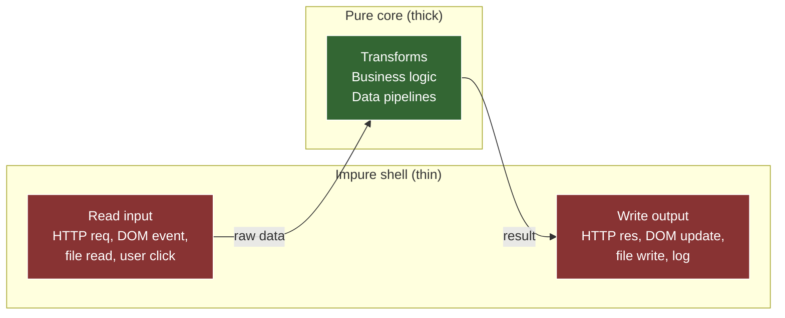

# 1. Immutability Patterns — teaching draft

## 1.1. Plan (teaching order)

- [x] 1. Teaser — mutation bug invisible at the call site
- [x] 2. Pure functions — definition, referential transparency, why purity enables composition
- [x] 3. Shallow copy idioms — spread, `Object.assign`, `Array.from`, `structuredClone`; shallow vs deep
- [ ] 4. Structural sharing concept — why "copy everything" is O(n) and what persistent data structures do differently
- [ ] 5. When immutability helps vs hurts — decision framework

---

## 1.2. Teaser — mutation bug invisible at the call site

```js
const addDiscount = (user) => {          // L1
  user.price *= 0.9;                     // L2
  return user;                           // L3
};                                       // L4

const users = [                          // L5
  { name: "A", price: 100 },            // L6
  { name: "B", price: 200 },            // L7
];                                       // L8

const discounted = users.map(addDiscount);  // L9

console.log(discounted[0].price);        // L10
console.log(users[0].price);             // L11
```

### 1.2.1. Reveal

Both L10 and L11 print `90`.

`map` creates a new array, but its elements are references to the same objects as the original. `addDiscount` mutates the object through that shared reference (`user.price *= 0.9`), so the mutation is visible through both `discounted[0]` and `users[0]` — they point to the same object in memory.

The call site (`users.map(addDiscount)`) looks safe — `map` "creates a new array," and `addDiscount` returns a value. Nothing at the call site signals that `users` is being destroyed. The bug is invisible without reading `addDiscount`'s implementation.

This is the class of bug that immutability patterns eliminate. The fix: `addDiscount` should return a *new* object instead of mutating the input:

```js
const addDiscount = (user) => ({ ...user, price: user.price * 0.9 });
```

Now `users` is untouched. The function is **pure** — same input always produces the same output, no side effects. The next sub-part formalizes what "pure" means and why it matters for composition.


---

## 1.3. Pure functions — the axiom that makes composition safe

### 1.3.1. Two rules (necessary and sufficient)

A function is **pure** if and only if:

1. **Deterministic.** Same inputs → same output. Always. No dependence on external mutable state (clock, global variable, database, random).
2. **No side effects.** The function doesn't modify anything outside its own scope — no mutation of inputs, no writes to external state, no I/O.

That's it. Two rules. Everything else (referential transparency, testability, composability, memoizability) is a *consequence* of these two.

### 1.3.2. Referential transparency — the consequence that matters most

If a function is pure, you can replace any call `f(x)` with its return value without changing program behavior. This property is called **referential transparency**.

```js
// Pure
const double = (x) => x * 2;

const a = double(5);   // → 10
const b = 10;           // → 10 (replaced the call with its return value — program unchanged)
```

You can't do this with impure functions:

```js
let counter = 0;
const increment = () => ++counter;   // impure — depends on + modifies external state

const a = increment();  // → 1 (and counter is now 1)
const b = 1;             // → 1 (but counter is still 0 — program changed)
```

Replacing `increment()` with `1` gives the same *value* for `b`, but the program's state diverges — `counter` never advances. The substitution broke something. With `double`, nothing breaks because the function touches nothing outside itself.

Referential transparency is what makes equational reasoning possible — you can think about functions as values, not as procedures with hidden state.

### 1.3.3. Why purity enables composition

`pipe(f, g, h)` assumes each function is a black box: takes input, returns output, nothing else happens. If `f` mutates shared state that `g` reads, the pipeline's behavior depends on *execution order* — reordering, parallelizing, or memoizing any step could break it.

Pure functions compose freely because:

- **Order-independent** (for independent sub-expressions) — no shared mutable state means no ordering dependencies beyond data flow.
- **Memoizable** — same input always gives same output, so you can cache results.
- **Testable** — no setup/teardown of external state; assert on return value alone.
- **Parallelizable** — no data races when there's nothing shared to race on.

The teaser's bug was a composition failure: `map(addDiscount)` looked like a pure pipeline step but secretly destroyed the input. Making `addDiscount` pure (return new object, don't mutate) restores the composition guarantee.

### 1.3.4. The purity spectrum in practice

Real programs need side effects — I/O, DOM updates, network calls. The strategy isn't "everything pure" but **push effects to the boundary**:



The principle: **decisions and transforms live in the pure core; I/O lives in the shell.** The shell is thin — it reads input, calls the pure core, and writes output. The core is thick — all business logic, validation, data transformation, pipeline composition.

Why this split pays off:

| Property | Pure core | Impure shell |
|---|---|---|
| Testable without mocks | ✅ assert on return value | ❌ needs mocked I/O |
| Composable (`pipe`, reuse) | ✅ referential transparency | ❌ ordering dependencies |
| Parallelizable | ✅ no shared mutable state | ❌ race conditions possible |
| Debuggable | ✅ reproduce with same input | ❌ depends on external state |

Concrete example — an Express route handler:

```js
// Impure shell — thin, does I/O only
app.post("/order", async (req, res) => {
  const input = req.body;                         // read (impure)
  const result = processOrder(input);             // pure core — all logic here
  await db.save(result);                          // write (impure)
  res.json(result);                               // write (impure)
});

// Pure core — testable, composable, no I/O
const processOrder = (input) => {
  const validated = validateOrder(input);
  const priced    = applyPricing(validated);
  const discounted = applyDiscounts(priced);
  return discounted;
};
```

`processOrder` is a pure pipeline — test it with plain objects, no database, no HTTP. The shell is three lines of glue. This is the "functional core, imperative shell" architecture.

### 1.3.5. Recognizing impurity — the checklist

A function is impure if it does any of:

| Impurity | Example |
|---|---|
| Reads mutable external state | `() => globalConfig.theme` |
| Writes external state | `counter++`, `arr.push(x)` |
| Mutates its arguments | `user.price *= 0.9` |
| Performs I/O | `console.log`, `fetch`, `fs.readFile` |
| Depends on non-deterministic input | `Math.random()`, `Date.now()` |

> **Aside —** `console.log` is technically impure (I/O side effect), but in practice nobody treats debug logging as a purity violation worth refactoring around. The checklist is for reasoning about *data flow correctness*, not for purity dogma.


---

## 1.4. Shallow copy idioms — making pure functions possible in JS

Pure functions that transform objects/arrays need to return *new* values without mutating the input. JS doesn't have built-in immutable data structures, so the mechanism is **copy-then-modify**: create a shallow copy, modify the copy, return it.

### 1.4.1. Object spread — the workhorse

```js
const user = { name: "A", age: 30, role: "admin" };

// Update one property — pure
const birthday = (u) => ({ ...u, age: u.age + 1 });

birthday(user);   // → { name: "A", age: 31, role: "admin" }
user.age;          // → 30 (untouched)
```

`{ ...u, age: u.age + 1 }` creates a new object with all of `u`'s own enumerable properties, then overrides `age`. The original is untouched.

**Key mechanics:**

- Spread copies **own enumerable** properties only (no prototype chain, no non-enumerable).
- Later properties override earlier ones: `{ ...u, age: 31 }` — `age` from `u` is overwritten by the explicit `age: 31`.
- It's a **shallow** copy — nested objects are still shared references.

### 1.4.2. Array spread and immutable array operations

```js
const nums = [1, 2, 3];

// Append — pure
const appended = [...nums, 4];           // → [1, 2, 3, 4]

// Prepend — pure
const prepended = [0, ...nums];          // → [0, 1, 2, 3]

// Remove at index — pure
const without2nd = [...nums.slice(0, 1), ...nums.slice(2)];  // → [1, 3]

// Update at index — pure
const updated = nums.map((n, i) => i === 1 ? 99 : n);       // → [1, 99, 3]

nums;  // → [1, 2, 3] (untouched in all cases)
```

Contrast with the mutating equivalents:

| Immutable (returns new) | Mutating (modifies in place) |
|---|---|
| `[...arr, x]` | `arr.push(x)` |
| `[x, ...arr]` | `arr.unshift(x)` |
| `arr.filter(pred)` | `arr.splice(i, 1)` |
| `arr.map((v, i) => i === k ? newV : v)` | `arr[k] = newV` |
| `arr.slice(0, -1)` | `arr.pop()` |

### 1.4.3. `Object.assign` — the pre-spread equivalent

```js
const updated = Object.assign({}, user, { age: 31 });
```

Same result as `{ ...user, age: 31 }`. Spread is preferred in modern code — shorter, no empty-object ceremony. `Object.assign` still appears in older codebases and has one edge: it can target an existing object (mutating it), which spread can't.

### 1.4.4. The shallow copy trap

Spread and `Object.assign` copy **one level deep**. Nested objects are shared:

```js
const user = {
  name: "A",
  address: { city: "Paris", zip: "75001" },   // L1 — nested object
};

const moved = { ...user, address: { ...user.address, city: "Lyon" } };  // L2

moved.address.city;    // → "Lyon"
user.address.city;     // → "Paris" (safe — we spread the nested object too)
```

Without spreading the nested object:

```js
const broken = { ...user };
broken.address.city = "Lyon";   // mutates user.address too!
user.address.city;               // → "Lyon" — shared reference
```

**Rule:** every level of nesting you want to protect requires its own spread. This gets verbose for deeply nested structures — the motivation for libraries (Immer) and the structural sharing concept (next sub-part).

### 1.4.5. `structuredClone` — deep copy (when you need it)

```js
const deep = structuredClone(user);
deep.address.city = "Lyon";
user.address.city;   // → "Paris" (fully independent)
```

`structuredClone` (available since Node 17 / all modern browsers) creates a **deep copy** — recursively clones nested objects, arrays, Maps, Sets, Dates, RegExps, ArrayBuffers. No shared references at any depth.

**Limitations:**

| Can't clone | Why |
|---|---|
| Functions | Not serializable |
| DOM nodes | Platform objects |
| Symbols as keys | Skipped |
| Prototype chain | Produces plain objects |
| Getters/setters | Evaluated, not preserved |

**When to use:** rare in FP-style code. Deep copy is O(n) over the entire object graph — expensive for large structures. Prefer shallow spread at the level you're modifying. Reserve `structuredClone` for cases where you genuinely need full independence (e.g., snapshotting state for undo/redo, passing data to a worker).

### 1.4.6. Summary — the copy idiom decision

| Situation | Tool | Cost |
|---|---|---|
| Update top-level property | `{ ...obj, key: newVal }` | O(k) where k = number of own props |
| Update nested property | Spread at each level down to the change | O(depth × k) |
| Full independence from source | `structuredClone(obj)` | O(n) entire graph |
| Array append/prepend/remove | Spread + slice, or `filter`/`map` | O(n) — new array |

The common case in FP-style JS is shallow spread — one level, targeting the property you're changing. Deep structures that change frequently are where structural sharing (next sub-part) becomes worth the complexity.

### 1.4.7. Encapsulated mutation — purity without the copy cost

The copy idioms above have a cost: every spread allocates a new object. For hot paths building up a result incrementally (e.g., constructing a large object inside `reduce`), copying at every step is O(n²). The escape hatch: **mutate locally-created data, return the result, never touch the input.**

```js
// Externally pure, internally mutable
const buildIndex = (items) => {
  const index = {};                         // locally created — no one else has a reference
  for (const item of items) {
    index[item.id] = item;                  // mutation — but only of `index`
  }
  return index;                             // caller gets a fresh object; `items` untouched
};
```

The contract from the caller's perspective: same input → same output, no side effects. The function is pure. Internally it mutates — but the mutated data was created inside the function and never existed outside it until the return.

**The three conditions** (all must hold):

1. The mutated data is **created inside the function** — not received as an argument.
2. No reference to the mutated data **escapes before the return** (no stashing it in a closure, global, or callback).
3. The function's **inputs are untouched**.

If any condition breaks, the mutation leaks and the function is impure.

This is the same principle from the reduce chunk (mutating the accumulator for O(n) instead of spreading for O(n²)) — generalized. It's not a loophole in purity; it's the recognition that purity is defined by *observable behavior*, not by the absence of assignment statements.

