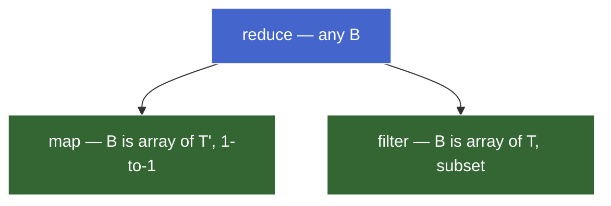
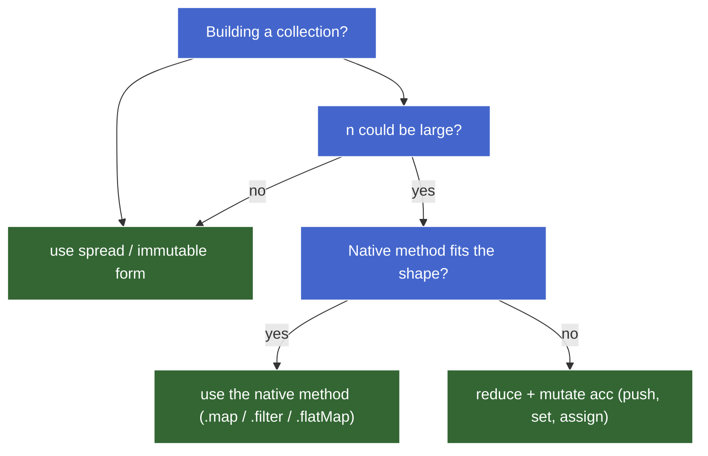

# Reduce Deep Dive — Teaching Draft

## Plan (teaching order)

- [x] **Teaser** — `groupBy` failure showing accumulator-shape mismatch
- [x] **Reduce as the universal fold** — formal layer, signature, threading mental model
- [x] **Accumulator design** — init value declares shape and type; type-uniform vs type-changing folds
- [x] **Building abstractions from reduce** — map/filter/find/some/every/max/groupBy/partition; the early-exit caveat
- [x] **Mutate-vs-immutable accumulator** — `[...acc, x]` is O(n²); `acc.push(x)` is O(n); when mutation is safe
- [x] **Common pitfalls** — forgetting return, missing initial value, shape mismatch, no `break`
- [ ] **Worked synthesis** — annotated example tying the pieces together

> ⚠️ Corrected during teaching — `reduceRight` was scoped into this chunk during planning but cut as scope creep; its only meaningful use case (function composition) belongs in the next chunk (*Composition & pipelines*). A one-line forward-pointer added in *Reduce as the universal fold* signals it exists.

---

## Chunk opener — teaser

```js
const items = [                                  // L1
  { type: "fruit", name: "apple" },
  { type: "veg",   name: "carrot" },
  { type: "fruit", name: "banana" },
  { type: "veg",   name: "spinach" },
];

const grouped = items.reduce((acc, item) => {    // L2
  acc[item.type].push(item.name);                // L3
  return acc;                                    // L4
}, {});

console.log(grouped);                            // L5
```

**Outcome:** `TypeError: Cannot read properties of undefined (reading 'push')` — at iteration 1, `acc = {}`, so `acc.fruit` is `undefined`, and `.push` on `undefined` throws.

The bug isn't in the callback's mechanism (return-value threading is correct). It's in the **mismatch between the init value's shape and the shape the callback assumes**.

### Two valid fixes

**A. Defensive callback (lazy bucket init):**

```js
items.reduce((acc, item) => {
  if (!acc[item.type]) acc[item.type] = [];
  acc[item.type].push(item.name);
  return acc;
}, {});
```

**B. Pre-seeded accumulator (when keys are known):**

```js
items.reduce((acc, item) => {
  acc[item.type].push(item.name);
  return acc;
}, { fruit: [], veg: [] });
```

Both produce `{ fruit: ["apple", "banana"], veg: ["carrot", "spinach"] }`.

### The takeaway

The init value is not bookkeeping — it's the **shape declaration** of the fold. The init answers "what does an initial accumulator look like?" and the callback answers "given a current acc and one element, what's the next acc?" If the two disagree on shape, the fold either throws or silently produces wrong output.

| Init | Implied shape | Callback's job |
|---|---|---|
| `0` | number | combine number + element → number |
| `""` | string | combine string + element → string |
| `[]` | array | combine array + element → array |
| `{}` | object (no keys) | callback must handle missing keys |
| `{ k: [], … }` | object with known keys | append into the right bucket |

> 🔖 **Later (*Algebraic structure* chunk):** the init value is the *identity element* of the combining operation. That's the monoid pattern.

---

## Reduce as the universal fold

### The signature

```
reduce<T, B>(
  callback: (acc: B, x: T, i: number, arr: T[]) => B,
  init: B
): B
```

Read it as a contract:

- **Input collection** is `T[]` — the array element type.
- **Accumulator type** is `B` — the carried state type.
- **Init** is a `B`. **Output** is a `B`. They must agree.
- **Callback** is the transition rule: given the current `B` and one `T`, produce the next `B`.

`T` and `B` can be the same (`+` over numbers: `T = B = number`) or completely different (`groupBy` over items: `T = Item`, `B = Record<string, Item[]>`). Reduce doesn't care — it only asks that callback's input/output and init agree.

### The threading mental model

Reduce *threads* a single value through the array. At every step the callback **consumes** the current accumulator + one element and **produces** the next accumulator. The next iteration sees that produced value as its `acc`. Nothing else carries between iterations.

```
init ──▶ cb(init, arr[0]) ──▶ cb(_, arr[1]) ──▶ cb(_, arr[2]) ──▶ … ──▶ result
         └──────acc────────┘  └──────acc────────┘  └──────acc────────┘
```

Concrete trace for `[3, 1, 4, 1, 5].reduce((a, x) => a + x, 0)`:

| Step | `acc` (in) | `x` | `acc` (out) |
|---|---|---|---|
| 1 | 0 | 3 | 3 |
| 2 | 3 | 1 | 4 |
| 3 | 4 | 4 | 8 |
| 4 | 8 | 1 | 9 |
| 5 | 9 | 5 | 14 |

Final result: 14. The accumulator is the only state. Each row's "out" is the next row's "in".

> **Aside — formal layer.** This is the **fold** in functional programming: `foldl(cb, init, [x₁, x₂, …, xₙ])` ≡ `cb(…cb(cb(init, x₁), x₂)…, xₙ)`. Haskell calls it `foldl`, OCaml `fold_left`, Python `functools.reduce`, JS `reduce`. Same operation, same algebraic identity. The *associative binary operator + identity element* version of this is the monoid pattern (covered in *Algebraic structure*).
>
> JS also ships **`reduceRight`** — the mirror right-fold (visit from last index to first). For commutative combines (sum, max, set union) the result is identical to `reduce`, so the choice is invisible. The one place direction matters in real code is **function composition** (`f ∘ g ∘ h` is right-associative), covered in *Composition & pipelines* — that's where `reduceRight` earns its keep.

### Why "universal"

Reduce subsumes `map` and `filter` because the accumulator can be *anything* — including an array you append to.

```js
// map via reduce — accumulator is a growing array
arr.reduce((acc, x) => [...acc, fn(x)], []);

// filter via reduce — accumulator is a growing array, conditional append
arr.reduce((acc, x) => pred(x) ? [...acc, x] : acc, []);
```

The reverse direction doesn't work: `map` is locked to "1-to-1, same length, output is array of mapped elements" — it can't collapse to a single number, can't conditionally drop, can't reorder. `filter` is locked to "subset of original elements" — it can't transform.

So the structural hierarchy is:



Reduce is the **most general** because it places no constraint on `B`. Map and filter are *specializations* — they're reduces whose accumulator is always an array and whose per-step combine is fixed.

### Why prefer the specializations anyway

If reduce is universal, why use `map`/`filter` at all? Same reason a `for` loop is more general than `map` but you still prefer `map`:

> **Constraints communicate intent.** A `.map(fn)` reader knows: same length, 1-to-1, no aggregation, no reordering — *before reading the callback*. A `.reduce(...)` reader has to read the callback to figure out the shape.

Use reduce **when the operation genuinely doesn't fit map or filter**: aggregating to a different type (sum, group, index), conditional accumulation depending on prior state, or fusing multiple shapes in one pass. Don't reach for reduce just because you can — the specialization carries information.

---

### Sub-part check

```js
const arr = [{ id: 1, n: 5 }, { id: 2, n: 3 }, { id: 3, n: 8 }];

const result = arr.reduce((acc, item) => {
  acc[item.id] = item.n;
  return acc;
}, {});
```

For this reduce, what are `T` and `B` in the signature `(acc: B, x: T) => B`, and what does `result` evaluate to?


---

## Accumulator design

The teaser already hinted at it: **the init value is the shape declaration of the fold.** This sub-part formalizes the design choice — when does `B` equal `T`, when does it differ, and how to choose the init value deliberately.

### Two structural categories

Folds split into two cases based on the relationship between `T` (element type) and `B` (accumulator type):

| Category | Relationship | Examples | Init |
|---|---|---|---|
| **Type-uniform fold** | `B = T` | sum of numbers, product, min/max, string concat, array concat | identity element of the combine op |
| **Type-changing fold** | `B ≠ T` | count, group, index, build a tree, parse | shape that the callback expects |

```js
// Type-uniform — T = B = number
[1, 2, 3, 4].reduce((acc, x) => acc + x, 0);             // 10

// Type-changing — T = string, B = number (count length)
["a", "bb", "ccc"].reduce((acc, x) => acc + x.length, 0); // 6

// Type-changing — T = { id, n }, B = Record<string, number> (index)
items.reduce((acc, item) => { acc[item.id] = item.n; return acc; }, {});
```

### Type-uniform folds — init is the identity element

When `B = T`, the combining operation is essentially "fold the same type into itself." The init value is the **identity element** of that operation — the value that leaves any other value unchanged.

| Operation | Identity | Why |
|---|---|---|
| `+` (numbers) | `0` | `x + 0 = x` |
| `*` (numbers) | `1` | `x * 1 = x` |
| `&&` (booleans) | `true` | `x && true = x` |
| `\|\|` (booleans) | `false` | `x \|\| false = x` |
| string concat | `""` | `s + "" = s` |
| array concat | `[]` | `arr.concat([]) = arr` |
| `Math.max` | `-Infinity` | `max(x, -Infinity) = x` |
| `Math.min` | `Infinity` | `min(x, Infinity) = x` |

**Why pick the identity, not just any value?** Two reasons:

1. **Empty-array correctness.** `[].reduce((a, x) => a + x, 0)` returns `0` — the right answer for "sum of nothing." With init `5`, you'd get `5`, which is wrong.
2. **Composition.** Folds with identity elements are **monoids** — they compose, parallelize, and chunk cleanly. Same algebraic property that makes `arr1.concat(arr2)` predictable regardless of grouping.

> 🔖 **Later (*Algebraic structure* chunk):** "init = identity" is the heart of the monoid pattern. The identity + associativity laws are what make folds well-behaved.

### Type-changing folds — init is the empty shape

When `B ≠ T`, the init is **what an empty accumulator of type `B` looks like** — the starting shape onto which the callback grafts each element's contribution.

```js
// build an array            → init = []
// build an object/map       → init = {} or { knownKey: [], … }
// build a Set               → init = new Set()
// build a Map               → init = new Map()
// count / index             → init = 0 or {}
// flag (some-style)         → init = false
// flag (every-style)        → init = true
```

The teaser revisited: pre-seeded `{ fruit: [], veg: [] }` worked because the init *already had the shape the callback assumed*. The `{}` version forced the callback to handle missing keys defensively.

**Decision rule for object accumulators:**

- **Keys known up front** → pre-seed with empty containers. Callback stays simple.
- **Keys discovered during iteration** (e.g. groupBy on dynamic data) → init `{}`, callback initializes lazily on first sight (`if (!acc[k]) acc[k] = []`).

### Init type ↔ callback contract

The init's *type* and the callback's *return type* form a contract. If they drift, you get one of three failure modes:

| Failure mode | Example | Symptom |
|---|---|---|
| Callback forgets to return | `(acc, x) => { acc.push(x); }` | `acc` becomes `undefined` on iteration 2 → `TypeError` |
| Callback returns wrong shape | `(acc, x) => x` (returning element instead of acc) | Final result is the last element, not an aggregate |
| Init shape ≠ callback assumption | teaser: `{}` init, callback assumes `acc[k]` is array | `TypeError` on first use |

All three are *type errors at the value level* — the language doesn't enforce the contract, but the contract still exists. TypeScript's reduce signature catches these at compile time; in plain JS, runtime is the only check.

### Choosing the init value — checklist

Before writing the callback, answer in order:

1. **What's `B`?** What does the final result look like? That's `B`.
2. **What does an *empty* `B` look like?** That's the init.
3. **For each element, how does it contribute to `B`?** That's the callback body.

Doing it in this order — `B` → init → callback — prevents the teaser bug. Working backward from "I want to push into `acc.fruit`" without first asking "is `acc.fruit` an array yet?" is how the shape mismatch sneaks in.

---

### Sub-part check

Two snippets — for each, identify the init value you'd pick and briefly say why.

**(a)** Find the longest string in an array of strings.

```js
const words = ["short", "medium-ish", "the longest one here", "tiny"];
const longest = words.reduce((acc, w) => w.length > acc.length ? w : acc, /* ??? */);
```

**(b)** Build an object mapping each user's `id` to the user object itself, for an array of `{ id, name, … }` users.

```js
const byId = users.reduce((acc, u) => { acc[u.id] = u; return acc; }, /* ??? */);
```

What init values do you pick, and why does each one fit?


---

## Building abstractions from reduce

We saw map and filter via reduce in *Core iteration abstractions*. The pattern goes wider: most array operations can be expressed as a reduce by picking the right `B` and the right combine rule. Working through this catalogue cements the universality claim and surfaces one important limit — early exit.

### Catalogue

```js
// map — accumulator = transformed array
arr.reduce((acc, x) => [...acc, fn(x)], []);

// filter — accumulator = kept array
arr.reduce((acc, x) => pred(x) ? [...acc, x] : acc, []);

// max — accumulator = best so far
arr.reduce((acc, x) => x > acc ? x : acc, -Infinity);

// some — accumulator = boolean OR
arr.reduce((acc, x) => acc || pred(x), false);

// every — accumulator = boolean AND
arr.reduce((acc, x) => acc && pred(x), true);

// find — accumulator = first match (or undefined)
arr.reduce((acc, x) => acc !== undefined ? acc : (pred(x) ? x : undefined), undefined);

// groupBy — accumulator = bucket map
arr.reduce((acc, it) => {
  const k = keyFn(it);
  (acc[k] ||= []).push(it);
  return acc;
}, {});

// countBy — accumulator = key→count map
arr.reduce((acc, it) => {
  const k = keyFn(it);
  acc[k] = (acc[k] || 0) + 1;
  return acc;
}, {});

// partition — accumulator = [matches, nonMatches]
arr.reduce(
  ([yes, no], x) => pred(x) ? [[...yes, x], no] : [yes, [...no, x]],
  [[], []]
);

// reverse — accumulator = reversed array
arr.reduce((acc, x) => [x, ...acc], []);

// flatten one level
arr.reduce((acc, x) => acc.concat(x), []);
```

The recipe is always the same: **pick `B`, pick init = empty `B`, write the combine.** The variety of operations comes entirely from varying `B` and the combine rule.

### The early-exit caveat — reduce always walks the whole array

**Reduce has no `break`.** Once started, it visits every element. This is a real cost for operations whose semantics include short-circuit:

| Native method | Stops at | Reduce-equivalent stops at |
|---|---|---|
| `.some(pred)` | first truthy match | end of array |
| `.every(pred)` | first falsy result | end of array |
| `.find(pred)` | first match | end of array |
| `.findIndex(pred)` | first match | end of array |
| `.includes(x)` | first equal | end of array |

Concrete demonstration:

```js
let visits = 0;
[1, 2, 3, 4, 5, 6, 7, 8, 9, 10].reduce((acc, x) => {
  visits++;
  return acc || x > 3;
}, false);
// result: true, visits: 10  — walked the whole array

let visits2 = 0;
[1, 2, 3, 4, 5, 6, 7, 8, 9, 10].some(x => {
  visits2++;
  return x > 3;
});
// result: true, visits: 4   — stopped at the match
```

For a 10-element array this doesn't matter. For 10,000 elements with an expensive predicate, or for **infinite/lazy sequences** where you *can't* visit the whole thing, the difference is decisive. The native methods aren't just sugar — they encode short-circuit semantics that reduce structurally cannot.

> 🔖 **Later (*Real-world patterns* chunk):** generators give you laziness — you can build short-circuit folds that stop early because the producer pauses. Reduce-over-an-array can't.

### Workarounds for early exit

Three options, in order of recommendation:

1. **Use the native method.** `.some` / `.every` / `.find` exist exactly for this. Don't rebuild them via reduce in production code.
2. **Reduce-to-build, then short-circuit-test.** When the question is about a *derived shape* (counts, groups, indices), build the shape with reduce, then run `.some` / `.every` on `Object.values(...)` of the result:
   ```js
   const counts = events.reduce((acc, e) => {
     acc[e.user] = (acc[e.user] || 0) + 1;
     return acc;
   }, {});
   const anyHeavyUser = Object.values(counts).some(c => c > 2);
   ```
   The reduce step still walks the whole array (it has no choice — it's *building* the shape). The `.some` step short-circuits on the values. Two passes, but each step uses the tool that fits its role.

   Key insight: **`.some` / `.every` / `.find` aren't anchored to the original input array.** They work on any iterable, including derived ones. Don't rule them out just because the *raw* input doesn't fit.
3. **`for...of` with `break`.** When the operation isn't a clean fit for any built-in *and* you genuinely need to stop iterating early (e.g. expensive predicate over a long input):
   ```js
   const counts = {};
   let answer = false;
   for (const e of events) {
     counts[e.user] = (counts[e.user] || 0) + 1;
     if (counts[e.user] > 2) { answer = true; break; }
   }
   ```
4. **Throw to escape reduce.** Wrap reduce in a try/catch, throw to short-circuit. **Anti-pattern** — exceptions for control flow are slow, opaque, and surprising. Listed only so you recognize and reject it on sight.

> ⚠️ **The "early-return inside reduce" trap.** Tempting:
> ```js
> events.reduce((acc, e) => {
>   if (acc === true) return true;        // already found
>   /* … build counts … */
>   if (counts[e.user] > 2) return true;
>   return acc;
> }, {});
> ```
> **This does not short-circuit.** Reduce keeps calling the callback for every remaining element — the callback just becomes a cheap no-op. The visit cost stays. Use option 3 (`for...of` + `break`) when you actually need to stop.

### Educational vs production use

Reimplementing every method via reduce is a great mental exercise — it proves the universality and forces you to think in terms of `B` + combine. But in real code, **prefer the named method that fits the shape**. Same reasoning as in *Core iteration abstractions*:

| Reach for reduce when | Reach for the named method when |
|---|---|
| The operation doesn't fit any specialization (group, index, custom aggregation) | A specialization fits — `map`, `filter`, `some`, `every`, `find`, `flatMap` |
| You're fusing multiple shapes in one pass | Clarity matters more than the (almost always negligible) intermediate-array cost |
| The accumulator type genuinely differs from the element type and isn't a list | You'd be reaching for reduce just to reimplement a shape that has a name |

A `.reduce(...)` in production code should make the reader stop and read carefully, because the *shape isn't named*. If a named method fits, the reader doesn't have to read the callback to learn the shape — the method name carries that information.

---

### Sub-part check

```js
const events = [
  { user: "alice", action: "login"  },
  { user: "bob",   action: "click"  },
  { user: "alice", action: "click"  },
  { user: "alice", action: "logout" },
  { user: "bob",   action: "logout" },
];
```

You want to know: *does any user have more than 2 events?*

Two implementations to consider:

**(a)** Build the per-user counts with reduce, then check the values.
**(b)** Use `.some` directly, somehow.

Which is structurally cleaner, and (more importantly) which one short-circuits? If you wrote (a), would the reduce step itself be able to stop early once it knows the answer is `true`? Why or why not?


---

## Mutate-vs-immutable accumulator — the silent O(n²) trap

The catalogue in the previous section used `[...acc, x]` — the immutable, FP-style append. It's idiomatic, it's lint-friendly, and it's **catastrophically slow** for non-trivial sizes. This sub-part is about why, and when each style is the right call.

### The bug demo

```js
const N = 50_000;
const arr = Array.from({ length: N }, (_, i) => i);

// Style A — immutable spread
arr.reduce((acc, x) => [...acc, x * 2], []);            // ≈ 20,900 ms

// Style B — mutate the accumulator
arr.reduce((acc, x) => { acc.push(x * 2); return acc; }, []);  //  ≈ 1.6 ms

// Style C — native map (also mutating internally)
arr.map(x => x * 2);                                    //  ≈ 1.0 ms
```

Style A is **~13,000× slower** than style B at N = 50k. Same observable output (a new array of doubled values). Same conceptual shape. Wildly different cost.

### Why — complexity analysis

`[...acc, x]` does **not** mean "append `x` to `acc`." It means **allocate a brand-new array, copy every element of `acc` into it, then place `x` at the end.** At iteration `k`, `acc` already holds `k` elements, so the spread copies `k` elements before adding one.

Total work across `n` iterations:

```
1 + 2 + 3 + … + n = n(n+1)/2 = O(n²)
```

Mutating push is amortized O(1) per element, so the whole reduce is O(n). The asymptotic gap is quadratic vs linear — which is why doubling `N` makes spread roughly 4× slower but push roughly 2× slower.

| Style | Per iteration | Whole reduce |
|---|---|---|
| `[...acc, x]` | O(k) — copy k elements | **O(n²)** |
| `acc.push(x)` | O(1) amortized | **O(n)** |
| Native `.map` | O(1) per element | **O(n)** |

### The contradiction with FP doctrine

Functional style says "no mutation." Yet here, the mutating version is the practical one — and the *native* `.map` does the same thing internally. What gives?

The resolution: **the accumulator is a private, in-flight value owned by the reduce.** It doesn't escape — no other code holds a reference to `acc` while the reduce runs. Mutating it isn't observable from outside. The function as a whole is *still pure* (same input → same output, no side effects on shared state) even though its inner mechanics mutate.

This is a general principle that comes up again and again:

> **Externally pure. Internally mutable.**
>
> Mutation is safe when scoped to a value the function exclusively owns. Pure as an API; mutating as an implementation. The "no mutation" rule applies to *shared* state, not local scratch space.

Same rule applies to other patterns we'll see — `Array.from` with a mapping function, `flatMap`'s internals, even how V8 implements `.map`.

### When immutable spread is fine

Spread isn't always wrong — it's fine when the size is small or the operation is naturally per-element-light:

| Use case | Spread OK? | Why |
|---|---|---|
| `n < ~100` and not in a hot loop | ✅ | Quadratic cost is small in absolute terms |
| Top-level state update (Redux-style reducer over an action, not over an array) | ✅ | Single allocation per call |
| Building inside a tight inner reduce over a large array | ❌ | The O(n²) hits hard |

The rule of thumb: **use spread when ergonomics + immutability matter and `n` is small; use mutation when `n` could grow.**

### Decision framework

For a reduce that builds an array (or any collection):



In practice for large `n`, you almost never *need* reduce-with-spread — either a native method fits (use it) or you genuinely need a custom shape (use mutation, which is safe because `acc` is private).

### The same trap with objects

Spread isn't only an array problem — `{...acc, [k]: v}` has the same quadratic cost when used in a reduce:

```js
// O(n²) — copies all existing keys every iteration
items.reduce((acc, item) => ({ ...acc, [item.id]: item }), {});

// O(n) — mutates the private accumulator
items.reduce((acc, item) => { acc[item.id] = item; return acc; }, {});
```

Same reasoning, same conclusion.

> **Aside — the lint rule.** ESLint's `no-param-reassign` (with `props: true`) flags `acc.push(x)` and `acc[k] = v` as "mutating a parameter." Configure it with `ignorePropertyModificationsFor: ["acc", "accumulator"]` to allow the reduce idiom while still catching genuinely bad parameter mutation elsewhere.

---

### Sub-part check

Two snippets — for each, predict whether the performance is OK, and explain why in terms of complexity:

**(a)**
```js
function buildIndex(records) {  // records: ~10,000 items
  return records.reduce((acc, r) => ({ ...acc, [r.id]: r }), {});
}
```

**(b)**
```js
function dedupe(arr) {  // arr: ~10,000 items
  const seen = new Set();
  return arr.reduce((acc, x) => {
    if (seen.has(x)) return acc;
    seen.add(x);
    acc.push(x);
    return acc;
  }, []);
}
```

For each: complexity, OK or trap, and (for the trap) the fix.


---

## Common pitfalls

A scannable consolidation. Most of these have appeared during teaching; collected here so future-self can map a symptom to a cause without re-deriving.

### Forgotten return

```js
[1, 2, 3].reduce((acc, x) => { acc.push(x * 2); /* forgot return */ }, []);
// → TypeError: Cannot read properties of undefined (reading 'push')
```

**Cause:** the callback's return value *replaces* `acc` for the next iteration. No return → next iteration sees `acc = undefined`. Throws on the second iteration's `acc.push`.

**Fix:** always `return acc` at the end. Single-expression arrow form (`(acc, x) => (acc.push(x), acc)` or `(acc, x) => acc.concat(x)`) avoids the trap by being expression-bodied.

### Missing init on empty input

```js
[].reduce((a, x) => a + x);
// → TypeError: Reduce of empty array with no initial value
```

**Cause:** without init, reduce uses `arr[0]` as the initial accumulator. Empty array → no `arr[0]` → throws.

**Fix:** always pass an init. Beyond avoiding the throw, the init declares the type and handles the empty case correctly (`0` for sum, `""` for concat, `[]` for collect).

### Missing init on type-changing fold

```js
const items = [{ n: 1 }, { n: 2 }, { n: 3 }];
items.reduce((acc, x) => acc + x.n);
// → "[object Object]23"   (silent garbage)
```

**Cause:** without init, `arr[0]` (the first `{ n: 1 }` object) becomes the initial accumulator. Then `acc + x.n` does `{n:1} + 2`, which coerces the object to `"[object Object]"` and string-concatenates. No throw — just wrong output.

**Fix:** when `B ≠ T`, the init *must* be supplied. The first-element-as-init shortcut only works when `B = T` (type-uniform fold).

### Returning an element instead of the accumulator

```js
[1, 2, 3, 4].reduce((acc, x) => x, 0);
// → 4
```

**Cause:** the callback ignores `acc` and returns the current element. Each iteration replaces `acc` with the element. Final accumulator is the last element.

Sounds dumb in this contrived form; surfaces in real code when refactoring (`return computed` instead of `acc[k] = computed; return acc`).

**Fix:** the callback's return value must be the *next accumulator*, not a contribution to it. Mental model: "given the current acc, what's the new acc?"

### Expecting `break` / `continue`

Already covered in the *Building abstractions from reduce* section. Symptom: code that "looks like" it short-circuits but doesn't. Reduce always walks the whole array. For genuine early exit, use `.some` / `.every` / `.find`, or `for...of` + `break`.

### Mutating shared input

```js
const original = [{ count: 1 }, { count: 2 }];
const sum = original.reduce((acc, item) => {
  item.count *= 10;            // ⚠️ mutates the input!
  return acc + item.count;
}, 0);
// sum = 30, but original is now [{count: 10}, {count: 20}]
```

**Cause:** the callback mutates the elements of the input array. Distinct from the previous "mutate the accumulator" discussion — that was safe because `acc` is private. The *input* isn't private; it's owned by the caller.

**Fix:** read from input, write to accumulator. If you need a transformed value, compute it as a local: `const next = item.count * 10; return acc + next;`. The input array's elements stay untouched.

This is the line that "Externally pure. Internally mutable." draws: the accumulator is internal scratch; the input is external. Mutate the first; never the second.

### Strict mode changes which bug throws first

When multiple bugs co-exist in a reduce, **strict mode often surfaces the *earliest* bug by promoting silent no-ops into throws.** Same snippet, two different errors:

```js
const tally = ["a", "b", "a", "c", "a"].reduce((acc, x) => {
  acc[x] = (acc[x] || 0) + 1;       // forgot return + missing init
});
```

| Mode | Iter that throws | Error | Which bug fired first |
|---|---|---|---|
| **Sloppy** | 2 | `Cannot read properties of undefined (reading 'a')` | Forgot return — iter 1 silently no-ops, then iter 2 sees `acc = undefined` |
| **Strict** | 1 | `Cannot create property 'b' on string 'a'` | Missing init — iter 1's write to a string primitive throws *before* the missing-return ever matters |

**Why:** in sloppy mode, several misuses silently no-op (writing to primitives, assigning to undeclared identifiers, deleting non-configurable properties). Strict mode promotes them to `TypeError`. So the sloppy-mode flow gets to iter 2 *only because iter 1's misuse silently failed*; strict mode breaks that chain.

**Where strict mode is automatic:**

| Context | Strict? |
|---|---|
| ESM modules (`.mjs`, `"type": "module"`, `<script type="module">`) | ✅ always |
| Class bodies | ✅ always |
| `"use strict"` directive at top of file/function | ✅ |
| CommonJS scripts, classic `<script>` tag, REPL | ❌ sloppy default |

Modern bundled code (Webpack/Vite/etc., framework components, `.mjs`) is strict by default. Sloppy-mode quirks survive mostly in legacy scripts and REPL one-liners — but the difference matters when reproducing a bug from one environment in another.

**Diagnostic principle:** when a reduce throws and you suspect multiple bugs, run it under both modes (or check the throw signature) — the bug that throws *first* is the one currently masking everything downstream. Fix it, and the next bug surfaces.


| Pitfall | Symptom | Fix |
|---|---|---|
| Forgot return | `TypeError` on iteration 2 (`undefined.push` etc.) | `return acc` always; or use expression-bodied form |
| Missing init, empty array | `TypeError: Reduce of empty array...` | Always pass init |
| Missing init, type-changing | Silent garbage (e.g. `"[object Object]23"`) | Init is mandatory when `B ≠ T` |
| Return element, not acc | Final result is the last element | Return the *next accumulator*, not a contribution |
| Expected `break` | Walks entire array; sometimes a perf cliff | `.some` / `.every` / `.find` / `for...of` + `break` |
| Mutated input | Caller's data silently changed | Mutate `acc` only; treat input as read-only |

---

### Sub-part check

Spot the bug in each. (Don't fix yet — just say what's wrong and what symptom you'd see.)

**(a)**
```js
const tally = ["a", "b", "a", "c", "a"].reduce((acc, x) => {
  acc[x] = (acc[x] || 0) + 1;
});
```

**(b)**
```js
function avg(nums) {
  return nums.reduce((acc, x) => acc + x) / nums.length;
}
avg([]);  // ?
```

**(c)**
```js
const totals = orders.reduce((acc, o) => {
  o.shipped = true;            // mark the order
  acc[o.userId] = (acc[o.userId] || 0) + o.amount;
  return acc;
}, {});
```


---
