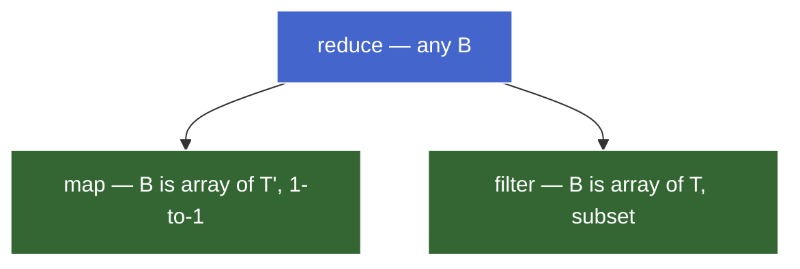
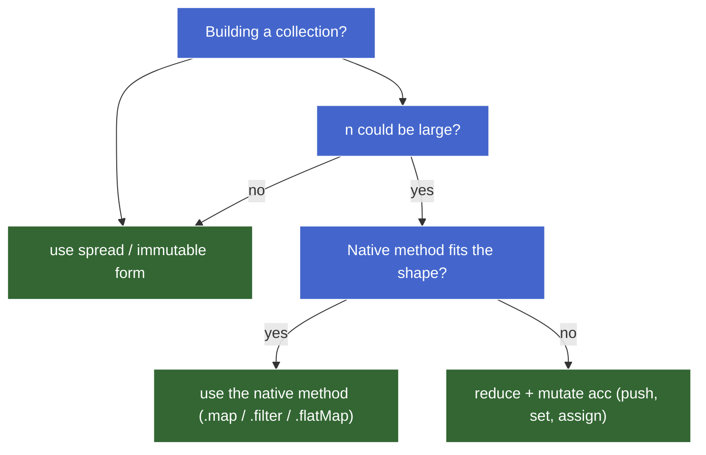

# 1. Reduce — The Universal Fold

> **TL;DR:** `reduce` threads an accumulator (`B`) through an array (`T[]`), one element at a time, applying a callback `(acc, x) => nextAcc`. The init value is the **empty shape of `B`** — for type-uniform folds (sum, max) it's the *identity element* of the combine; for type-changing folds (group, index) it's the empty container. Reduce is the most general iteration shape — `map` and `filter` are specializations — but the cost of generality is no early exit (always walks the whole array) and a callback the reader must read to learn the shape. Prefer specializations when they fit; reach for reduce when the operation genuinely doesn't fit any. Mutating the *private* accumulator is safe and idiomatic — externally pure, internally mutable.

## 1.1. Signature and the threading model

```
reduce<T, B>(
  callback: (acc: B, x: T, i: number, arr: T[]) => B,
  init: B
): B
```

Read as a contract:

- **Input collection** is `T[]`.
- **Accumulator type** is `B` — the *carried state* type.
- **Init**, **output**, and the callback's input/output of the accumulator parameter all share `B`.
- The callback is the **transition rule**: given current `B` and one `T`, produce the next `B`.

`T` and `B` can be the same type (sum: both `number`) or completely different (groupBy: `T = Item`, `B = Record<string, Item[]>`). Reduce doesn't care — the only constraint is *the callback's input/output and the init agree on `B`*.

### 1.1.1. Threading

Reduce threads a single value through the array. At every step the callback **consumes** the current accumulator + one element and **produces** the next accumulator. The next iteration sees that produced value as its `acc`. Nothing else carries between iterations.

```
init ──▶ cb(init, arr[0]) ──▶ cb(_, arr[1]) ──▶ cb(_, arr[2]) ──▶ … ──▶ result
         └──────acc────────┘  └──────acc────────┘  └──────acc────────┘
```

Concrete trace for `[3, 1, 4, 1, 5].reduce((a, x) => a + x, 0)`:

| Step | `acc` (in) | `x` | `acc` (out) |
|---|---|---|---|
| 1 | 0 | 3 | 3 |
| 2 | 3 | 1 | 4 |
| 3 | 4 | 4 | 8 |
| 4 | 8 | 1 | 9 |
| 5 | 9 | 5 | 14 |

The accumulator is the only state. Each row's "out" is the next row's "in".

> **Aside — formal layer.** This is the **fold** (`foldl`) of functional programming: `foldl(cb, init, [x₁, x₂, …, xₙ])` ≡ `cb(…cb(cb(init, x₁), x₂)…, xₙ)`. Same operation across languages — Haskell `foldl`, OCaml `fold_left`, Python `functools.reduce`, JS `reduce`. The *associative binary operator + identity element* version is the monoid pattern (covered in *Algebraic structure*).
>
> JS also ships **`reduceRight`** — the mirror right-fold (visit from last index to first). For commutative combines (sum, max, set union) the result is identical; the one place direction matters in real code is **function composition** (`f ∘ g ∘ h` is right-associative), covered in *Composition & pipelines* — that's where `reduceRight` earns its keep.

## 1.2. Accumulator design — choosing `B` and the init

The init value isn't bookkeeping. It's the **shape declaration** of the fold. Get it right and the callback writes itself; get it wrong and you get either silent garbage or a `TypeError`.

### 1.2.1. Two structural categories

| Category | Relationship | Examples | Init |
|---|---|---|---|
| **Type-uniform fold** | `B = T` | sum, product, min/max, string concat, array concat | identity element of the combine op |
| **Type-changing fold** | `B ≠ T` | count, group, index, build a tree, parse | shape that the callback expects |

```js
// Type-uniform — T = B = number
[1, 2, 3, 4].reduce((acc, x) => acc + x, 0);             // 10

// Type-changing — T = string, B = number (count length)
["a", "bb", "ccc"].reduce((acc, x) => acc + x.length, 0); // 6

// Type-changing — T = { id, n }, B = Record<string, number> (index)
items.reduce((acc, item) => { acc[item.id] = item.n; return acc; }, {});
```

### 1.2.2. Type-uniform — init is the identity element

When `B = T`, the init is the **identity element** of the combining operation — the value that leaves any other value unchanged when combined with it.

| Operation | Identity | Why |
|---|---|---|
| `+` (numbers) | `0` | `x + 0 = x` |
| `*` (numbers) | `1` | `x * 1 = x` |
| `&&` (booleans) | `true` | `x && true = x` |
| `\|\|` (booleans) | `false` | `x \|\| false = x` |
| string concat | `""` | `s + "" = s` |
| array concat | `[]` | `arr.concat([]) = arr` |
| `Math.max` | `-Infinity` | `max(x, -Infinity) = x` |
| `Math.min` | `Infinity` | `min(x, Infinity) = x` |

Two reasons to pick identity, not just any value:

1. **Empty-array correctness.** `[].reduce((a, x) => a + x, 0)` returns `0` — the right answer for "sum of nothing." Init `5` would give `5`, which is wrong.
2. **Composition.** Folds with identity elements are **monoids** — they compose, parallelize, and chunk cleanly. Same algebraic property that makes `arr1.concat(arr2)` predictable regardless of grouping.

> 🔖 **Later (*Algebraic structure*):** "init = identity" is the heart of the monoid pattern. Identity + associativity laws are what make folds well-behaved.

### 1.2.3. Type-changing — init is the empty shape

When `B ≠ T`, the init is **what an empty `B` looks like** — the starting shape onto which the callback grafts each element's contribution.

```js
// build an array            → init = []
// build an object/map       → init = {} or { knownKey: [], … }
// build a Set               → init = new Set()
// build a Map               → init = new Map()
// count / index             → init = 0 or {}
// flag (some-style)         → init = false
// flag (every-style)        → init = true
```

**Decision rule for object accumulators:**

- **Keys known up front** → pre-seed with empty containers. Callback stays simple.
- **Keys discovered during iteration** (e.g. groupBy on dynamic data) → init `{}`, callback initializes lazily on first sight (`if (!acc[k]) acc[k] = []`).

### 1.2.4. Bug demo — when init's shape disagrees with the callback

```js
const items = [
  { type: "fruit", name: "apple"  },
  { type: "veg",   name: "carrot" },
  { type: "fruit", name: "banana" },
];

const grouped = items.reduce((acc, item) => {  // L1
  acc[item.type].push(item.name);              // L2
  return acc;                                  // L3
}, {});                                        // L4
// → TypeError: Cannot read properties of undefined (reading 'push')
```

The callback isn't structurally wrong — return-value threading is correct. The bug is at L4: init `{}` has no buckets, but L2 assumes `acc[item.type]` is already an array. **Mismatch between init's shape and the callback's shape assumption.**

Two valid fixes, each picking one side of the *Decision rule for object accumulators*:

```js
// A. Lazy bucket init — keys are discovered during iteration
items.reduce((acc, item) => {
  if (!acc[item.type]) acc[item.type] = [];
  acc[item.type].push(item.name);
  return acc;
}, {});

// B. Pre-seeded accumulator — keys are known up front
items.reduce((acc, item) => {
  acc[item.type].push(item.name);
  return acc;
}, { fruit: [], veg: [] });
```

Both produce `{ fruit: ["apple", "banana"], veg: ["carrot"] }`.

### 1.2.5. The order to think in

Before writing the callback:

1. **What's `B`?** What does the final result look like? That's `B`.
2. **What does an *empty* `B` look like?** That's the init.
3. **For each element, how does it contribute to `B`?** That's the callback body.

Doing it in this order — `B` → init → callback — prevents the shape-mismatch bug. Working backward from "I want to push into `acc.fruit`" without first asking "is `acc.fruit` an array yet?" is how the mismatch sneaks in.

## 1.3. Universality — building other abstractions from reduce

Reduce subsumes `map` and `filter` because the accumulator can be *anything* — including an array you append to.

```js
// map via reduce
arr.reduce((acc, x) => [...acc, fn(x)], []);

// filter via reduce
arr.reduce((acc, x) => pred(x) ? [...acc, x] : acc, []);
```

The reverse doesn't work: `map` is locked to "1-to-1, same length, output is array of mapped elements" — can't collapse to a number, can't drop, can't reorder. `filter` is locked to "subset of original elements" — can't transform.



Reduce is the **most general** because it places no constraint on `B`. Map and filter are *specializations* — reduces whose accumulator is always an array and whose per-step combine is fixed.

### 1.3.1. The catalogue

Most array operations fit the same recipe — pick `B`, pick init = empty `B`, write the combine:

```js
// max — accumulator = best so far
arr.reduce((acc, x) => x > acc ? x : acc, -Infinity);

// some — accumulator = boolean OR
arr.reduce((acc, x) => acc || pred(x), false);

// every — accumulator = boolean AND
arr.reduce((acc, x) => acc && pred(x), true);

// find — accumulator = first match (or undefined)
arr.reduce((acc, x) => acc !== undefined ? acc : (pred(x) ? x : undefined), undefined);

// groupBy — accumulator = bucket map
arr.reduce((acc, it) => {
  const k = keyFn(it);
  (acc[k] ||= []).push(it);
  return acc;
}, {});

// countBy — accumulator = key→count map
arr.reduce((acc, it) => {
  const k = keyFn(it);
  acc[k] = (acc[k] || 0) + 1;
  return acc;
}, {});

// partition — accumulator = [matches, nonMatches]
arr.reduce(
  ([yes, no], x) => pred(x) ? [[...yes, x], no] : [yes, [...no, x]],
  [[], []]
);

// flatten one level
arr.reduce((acc, x) => acc.concat(x), []);
```

The variety comes entirely from varying `B` and the combine rule.

### 1.3.2. The early-exit caveat — reduce has no `break`

Once started, reduce visits every element. This is a real cost for operations whose semantics include short-circuit:

| Native method | Stops at | Reduce-equivalent stops at |
|---|---|---|
| `.some(pred)` | first truthy match | end of array |
| `.every(pred)` | first falsy result | end of array |
| `.find(pred)` | first match | end of array |
| `.findIndex(pred)` | first match | end of array |
| `.includes(x)` | first equal | end of array |

```js
let visits = 0;
[1, 2, 3, 4, 5, 6, 7, 8, 9, 10].reduce((acc, x) => {
  visits++;
  return acc || x > 3;
}, false);
// result: true, visits: 10  — walked the whole array

let visits2 = 0;
[1, 2, 3, 4, 5, 6, 7, 8, 9, 10].some(x => {
  visits2++;
  return x > 3;
});
// result: true, visits: 4   — stopped at the match
```

For 10 elements the difference is invisible. For 10,000 elements with an expensive predicate, or for **infinite/lazy sequences** where you *can't* visit everything, it's decisive. The native short-circuit methods aren't sugar — they encode semantics reduce structurally cannot.

> ⚠️ **The "early-return inside reduce" trap.** Tempting:
> ```js
> events.reduce((acc, e) => {
>   if (acc === true) return true;        // already found
>   /* … work … */
>   return acc;
> }, {});
> ```
> **This does not short-circuit.** Reduce keeps calling the callback for every remaining element — the callback just becomes a cheap no-op. The visit cost stays.

#### 1.3.2.1. Workarounds, in order of preference

1. **Use the native method.** `.some` / `.every` / `.find` exist for this. Don't rebuild them via reduce in production code.
2. **Reduce-to-build, then short-circuit-test.** When the question is about a *derived shape* (counts, groups, indices), build the shape with reduce, then run `.some` / `.every` on `Object.values(...)`:
   ```js
   const counts = events.reduce((acc, e) => {
     acc[e.user] = (acc[e.user] || 0) + 1;
     return acc;
   }, {});
   const anyHeavyUser = Object.values(counts).some(c => c > 2);
   ```
   The reduce step still walks the whole array (it has no choice — it's *building* the shape). The `.some` step short-circuits on the values. Two passes, but each step uses the tool that fits its role. Key insight: **`.some` / `.every` / `.find` aren't anchored to the original input array.** They work on any iterable, including derived ones.
3. **`for...of` with `break`.** When the operation isn't a clean fit for any built-in *and* you genuinely need to stop iterating early:
   ```js
   const counts = {};
   let answer = false;
   for (const e of events) {
     counts[e.user] = (counts[e.user] || 0) + 1;
     if (counts[e.user] > 2) { answer = true; break; }
   }
   ```
4. **Throw to escape.** Anti-pattern. Listed only so you recognize and reject it on sight.

> 🔖 **Later (*Real-world patterns*):** generators give you laziness — short-circuit folds that stop early because the producer pauses. Reduce-over-an-array can't.

### 1.3.3. Educational vs production use

Reimplementing every method via reduce proves universality and forces you to think in `B` + combine terms. In real code, **prefer the named method that fits the shape**. Same reasoning as in *Core iteration abstractions*:

| Reach for reduce when | Reach for the named method when |
|---|---|
| The operation doesn't fit any specialization (group, index, custom aggregation) | A specialization fits — `map`, `filter`, `some`, `every`, `find`, `flatMap` |
| You're fusing multiple shapes in one pass | Clarity matters more than the (almost always negligible) intermediate-array cost |
| The accumulator type genuinely differs from the element type and isn't a list | You'd be reaching for reduce just to reimplement a shape that has a name |

A `.reduce(...)` in production code should make the reader stop and read carefully, because the *shape isn't named*. If a named method fits, the reader doesn't have to read the callback to learn the shape — the method name carries that information.

## 1.4. Performance — mutate-vs-immutable accumulator

The catalogue used `[...acc, x]` — the immutable, FP-style append. It's idiomatic, lint-friendly, and **catastrophically slow** for non-trivial sizes.

### 1.4.1. The bug demo

```js
const N = 50_000;
const arr = Array.from({ length: N }, (_, i) => i);

// Style A — immutable spread
arr.reduce((acc, x) => [...acc, x * 2], []);                   // ≈ 20,900 ms

// Style B — mutate the accumulator
arr.reduce((acc, x) => { acc.push(x * 2); return acc; }, []);  //  ≈ 1.6 ms

// Style C — native map (also mutating internally)
arr.map(x => x * 2);                                           //  ≈ 1.0 ms
```

Style A is **~13,000× slower** than style B at N = 50k. Same observable output. Same conceptual shape. Wildly different cost.

### 1.4.2. Why — complexity analysis

`[...acc, x]` does **not** mean "append `x` to `acc`." It means **allocate a brand-new array, copy every element of `acc` into it, then place `x` at the end.** At iteration `k`, `acc` already holds `k` elements, so the spread copies `k` elements before adding one.

```
1 + 2 + 3 + … + n = n(n+1)/2 = O(n²)
```

| Style | Per iteration | Whole reduce |
|---|---|---|
| `[...acc, x]` | O(k) — copy k elements | **O(n²)** |
| `acc.push(x)` | O(1) amortized | **O(n)** |
| Native `.map` | O(1) per element | **O(n)** |

### 1.4.3. The principle — externally pure, internally mutable

FP doctrine says "no mutation," yet the mutating reduce is the practical one — and the *native* `.map` does the same thing internally. The resolution:

> **The accumulator is a private, in-flight value owned by the reduce.**
>
> No other code holds a reference to `acc` while the reduce runs. Mutating it isn't observable from outside. The function as a whole is *still pure* (same input → same output, no side effects on shared state) even though its inner mechanics mutate.

> **Externally pure. Internally mutable.**
>
> Mutation is safe when scoped to a value the function exclusively owns. Pure as an API; mutating as an implementation. The "no mutation" rule applies to *shared* state, not local scratch space.

Same rule applies to other patterns: `Array.from` with a mapping function, `flatMap`'s internals, even how V8 implements `.map`.

### 1.4.4. The same trap with objects

```js
// O(n²) — copies all existing keys every iteration
items.reduce((acc, item) => ({ ...acc, [item.id]: item }), {});

// O(n) — mutates the private accumulator
items.reduce((acc, item) => { acc[item.id] = item; return acc; }, {});
```

### 1.4.5. When immutable spread is fine

| Use case | Spread OK? | Why |
|---|---|---|
| `n < ~100` and not in a hot loop | ✅ | Quadratic cost is small in absolute terms |
| Top-level state update (Redux-style reducer over an action, not over an array) | ✅ | Single allocation per call |
| Building inside a tight inner reduce over a large array | ❌ | The O(n²) hits hard |

### 1.4.6. Decision framework



For large `n`, you almost never *need* reduce-with-spread — either a native method fits (use it) or you genuinely need a custom shape (use mutation, which is safe because `acc` is private).

> **Aside — the lint rule.** ESLint's `no-param-reassign` (with `props: true`) flags `acc.push(x)` and `acc[k] = v` as "mutating a parameter." Configure it with `ignorePropertyModificationsFor: ["acc", "accumulator"]` to allow the reduce idiom while still catching genuinely bad parameter mutation elsewhere.

## 1.5. Common pitfalls

A scannable consolidation. Symptom → cause → fix.

| Pitfall | Symptom | Fix |
|---|---|---|
| Forgot return | `TypeError` on iteration 2 (`undefined.push` etc.) | `return acc` always; or use expression-bodied form |
| Missing init, empty array | `TypeError: Reduce of empty array...` | Always pass init |
| Missing init, type-changing | Silent garbage (e.g. `"[object Object]23"`) | Init is mandatory when `B ≠ T` |
| Return element, not acc | Final result is the last element | Return the *next accumulator*, not a contribution |
| Expected `break` | Walks entire array; sometimes a perf cliff | `.some` / `.every` / `.find` / `for...of` + `break` |
| Mutated input | Caller's data silently changed | Mutate `acc` only; treat input as read-only |

### 1.5.1. Forgotten return

```js
[1, 2, 3].reduce((acc, x) => { acc.push(x * 2); /* forgot return */ }, []);
// → TypeError: Cannot read properties of undefined (reading 'push')
```

Without a return, iteration 2 sees `acc = undefined` and throws on `acc.push`. Single-expression arrow forms (`(acc, x) => (acc.push(x), acc)` or `(acc, x) => acc.concat(x)`) avoid the trap by being expression-bodied.

### 1.5.2. Missing init on empty input

```js
[].reduce((a, x) => a + x);
// → TypeError: Reduce of empty array with no initial value
```

Without init, reduce uses `arr[0]` as the initial accumulator. Empty array → no `arr[0]` → throws.

### 1.5.3. Missing init on type-changing fold

```js
const items = [{ n: 1 }, { n: 2 }, { n: 3 }];
items.reduce((acc, x) => acc + x.n);
// → "[object Object]23"   (silent garbage)
```

Without init, `arr[0]` (the first `{ n: 1 }` object) becomes the initial accumulator. `{n:1} + 2` coerces the object to `"[object Object]"` and string-concatenates. **No throw — wrong output.** The first-element-as-init shortcut only works when `B = T`.

### 1.5.4. Returning an element instead of the accumulator

```js
[1, 2, 3, 4].reduce((acc, x) => x, 0);
// → 4
```

Each iteration replaces `acc` with the element. Final accumulator is the last element. Sounds dumb in this contrived form; surfaces in real code when refactoring (`return computed` instead of `acc[k] = computed; return acc`).

### 1.5.5. Mutating shared input

```js
const original = [{ count: 1 }, { count: 2 }];
const sum = original.reduce((acc, item) => {
  item.count *= 10;            // ⚠️ mutates the input!
  return acc + item.count;
}, 0);
// sum = 30, but original is now [{count: 10}, {count: 20}]
```

Distinct from the previous "mutate the accumulator" discussion — that was safe because `acc` is private. The *input* isn't private; it's owned by the caller. **Read from input, write to accumulator.** This is the line that "Externally pure. Internally mutable." draws.

### 1.5.6. Strict mode changes which bug throws first

When multiple bugs co-exist in a reduce, **strict mode often surfaces the *earliest* bug by promoting silent no-ops into throws.** Same snippet, two different errors:

```js
const tally = ["a", "b", "a", "c", "a"].reduce((acc, x) => {
  acc[x] = (acc[x] || 0) + 1;       // forgot return + missing init
});
```

| Mode | Iter that throws | Error | Which bug fired first |
|---|---|---|---|
| **Sloppy** | 2 | `Cannot read properties of undefined (reading 'a')` | Forgot return — iter 1 silently no-ops, then iter 2 sees `acc = undefined` |
| **Strict** | 1 | `Cannot create property 'b' on string 'a'` | Missing init — iter 1's write to a string primitive throws *before* the missing-return ever matters |

In sloppy mode, several misuses silently no-op (writing to primitives, assigning to undeclared identifiers, deleting non-configurable properties). Strict mode promotes them to `TypeError`. The sloppy-mode flow gets to iter 2 *only because iter 1's misuse silently failed*; strict mode breaks that chain.

**Where strict mode is automatic:**

| Context | Strict? |
|---|---|
| ESM modules (`.mjs`, `"type": "module"`, `<script type="module">`) | ✅ always |
| Class bodies | ✅ always |
| `"use strict"` directive at top of file/function | ✅ |
| CommonJS scripts, classic `<script>` tag, REPL | ❌ sloppy default |

Modern bundled code (Webpack/Vite/etc., framework components, `.mjs`) is strict by default. Sloppy-mode quirks survive mostly in legacy scripts and REPL one-liners — but the difference matters when reproducing a bug from one environment in another.

**Diagnostic principle:** when a reduce throws and you suspect multiple bugs, run it under both modes (or check the throw signature) — the bug that throws *first* is the one currently masking everything downstream. Fix it, and the next bug surfaces.

## 1.6. Worked synthesis — order summary report

A single example exercising every piece of this note: type-changing fold, init-as-empty-shape, lazy bucket init, mutating the private accumulator, and fusing three aggregations (count, total, top) into one pass.

### 1.6.1. The problem

Given a flat list of orders, build a per-user summary with three fields: `count`, `total`, `top` (the user's single highest-amount order).

```js
const orders = [
  { userId: "u1", product: "book",  amount: 12 },
  { userId: "u2", product: "lamp",  amount: 35 },
  { userId: "u1", product: "pen",   amount:  3 },
  { userId: "u1", product: "chair", amount: 89 },
  { userId: "u2", product: "lamp",  amount: 35 },
  { userId: "u3", product: "mug",   amount:  8 },
];
```

### 1.6.2. The naive multi-pass version (for contrast)

```js
// 3 passes, 3 intermediate maps — works, but redundant
const counts = orders.reduce((acc, o) => {
  acc[o.userId] = (acc[o.userId] || 0) + 1;
  return acc;
}, {});

const totals = orders.reduce((acc, o) => {
  acc[o.userId] = (acc[o.userId] || 0) + o.amount;
  return acc;
}, {});

const tops = orders.reduce((acc, o) => {
  const cur = acc[o.userId];
  if (!cur || o.amount > cur.amount) {
    acc[o.userId] = { product: o.product, amount: o.amount };
  }
  return acc;
}, {});

// Then merge the three maps... 3× iteration, 3× allocation, manual merge.
```

Three passes, three intermediate objects, then a fourth pass to merge. Each individual reduce is a clean specialization, but the *combined* output forces a structurally heavier shape than reduce can express in a single map-or-filter.

### 1.6.3. The one-pass version

```js
const summary = orders.reduce((acc, o) => {           // L1
  if (!acc[o.userId]) {                                // L2 — A
    acc[o.userId] = { count: 0, total: 0, top: null }; // L3 — A
  }                                                    // L4
  const u = acc[o.userId];                             // L5 — B
  u.count += 1;                                        // L6
  u.total += o.amount;                                 // L7
  if (u.top === null || o.amount > u.top.amount) {     // L8 — C
    u.top = { product: o.product, amount: o.amount };  // L9 — C
  }                                                    // L10
  return acc;                                          // L11
}, {});                                                // L12 — D
```

- **L12 — D — init = empty shape.** `B` is `Record<userId, { count, total, top }>`. The empty `B` is `{}`. We don't pre-seed bucket keys because user ids are discovered during iteration — *unknown keys, lazy bucket init*.
- **L2–L4 — A — lazy bucket init.** First time we see a user id, the bucket doesn't exist. Initialize it with the *empty shape of a single user's summary*: `count: 0` (additive identity), `total: 0` (same), `top: null` (sentinel for "no order seen yet" — distinct from "smallest possible amount"). Doing this *once at first sight*, not on every iteration, keeps per-iteration cost O(1).
- **L5 — B — alias the bucket.** `const u = acc[o.userId]` after the lazy init. Readability (the next four lines all touch this user's row) and a tiny perf win (one property lookup instead of four). `u` is a *reference* into `acc`, so mutating `u` mutates `acc[o.userId]`.
- **L6, L7 — count and total.** Plain additive aggregation. Type-uniform sub-folds (number + number → number) embedded inside the type-changing outer fold.
- **L8–L10 — C — top order with sentinel.** Running-maximum pattern, but with a twist. Init can't be `-Infinity` because we don't just want the largest amount, we want the entire `{ product, amount }` record. So `top` starts as `null`; the comparison `top === null || o.amount > top.amount` short-circuits the first iteration into "always replace" without needing a synthetic dummy order.
- **L11 — return acc.** Mandatory. Without it, iteration 2 sees `acc = undefined` and L2's property access throws.
- **Mutation choice.** `u.count += 1`, `u.total += o.amount`, `u.top = …` all mutate properties of objects living inside `acc`. The immutable equivalent (`{ ...acc, [o.userId]: { ...u, count: u.count + 1, … } }`) would spread `acc` on every iteration — O(n²) by user count. Since `acc` is private to the reduce, mutation is safe and lands the entire reduce at O(n).

### 1.6.4. Output

```js
{
  u1: { count: 3, total: 104, top: { product: "chair", amount: 89 } },
  u2: { count: 2, total:  70, top: { product: "lamp",  amount: 35 } },
  u3: { count: 1, total:   8, top: { product: "mug",   amount:  8 } }
}
```

Trace for `u1`:

| Iter | Order | Bucket before | Bucket after |
|---|---|---|---|
| 1 | `{ p: book,  a: 12 }` | absent | `{ count: 1, total: 12, top: { p: book, a: 12 } }` |
| 3 | `{ p: pen,   a:  3 }` | `count: 1, total: 12, top.a: 12` | `{ count: 2, total: 15, top: { p: book, a: 12 } }` (3 < 12, top unchanged) |
| 4 | `{ p: chair, a: 89 }` | `count: 2, total: 15, top.a: 12` | `{ count: 3, total: 104, top: { p: chair, a: 89 } }` (89 > 12, top replaced) |

### 1.6.5. Why reduce is the right tool here

The output shape doesn't fit any specialization:

- Not `map` — output isn't 1-to-1 with input (6 orders → 3 users).
- Not `filter` — output elements aren't the input elements.
- Not three separate reduces stitched together — that's three passes plus a manual merge. The single fold is structurally one operation; expressing it as three is decomposition for its own sake.

The decision rule from earlier — *reach for reduce when the operation doesn't fit any specialization, when fusing multiple shapes in one pass, or when `B` genuinely differs from element type and isn't a list* — fires on all three counts simultaneously. That's the signature of reduce's headline use case.

## 1.7. Quick reference

- **Signature** — `reduce<T, B>((acc: B, x: T) => B, init: B): B`. Init, output, and the callback's accumulator parameter share `B`.
- **Init is the empty shape** — type-uniform folds: identity element of the combine (`0`, `""`, `[]`, `-Infinity`). Type-changing folds: empty `B` (`{}`, `new Set()`, `[[], []]`).
- **Universality with one limit** — reduce subsumes map/filter/some/every/find/etc., but **always walks the whole array**. For early exit, use `.some` / `.every` / `.find` or `for...of` + `break`. Native short-circuit isn't sugar — reduce structurally cannot express it.
- **Externally pure, internally mutable** — mutating `acc` is safe and idiomatic because `acc` is private. Spread-based immutable accumulator is O(n²); mutation is O(n). Mutating the *input* is never safe.
- **Pick `B` first, then init, then callback** — working backward from "I want to push into `acc.k`" without first checking "is `acc.k` initialized?" is how shape mismatches appear.
- **Prefer named methods when they fit** — a `.reduce(...)` should make the reader stop because the *shape isn't named*. Reach for it when no specialization fits, when fusing shapes in one pass, or when `B` genuinely isn't a list.
