# Building Prototype Chains — Draft

## Plan (teaching order)

- [x] 1. Frame: multi-level inheritance, four wiring mechanisms (same outcome, different ergonomics)
- [x] 2. Teaser — pre-2011 `Dog.prototype = new Animal()`: what's wrong?
- [x] 3. Pre-2011 wiring + the two problems it reveals (resource waste, `.constructor` confusion)
- [x] 4. `Object.create(Animal.prototype)` — ES5 fix, what changes vs pre-2011
- [x] 5. `Object.setPrototypeOf` — ES6, why rarely used despite being symmetrical
- [x] 6. `call()` — running parent constructor inside child for instance props
- [x] 7. `class extends` — what it desugars to; `super()` requirement
- [x] 8. 3-level chain worked example: constructor form ↔ class form
- [x] 9. Unified comparison table + the duplication problem fully named
- [ ] 10. End-of-chunk understanding check

---

## 1. Frame — what "building a chain" means

You've wired a single-level chain many times:

```js
function Dog(breed) {
  this.breed = breed;
}
Dog.prototype.bark = function () {
  return 'woof';
};

const rex = new Dog('Shepherd');

// rex ──▶ Dog.prototype ──▶ Object.prototype ──▶ null

// rex.[[Prototype]]             → Dog.prototype
// Dog.prototype.[[Prototype]]   → Object.prototype
// Object.prototype.[[Prototype]]→ null
```

A **multi-level chain** just inserts another link in the middle:

```js
// rex ──▶ Dog.prototype ──▶ Animal.prototype ──▶ Object.prototype ──▶ null
```

The whole chunk is about **how you make that middle arrow exist**. Four mechanisms, same chain:

| Era                  | Mechanism                                              |
| -------------------- | ------------------------------------------------------ |
| Pre-2011             | `Dog.prototype = new Animal()`                         |
| ES5 (2009)           | `Dog.prototype = Object.create(Animal.prototype)`      |
| ES6 (2015)           | `Object.setPrototypeOf(Dog.prototype, Animal.prototype)` |
| ES6 (2015)           | `class Dog extends Animal { … }`                       |

Each later mechanism exists because the earlier one had problems. The two pre-2011 problems are the motivation for everything that follows — so we name them precisely first.

---

## 2 & 3. The pre-2011 approach and its two problems

Recap of the teaser:

```js
function Animal(name) { this.name = name; }
Animal.prototype.eat = function () { return `${this.name} eats`; };

function Dog(name, breed) {
  this.name = name;
  this.breed = breed;
}
Dog.prototype = new Animal();        // ◀── the wiring step
Dog.prototype.bark = function () { return `${this.name} barks`; };

const rex = new Dog('Rex', 'labrador');
rex.eat();                // 'Rex eats'   ✓ chain works
rex.constructor.name;     // 'Animal'     ✗ lies

// rex ──▶ Dog.prototype ──▶ Animal.prototype ──▶ Object.prototype ──▶ null

// rex.[[Prototype]]             → Dog.prototype (which IS an Animal instance)
// Dog.prototype.[[Prototype]]   → Animal.prototype
// Animal.prototype.[[Prototype]]→ Object.prototype
// Object.prototype.[[Prototype]]→ null
```

The wiring _functionally works_ — `eat` is reachable, the chain is correct. But two things are wrong with **how** we built it.

### Problem A — Dog.prototype is an Animal instance, not a clean prototype

`new Animal()` does what `new` always does:

1. Creates a fresh object with `[[Prototype]] = Animal.prototype`. ✓ (this is the part we wanted)
2. **Runs the `Animal` constructor with `this` bound to that object.** ✗ (this is the part we didn't want)

So `Dog.prototype` ends up with `name: undefined` as an **own** property (from `this.name = name` with `name` being `undefined`). It also paid the cost of running the constructor for nothing.

The deeper problem is conceptual: `Dog.prototype` is supposed to be a _container of shared behavior_ for dogs. Instead, it's an _animal_. If Animal's constructor did real work (allocated buffers, registered event listeners, mutated globals) we'd be running that work once at class-definition time, with garbage arguments, into a prototype object. Wrong layer.

### Problem B — `.constructor` lies

Every function `F` gets a `.prototype` whose `.constructor` points back to `F`. That's where `instance.constructor` resolves to:

```
instance ─▶ F.prototype { constructor: F, … }
```

When we **overwrite** `Dog.prototype` (rather than mutate it), we throw away the object that had `constructor: Dog`. The chain walk for `.constructor` now skips past Dog.prototype (no own constructor there — it's an Animal instance with only `name` and `bark`) and lands at `Animal.prototype.constructor`, which is `Animal`.

So `rex.constructor === Animal`. Code that uses `instance.constructor` for introspection (or `instance instanceof rex.constructor`) is now broken. People worked around this by manually re-pinning:

```js
Dog.prototype = new Animal();
Dog.prototype.constructor = Dog;   // patch the lie
```

…which is exactly the kind of fragile boilerplate the ES5 fix removes.

### Root cause (unified view)

Both problems share one origin: **pre-2011 JS had no API for "just give me an object whose `[[Prototype]]` is X."** `new Constructor()` was the closest, but it bundles three things:

1. Allocate a new object linked to `Constructor.prototype`. ◀── all we wanted
2. Run `Constructor` with `this` bound to that object. ◀── caused Problem A
3. Return that new object (forcing us to **assign** it, overwriting Dog.prototype). ◀── caused Problem B

The ES5 fix isolates step 1.

---

## 4. `Object.create(Animal.prototype)` — the ES5 fix

`Object.create(proto)` does **exactly one thing**: allocate a fresh empty object whose `[[Prototype]]` is `proto`. No constructor runs. No instance state.

```js
function Animal(name) { this.name = name; }
Animal.prototype.eat = function () { return `${this.name} eats`; };

function Dog(name, breed) {
  this.name = name;
  this.breed = breed;
}

Dog.prototype = Object.create(Animal.prototype);   // ◀── pure link, nothing else
Dog.prototype.constructor = Dog;                   // ◀── re-pin (we still overwrote)
Dog.prototype.bark = function () { return `${this.name} barks`; };

const rex = new Dog('Rex', 'labrador');
rex.eat();                // 'Rex eats'    ✓
rex.constructor.name;     // 'Dog'         ✓ once we re-pin
```

### What changed vs pre-2011

| Issue                          | `new Animal()`                              | `Object.create(Animal.prototype)`            |
| ------------------------------ | ------------------------------------------- | -------------------------------------------- |
| Runs Animal constructor?       | Yes — pollutes Dog.prototype                | **No**                                       |
| `name: undefined` own prop?    | Yes (from `this.name = name`)               | **No** — Dog.prototype starts empty          |
| Dog.prototype's `[[Prototype]]`| `Animal.prototype` (via the `new` step 1)   | **`Animal.prototype`** (directly, no detour) |
| Need to re-pin `.constructor`? | Yes (still overwritten)                     | Yes (still overwritten)                      |

Problem A is gone. Problem B is **untouched** — we still overwrite `Dog.prototype`, so `.constructor` still needs re-pinning manually. The root cause is the same: `Dog.prototype = …` discards the original object (and its `constructor: Dog` property). To eliminate Problem B, we'd need to keep the original `Dog.prototype` object and only change _its_ `[[Prototype]]`. That's the niche `setPrototypeOf` fills (next).

### The shape of `Object.create` (preview)

`Object.create` is more than a chain-wiring tool — it's the general "make an object with this prototype" primitive. You've seen it as part of [instantiation patterns](instantiation.md) (the Prototypal pattern). Here we're applying the same primitive at a different layer: not to create _instances_, but to create the _prototype object_ that future instances will link to.

> **Aside —** `Object.create` also accepts a second argument: a property-descriptors map (`{ name: { value: 'Rex', writable: true, … } }`). Rarely used inline for chain-building. Mentioned for completeness.

---

## 5. `Object.setPrototypeOf` — ES6, in-place mutation

`setPrototypeOf(target, proto)` rewrites `target`'s `[[Prototype]]` slot to point to `proto`. **It does not allocate.** `target` keeps its identity and all its own properties.

```js
function Animal(name) { this.name = name; }
Animal.prototype.eat = function () { return `${this.name} eats`; };

function Dog(name, breed) {
  this.name = name;
  this.breed = breed;
}

// Don't replace Dog.prototype — keep the original object,
// just change WHERE its [[Prototype]] points.
Object.setPrototypeOf(Dog.prototype, Animal.prototype);

Dog.prototype.bark = function () { return `${this.name} barks`; };

const rex = new Dog('Rex', 'labrador');
rex.eat();                // 'Rex eats'    ✓
rex.constructor.name;     // 'Dog'         ✓ no re-pin needed
```

This is the first approach that solves **both** problems with no patching:

- Problem A — no constructor runs, Dog.prototype stays clean. ✓
- Problem B — Dog.prototype is the _original_ object, so the `constructor: Dog` back-pointer is intact. `.constructor` tells the truth. ✓

### Why everyone tells you not to use it

Despite being the cleanest API on paper, `setPrototypeOf` is the **one most loudly discouraged in production code**. The reason is engine optimization, which we hit in the [Modern Access](modern-access.md) note:

- JS engines (V8, SpiderMonkey) optimize property access by tracking each object's "**shape**" (a.k.a. "hidden class") — which includes its `[[Prototype]]`.
- Two objects with the same shape share an optimized inline-cache path; mutating `[[Prototype]]` invalidates every cache that ever depended on that shape.
- All descendant instances become "deoptimized." Property access on them falls back to a slow path. The cost is paid every subsequent access, not just at the mutation.

So `setPrototypeOf` is fine **once, at class-definition time, before any instances exist** — that's the chain-building use here. It's catastrophic when used to mutate the prototype of a live object whose shape is already cached. MDN's "use sparingly" advice targets the latter; the chain-wiring use is the safer edge.

In practice though, even safe uses of `setPrototypeOf` are rare because `class extends` (next) does the same wiring with cleaner ergonomics _and_ a clearer signal of intent.

### The three approaches so far

| Wiring                                     | Problem A (pollution) | Problem B (`.constructor` lies) | Engine performance |
| ------------------------------------------ | --------------------- | ------------------------------- | ------------------ |
| `Dog.prototype = new Animal()`             | ✗ broken              | ✗ broken                        | OK                 |
| `Dog.prototype = Object.create(Animal.prototype)` | ✓ fixed         | ✗ needs re-pin                  | OK                 |
| `Object.setPrototypeOf(Dog.prototype, Animal.prototype)` | ✓ fixed | ✓ fixed                         | ⚠️ deopt risk      |

Each row fixes one more thing, but the third introduces a new cost. None of these dominates the others outright — which is why the language eventually added a fourth mechanism (`class extends`) that gets all the green checks and signals intent at the same time.

Before we get to `class`, one orthogonal piece is missing: **how does the child constructor get the parent's instance properties** (the `this.name = name` half of Animal)? That's what `call()` is for.

---

## 6. `call()` — reusing the parent's constructor body

So far our chain-building has only addressed the **prototype side** — `Dog.prototype` linked to `Animal.prototype` for shared methods. The **instance side** (per-instance properties written by the constructor) has been ignored. We hand-wrote `this.name = name` inside `Dog`:

```js
function Dog(name, breed) {
  this.name = name;       // ◀── duplicating Animal's constructor logic
  this.breed = breed;
}
```

That's fine for one line. If `Animal`'s constructor had 20 lines of setup, we'd be copy-pasting them into every subclass — a different flavor of "the duplication problem" the course outline mentions, this time at the constructor layer instead of the prototype layer.

### The trick: borrow Animal's body, set `this` to the dog

`Function.prototype.call(thisArg, ...args)` invokes the function _now_, with `this` bound to whatever you pass. Inside a constructor, `this` is the freshly-allocated instance — so:

```js
function Animal(name) {
  this.name = name;
  this.species = 'animal';
}
Animal.prototype.eat = function () { return `${this.name} eats`; };

function Dog(name, breed) {
  Animal.call(this, name);     // ◀── run Animal's body, this = the new dog
  this.breed = breed;
}
Object.setPrototypeOf(Dog.prototype, Animal.prototype);   // prototype side

const rex = new Dog('Rex', 'labrador');
rex.name;       // 'Rex'        (set by Animal.call)
rex.species;    // 'animal'     (set by Animal.call)
rex.breed;      // 'labrador'   (set by Dog)
rex.eat();      // 'Rex eats'   (found via prototype chain)
```

What just happened inside `new Dog('Rex', 'labrador')`:

1. `new` allocates `rex` with `[[Prototype]] = Dog.prototype`.
2. `Dog` runs with `this = rex`.
3. `Animal.call(this, name)` runs Animal's body with `this = rex`, `name = 'Rex'`. So `rex.name = 'Rex'` and `rex.species = 'animal'`.
4. `this.breed = breed` sets `rex.breed = 'labrador'`.
5. `new` returns `rex`.

This pattern has a name in older codebases: **constructor stealing** or **constructor borrowing**. The two-layer wiring is now complete:

| Layer            | Tool                                          | Purpose                                  |
| ---------------- | --------------------------------------------- | ---------------------------------------- |
| Prototype        | `Object.create` / `setPrototypeOf` / `extends`| Wire shared methods (chain)              |
| Instance/state   | `Parent.call(this, ...args)` / `super(...)`   | Reuse parent's per-instance setup        |

These are **orthogonal** — you need both for full classical-style inheritance. Pre-2011's `Dog.prototype = new Animal()` accidentally did half of the second layer too (by running Animal's body), but it ran it on the wrong object (Dog.prototype, not the eventual instance) and with wrong arguments (undefined). That's why it was a fake fix.

> **Aside —** `Animal.apply(this, [name])` does the same thing with args-as-array. Use `.call` when args are static; `.apply` when you have an arbitrary array — e.g. `Animal.apply(this, arguments)` to forward all of Dog's args.

---

## 7. `class extends` — sugar that bundles both layers

Everything from the previous five sections collapses into:

```js
class Animal {
  constructor(name) { this.name = name; this.species = 'animal'; }
  eat() { return `${this.name} eats`; }
}

class Dog extends Animal {
  constructor(name, breed) {
    super(name);                       // ◀── parent constructor call (= Animal.call(this, name))
    this.breed = breed;
  }
  bark() { return `${this.name} barks`; }
}

const rex = new Dog('Rex', 'labrador');
rex.eat();              // 'Rex eats'
rex.constructor.name;   // 'Dog'   ✓ no patching needed
```

### What `extends Animal` desugars to

Roughly equivalent to the pre-class setup we just built, plus one extra link:

```js
// Prototype chain (instance side — methods)
Object.setPrototypeOf(Dog.prototype, Animal.prototype);
//   rex ──▶ Dog.prototype ──▶ Animal.prototype ──▶ Object.prototype ──▶ null

// Constructor chain (class side — static members + `super` in static methods)
Object.setPrototypeOf(Dog, Animal);
//   Dog ──▶ Animal ──▶ Function.prototype ──▶ Object.prototype ──▶ null
```

The **second** line is the subtle one. `class extends` wires _two_ chains:

1. `Dog.prototype.[[Prototype]] = Animal.prototype` — so instances inherit instance methods.
2. **`Dog.[[Prototype]] = Animal`** — so static methods on `Animal` are inherited by `Dog`. E.g. if `Animal` had `static fromJSON(...)`, then `Dog.fromJSON(...)` would work because the chain walk from `Dog` finds it on `Animal`. The pre-class pattern with `.call()` + `Object.create` only wires chain #1; static inheritance was a separate manual step.

### What `super(name)` does

> 🔖 Later: full `this`/`super` dispatch semantics (super.method() lookup, this preservation, static dispatch, the polymorphism payoff) live in the upcoming **Class deep dive** chunk. Here we treat `super(name)` only as the constructor-side counterpart to `Animal.call(this, name)`.

`super(...)` inside a derived-class constructor invokes the parent constructor _and_ implicitly initializes `this`. Two rules fall out of the spec:

- **You must call `super()` before using `this`.** In a derived class, `this` is not bound until `super(...)` returns. Reading `this` before that throws `ReferenceError`. This is enforced — unlike the pre-class form where you could (incorrectly) write `this.breed = breed` _before_ `Animal.call(this, name)` and silently overwrite.
- **If the derived class has no constructor**, an implicit `constructor(...args) { super(...args); }` is supplied. So `class Dog extends Animal {}` (no constructor) Just Works — all args forward to Animal.

`super.method(...)` (without parens) is the other use: invoke a parent's method, with `this` still bound to the current instance. Useful for overrides that want to call the original first.

### What you don't have to do anymore

| Pre-class boilerplate                                   | With `extends`            |
| ------------------------------------------------------- | ------------------------- |
| `Dog.prototype = Object.create(Animal.prototype)`       | implicit in `extends`     |
| `Dog.prototype.constructor = Dog`                       | implicit (correct)        |
| `Animal.call(this, name)`                               | `super(name)`             |
| Static-method inheritance (manual)                      | implicit in `extends`     |
| Order-sensitivity / hoisting traps                      | gone — `class` is one unit|

### Critical lens — what `class` is and isn't

> ⚠️ Despite the C++/Java-feeling syntax, `class` in JS is **still prototypal**. There's no separate class-based inheritance system underneath — `class Dog extends Animal` just sets up the same prototype chains we built by hand. `class` is **syntactic sugar** over prototypes, with three small semantic additions (forced `new`, TDZ binding, implicit `super` enforcement). The mental model is unchanged. The internal slot is still `[[Prototype]]`, the chain walk still walks, shadowing still shadows.

That said, "sugar" is doing real work: the bundling _is_ the value. Code that uses `class` is shorter, harder to mis-wire, and signals intent ("this is meant to be inherited / instantiated"). Inside library code where you can't use class for some reason, the pre-class pattern is still important to know.

---

## 8. Worked example — a 3-level chain, two ways

Two implementations of the same chain: `puppy → Puppy.prototype → Dog.prototype → Animal.prototype → Object.prototype → null`.

### Class form

```js
class Animal {
  constructor(name) { this.name = name; this.species = 'animal'; }
  eat() { return `${this.name} eats`; }
}

class Dog extends Animal {
  constructor(name, breed) {
    super(name);                    // runs Animal's constructor on this
    this.breed = breed;
  }
  bark() { return `${this.name} barks`; }
}

class Puppy extends Dog {
  constructor(name, breed, weeksOld) {
    super(name, breed);             // runs Dog's constructor (which super-calls Animal's)
    this.weeksOld = weeksOld;
  }
  whimper() { return `${this.name} whimpers`; }
}

const p = new Puppy('Tilly', 'corgi', 5);
p.whimper();   // 'Tilly whimpers'   — own prototype
p.bark();      // 'Tilly barks'      — Dog.prototype
p.eat();       // 'Tilly eats'       — Animal.prototype
p.name;        // 'Tilly'            — set by Animal via super → super
p.weeksOld;    // 5                  — set by Puppy
```

The `super(...)` chain is what makes multi-level constructors work: `new Puppy(...)` calls `Puppy`'s constructor → `super(name, breed)` invokes `Dog`'s → `super(name)` invokes `Animal`'s. By the time the original `new Puppy(...)` returns, all three constructors have run on the same `this`.

### Constructor form (the manual version)

Same chain, no `class`:

```js
function Animal(name) { this.name = name; this.species = 'animal'; }
Animal.prototype.eat = function () { return `${this.name} eats`; };

function Dog(name, breed) {
  Animal.call(this, name);                                         // ◀── parent's body
  this.breed = breed;
}
Dog.prototype = Object.create(Animal.prototype);                   // ◀── prototype link
Dog.prototype.constructor = Dog;                                   // ◀── re-pin
Dog.prototype.bark = function () { return `${this.name} barks`; };

function Puppy(name, breed, weeksOld) {
  Dog.call(this, name, breed);                                     // ◀── chains through Animal
  this.weeksOld = weeksOld;
}
Puppy.prototype = Object.create(Dog.prototype);                    // ◀── prototype link
Puppy.prototype.constructor = Puppy;                               // ◀── re-pin
Puppy.prototype.whimper = function () { return `${this.name} whimpers`; };

const p = new Puppy('Tilly', 'corgi', 5);
// same behavior as the class form
```

Note `Dog.call(this, name, breed)` inside `Puppy` — `Dog`'s body itself calls `Animal.call(this, name)`, so the parent constructors chain through transitively without Puppy having to know about Animal. Same shape as the `super → super` chain in the class form, just written by hand.

### The full chain, both ways

```mermaid
flowchart LR
    p["p (Puppy instance)<br/>own: name, species, breed, weeksOld"]
    PP["Puppy.prototype<br/>own: whimper, constructor"]
    DP["Dog.prototype<br/>own: bark, constructor"]
    AP["Animal.prototype<br/>own: eat, constructor"]
    OP["Object.prototype<br/>own: hasOwnProperty, …"]
    N(("null"))

    p --[[Prototype]]--> PP
    PP --[[Prototype]]--> DP
    DP --[[Prototype]]--> AP
    AP --[[Prototype]]--> OP
    OP --[[Prototype]]--> N

    style p fill:#46c,stroke:#fff,color:#fff
    style PP fill:#46c,stroke:#fff,color:#fff
    style DP fill:#46c,stroke:#fff,color:#fff
    style AP fill:#46c,stroke:#fff,color:#fff
    style OP fill:#46c,stroke:#fff,color:#fff
    style N fill:#222,stroke:#fff,color:#fff
```



What's identical between the two forms:

- Same five-link chain, same own-property layout on each prototype object.
- Same instance-property layout on `p` (all four set by chained constructor calls).
- Same `p.constructor === Puppy` (re-pinned manually in the constructor form; automatic in the class form).

What differs:

- Class form wires `Puppy.[[Prototype]] = Dog` and `Dog.[[Prototype]] = Animal` for static inheritance. The constructor form doesn't (would need explicit `Object.setPrototypeOf(Dog, Animal)` etc).
- Class form enforces `super(...)` before `this`. Constructor form lets you write the lines in either order — and silently corrupts state if you do.
- Class form's constructors can't be called without `new`. Constructor form's can (and silently does the wrong thing — `this` becomes the global object or `undefined` in strict mode).

---

## 9. Unified comparison + the duplication problem

### The four mechanisms, side by side

| Mechanism                                         | Era      | Prototype link | Constructor pollution | `.constructor` | Static inheritance | Engine perf |
| ------------------------------------------------- | -------- | -------------- | --------------------- | -------------- | ------------------ | ----------- |
| `Dog.prototype = new Animal()`                    | pre-2011 | ✓              | ✗ (Animal runs)       | ✗ (lies)       | ✗ (manual)         | OK          |
| `Dog.prototype = Object.create(Animal.prototype)` | ES5      | ✓              | ✓                     | ✗ (re-pin)     | ✗ (manual)         | OK          |
| `Object.setPrototypeOf(Dog.prototype, Animal.prototype)` | ES6 | ✓        | ✓                     | ✓              | ✗ (manual)         | ⚠️ once is safe at definition time |
| `class Dog extends Animal {…}`                    | ES6      | ✓              | ✓                     | ✓              | ✓                  | OK          |

Each mechanism fixes the previous era's issue; `class` is the only one that gets every column without a footnote.

### Naming "the duplication problem"

The course outline lists "duplication problems" alongside the chain-building mechanisms. There are actually _two_ duplication problems, and the two layers of chain-building (`prototype` link + `.call()`) each fix one:

| Duplication                                           | Fixed by                                       |
| ----------------------------------------------------- | ---------------------------------------------- |
| Copying parent's **methods** onto every subclass      | Prototype link (`Object.create` / `extends`)   |
| Copying parent's **constructor body** onto every subclass | `Parent.call(this, …)` / `super(...)`      |

Without the prototype link, you'd have to redefine `eat` on `Dog.prototype` and `Puppy.prototype` and every other subclass. Without `.call()`/`super`, you'd have to re-type the lines from `Animal`'s constructor in every descendant. **Both** layers exist precisely to avoid copy-paste — which is why both are required for full inheritance.

### Mental model for the chunk

A "chain" is just a sequence of `[[Prototype]]` links. Building one is asking:

1. **Where do shared methods live?** → on `Constructor.prototype` objects, linked together via `[[Prototype]]`.
2. **Where does per-instance state come from?** → from the chain of constructors, each calling the next with `this` set to the new instance.

The four mechanisms differ only in (a) the API used to wire those links and (b) what they bundle. They produce identical chains. Once `class extends` exists, prefer it — but the older patterns are exactly what `class` desugars to, so reading them in legacy code is just reading the unrolled form.

---

## 10. Understanding check

(To be delivered one question at a time after section 9 is read.)


