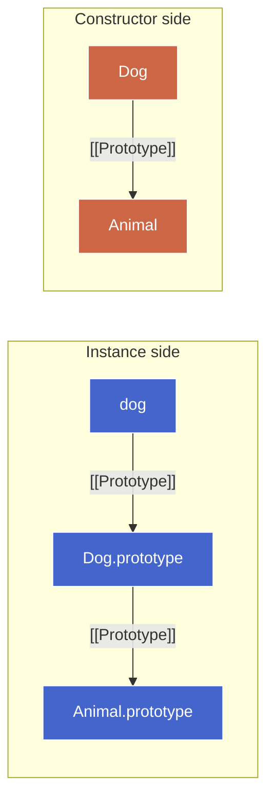

# Building Prototype Chains

> **TL;DR:** Multi-level inheritance has **two orthogonal layers**. The **prototype layer** wires shared methods via `[[Prototype]]` links between `.prototype` objects. The **instance layer** reuses the parent's constructor body via `Parent.call(this, ...)` / `super(...)`. Four mechanisms have existed for the prototype layer over time (`new Parent()` → `Object.create` → `setPrototypeOf` → `class extends`); each fixed the previous era's flaw. `class extends` bundles both layers and adds **static-method inheritance** via a second chain on the constructor side (`Child.[[Prototype]] = Parent`). The layers are independent — breaking one leaves the other intact, which is both the chunk's central insight and a precise debugging tool.

## The two layers

A multi-level chain like `dog → Dog.prototype → Animal.prototype → Object.prototype → null` exists for one reason: methods defined on `Animal.prototype` should be reachable from a `Dog` instance. That's the **prototype layer**.

But there's a second thing inheritance has to do — make sure the parent's per-instance setup (e.g. `this.name = name`) actually runs when a child is constructed. That's the **instance layer**, and the prototype chain alone doesn't handle it. Methods are shared via `[[Prototype]]`; instance state lives on the instance itself, set by the constructor at construction time.

| Layer            | What it does                              | Wiring                                            |
| ---------------- | ----------------------------------------- | ------------------------------------------------- |
| **Prototype**    | Make parent's shared methods reachable    | `[[Prototype]]` link between `.prototype` objects |
| **Instance**     | Run parent's constructor body on the new instance | `Parent.call(this, ...)` or `super(...)`          |

The layers are orthogonal — wiring one says nothing about the other. Real inheritance needs both, but you can break either independently. (See [Two-layer independence](#two-layer-independence) below.)

## Prototype-layer wiring — four mechanisms

The same chain (`Dog.prototype → Animal.prototype`) has had four standard implementations over JS's history. Each later mechanism exists because the earlier one had a specific flaw.

| Era      | Mechanism                                                | Constructor pollution | `.constructor` correct | Static inheritance | Perf      |
| -------- | -------------------------------------------------------- | --------------------- | ---------------------- | ------------------ | --------- |
| Pre-2011 | `Dog.prototype = new Animal()`                           | ✗ (Animal runs)       | ✗ (lies)               | ✗ (manual)         | OK        |
| ES5      | `Dog.prototype = Object.create(Animal.prototype)`        | ✓                     | ✗ (needs re-pin)       | ✗ (manual)         | OK        |
| ES6      | `Object.setPrototypeOf(Dog.prototype, Animal.prototype)` | ✓                     | ✓                      | ✗ (manual)         | ⚠️ (see below) |
| ES6      | `class Dog extends Animal {}`                            | ✓                     | ✓                      | ✓                  | OK        |

### Pre-2011 — the root flaw

```js
function Animal(name) { this.name = name; }
Animal.prototype.eat = function () { return `${this.name} eats`; };

function Dog(name, breed) {
  this.name = name;
  this.breed = breed;
}
Dog.prototype = new Animal();                 // ◀── wiring attempt
Dog.prototype.bark = function () { return `${this.name} barks`; };

const rex = new Dog('Rex', 'labrador');
rex.eat();                // 'Rex eats'    ✓ chain works
rex.constructor.name;     // 'Animal'      ✗ lies
```

This **works functionally** (the chain is correct, `rex.eat()` resolves), but two things are wrong with _how_ we built it.

#### Problem A — Dog.prototype is an Animal instance, not a clean prototype

`new Animal()` does what `new` always does:

1. Creates a fresh object with `[[Prototype]] = Animal.prototype`. ✓ (the part we wanted)
2. **Runs the `Animal` constructor with `this` bound to that object.** ✗ (the part we didn't want)

So `Dog.prototype` ends up with `name: undefined` as an **own** property (from `this.name = name` with `name` being `undefined`). It also paid the cost of running the constructor for nothing.

The conceptual problem is deeper: `Dog.prototype` is supposed to be a _container of shared behavior_ for dogs. Instead, it's _an animal_. If `Animal`'s constructor did real work (allocated buffers, registered event listeners, mutated globals) we'd be running that work once at class-definition time, with garbage arguments, into a prototype object. Wrong layer.

#### Problem B — `.constructor` lies

Every function `F` gets a `.prototype` whose `.constructor` points back to `F`. That's where `instance.constructor` resolves to:

```
instance ─▶ F.prototype { constructor: F, … }
```

When we **overwrite** `Dog.prototype` (rather than mutate it), we throw away the object that had `constructor: Dog`. The chain walk for `.constructor` now skips past `Dog.prototype` (no own constructor — it's an Animal instance with only `name` and `bark`) and lands at `Animal.prototype.constructor`, which is `Animal`.

So `rex.constructor === Animal`. Code that uses `instance.constructor` for introspection (or `instance instanceof rex.constructor`) is now broken. The standard workaround: manually re-pin.

```js
Dog.prototype = new Animal();
Dog.prototype.constructor = Dog;   // patch the lie
```

That's the fragile boilerplate `Object.create` removes.

#### Root cause (unified)

Both problems share one origin: **pre-2011 JS had no API for "just give me an object whose `[[Prototype]]` is X."** `new Constructor()` was the closest tool, but it bundles three things:

1. Allocate a new object linked to `Constructor.prototype`. ◀── all we wanted
2. Run `Constructor` with `this` bound to that object. ◀── caused Problem A
3. Return that new object (forcing **assignment**, overwriting Dog.prototype). ◀── caused Problem B

The ES5 fix isolates step 1.

### ES5 — `Object.create` isolates step 1

`Object.create(proto)` does **exactly one thing**: allocate a fresh empty object whose `[[Prototype]]` is `proto`. No constructor runs. No instance state.

```js
Dog.prototype = Object.create(Animal.prototype);   // ◀── pure link, nothing else
Dog.prototype.constructor = Dog;                   // ◀── re-pin (we still overwrote)
Dog.prototype.bark = function () { return `${this.name} barks`; };

const rex = new Dog('Rex', 'labrador');
rex.eat();                // 'Rex eats'    ✓
rex.constructor.name;     // 'Dog'         ✓ once we re-pin
```

What changed vs pre-2011:

| Issue                          | `new Animal()`                              | `Object.create(Animal.prototype)`            |
| ------------------------------ | ------------------------------------------- | -------------------------------------------- |
| Runs Animal constructor?       | Yes — pollutes Dog.prototype                | **No**                                       |
| `name: undefined` own prop?    | Yes (from `this.name = name`)               | **No** — Dog.prototype starts empty          |
| Dog.prototype's `[[Prototype]]`| `Animal.prototype` (via the `new` step 1)   | `Animal.prototype` (directly, no detour)     |
| Need to re-pin `.constructor`? | Yes (still overwritten)                     | Yes (still overwritten)                      |

**Problem A is fixed.** **Problem B is untouched** — we still overwrite Dog.prototype, so `.constructor` still needs re-pinning manually. The root cause is the same: `Dog.prototype = …` discards the original object. To eliminate Problem B too, we'd need to keep the original `Dog.prototype` and only change _its_ `[[Prototype]]`. That's `setPrototypeOf`.

> **Aside —** `Object.create` is the general "make an object with this prototype" primitive — also the basis of the Prototypal pattern in [Instantiation Patterns](instantiation.md). Here we apply it at a different layer: not to create _instances_, but to create the _prototype object_ that future instances will link to.

### ES6 — `setPrototypeOf` mutates in place

`setPrototypeOf(target, proto)` rewrites `target`'s `[[Prototype]]` slot to point to `proto`. **It does not allocate.** `target` keeps its identity and all its own properties.

```js
Object.setPrototypeOf(Dog.prototype, Animal.prototype);   // keep object, change link
Dog.prototype.bark = function () { return `${this.name} barks`; };

const rex = new Dog('Rex', 'labrador');
rex.eat();                // 'Rex eats'    ✓
rex.constructor.name;     // 'Dog'         ✓ no re-pin needed
```

This is the first approach that solves **both** problems with no patching:

- Problem A — no constructor runs, Dog.prototype stays clean. ✓
- Problem B — Dog.prototype is the _original_ object, so the `constructor: Dog` back-pointer is intact. ✓

The three approaches side-by-side:

| Wiring                                                    | Problem A | Problem B           | Perf risk |
| --------------------------------------------------------- | --------- | ------------------- | --------- |
| `Dog.prototype = new Animal()`                            | ✗ broken  | ✗ broken            | OK        |
| `Dog.prototype = Object.create(Animal.prototype)`         | ✓ fixed   | ✗ needs re-pin      | OK        |
| `Object.setPrototypeOf(Dog.prototype, Animal.prototype)`  | ✓ fixed   | ✓ fixed             | ⚠️ deopt  |

> ⚠️ **Perf caveat.** Engines (V8, SpiderMonkey) optimize property access by tracking each object's hidden class, which includes its `[[Prototype]]`. Mutating `[[Prototype]]` invalidates inline caches for every descendant — instances become "deoptimized" and all subsequent property access falls back to a slow path. The cost is paid every subsequent access, not just at the mutation.
>
> So `setPrototypeOf` is safe **once, at class-definition time, before any instances exist** — that's the chain-building use here. It's catastrophic on a live object whose shape is already cached. MDN's "use sparingly" advice targets the latter; the chain-wiring use is the safer edge. See [Modern Access](modern-access.md) for the full story.

In practice, even safe uses of `setPrototypeOf` are rare because `class extends` does the same wiring with cleaner ergonomics and a clearer signal of intent.

### ES6 — `class extends` bundles both layers + static inheritance

Everything from the previous sections collapses into:

```js
class Animal {
  constructor(name) { this.name = name; }
  eat() { return `${this.name} eats`; }
}

class Dog extends Animal {
  constructor(name, breed) {
    super(name);                    // ◀── instance layer (= Animal.call(this, name))
    this.breed = breed;
  }
  bark() { return `${this.name} barks`; }
}

const rex = new Dog('Rex', 'labrador');
rex.eat();              // 'Rex eats'
rex.constructor.name;   // 'Dog'   ✓ no patching needed
```

#### Two chains, not one

`extends Animal` wires **two** prototype chains — one for instances, one for the constructors themselves:



- **Instance side** (`Dog.prototype.[[Prototype]] = Animal.prototype`) — `dog.eat()` chain-walks from instances to find instance methods.
- **Constructor side** (`Dog.[[Prototype]] = Animal`) — `Dog.fromJSON(...)` chain-walks from constructors to find **static** methods. Static members live on the constructor function object itself, not on `Constructor.prototype`, so they need their own chain.

Concrete static-inheritance demo:

```js
class Animal {
  static fromName(name) { return new this(name); }    // ◀── static method on Animal
  constructor(name) { this.name = name; }
}

class Dog extends Animal {
  constructor(name, breed) { super(name); this.breed = breed; }
}

const a = Animal.fromName('Generic');
const d = Dog.fromName('Rex');     // ◀── inherited via constructor-side chain
a.constructor.name;   // 'Animal'
d.constructor.name;   // 'Dog'  — `this` inside fromName was Dog (left-of-dot), so `new this(...)` made a Dog
```

`Dog.fromName` is not defined on `Dog` directly. The constructor-side chain (`Dog.[[Prototype]] = Animal`) makes `Animal.fromName` reachable. The `this` inside the inherited method is still receiver-determined (left of the dot) — `Dog.fromName(...)` gives `this = Dog`, so `new this(...)` constructs a `Dog`. The same call dispatched via `Animal.fromName(...)` would have constructed an `Animal`.

#### What you don't have to do anymore

The class form bundles every line of pre-class boilerplate:

| Pre-class boilerplate                                          | With `extends`               |
| -------------------------------------------------------------- | ---------------------------- |
| `Dog.prototype = Object.create(Animal.prototype)`              | implicit in `extends`        |
| `Dog.prototype.constructor = Dog`                              | implicit (correct)           |
| `Animal.call(this, name)`                                      | `super(name)`                |
| `Object.setPrototypeOf(Dog, Animal)` (static-method inheritance) | implicit in `extends`        |
| Order-sensitivity / hoisting traps                             | gone — `class` is one unit   |

Pre-class patterns only wired the instance side; static inheritance was a separate manual step. `extends` does both implicitly _and_ correctly auto-pins `.constructor`.

#### Three semantic additions on top of sugar

> ⚠️ Despite the C++/Java-feeling syntax, `class` in JS is **still prototypal**. There's no separate class-based inheritance system underneath — `class Dog extends Animal` just sets up the same prototype chains we built by hand. The mental model is unchanged.

That said, the bundling _is_ the value. And `class` adds three semantic constraints on top of the sugar, all designed to turn silent footguns into loud errors:

1. **Forced `new`.** Calling `Dog(...)` without `new` throws `TypeError`. The pre-class form would silently bind `this` to `undefined` (strict) or `globalThis` (sloppy).
2. **TDZ binding.** Class declarations are not hoisted the way `function` declarations are — they exist in a temporal dead zone until the declaration is evaluated. Touching `Dog` before its declaration is a `ReferenceError`, not a silent `undefined`.
3. **`super`-before-`this` enforcement.** In a derived constructor, `this` is uninitialized until `super(...)` returns. Reading or writing `this` first throws. Full mechanics belong in the **Class deep dive** chunk; here it's enough that the class form makes a class of bugs structurally impossible.

The mental model is unchanged. The chains underneath are the same chains you'd build by hand — just bundled, enforced, and labeled.

## Instance-layer wiring — `.call()` and `super(...)`

The prototype-layer mechanisms above only wire `Dog.prototype` to `Animal.prototype`. They don't run `Animal`'s constructor body when `new Dog(...)` is called. To inherit the parent's per-instance setup, we have to invoke the parent constructor with `this` bound to the new instance.

```js
function Animal(name) {
  this.name = name;
  this.species = 'animal';
}
Animal.prototype.eat = function () { return `${this.name} eats`; };

function Dog(name, breed) {
  Animal.call(this, name);                                         // ◀── parent's body
  this.breed = breed;
}
Object.setPrototypeOf(Dog.prototype, Animal.prototype);            // prototype layer

const rex = new Dog('Rex', 'labrador');
rex.name;       // 'Rex'        (set by Animal.call)
rex.species;    // 'animal'     (set by Animal.call)
rex.breed;      // 'labrador'   (set by Dog)
rex.eat();      // 'Rex eats'   (found via prototype chain)
```

`Function.prototype.call(thisArg, ...args)` invokes the function immediately with `this` set to `thisArg`. Inside a constructor, `this` is the freshly-allocated instance — so `Animal.call(this, name)` runs Animal's body on the new Dog. This pattern has a name in older codebases: **constructor stealing** (or borrowing).

### Step-by-step trace

What happens inside `new Dog('Rex', 'labrador')`:

1. `new` allocates `rex` with `[[Prototype]] = Dog.prototype`.
2. `Dog` runs with `this = rex`.
3. `Animal.call(this, name)` runs Animal's body with `this = rex`, `name = 'Rex'`. So `rex.name = 'Rex'` and `rex.species = 'animal'`.
4. `this.breed = breed` sets `rex.breed = 'labrador'`.
5. `new` returns `rex`.

The chain walk for `rex.eat()` separately finds `eat` on `Animal.prototype` (via the prototype-layer wiring on the second-to-last line) — that's a property access, not part of `new`'s mechanics.

### Two layers, two tools

| Layer            | Tool                                          | Purpose                                  |
| ---------------- | --------------------------------------------- | ---------------------------------------- |
| Prototype        | `Object.create` / `setPrototypeOf` / `extends`| Wire shared methods (chain)              |
| Instance / state | `Parent.call(this, ...args)` / `super(...)`   | Reuse parent's per-instance setup        |

These are **orthogonal** — you need both for full classical-style inheritance. The two pre-2011 quirks even reflect this: `Dog.prototype = new Animal()` accidentally did half of the instance layer (by running Animal's body), but it ran it on the wrong object (Dog.prototype, not the eventual instance) and with wrong arguments (undefined). That's why it was a fake fix.

### `super(name)` in class form

`super(name)` does exactly what `Animal.call(this, name)` does — with an extra invariant: in a derived class constructor, `this` is **uninitialized** until `super(...)` returns. Reading or writing `this` first throws `ReferenceError`. The pre-class form lets you write the lines in any order and silently corrupts state on mistakes; the class form makes the mistake loud.

```js
class Puppy extends Dog {
  constructor(n, b, w) {
    this.weeksOld = w;     // ◀── ReferenceError — `this` not bound yet
    super(n, b);
  }
}
```

The error is unconditional. Even writing a brand-new property like `weeksOld` (which Animal/Dog know nothing about) throws — the engine doesn't analyze whether your write _logically_ depends on super; it just enforces "no `this` before super."

> 🔖 Later: full `super` dispatch semantics (including `super.method()` lookup and static-side super) live in the **Class deep dive** chunk. Here `super(name)` is treated only as the constructor-side counterpart to `Animal.call(this, name)`.

> **Aside —** `Animal.apply(this, [name])` does the same thing with args-as-array. Use `.call` when args are static; `.apply` when you have an arbitrary array — e.g. `Animal.apply(this, arguments)` to forward all of Dog's args without naming them.

## Worked synthesis — a 3-level chain, two ways

A multi-level chain: `puppy → Puppy.prototype → Dog.prototype → Animal.prototype → Object.prototype → null`. Two implementations of the same chain, line-for-line equivalent.

### Class form

```js
class Animal {
  constructor(name) { this.name = name; this.species = 'animal'; }
  eat() { return `${this.name} eats`; }
}

class Dog extends Animal {
  constructor(name, breed) {
    super(name);                  // instance layer: chains to Animal
    this.breed = breed;
  }
  bark() { return `${this.name} barks`; }
}

class Puppy extends Dog {
  constructor(name, breed, weeksOld) {
    super(name, breed);           // chains to Dog → which chains to Animal
    this.weeksOld = weeksOld;
  }
  whimper() { return `${this.name} whimpers`; }
}

const p = new Puppy('Tilly', 'corgi', 5);
p.whimper();   // 'Tilly whimpers' — own prototype
p.bark();      // 'Tilly barks'    — Dog.prototype
p.eat();       // 'Tilly eats'     — Animal.prototype
```

### Constructor form (no `class`)

Two equivalent variants — `setPrototypeOf` (preserves `.constructor` automatically) and `Object.create` (requires manual re-pin).

**Variant A — `setPrototypeOf` form:**

```js
function Animal(name) { this.name = name; this.species = 'animal'; }
Animal.prototype.eat = function () { return `${this.name} eats`; };

function Dog(name, breed) {
  Animal.call(this, name);                                  // instance layer
  this.breed = breed;
}
Object.setPrototypeOf(Dog.prototype, Animal.prototype);     // prototype layer (in-place)
Dog.prototype.bark = function () { return `${this.name} barks`; };

function Puppy(name, breed, weeksOld) {
  Dog.call(this, name, breed);                              // chains through Animal
  this.weeksOld = weeksOld;
}
Object.setPrototypeOf(Puppy.prototype, Dog.prototype);
Puppy.prototype.whimper = function () { return `${this.name} whimpers`; };
```

**Variant B — `Object.create` form (with explicit re-pin):**

```js
function Dog(name, breed) {
  Animal.call(this, name);
  this.breed = breed;
}
Dog.prototype = Object.create(Animal.prototype);            // REPLACES Dog.prototype
Dog.prototype.constructor = Dog;                            // re-pin (lost on overwrite)
Dog.prototype.bark = function () { return `${this.name} barks`; };

function Puppy(name, breed, weeksOld) {
  Dog.call(this, name, breed);
  this.weeksOld = weeksOld;
}
Puppy.prototype = Object.create(Dog.prototype);
Puppy.prototype.constructor = Puppy;                        // re-pin again
Puppy.prototype.whimper = function () { return `${this.name} whimpers`; };
```

The `super → super` cascade in the class form corresponds line-for-line to the `Dog.call(this, name, breed)` → `Animal.call(this, name)` cascade in both variants. Puppy never mentions Animal directly in any form — transitivity through Dog handles it. The only differences between Variant A and Variant B are the prototype-layer mechanism (mutate-in-place vs replace) and the resulting need to manually re-pin `.constructor`.

Identical resulting chain in all three forms:

```mermaid
flowchart LR
    p["p<br/>own: name, species, breed, weeksOld"]
    PP["Puppy.prototype<br/>own: whimper, constructor"]
    DP["Dog.prototype<br/>own: bark, constructor"]
    AP["Animal.prototype<br/>own: eat, constructor"]
    OP["Object.prototype"]
    N(("null"))

    p --[[Prototype]]--> PP
    PP --[[Prototype]]--> DP
    DP --[[Prototype]]--> AP
    AP --[[Prototype]]--> OP
    OP --[[Prototype]]--> N

    style p fill:#46c,stroke:#fff,color:#fff
    style PP fill:#46c,stroke:#fff,color:#fff
    style DP fill:#46c,stroke:#fff,color:#fff
    style AP fill:#46c,stroke:#fff,color:#fff
    style OP fill:#46c,stroke:#fff,color:#fff
    style N fill:#222,stroke:#fff,color:#fff
```



Differences across the forms:

| Concern                          | Class form           | Constructor form (`setPrototypeOf`) | Constructor form (`Object.create`)   |
| -------------------------------- | -------------------- | ----------------------------------- | ------------------------------------ |
| Instance chain wiring            | implicit in `extends`| `Object.setPrototypeOf(...)` each level | `X.prototype = Object.create(...)` each level |
| Constructor (static) chain wiring| implicit in `extends`| **manual** `setPrototypeOf(Dog, Animal)` if you want static inheritance | same — manual |
| `.constructor` correctness       | auto-pinned          | preserved (in-place mutation)       | **manual re-pin needed each level**  |
| Parent constructor body invocation| `super(n, b)`       | `Dog.call(this, n, b)`              | `Dog.call(this, n, b)`               |
| Order-sensitivity                | none                 | none (in-place mutation)            | high — prototype-replacement is destructive |
| `super`-before-`this` enforcement| **yes** (ReferenceError)| no — can silently mis-order      | no — can silently mis-order          |

The chain itself is identical in all three; what differs is how much boilerplate and how many footguns remain visible.

## Two-layer independence

Because the layers are orthogonal, you can break one and the other keeps working. This isn't a corner case — it's the most important debugging insight from the chunk, because the symptom precisely identifies the layer.

```js
function Vehicle(speed) { this.speed = speed; }
Vehicle.prototype.go = function () { return `going at ${this.speed} mph`; };

function Car(speed, model) {
  Vehicle.call(this, speed);     // ◀── instance layer wired
  this.model = model;
}
Car.prototype.honk = function () { return `${this.model} honks`; };
// ◀── prototype layer NOT wired (no Object.setPrototypeOf / Object.create)

const tesla = new Car(60, 'Model 3');
tesla.speed;     // 60                — instance layer works
tesla.honk();    // 'Model 3 honks'   — Car's own prototype works
tesla.go();      // TypeError         — prototype-layer inheritance broken
```

Diagnosis is mechanical: only `go` (the parent's _shared method_) is missing — so the broken thing is the **prototype-layer link between Car.prototype and Vehicle.prototype**. Everything sourced from the instance layer (`.speed` via `.call()`) or from Car's own prototype (`.honk()`) is fine.

The mirror is symmetric: keep `setPrototypeOf` but remove `Vehicle.call(this, speed)`, and `tesla.go()` resolves cleanly — printing `'going at undefined mph'` because `tesla.speed` was never set. Prototype layer working, instance layer broken.

**When something inherited breaks**: ask which layer the missing thing belongs to. Shared methods → prototype layer (chain-link missing). Per-instance state → instance layer (`.call()` / `super()` missing). The diagnosis is local.

## Order-sensitivity (pre-class form)

In the constructor form, the prototype-layer line is destructive:

```js
Dog.prototype = Object.create(Animal.prototype);             // L1 — REPLACES Dog.prototype
Dog.prototype.bark = function () { … };                      // L2 — adds bark
Dog.prototype.constructor = Dog;                             // L3 — re-pins
```

Anything you put on `Dog.prototype` _before_ L1 is thrown away when L1 reassigns the property. L2 and L3 must come after L1.

`setPrototypeOf` form has no such trap — it mutates in place, so any earlier mutations on `Dog.prototype` survive.

Function declarations are hoisted, so `function Dog(...)` itself can appear anywhere relative to the `Dog.prototype = …` lines; the binding exists at the top of the scope. Class declarations are _not_ hoisted that way (TDZ-bound), so `class` form is one self-contained unit with no order-sensitivity concerns.

## Naming the duplication problem

The course outline groups all of this under "the duplication problem." There are actually **two** duplication problems, each solved by one of the two layers:

| Duplication                                                  | Fixed by                                            |
| ------------------------------------------------------------ | --------------------------------------------------- |
| Copying parent's **shared methods** onto every subclass       | Prototype-layer link (`Object.create` / `extends`)  |
| Copying parent's **constructor body** onto every subclass     | Instance-layer reuse (`.call()` / `super(...)`)     |

Without the prototype-layer link, you'd redefine `eat` on every subclass. Without `.call()` / `super`, you'd re-type the parent constructor's body in every subclass constructor. **Both** layers exist precisely to avoid copy-paste — which is why full inheritance requires both.
