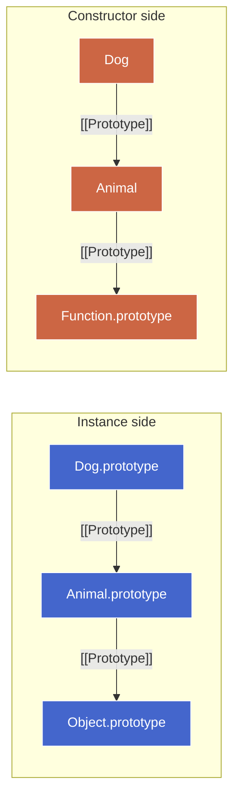

# 1. Class Deep Dive — Draft

## 1.1. Plan (teaching order)

- [x] 1. **Unified dispatch rule** — `this` from receiver (recap + forward link); `super.method()` as lookup-redirect with `this` preserved. Worked synthesis: A/B/C cascade.
- [x] 2. **Polymorphism payoff** — inherited body's `this.method()` resolves to most-derived override because `this` never rebinds.
- [x] 3. **`super(...)` in derived constructors** — allocation delegation axiom (base vs derived), uninitialized-`this` mechanism, two failure modes as consequences, contrast with `.call()` form.
- [x] 4. **Static dispatch + constructor-side chain** — `this` inside static = class on left of dot; `super.staticMethod()` on constructor chain.
- [ ] 5. **Class fields vs prototype methods (inheritance lens)** — brief recap; inheritance implications.
- [ ] 6. **Private fields (`#field`)** — class-only syntax, spec-enforced encapsulation.
- [ ] 7. **Where "just sugar" leaks** — no-`new` TypeError, TDZ on class binding, `new.target`.
- [ ] 8. **Extending built-ins** — `extends Array/Error/Map`, `Symbol.species`.

---

## 1.2. Unified dispatch rule

### 1.2.1. Teaser

```js
class A {
  hi()    { return 'A.hi'; }
  greet() { return this.hi() + '!'; }
}
class B extends A {
  hi()    { return 'B.hi'; }
}
class C extends B {
  greet() { return 'C says ' + super.greet(); }
}

new C().greet();   // ?
```

**Predict:** what string comes back, and — more importantly — for each method call inside the evaluation, **which class's body runs** and **what is `this`**?

Try to be precise about both: `c.greet()` → ? body, `this` = ?; `super.greet()` → ? body, `this` = ?; `this.hi()` inside that → ? body, `this` = ?

### 1.2.2. The axiom

A method call resolves **two independent questions**:

1. **Which function body runs?** — determined by a prototype-chain walk.
2. **What is `this` inside that body?** — always the receiver (the object left of the dot at the original call site).

#### 1.2.2.1. Question 1: which function body runs?

`expr.method()` (normal) and `super.method()` both resolve the function the same way — walk a `[[Prototype]]` chain until the property is found. The only difference is where the walk starts:

| Call form | Walk starts at | Determined when |
|---|---|---|
| `expr.method()` | `expr` itself (the receiver) | call time (dynamic) |
| `super.method()` | `Object.getPrototypeOf(HomeObject)` — one level above where the calling method is *defined* | definition time (static) |

**Normal dispatch** is receiver-based — already derived in [`prototype-deep-dive.md`](prototype-deep-dive.md#custom-prototypes-and-this-binding); not re-derived here.

**Super dispatch** shifts the starting point. `super` is not an object you can store or pass — it's a **lookup instruction** meaning "skip my level." Concretely: start the walk at `Object.getPrototypeOf(HomeObject)`, where `HomeObject` is the object the calling method was *defined on* (the prototype object it was installed into). This start point is baked in at definition time — it never changes regardless of how the method is later called.

```
super.X  ≈  Object.getPrototypeOf(HomeObject)[X]
                        ▲
                 "one above where I'm written"
                 fixed at definition time
```

**Concrete example — what is `HomeObject` for a given method?**

```js
class Animal {
  speak() { return `[Animal] ${this.name}`; }
}

class Dog extends Animal {
  speak() {
    // HomeObject for this method = Dog.prototype
    // (because `speak` was defined/installed on Dog.prototype)
    //
    // super.speak() means:
    //   Object.getPrototypeOf(Dog.prototype).speak.call(this)
    //   = Animal.prototype.speak.call(this)
    return super.speak() + ' woof';
  }
}

const d = new Dog();
d.name = 'Rex';
d.speak(); // "[Animal] Rex woof"
```

`HomeObject` is the object the method was **installed into** — not the instance, not the class constructor. In a `class` body, methods get installed on `ClassName.prototype`, so `Dog`'s `speak` has `HomeObject = Dog.prototype`. The `super.speak()` lookup starts one level above that: `Object.getPrototypeOf(Dog.prototype)` = `Animal.prototype`.

This is a **static, definition-time binding** stored in the method's internal `[[HomeObject]]` slot the moment the class is evaluated. Reassigning, borrowing, or `.call()`-ing the method with a different receiver doesn't change where `super` resolves:

```js
const borrowed = Dog.prototype.speak;
const cat = { name: 'Whiskers' };
borrowed.call(cat);
// super.speak() still resolves against Animal.prototype
// (HomeObject is still Dog.prototype, regardless of receiver)
// → "[Animal] Whiskers woof"
```

For **static methods**, the same rule applies — but static methods live on the constructor itself, so `HomeObject` is the constructor function:

| Method kind | Installed on | `HomeObject` | `super` resolves against |
|---|---|---|---|
| Instance method | `Child.prototype` | `Child.prototype` | `Parent.prototype` |
| Static method | `Child` (constructor) | `Child` | `Parent` (constructor) |

#### 1.2.2.2. Question 2: what is `this`?

Always the receiver. `super` does not rebind `this` — the parent method runs with the same `this` the caller had. This is what makes inheritance useful: a parent method can reference `this.prop` and get the child instance's data.

```js
d.speak()          // this = d
  → super.speak() // this = still d (Animal.prototype.speak sees d)
```

#### 1.2.2.3. The full desugaring

Putting Q1 and Q2 together into one pseudo-expression:

```
super.X(args)  ≈  Object.getPrototypeOf(HomeObject)[X].call(this, ...args)
                              ▲                                 ▲
                       Q1: where to find the             Q2: receiver,
                       function body (static)            unchanged (dynamic)
```

Two inputs, two different lifetimes: the lookup target is frozen at definition time; `this` flows in at call time. This separation is the entire mechanism — everything else (polymorphism, constructor chaining, the proof below) falls out of it.

#### 1.2.2.4. `[[HomeObject]]` — what anchors `super`

`[[HomeObject]]` is an internal slot on the **function object itself**, set once when the method is defined with **method syntax** inside a class body or object literal. It records *which object this method was installed into* — that's the reference point `super` uses to compute "one level above me."

Key properties:

- **Set once, never changes.** Moving the function to another object doesn't update `[[HomeObject]]`.
- **Only method syntax gets it.** `{ greet() {} }` → has `[[HomeObject]]`. `{ greet: function() {} }` → does not. Arrow functions → do not. This is why `super` is only legal inside method-syntax definitions.
- **Travels with the function.** Detaching a method (`const f = c.greet`) breaks `this` (no receiver at call site) but `super` inside `f` still resolves from the original `[[HomeObject]]`.

The two failure modes are independent because they're sourced from different times:

| Concern | Determined at | Breaks when |
|---|---|---|
| `this` | call time | no receiver (detached call, bare invocation) |
| `super`'s start point | definition time | never breaks once set (but absent if not method syntax) |

##### 1.2.2.4.1. Demo — detach breaks `this`, not `super`

```js
class A {
  id() { return 'A'; }
}
class B extends A {
  id() { return 'B(super=' + super.id() + ')'; }  // [[HomeObject]] = B.prototype
}

const b = new B();
b.id();              // "B(super=A)" — this=b, super starts at A.prototype ✓

const detached = b.id;
detached();          // TypeError or "B(super=A)" with undefined `this`
                     // super.id() still resolves A.id — HomeObject unchanged
                     // but `this` is undefined (strict mode) — no receiver
```

`super` didn't break — it still found `A.id`. What broke is `this`: no object left of the dot means no receiver. Two independent failure axes.

### 1.2.3. Why it *must* be HomeObject-based (not receiver-based)

Proof by contradiction. Suppose `super.X` started its lookup from the parent of **`this`'s class** (receiver-based):

```js
class A { greet() { return 'A→' + (super.greet?.() ?? 'end'); } }  // L1
class B extends A {}                                                // L2 — no greet
class C extends B {}                                                // L3 — no greet
new C().greet();                                                    // A.greet runs, this = c
```

Inside `A.greet`, `this` is `c` (class `C`, parent `B`). Receiver-based reading: look up `greet` from `B.prototype` → not found → `A.prototype` → **finds `A.greet` again** → calls it → `super.greet` again → `B.prototype` → `A.prototype` → `A.greet` → **infinite recursion**.

Calling `super` from an inherited method is legal, everyday code. A rule that makes it infinitely recurse cannot be the rule. Therefore `super`'s start point must be **static** (`HomeObject.[[Prototype]]`), not receiver-derived. Under the real rule: `A.greet`'s `[[HomeObject]]` = `A.prototype`, so `super.greet` starts at `A.prototype.[[Prototype]]` = `Object.prototype` → no `greet` → terminates. No loop. The static rule is the *only* coherent choice.

### 1.2.4. Worked synthesis — the A/B/C cascade

```js
class A {
  hi()    { return 'A.hi'; }
  greet() { return this.hi() + '!'; }       // [[HomeObject]] = A.prototype
}
class B extends A {
  hi()    { return 'B.hi'; }                // [[HomeObject]] = B.prototype
}
class C extends B {
  greet() { return 'C says ' + super.greet(); }  // [[HomeObject]] = C.prototype
}

const c = new C();
c.greet();   // 'C says B.hi!'
```

Trace — `this = c` at *every* level; only the executing body changes:

| Step | Call | Resolves how | Body run | `this` |
|---|---|---|---|---|
| 1 | `c.greet()` | dynamic walk from `c`: `C.prototype` has `greet` | `C.greet` | `c` |
| 2 | `super.greet()` in `C.greet` | static: from `C.prototype.[[Prototype]]` = `B.prototype` (no `greet`) → `A.prototype` (found) | `A.greet` | `c` (preserved) |
| 3 | `this.hi()` in `A.greet` | dynamic walk from `c`: `C.prototype` (no `hi`) → `B.prototype` (found) | `B.hi` | `c` |

Result: `'C says ' + ('B.hi' + '!')` = `'C says B.hi!'`. The body migrated `C.greet → A.greet → B.hi`; `this` never rebound off `c`. Step 2 is static-start/dynamic-`this`; steps 1 and 3 are fully dynamic from the receiver.

## 1.3. Polymorphism payoff

Polymorphism is not a separate feature. It is **Q1 ∘ Q2** — the composition of the two coordinates — applied to a `this.method()` call inside an inherited method.

```js
class Animal {
  speak() { return `${this.sound()} (from Animal.speak)`; }  // defined only on Animal
  sound() { return 'generic noise'; }
}
class Dog extends Animal {
  sound() { return 'woof'; }                                  // override
}

new Dog().speak();   // 'woof (from Animal.speak)'
```

`speak` exists only on `Animal.prototype`. Trace `new Dog().speak()`:

1. `d.speak()` — dynamic walk from `d`: `Dog.prototype` (no `speak`) → `Animal.prototype` (found). Body = `Animal.speak`, **`this = d`**.
2. Inside `Animal.speak`, `this.sound()` — this is an *ordinary receiver-based call*. Q2 kept `this = d`, so Q1 now runs a **fresh dynamic walk from `d`**: `Dog.prototype.sound` (found, step 0) before `Animal.prototype.sound`. Body = `Dog.sound`.

Result: `'woof (from Animal.speak)'`. The parent method called *down into* the child override without naming — or even knowing about — the child. That downward reach is the entire payoff:

> A method written in the parent, calling `this.x()`, automatically dispatches to whatever override the actual receiver provides — because `this` is preserved (Q2) and `this.x()` re-dispatches dynamically from it (Q1).

This is what makes inheritance *useful* rather than merely *structural*. Without `this`-preservation, a parent method's `this.sound()` would resolve against the parent and every subclass would have to re-implement `speak` just to call its own `sound`. Polymorphism falls out of the axiom for free — no extra mechanism.

> **Aside —** the "template method pattern" (a fixed parent algorithm with overridable steps) is just this, named. `Animal.speak` is the template; `sound` is the overridable hole.

The flip side — if `sound` were a **class field** (`sound = () => 'woof'`) rather than a method, polymorphism still works but via a *different* path: the field is an own property on `d`, found at walk step 0 directly, never reaching any prototype. Same observable result, different mechanism. That asymmetry is sub-part 5.

## 1.4. `super(...)` in derived constructors

### 1.4.1. Teaser

```js
class Base {
  constructor() { console.log('Base, this =', this); }
}

class Mid extends Base {
  constructor() {
    console.log('Mid, this =', this);  // L1
    super();                            // L2
  }
}

new Mid();
```

**Predict:** What does L1 print? What does L2 do?

### 1.4.2. The allocation delegation axiom

With `new` on a **base** class, the engine does what you already know:

1. Allocate a fresh object (linked to `Base.prototype`)
2. Bind `this` to it
3. Run the constructor body
4. Return `this`

With a **derived** class (`extends` something), step 1 changes fundamentally: **the derived constructor does not allocate.** It *delegates* allocation upward to the base.

The structural reason: the base class might be **exotic** (`Array`, `Error`, `Map`, `Promise`, `RegExp`). These aren't plain objects — they have internal slots (`[[ArrayBufferData]]`, magic `length` behavior, `[[MapData]]`, stack capture) that can only be set up at allocation time. A plain `Object.create(Derived.prototype)` wouldn't have those internals. Only the base's own allocation logic knows what *kind* of object to produce.

If the engine allocated a plain object in the derived constructor and then ran the base constructor on it, the base couldn't retroactively make it exotic — the object's "kind" is fixed at allocation time. So allocation **must** happen inside the base.

For plain user classes (`class A {}`) this distinction is invisible — a plain object is fine either way. But the language can't have two different `new` semantics depending on whether your ancestor chain eventually hits an exotic. One uniform rule: **derived doesn't allocate, base does.**

### 1.4.3. The uninitialized-`this` mechanism

When you call `new Mid()`:

1. Engine enters `Mid`'s constructor body — but **does not allocate an object yet**. The `this` binding exists in the environment record but is marked **uninitialized** (same TDZ mechanism as a `let` before its declaration).
2. `super()` calls `Base`'s constructor, which *does* allocate (because `Base` is not derived). That fresh object comes back.
3. Only *now* does the engine initialize `this` in `Mid`'s environment to that returned object.
4. After `super()` returns, `this` is live — you can read/write it freely.

The `ReferenceError` at L1 isn't a style rule — it's the same TDZ mechanism as accessing a `let` before its declaration. The binding literally has no value yet because **the object doesn't exist yet**.

### 1.4.4. Two failure modes (consequences of the axiom)

Both are the same underlying cause (uninitialized `this`) surfacing in different ways:

| Failure | Trigger | Why |
|---|---|---|
| `this` before `super()` | Any read/write of `this` before `super(...)` completes | Object hasn't been allocated yet — nothing to bind |
| Missing `super()` entirely | Derived constructor returns without calling `super()` | Object never gets allocated, `new` can't return `this` → `ReferenceError` on implicit return |

```js
class Broken extends Base {
  constructor() {
    // no super() call at all
    this.x = 1;  // ReferenceError — this is uninitialized
  }
}
// Even avoiding `this` doesn't help:
class AlsoBroken extends Base {
  constructor() {
    return;  // implicit return of `this` — but this is uninitialized → ReferenceError
  }
}
```

The rule is **unconditional** — the engine doesn't analyze whether your `this` usage logically depends on parent setup. Any access before `super()` throws, period.

### 1.4.5. Contrast with `.call()` form

In the pre-class pattern, `this` is always initialized — `new` allocates immediately and hands it to the constructor:

```js
function Mid() {
  console.log(this);         // ✓ — object already exists (allocated by `new Mid()`)
  Base.call(this);           // just runs Base's body on an already-existing object
}
```

No TDZ, no enforcement. You *can* use `this` before `.call()` — the engine won't stop you. But if `Base` sets properties you depend on, you'll read `undefined`. Silent corruption instead of a loud error. The class form turns that silent bug into a structural impossibility.

| Concern | `.call()` form | `class` form |
|---|---|---|
| Allocation | `new` allocates immediately in derived | Delegated to base via `super()` |
| `this` before parent runs | Allowed (silent bugs) | `ReferenceError` (loud) |
| Exotic base support | Impossible (plain object already allocated) | Works (base allocates the right kind) |

### 1.4.6. The escape hatch — explicit return

One way to bypass the axiom: return an explicit object from the derived constructor.

```js
class Weird extends Base {
  constructor() {
    return { custom: true };  // ✓ — no super() needed, no ReferenceError
  }
}
new Weird();  // { custom: true } — not linked to Weird.prototype!
```

If you return a non-primitive, `new` uses *that* instead of `this`. Since `this` is never accessed, the TDZ never triggers. But the returned object isn't wired to the prototype chain — `new Weird() instanceof Weird` is `false`. This is a deliberate escape hatch for factory patterns, not normal inheritance usage.

## 1.5. Static dispatch + constructor-side chain

### 1.5.1. Teaser

```js
class Animal {
  static create(name) { return new this(name); }
  static describe() { return `I am ${this.name}`; }
}

class Dog extends Animal {
  static describe() { return super.describe() + ' (dog edition)'; }
}

Dog.create('Rex');      // L1
Dog.describe();         // L2
Animal.describe();      // L3
```

**Predict:** For each line — what is `this`, where does the method body come from, and what's the result?

### 1.5.2. The constructor-side chain

`class Dog extends Animal` wires **two** chains simultaneously:

- **Instance side:** `Dog.prototype.[[Prototype]] = Animal.prototype`
- **Constructor side:** `Dog.[[Prototype]] = Animal`

The constructor-side chain makes static methods inheritable. Static members live on the constructor function object itself (not on `.prototype`), so they need their own chain to be reachable from subclasses.



### 1.5.3. Same unified dispatch rule, different objects

The dispatch axiom (Q1: where's the body? Q2: what's `this`?) applies identically on both sides. The only difference is *which objects* form the chain:

| Side | Chain links | `this` is | `super` starts from |
|---|---|---|---|
| Instance | `instance → Child.prototype → Parent.prototype → …` | the instance | `getPrototypeOf(HomeObject)` where HomeObject is a `.prototype` object |
| Constructor (static) | `Child → Parent → Function.prototype → …` | the constructor left of the dot | `getPrototypeOf(HomeObject)` where HomeObject is a constructor function |

There's no separate "static inheritance" mechanism — it's the same chain walk on a different set of objects.

### 1.5.4. Trace of the teaser

**L1 — `Dog.create('Rex')`:**
- `create` not own on `Dog` → chain-walk to `Dog.[[Prototype]]` = `Animal` → found `Animal.create`
- `this = Dog` (left of dot)
- Inside: `new this(name)` → `new Dog('Rex')` → constructs a `Dog` instance
- Polymorphic factory: parent's method builds the right subclass without naming it

**L2 — `Dog.describe()`:**
- `describe` own on `Dog` → body = `Dog.describe`, `this = Dog`
- `super.describe()`: `Dog.describe`'s `[[HomeObject]]` = `Dog`, so start at `getPrototypeOf(Dog)` = `Animal` → found `Animal.describe`
- Runs `Animal.describe` with `this = Dog` (preserved) → `this.name` = `"Dog"`
- Result: `"I am Dog (dog edition)"`

**L3 — `Animal.describe()`:**
- `describe` own on `Animal` → body = `Animal.describe`, `this = Animal`
- `this.name` = `"Animal"`
- Result: `"I am Animal"`

### 1.5.5. Pre-class form — the missing chain

In the constructor-function form, `Dog.[[Prototype]]` defaults to `Function.prototype` — **not** `Animal`:

```js
function Animal(name) { this.name = name; }
Animal.create = function(name) { return new this(name); };

function Dog(name, breed) {
  Animal.call(this, name);
  this.breed = breed;
}
Object.setPrototypeOf(Dog.prototype, Animal.prototype);  // instance side only

Object.getPrototypeOf(Dog) === Function.prototype;  // true — not Animal!
Dog.create('Rex');  // TypeError: Dog.create is not a function
```

`setPrototypeOf(Dog.prototype, Animal.prototype)` only wires the instance side. The constructor-side chain requires a **separate** manual step:

```js
Object.setPrototypeOf(Dog, Animal);  // ← extra line for static inheritance
Dog.create('Rex');                    // now works
```

| Form | Instance chain | Constructor chain |
|---|---|---|
| `class Dog extends Animal` | ✓ automatic | ✓ automatic |
| `function` + `setPrototypeOf(Dog.prototype, ...)` | ✓ manual | ✗ missing (need separate `setPrototypeOf(Dog, Animal)`) |

This is why static inheritance was rare in the pre-class era — it required an extra step most people forgot. `class extends` made it invisible and correct by default.
