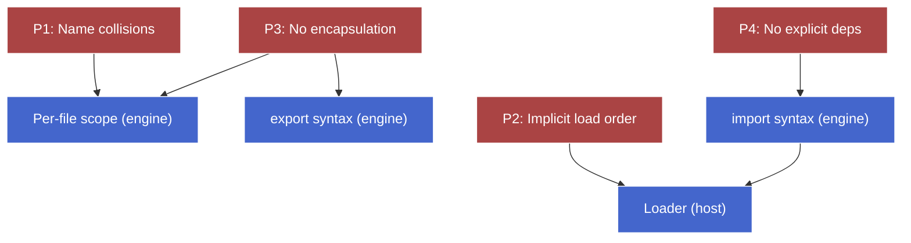

# Why modules exist — draft

Teaching draft for the chunk. Lives alongside chat; final note is reorganized after the chunk gate.

## Plan (teaching order)

- [x] **Motivation** — implementation challenge: build a multi-file dashboard with no `import`/`export`, no bundler, just `<script>` tags. Feel the pain.
- [x] **The pre-module landscape** — *folded into the motivation reveal:* the single-shared-global mechanism + four pain points (name collisions, implicit load order, no encapsulation, no explicit dependency declaration), with the table showing they're independent.
- [x] **IIFE namespace pattern** — the pre-ES2015 workaround. What it fixes (encapsulation, single global per module). What it can't fix (still need `<script>` ordering, deps still implicit, still leaks one global per file).
- [x] **What a module system needs to provide** — the requirements list extracted from the pain points, framed as four things ES modules deliver on. Bridge to the next chunk (ES module syntax).

---

## Motivation — implementation challenge

> You're building a small dashboard. Three logical pieces:
>
> - `formatter.js` — exposes two helpers: `formatCurrency(n)` and `formatDate(d)`.
> - `chart.js` — exposes one helper: `renderChart(data, container)`. Internally it calls `formatCurrency` to format axis labels.
> - `app.js` — entry point. Calls `renderChart(...)` to draw a chart into a `<div>`.
>
> **Constraint:** pretend it's 2010. No `import`/`export`. No `require`. No bundler. Just `index.html` with plain `<script>` tags.
>
> Sketch:
>
> 1. The `<script>` tags in `index.html`.
> 2. How `formatter.js` makes its two functions reachable from `chart.js`.
> 3. How `chart.js` makes `renderChart` reachable from `app.js`, and how it gets at `formatCurrency`.
> 4. How `app.js` calls `renderChart`.
>
> Skip the actual implementations — just the *shape* of how each file exposes its API and how the others reach it. Aim for something a dev in 2010 would actually have shipped.

Once you've sketched it, we'll walk through what's painful about it, and that pain becomes the motivation for the rest of the chunk.


### Your sketch (concrete form)

```html
<!-- index.html -->
<script src="formatter.js"></script>  <!-- L1 -->
<script src="chart.js"></script>      <!-- L2 -->
<script src="app.js"></script>        <!-- L3 -->
```

```js
// formatter.js
function formatCurrency(n) { /* ... */ }   // L1
function formatDate(d)     { /* ... */ }   // L2
```

```js
// chart.js
function renderChart(data, container) {    // L1
  const label = formatCurrency(data[0]);   // L2 — reaches into formatter.js's stuff
  // ...                                   // L3
}                                          // L4
```

```js
// app.js
renderChart(myData, document.querySelector("#chart"));  // L1
```

This is exactly what a 2010 dev would have shipped — and it works. The mechanism that makes it work is also the source of every problem.

### The reveal — one mechanism, four problems

**The mechanism.** Plain `<script>` tags execute their files top-to-bottom into **one shared global scope** (`window` in the browser). A `function foo() {}` at top level in `formatter.js` becomes `window.foo`. When `chart.js` later writes `formatCurrency(...)`, the lookup walks the scope chain, finds nothing local, and lands on `window.formatCurrency` — the same global the previous script wrote.

> **Aside —** this is the "single shared global" model from `js-vars-scope`. Every top-level `function`/`var` declaration in any script becomes a property of the same global object. Nothing in the language treats files as separate units.

That single mechanism (one shared global) creates four distinct problems. Each one is genuinely independent — solving any one of them doesn't solve the others.

#### Problem 1 — Name collisions

Two files declaring the same name silently overwrite each other.

```js
// formatter.js
function format(n) { return `$${n}`; }     // L1

// chart.js
function format(d) { return d.toFixed(2); } // L1 — same global slot, formatter's version is gone
```

No error. No warning. The second file wins because the second `<script>` runs later. As soon as you pull in a third-party library, this gets unmanageable — every helper they expose is yours to step on, and vice versa.

#### Problem 2 — Implicit load order

The HTML tag order *is* the dependency declaration. `chart.js` works only because `formatter.js` ran first and parked `formatCurrency` on `window`. Reorder the tags:

```html
<script src="chart.js"></script>      <!-- L1 -->
<script src="formatter.js"></script>  <!-- L2 -->
<script src="app.js"></script>        <!-- L3 -->
```

`chart.js` parses fine — function declarations don't call anything yet. But the moment `app.js` calls `renderChart(...)`, the body of `renderChart` executes, hits `formatCurrency(...)`, and... actually it still works here, because by L3 `formatter.js` has already run. Try the *real* failure case:

```html
<script src="chart.js"></script>      <!-- L1 -->
<script>renderChart(myData, ...);</script>  <!-- L2 — runs before formatter.js -->
<script src="formatter.js"></script>  <!-- L3 -->
```

Now L2 calls `renderChart` → which calls `formatCurrency` → which is `undefined` → `TypeError: formatCurrency is not a function`. The dependency `chart.js → formatter.js` exists in the code but is invisible to the loader. The HTML author has to know it.

> ⚠️ Subtler failure: a top-level statement in `chart.js` (not inside a function) that *uses* `formatCurrency` at load time would break the moment `chart.js` is placed before `formatter.js` — no waiting for `app.js` to call it. Function declarations are forgiving because they defer the lookup until call time; top-level statements aren't.

#### Problem 3 — No encapsulation

Every top-level name in every file is public. `chart.js` might want a private helper `_pickAxisScale(data)` — there's no way to mark it as internal. Drop it at top level and the whole world (including future files written by your teammate) can see it and call it.

```js
// chart.js
function _pickAxisScale(data) { /* internal! */ } // L1 — actually window._pickAxisScale, fully public
function renderChart(data, container) {            // L2
  const scale = _pickAxisScale(data);             // L3
  // ...                                          // L4
}                                                  // L5
```

The `_` prefix is a *convention*, not a barrier. Anyone can call `_pickAxisScale` from anywhere; refactoring it is now a breaking change.

#### Problem 4 — No explicit dependency declaration

Reading `chart.js` in isolation, what does it depend on? You can't tell. `formatCurrency` is a free reference — it could come from `formatter.js`, from a third-party script, from a global polyfill, from an inline `<script>` block in the HTML. The only way to find out is to grep the entire codebase for the name, or run it and see what breaks.

This is the worst one for large codebases: dependencies are *invisible*, so refactoring is dangerous (you can't know what depends on what), code review can't catch mismatches, and tooling can't help (a static analyzer reading `chart.js` alone has no idea `formatCurrency` is supposed to come from `formatter.js`).

### The four problems are independent

| Problem                        | Symptom                                       | What "fixing" it alone would require                          |
| ------------------------------ | --------------------------------------------- | ------------------------------------------------------------- |
| Name collisions                | Silent overwrite, last-script-wins            | Per-file scope (file is not part of global)                   |
| Implicit load order            | TypeErrors when scripts ordered wrong         | A way for code to *declare* what it needs, loader resolves it |
| No encapsulation               | Internal helpers leak as public globals       | Per-file scope + an opt-in "this is the public API" mechanism |
| No explicit dependency declaration | Free references everywhere, no static signal | Syntax that names which file each external comes from         |

Notice the overlap: per-file scope alone fixes 1 and partially fixes 3. Explicit `import` syntax fixes 4 and gives the loader enough info to fix 2. So a real solution needs **two things together** — per-file scope *and* declarative import/export. Either alone is half a fix.

This is the design target ES modules hit. The next sub-part looks at the partial workaround the community shipped *before* ES modules existed (the IIFE namespace pattern), to see how close you can get with just functions and conventions — and where the wall is.


---

## IIFE namespace pattern

The community didn't wait for ES2015 to ship a partial fix. The tools they had were just functions and the language's lexical scoping rules — and that turns out to be enough to close problems 1 (name collisions) and 3 (no encapsulation), without any new syntax.

### The pattern

The trick is to wrap the whole file in a function and *immediately* call it. The function body becomes a private scope; only what the function explicitly returns escapes.

```js
// formatter.js
var Formatter = (function () {              // L1 — A: open IIFE, assign result to one global
  var locale = "en-US";                     // L2 — private to the IIFE
  function pad(n) { return String(n).padStart(2, "0"); }  // L3 — private helper

  function formatCurrency(n) {              // L4
    return new Intl.NumberFormat(locale, { style: "currency", currency: "USD" }).format(n);  // L5
  }                                          // L6
  function formatDate(d) {                   // L7
    return `${d.getFullYear()}-${pad(d.getMonth() + 1)}-${pad(d.getDate())}`;  // L8
  }                                          // L9

  return {                                   // L10 — B: explicit public API
    formatCurrency: formatCurrency,          // L11
    formatDate: formatDate,                  // L12
  };                                         // L13
})();                                        // L14 — A': close + invoke
```

`A` and `A'` together are the IIFE — *Immediately-Invoked Function Expression*. The parens around `function () { ... }` make it an expression (not a declaration), and the trailing `()` calls it on the spot. The return value at `B` is what gets assigned to `Formatter`.

> **Aside —** the outer `var` is sometimes written as `window.Formatter = (function() { ... })()` to make the global assignment explicit. Same effect; just signals intent.

`chart.js` follows the same shape and consumes `Formatter` through its namespace:

```js
// chart.js
var Chart = (function () {                              // L1
  function pickAxisScale(data) { /* private */ }        // L2 — actually private now
  function renderChart(data, container) {               // L3
    const label = Formatter.formatCurrency(data[0]);    // L4 — explicit reach into formatter
    // ...                                              // L5
  }                                                     // L6
  return { renderChart: renderChart };                  // L7
})();                                                   // L8
```

### What it fixes

**Problem 1 — name collisions** ✅ Fixed *within* the file. `pad` in `formatter.js` and `pad` in `chart.js` are now in separate function scopes — they can't see each other. The IIFE body is just a function, so the same lexical-scoping rules from `js-vars-scope` apply: each call creates a fresh Function ER, locals stay there.

**Problem 3 — no encapsulation** ✅ Fixed. `locale`, `pad`, `pickAxisScale` never touch the global. They live in the IIFE's Function ER, which closes over `formatCurrency`/`formatDate`/`renderChart` (those are the closures that survive after the IIFE returns). The returned object's properties are the *public API*; everything else is unreachable from outside.

> **Aside —** this is a closure pattern. The returned object holds references to functions whose `[[Environment]]` slot points at the IIFE's Function ER. After the IIFE returns, that ER stays alive specifically because those returned functions still need it (for `locale`, `pad`, etc.). Same mechanism as the counter-factory examples from `js-vars-scope`.

**Bonus — the namespace object** ✅ Mitigates problem 1 *across* files too. Instead of one global per function (`formatCurrency`, `formatDate`, `renderChart`, ...), there's now one global per file (`Formatter`, `Chart`, ...). Collision risk drops by a factor of however many functions the file exports. Common practice was to nest deeper — `MyCompany.UI.Chart` — to push collision risk near zero, especially against third-party libs.

### What it doesn't fix

**Problem 2 — implicit load order** ❌ Untouched. `chart.js` still references `Formatter` as a free name. Load `chart.js` first and `Formatter` is `undefined` — `Formatter.formatCurrency` throws at the moment `renderChart` actually runs. The `<script>` order in `index.html` is still the de facto dependency declaration.

**Problem 4 — no explicit dependency declaration** ❌ Untouched. The signal that `chart.js` depends on `Formatter` is the bare reference `Formatter.formatCurrency` deep inside a function body. A static analyzer reading `chart.js` alone still can't tell where `Formatter` is supposed to come from. Conventionally, devs would write a comment block at the top of the file (`// requires: formatter.js`), but that's a *convention* — not language- or tooling-enforced.

**Problem 1 — name collisions** ⚠️ Mitigated, not fixed. Two files both writing `var Formatter = (function() { ... })()` still collide on `window.Formatter`. The collision surface shrinks (one global per file instead of N), but it doesn't disappear. The deeper-nesting trick (`MyCompany.UI.Chart`) pushes the probability down but doesn't change the mechanism — there's still one shared global object underneath.

### The dependency-injection variant

A common refinement passed dependencies *into* the IIFE explicitly:

```js
// chart.js
var Chart = (function (Formatter) {                       // L1 — Formatter is now a parameter
  function renderChart(data, container) {                 // L2
    const label = Formatter.formatCurrency(data[0]);      // L3 — uses the parameter, not a free name
  }                                                        // L4
  return { renderChart: renderChart };                     // L5
})(window.Formatter);                                      // L6 — explicit injection at the call site
```

This makes the dependency *visible at the call site* (L6) and keeps the function body free of globals. It's closer to a real `import` declaration than the bare-reference version — the dependency is named and provided explicitly. But it still doesn't solve problem 2: `window.Formatter` has to already exist when `chart.js` runs, which means the `<script>` tags still need to be ordered.

### Status

| Problem                            | Plain `<script>` | IIFE pattern             | IIFE + injection         |
| ---------------------------------- | ---------------- | ------------------------ | ------------------------ |
| 1. Name collisions                 | ❌                | ⚠️ mitigated (one per file) | ⚠️ mitigated              |
| 2. Implicit load order             | ❌                | ❌                        | ❌                        |
| 3. No encapsulation                | ❌                | ✅                        | ✅                        |
| 4. No explicit dep declaration     | ❌                | ❌                        | ⚠️ partial (visible at top of file, not parsable) |

The IIFE pattern is what every pre-2015 JS codebase looked like — jQuery plugins, Backbone, early Bootstrap JS, all of it. It's a remarkable amount of mileage out of just functions and parens. But the wall is clear: **encapsulation can be solved at the language level (functions are enough); load order and explicit dependencies cannot.** Those need a *loader* — something outside the language proper that knows how to fetch files, link them by name, and run them in dependency order.

That's the bridge to the next sub-part: what a real module system needs to provide, and where the work has to happen (in the language, in the host, or both).


> ⚠️ Corrected during teaching — initial framing said the wall for problem 2 was "no fetching primitive in the language." That's only the wall for *language-only* solutions; the moment the host provides a fetch primitive (as Node does for `require()`), problem 2 *is* solvable via a runtime function call, and CommonJS actually shipped that solution in 2009. The deeper distinction ES modules introduce is **static** vs runtime resolution: `import` is syntax (parsed without running code), so the host knows the full dep graph before evaluation. That's what unlocks tree-shaking, browser-parallel-fetch, and parse-time error checking. So the *real* design axis isn't "fetch vs no-fetch" — it's "runtime resolution (`require()`-style) vs static resolution (`import`-style)," and ES modules pick the static side.


---

## What a module system needs to provide

Pulling the requirements out of the pain points. Each problem implies a capability — and crucially, each capability has to live somewhere specific (engine, host, or syntax-as-contract between them).

### The four requirements

1. **Per-file scope.** Top-level declarations don't leak to the global object. Each file gets its own scope. *Lives in: language (engine).* Pure scoping rules — same machinery as functions, just lifted to file granularity.

2. **Explicit public API.** A way to mark "this is what my file exposes to others"; everything else is private. *Lives in: language (engine), as syntax.* A keyword (`export`) tagging the bindings that escape.

3. **Explicit imports.** A way to declare "I depend on these names from this file." *Lives in: language (engine), as syntax* — but the syntax is the contract that lets the host do its job.

4. **A loader.** Something that fetches files, links them by name, and orders execution. *Lives in: host (browser, Node, bundler).* The language can't fetch on its own; the host has always owned that.

The first three are **engine-side** — they're scoping rules and syntax. The fourth is **host-side** — fetching, resolving paths, deciding what runs when. The whole module system is a **partnership**: language ships syntax that *declares* the dep graph; host ships a loader that *acts* on it.

> **Aside —** "the module system" colloquially means all four together. Spec-wise, the engine portion is in ECMAScript (parsing rules, module records, linking algorithm); the host portion is in HTML spec for browsers and in Node's docs for Node. Same JS, different hosts → different loaders.

### The two-axis decision

Given the four requirements, two design questions remain:

**Axis 1 — Where does fetching come from?** It has to come from the host (functions can't fetch in pure JS). Both CommonJS and ES modules accept this. No real choice here; it's a constraint.

**Axis 2 — When is the dep graph determined: at runtime or at parse time?**

This is the actual fork in the road, and where CommonJS and ES modules diverge.

| Question                                        | CommonJS (`require`)                | ES modules (`import`)                  |
| ----------------------------------------------- | ----------------------------------- | -------------------------------------- |
| Imports look like...                            | function calls                      | dedicated syntax                       |
| ...so they execute when?                        | when the line runs                  | never "execute" — parsed, not called   |
| Can the dep be computed at runtime?             | yes (`require(getName())`)          | no (must be a literal string at top)   |
| Can imports sit inside `if` / functions?        | yes                                 | no (top-level only)                    |
| When does the host learn the full dep graph?    | only by running every file          | by *parsing* the entry, no execution   |
| Fetch strategy                                  | sequential (run → discover → fetch) | parallel (parse all, fetch graph)      |
| Tree-shaking possible?                          | no — can't tell what's used         | yes — graph is fully known statically  |
| Misspelled import fails when?                   | at runtime, when the line runs      | at parse/link time, before any code runs |

The static side has stricter rules (top-level only, literal strings only) — and gets a stronger guarantee in return: **the dep graph is knowable before any code runs.** That's what enables every downstream win — parallel fetching, tree-shaking, parse-time error catching, IDE features.

The runtime side is more flexible — you can `require` based on a runtime condition or a computed name — and pays for that flexibility with the loss of static analyzability.

> **Aside —** this is a recurring tradeoff in language design: declarative-and-restricted vs imperative-and-flexible. Declarative wins when tooling needs to reason about the program without running it. Same shape as types vs. duck-typing, prepared statements vs. string-concat SQL, schema vs. schemaless data — restrict the form, gain analyzability.

### Mapping back to the problems

With the static-resolution axis settled, here's how the four pain points get retired:



`import` syntax does double duty — it's the user-facing way to declare a dependency (problem 4), and it's the structured input the host loader needs to know what to fetch and in what order (problem 2). One piece of syntax, two problems retired, *because* it's static.

### Bridge to the next chunk

The next chunk drops into the actual ES module syntax — `import`, `export`, named vs default, re-exports. With this design framing in mind, the syntax should feel inevitable: every restriction (top-level only, literal strings, statically-known names) traces back to "the host has to know the dep graph before any code runs." Nothing is arbitrary.


---

## What a module system needs to provide

Pulling the requirements list out of everything we've seen. Each requirement maps directly to one of the four pain points — not by accident; they're the inverse.

### The four requirements

1. **Per-file scope.** Each file gets its own scope; top-level declarations don't leak to a shared global. This is what closes problem 1 (collisions) and problem 3 (encapsulation). IIFE achieves this with closures; ESM bakes it into the language by making every module file its own scope automatically — no wrapping required.
2. **A way to declare dependencies.** A file says "I need `Formatter`" *and names where it comes from* (the path, or some specifier the host can resolve). Closes problem 4. CJS does this with `require("./formatter.js")`; ESM does it with `import { formatCurrency } from "./formatter.js"`.
3. **A way to declare exports.** A file says "this is my public API; everything else stays private." Closes the second half of problem 3 (intentional API boundary, not just "what didn't leak"). CJS uses `module.exports = {...}`; ESM uses `export` statements.
4. **A loader that orders execution by dependency.** Something fetches files, links them by name, and runs them in dependency order — so when `chart.js` runs, `Formatter` is guaranteed to exist. Closes problem 2. The loader lives in the host (browser, Node, bundler), not the engine.

### The two design axes

The four requirements above are *what* a module system must deliver. The interesting design choices are *how* — and they cluster on two independent axes:

**Axis 1 — Where does fetching live?** Always in the host. JavaScript the language has never had a fetch primitive and never will (would tie the language to a specific I/O model — filesystems vs network vs whatever else). Both CJS and ESM agree on this; the host provides fetching, the language calls into it. Not really a choice; just where the seam sits.

**Axis 2 — When is the dep graph known?** This is the actual fork.

- **Runtime resolution** (CJS, AMD's `require`). Dependencies are discovered by *running the code* — `require()` is a function call. Simple to implement; works fine when files are local and execution is single-threaded server startup.
- **Static resolution** (ESM). Dependencies are discovered by *parsing the syntax* — `import` is a top-of-file declaration with literal string paths. The host can scan files without executing them, build the full graph, fetch in parallel, link, then evaluate. This is the unlock for tree-shaking, browser-friendly parallel loading, IDE intelligence, and parse-time error catching.

### What ES modules deliver

Mapping the four requirements onto ESM's actual machinery — preview only; each gets a dedicated chunk later in the course.

| Requirement                       | ESM mechanism                                                  | Where it's covered later                |
| --------------------------------- | -------------------------------------------------------------- | --------------------------------------- |
| 1. Per-file scope                 | Every module file is its own scope by language rule            | *ES module basics*                      |
| 2. Declare dependencies           | `import` syntax (static), `import()` expression (dynamic)      | *ES module basics*, *Dynamic `import()`* |
| 3. Declare exports                | `export` syntax (named, default, re-exports)                   | *ES module basics*                      |
| 4. Loader orders execution        | Module Record lifecycle: Parse → Instantiate → Evaluate        | *Static linking & live bindings*, *Module record lifecycle* |

ESM also adds capabilities that pure-runtime systems can't provide, all flowing from the static-resolution choice on axis 2:

- **Live bindings** (vs CJS's value copies) — the import is a *reference* to the exporter's binding, not a snapshot. Re-export and circular-dep semantics fall out of this. Covered in *Static linking & live bindings*.
- **Top-level `await`** — possible because the loader knows the full graph and can suspend a module's evaluation step without losing track of dependents. Covered in *Top-level `await`*.
- **Tree-shaking** — bundlers can statically determine which exports are unused. Covered in *Bundlers & the module graph*.

### The bridge

Now we have the *requirements* and the *axis choices*. The next chunk shows the **syntax** ESM uses to deliver on them — `export`, `import`, named vs default, re-exports, and what "every file is its own scope" actually changes about how code is written.

The mental hook to carry forward: when you write `import { formatCurrency } from "./formatter.js"`, you're not calling a function. You're handing the host a parseable declaration. The host fetches, the engine parses and links, and only *then* does any of your code run. That ordering — parse-and-link before any evaluation — is the whole game.
