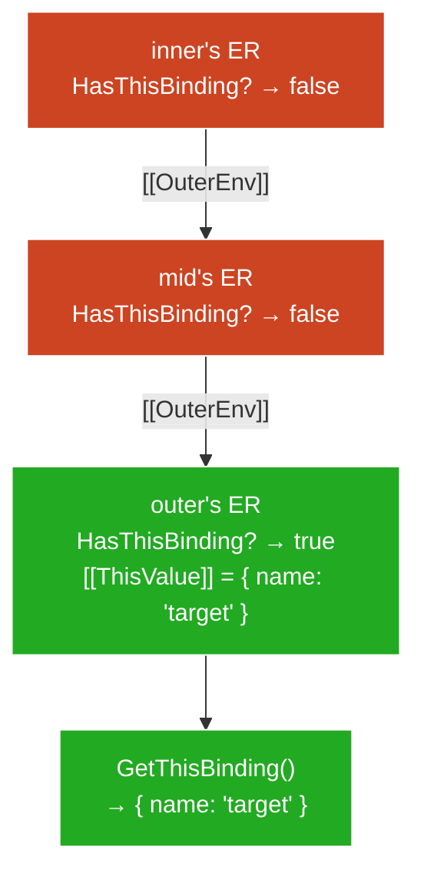

# Arrow Functions — Teaching Draft

## Plan (teaching order)

- [x] The structural difference — no `[[ThisValue]]`, `[[ThisMode]]: "lexical"`, OrdinaryCallBindThis skips
- [x] `this` resolution mechanism — `[[OuterEnv]]` chain walk, ResolveThisBinding, HasThisBinding
- [x] What arrows lack — no `arguments`, no `new.target`, not constructable (`[[IsConstructor]]` = false)
- [x] The problem they solve — `self = this`, callback `this`-loss, the historical workaround
- [x] Interactions with `call`/`apply`/`bind` — all no-ops for `this`; `bind` still does partial application

---

## The structural difference

### What makes an arrow different

Every ordinary function has three pieces of `this` machinery:

1. **`[[ThisMode]]`** — a slot on the function object, set at creation. Values: `"strict"`, `"global"`, or `"lexical"`.
2. **OrdinaryCallBindThis** — the step that writes `thisValue` into the new ER's `[[ThisValue]]` slot.
3. **`[[ThisValue]]` slot** — on the Function ER, holds the value the `this` keyword reads.

Arrow functions set `[[ThisMode]]` to `"lexical"`. This single flag has a cascading structural consequence:

```
OrdinaryCallBindThis(F, thisValue):
    if F.[[ThisMode]] is "lexical":
        return          ← does nothing, exits immediately
    ...
```

Because OrdinaryCallBindThis returns early, the arrow's Function ER **never gets a `[[ThisValue]]` written into it**. The slot isn't "set to undefined" — it's never initialized. The ER's `HasThisBinding()` method returns `false`.

### The cascade

| | Ordinary function | Arrow function |
|---|---|---|
| `[[ThisMode]]` | `"strict"` or `"global"` | `"lexical"` |
| OrdinaryCallBindThis | Runs, writes `[[ThisValue]]` | Skips (early return) |
| ER has `[[ThisValue]]`? | Yes — populated per call | No — never written |
| `this` keyword resolves to | Own ER's `[[ThisValue]]` | Walks `[[OuterEnv]]` chain |
| `call`/`apply` effect on `this` | Supplies `thisValue` to pipeline | No-op (pipeline skipped) |
| `bind` effect on `this` | Wrapper intercepts, supplies `[[BoundThis]]` | No-op (arrow ignores it) |
| Constructable? | Yes (unless class method) | No — `[[IsConstructor]]` = false |

The arrow doesn't "capture" or "close over" `this` the way it closes over a variable. It simply **doesn't have `this` machinery** — so the `this` keyword falls through to the enclosing scope's ER, the same way an unresolved variable would.

### Teaser reveal

```js
"use strict";                                    // L1
const obj = {                                    // L2
  name: "outer",                                 // L3
  createGreeter() {                              // L4
    const arrow = () => this.name;               // L5
    return arrow;                                // L6
  }                                              // L7
};                                               // L8

const greeter = obj.createGreeter();             // L9
greeter();                                       // L10 → "outer"
greeter.call({ name: "override" });              // L11 → "outer"

const detached = obj.createGreeter;              // L12
const greeter2 = detached();                     // L13
greeter2();                                      // L14 → TypeError
```

**L9–L10 trace:**
1. `obj.createGreeter()` — Ref base = `obj` → `createGreeter`'s ER gets `[[ThisValue]] = obj`
2. Arrow created inside that ER. Arrow's `[[Environment]]` points to `createGreeter`'s ER.
3. `greeter()` — arrow's `[[ThisMode]]` = `"lexical"` → OrdinaryCallBindThis skips → arrow's ER has no `[[ThisValue]]`
4. Body reads `this` → `ResolveThisBinding()` → arrow's ER says `HasThisBinding() = false` → walks `[[OuterEnv]]` → finds `createGreeter`'s ER → `[[ThisValue]] = obj`
5. `this.name` → `"outer"`

**L11 trace:**
1. `.call({ name: "override" })` invokes `arrow.[[Call]]({ name: "override" }, [])`
2. OrdinaryCallBindThis: `[[ThisMode]]` = `"lexical"` → **return** (skips)
3. `{ name: "override" }` is discarded — never written anywhere
4. `this` resolves the same way as L10 → `"outer"`

**L13–L14 trace:**
1. `detached = obj.createGreeter` — assignment calls GetValue, extracts the function. `detached` is a plain binding.
2. `detached()` — Ref base = scriptER → `createGreeter`'s ER gets `[[ThisValue]] = undefined` (strict)
3. Arrow created inside that ER. Arrow's `[[Environment]]` points to this new ER.
4. `greeter2()` → arrow's ER has no `[[ThisValue]]` → walks `[[OuterEnv]]` → finds `createGreeter`'s ER → `[[ThisValue]] = undefined`
5. `undefined.name` → **TypeError**

> **Key insight:** The arrow's `this` depends entirely on how its *enclosing function* was called — not how the arrow itself is called. The arrow has no `this` knob to turn.

---

## `this` resolution mechanism — the chain walk

When the engine encounters the `this` keyword anywhere in source code, it runs **`ResolveThisBinding()`**. This is the same algorithm for ordinary functions and arrows — the difference is purely structural (whether the current ER has a `[[ThisValue]]` or not).

### The algorithm

```
ResolveThisBinding():
    1. env = GetThisEnvironment()
    2. return env.GetThisBinding()

GetThisEnvironment():
    1. env = running EC's LexicalEnvironment
    2. loop:
         if env.HasThisBinding() == true:
             return env
         env = env.[[OuterEnv]]
         goto loop
```

`GetThisEnvironment` walks up the `[[OuterEnv]]` chain until it finds an ER that **has** a `this` binding. Then `GetThisBinding()` reads `[[ThisValue]]` from that ER.

### `HasThisBinding()` — the gate

Each ER type answers `HasThisBinding()` differently:

| ER type | `HasThisBinding()` returns | Why |
|---------|---------------------------|-----|
| Function ER (ordinary fn) | `true` | OrdinaryCallBindThis wrote `[[ThisValue]]` |
| Function ER (arrow fn) | `false` | OrdinaryCallBindThis skipped — slot never initialized |
| Declarative ER (blocks) | `false` | Blocks don't have `this` machinery |
| Module ER | `true` | Returns `undefined` (modules are always strict) |
| Global ER | `true` | Returns `globalThis` |

The chain walk **always terminates** — at worst it hits the Global ER, which always says `true`.

### Traced example: nested arrows

```js
"use strict";                                         // L1
function outer() {                                    // L2
  const mid = () => {                                 // L3
    const inner = () => this;                         // L4
    return inner;                                     // L5
  };                                                  // L6
  return mid;                                         // L7
}                                                     // L8

const fn = outer.call({ name: "target" });            // L9
const midFn = fn();                                   // L10
midFn();                                              // L11 → { name: "target" }
```

**L11 resolution trace — `this` keyword at L4:**



**† Legend:**
- Red: ER says "I don't have `this`" — walk continues
- Green: ER says "I have `this`" — resolution stops, value returned

Both `inner` and `mid` are arrows → their ERs have no `[[ThisValue]]`. The walk passes through both and lands on `outer`'s ER, where `[[ThisValue]]` was set by `outer.call({ name: "target" })`.

### Why "lexical `this`" is the right name

The resolution uses the **same chain-walk mechanism** as variable lookup — `[[OuterEnv]]` links, established at function creation time (lexically). It's not a special "arrow `this` capture" — it's the absence of local `this` causing the normal resolution to fall through. Identical to how an inner function reads a variable declared in an outer function: the inner scope doesn't have it, so the lookup walks outward.

The difference from variable lookup: variables walk `[[OuterEnv]]` looking for a binding with that *name*. `this` walks `[[OuterEnv]]` looking for an ER where `HasThisBinding()` is `true`. Same chain, different predicate.

### Multiple arrows don't "stack" — they're transparent

Each arrow in a nesting chain is just another ER that says `false`. The walk passes through all of them. Ten nested arrows still resolve to the nearest enclosing *ordinary function*'s `[[ThisValue]]`. Arrows are transparent to `this` resolution — they don't participate at all.

---

## What arrows lack — the full structural picture

The `[[ThisMode]]: "lexical"` flag is the most visible difference, but arrows are stripped of more than just `this`. The design principle: **arrows are expression-bodied callbacks, not full functions.** Everything related to "being called as a standalone entity" is removed.

### Three missing implicit bindings

| Implicit binding | Ordinary function | Arrow function | Resolution if accessed inside arrow |
|---|---|---|---|
| `this` | Own ER `[[ThisValue]]` | None | `[[OuterEnv]]` chain walk (as covered above) |
| `arguments` | Own ER creates `arguments` object | None | `[[OuterEnv]]` chain walk — finds enclosing ordinary fn's `arguments` |
| `new.target` | Set by `[[Construct]]` | None | `[[OuterEnv]]` chain walk — finds enclosing fn's `new.target` (or `undefined`) |

All three use the **same resolution pattern**: the arrow's ER doesn't have it, so the lookup walks outward. `this` uses `GetThisEnvironment`; `arguments` and `new.target` use standard identifier/binding resolution through `[[OuterEnv]]`.

```js
"use strict";                                         // L1
function outer() {                                    // L2
  const arrow = () => {                               // L3
    console.log(this);           // L4 — outer's this
    console.log(arguments);      // L5 — outer's arguments
    console.log(new.target);     // L6 — outer's new.target
  };                                                  // L7
  arrow();                                            // L8
}                                                     // L9

outer.call({ x: 1 }, "a", "b");                       // L10
// L4 → { x: 1 }
// L5 → Arguments ["a", "b"]
// L6 → undefined (outer wasn't called with new)

new outer("c");                                        // L11
// L4 → the new object (created by [[Construct]])
// L5 → Arguments ["c"]
// L6 → outer (new.target = the constructor being called)
```

> **Aside —** `arguments` inside an arrow is a common source of bugs. People write `(...) => { arguments[0] }` expecting the arrow's own args — but they get the enclosing function's `arguments` (or a ReferenceError if there's no enclosing function). Use rest parameters (`...args`) in arrows instead.

### Not constructable — `[[IsConstructor]]`

Every function object has an internal `[[IsConstructor]]` boolean, set at creation time:

| Function kind | `[[IsConstructor]]` | Can use `new`? |
|---|---|---|
| Function declaration / expression | `true` | Yes |
| Arrow function | `false` | No |
| Method (shorthand syntax) | `false` | No |
| Async function | `true` | Yes (but `[[Construct]]` throws) |
| Generator | `true` | Yes |
| Class (the constructor) | `true` | Yes (and *required*) |

When `new expr()` runs, the engine checks `expr.[[IsConstructor]]`. If `false` → **TypeError: expr is not a constructor**.

```js
const arrow = () => {};                               // L1
new arrow();                                          // L2 → TypeError: arrow is not a constructor
```

This isn't a runtime check on `this` behavior — it's a hard gate before any call mechanics run. The engine never reaches OrdinaryCallBindThis because `[[Construct]]` is never invoked.

### Why arrows aren't constructable

Construction creates a fresh object and binds it as `this`. But arrows have no `this` machinery — OrdinaryCallBindThis skips, so there's nowhere to put the new object. Making arrows constructable would mean `new` creates an object that the function body can never access. Rather than silently producing an unreachable object, the spec makes it a TypeError.

The design is consistent: arrows are **transparent wrappers** for inline logic. They delegate `this`, `arguments`, and `new.target` to their enclosing scope. Anything that requires the function to "own" these bindings (construction, being a method with its own `this`) is structurally incompatible with arrows.

---

## The problem arrows solve

### The bug: callback `this`-loss

Before arrows existed (pre-ES6), this was one of the most common JS bugs:

```js
function Timer() {                                    // L1
  this.seconds = 0;                                   // L2
  setInterval(function tick() {                       // L3
    this.seconds++;                                   // L4 — bug: this ≠ Timer instance
    console.log(this.seconds);                        // L5
  }, 1000);                                           // L6
}                                                     // L7

const t = new Timer();                                // L8
// L5 logs NaN repeatedly (sloppy) or throws TypeError (strict)
```

**Why it breaks — traced through the mechanism:**

1. `new Timer()` → `Timer`'s ER gets `[[ThisValue]] = {}` (the fresh object).
2. L2: `this.seconds = 0` works — reads from Timer's ER.
3. `setInterval` receives the `tick` function object as an argument. **Argument passing calls GetValue** — but that's fine here (functions are objects, no Reference involved in passing).
4. The runtime later calls `tick()` as a plain call — no member expression, no explicit `this`. The call site produces a Reference with an ER base → `thisValue = undefined` (strict) or `globalThis` (sloppy).
5. `tick`'s ER gets `[[ThisValue]] = undefined` or `globalThis`. Either way, it's not the Timer instance.

The structural problem: `tick` is an ordinary function — it **has its own `this` machinery**. Every call to `tick` creates a fresh ER with its own `[[ThisValue]]`, determined by `tick`'s call site. The Timer instance's `this` is trapped in a different ER that `tick` can't reach.

### Historical workaround: `self = this`

```js
function Timer() {                                    // L1
  var self = this;                                    // L2 — capture in a regular variable
  this.seconds = 0;                                   // L3
  setInterval(function tick() {                       // L4
    self.seconds++;                                   // L5 — reads 'self' via [[OuterEnv]], not 'this'
    console.log(self.seconds);                        // L6
  }, 1000);                                           // L7
}                                                     // L8
```

The trick: store `this` in a regular variable (`self`, `that`, `_this` — all common names). The callback closes over `self` via normal lexical scoping (`[[OuterEnv]]` chain). This works because **variable lookup always walks the chain** — it's only `this` that gets trapped in the local ER.

The workaround is correct but ugly:
- Extra variable that exists solely to work around a language quirk.
- Easy to forget — `this` still exists inside `tick` and silently refers to the wrong thing.
- Every nested callback needs the same dance.

### Alternative workaround: `.bind(this)`

```js
function Timer() {                                    // L1
  this.seconds = 0;                                   // L2
  setInterval(function tick() {                       // L3
    this.seconds++;                                   // L4
  }.bind(this), 1000);                                // L5 — bind locks this
}                                                     // L6
```

Creates a BoundFunction wrapper that forces `[[BoundThis]] = Timer instance`. Correct, but allocates an extra wrapper object per callback and is verbose.

### The arrow solution

```js
function Timer() {                                    // L1
  this.seconds = 0;                                   // L2
  setInterval(() => {                                 // L3
    this.seconds++;                                   // L4 — this = Timer instance
    console.log(this.seconds);                        // L5
  }, 1000);                                           // L6
}                                                     // L7
```

**Why it works — same mechanism as `self = this`, but built into the language:**

The arrow has no `this` machinery → `this` at L4 resolves via `[[OuterEnv]]` → finds `Timer`'s ER → `[[ThisValue]] = the instance`. No extra variable, no wrapper object, no way to accidentally use the wrong `this`.

The arrow doesn't "capture" `this` — it **doesn't have `this`**, so the keyword naturally resolves outward. The `self = this` pattern was manually simulating what arrows do structurally.

### Design motivation summary

| Problem | Pre-ES6 fix | Arrow fix |
|---|---|---|
| Callback loses `this` | `var self = this` | Arrow has no `this` → falls through |
| Verbose | Extra variable + discipline | Syntax is shorter, mechanism is automatic |
| Error-prone | Can still write `this` by accident | `this` always means the outer one — no local `this` to confuse |
| Allocation | `.bind()` creates wrapper per call | No wrapper needed |

> **Aside —** Arrows weren't designed *only* for `this`-loss. The concise syntax (`=>` vs `function`) and implicit return for expression bodies are independent ergonomic wins. But the `this` behavior is the *semantic* motivation — the reason they needed to be a new function kind rather than just shorter syntax for the same thing.

---

## Interactions with `call`/`apply`/`bind`

### `call`/`apply` — `this` is a no-op, arguments still work

`call`/`apply` deliver two things to `[[Call]]`: a `thisValue` and arguments. For arrows:

- **`thisValue`** — delivered to OrdinaryCallBindThis, which sees `[[ThisMode]]: "lexical"` and returns immediately. Discarded.
- **Arguments** — delivered normally. The arrow receives them in its parameters. Unaffected.

```js
"use strict";                                         // L1
const arrow = (a, b) => ({ self: this, sum: a + b }); // L2 — defined at module top level

arrow.call({ x: 1 }, 10, 20);                        // L3
// → { self: undefined, sum: 30 }
// this: { x: 1 } discarded, resolves to module this (undefined)
// args: 10, 20 delivered normally
```

`call`/`apply` are still useful on arrows for **argument delivery** — just not for `this`. Rare in practice, but not broken.

### `bind` — `this` is a no-op, partial application still works

`bind` creates a BoundFunction wrapper. The wrapper has two jobs:

1. Replace incoming `thisValue` with `[[BoundThis]]`
2. Prepend `[[BoundArguments]]` to call-time args

For arrows, job 1 is pointless (the arrow ignores whatever `thisValue` arrives), but job 2 works fine:

```js
"use strict";                                         // L1
const add = (a, b) => a + b;                          // L2

const add5 = add.bind(null, 5);                       // L3 — [[BoundThis]]=null, [[BoundArgs]]=[5]
add5(10);                                             // L4 → 15

// Trace:
// 1. add5.[[Call]](undefined, [10])
// 2. BoundFunction: thisValue = null (from [[BoundThis]]), args = concat([5], [10]) = [5, 10]
// 3. Calls add.[[Call]](null, [5, 10])
// 4. OrdinaryCallBindThis: [[ThisMode]] = "lexical" → return (null discarded)
// 5. Arrow body: a=5, b=10 → 15
```

The `null` first argument to `bind` is a convention — it signals "I don't care about `this`, I'm here for partial application." With arrows, any value works (it's ignored regardless), but `null` communicates intent.

### Summary: what works, what doesn't

| Operation | Effect on arrow's `this` | Effect on arrow's arguments |
|---|---|---|
| `arrow.call(thisArg, ...args)` | None — discarded | Normal delivery |
| `arrow.apply(thisArg, args)` | None — discarded | Normal delivery |
| `arrow.bind(thisArg, ...args)` | None — discarded | Partial application works |
| `obj.arrow()` (member call) | None — Reference base ignored | Normal delivery |
| `new arrow()` | TypeError — not constructable | N/A |

Every path that tries to influence `this` fails at the same point: OrdinaryCallBindThis's early return. The arrow is structurally immune — not by priority, but by absence of the machinery that would receive the value.

### When to use `bind` on an arrow

Rare, but legitimate for partial application when you want both lexical `this` *and* pre-filled arguments:

```js
"use strict";                                         // L1
function Controller() {                               // L2
  this.prefix = "[CTRL]";                             // L3
  const log = (level, msg) => `${this.prefix} ${level}: ${msg}`;  // L4
  this.warn = log.bind(null, "WARN");                 // L5
  this.error = log.bind(null, "ERROR");               // L6
}                                                     // L7

const c = new Controller();                           // L8
c.warn("disk full");    // L9 → "[CTRL] WARN: disk full"
c.error("crash");       // L10 → "[CTRL] ERROR: crash"
```

`this.prefix` resolves via `[[OuterEnv]]` to Controller's `[[ThisValue]]` (the instance). `bind` handles only the `level` argument. Clean separation: arrow owns `this` resolution, `bind` owns argument pre-filling.

### Why the arrow version is stronger than the ordinary-function alternative

Without the arrow, you'd need `bind` to handle *both* `this` and arguments:

```js
const log = function(level, msg) {                    // L1
  return `${this.prefix} ${level}: ${msg}`;           // L2
};                                                    // L3
this.warn = log.bind(this, "WARN");                   // L4 — bind must lock this AND prepend arg
```

This works, but now `this` depends on `bind`'s wrapper surviving — if someone does `new (c.warn)()`, `[[Construct]]` bypasses `[[BoundThis]]` and `this.prefix` breaks. With the arrow version, `this` is resolved via the environment chain regardless of how the function is invoked — `new` is blocked entirely (`[[IsConstructor]] = false`), and `call`/`apply`/`bind`/member-call all fail to override it.

The arrow version is **structurally immune** to `this`-loss. The ordinary-function-with-`bind` version is immune only as long as you go through `[[Call]]` (not `[[Construct]]`). The arrow is the stronger guarantee.
