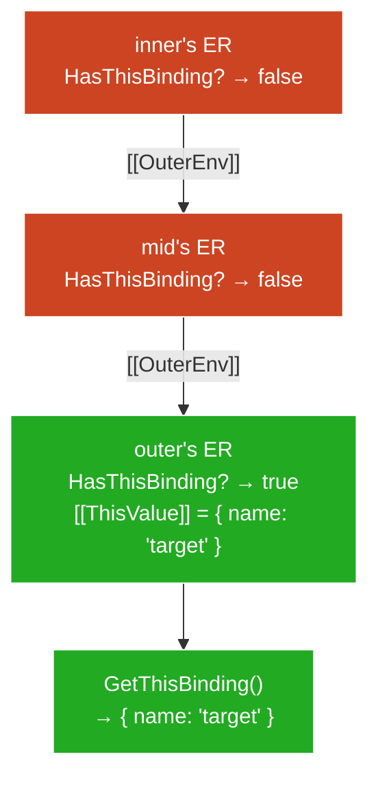

# Arrow Functions

**TL;DR:** Arrow functions have no `this` machinery — `[[ThisMode]]: "lexical"` causes OrdinaryCallBindThis to skip entirely, so the arrow's ER never gets a `[[ThisValue]]`. The `this` keyword inside an arrow resolves via `[[OuterEnv]]` chain walk (using `GetThisEnvironment` / `HasThisBinding`) until it finds an ER that *does* have `[[ThisValue]]` — typically the nearest enclosing ordinary function's ER. This makes arrows structurally immune to `this`-loss: no invocation path (`call`, `apply`, `bind`, member-call, `new`) can override their `this`. They also lack `arguments`, `new.target`, and `[[IsConstructor]]`.

## The structural difference

Every ordinary function has three pieces of `this` machinery:

1. **`[[ThisMode]]`** — slot on the function object, set at creation. Values: `"strict"`, `"global"`, or `"lexical"`.
2. **OrdinaryCallBindThis** — writes `thisValue` into the new ER's `[[ThisValue]]` slot.
3. **`[[ThisValue]]` slot** — on the Function ER, holds the value `this` reads.

Arrow functions set `[[ThisMode]]` to `"lexical"`. This single flag cascades:

```
OrdinaryCallBindThis(F, thisValue):
    if F.[[ThisMode]] is "lexical":
        return          ← does nothing, exits immediately
    ...
```

The arrow's Function ER **never gets a `[[ThisValue]]` written into it**. The ER's `HasThisBinding()` returns `false`.

| | Ordinary function | Arrow function |
|---|---|---|
| `[[ThisMode]]` | `"strict"` or `"global"` | `"lexical"` |
| OrdinaryCallBindThis | Runs, writes `[[ThisValue]]` | Skips (early return) |
| ER has `[[ThisValue]]`? | Yes — populated per call | No — never written |
| `this` keyword resolves to | Own ER's `[[ThisValue]]` | Walks `[[OuterEnv]]` chain |
| `call`/`apply` effect on `this` | Supplies `thisValue` to pipeline | No-op (pipeline skipped) |
| `bind` effect on `this` | Wrapper intercepts, supplies `[[BoundThis]]` | No-op (arrow ignores it) |
| Constructable? | Yes (unless class method) | No — `[[IsConstructor]]` = false |

## `this` resolution — the chain walk

When the engine encounters `this`, it runs **`ResolveThisBinding()`**:

```
ResolveThisBinding():
    1. env = GetThisEnvironment()
    2. return env.GetThisBinding()

GetThisEnvironment():
    1. env = running EC's LexicalEnvironment
    2. loop:
         if env.HasThisBinding() == true:
             return env
         env = env.[[OuterEnv]]
         goto loop
```

`GetThisEnvironment` walks `[[OuterEnv]]` until it finds an ER where `HasThisBinding()` is `true`.

### `HasThisBinding()` per ER type

| ER type | Returns | Why |
|---------|---------|-----|
| Function ER (ordinary fn) | `true` | OrdinaryCallBindThis wrote `[[ThisValue]]` |
| Function ER (arrow fn) | `false` | OrdinaryCallBindThis skipped |
| Declarative ER (blocks) | `false` | Blocks have no `this` machinery |
| Module ER | `true` | Returns `undefined` |
| Global ER | `true` | Returns `globalThis` |

The walk always terminates — at worst it hits Global ER or Module ER.

### Nested arrows are transparent

```js
"use strict";                                         // L1
function outer() {                                    // L2
  const mid = () => {                                 // L3
    const inner = () => this;                         // L4
    return inner;                                     // L5
  };                                                  // L6
  return mid;                                         // L7
}                                                     // L8

const fn = outer.call({ name: "target" });            // L9
fn()();                                               // L10 → { name: "target" }
```



**† Legend:**
- Red: ER says `HasThisBinding() = false` — walk continues
- Green: ER says `HasThisBinding() = true` — resolution stops

Each arrow is another ER that says `false`. Ten nested arrows still resolve to the nearest enclosing ordinary function's `[[ThisValue]]`.

### Why "lexical `this`" is the right name

The resolution uses the **same `[[OuterEnv]]` chain** as variable lookup — established at function creation time (lexically). It's not a special "capture" mechanism — it's the absence of local `this` causing normal resolution to fall through. Same chain, different predicate: variables check `HasBinding(name)`, `this` checks `HasThisBinding()`.

## What arrows lack

The design principle: arrows are **expression-bodied callbacks**, not full functions. Everything related to "being called as a standalone entity" is removed.

### Three missing implicit bindings

| Implicit binding | Ordinary function | Arrow | Resolution inside arrow |
|---|---|---|---|
| `this` | Own ER `[[ThisValue]]` | None | `[[OuterEnv]]` chain walk via `GetThisEnvironment` |
| `arguments` | Own ER creates `arguments` object | None | `[[OuterEnv]]` chain walk (standard identifier resolution) |
| `new.target` | Set by `[[Construct]]` | None | `[[OuterEnv]]` chain walk |

All three use the same pattern: the arrow's ER doesn't have it → lookup walks outward.

```js
"use strict";                                         // L1
function outer() {                                    // L2
  const arrow = () => {                               // L3
    console.log(this);           // L4 — outer's this
    console.log(arguments);      // L5 — outer's arguments
    console.log(new.target);     // L6 — outer's new.target
  };                                                  // L7
  arrow();                                            // L8
}                                                     // L9

outer.call({ x: 1 }, "a", "b");                       // L10
// L4 → { x: 1 }
// L5 → Arguments ["a", "b"]
// L6 → undefined (outer wasn't called with new)
```

> **Aside —** `arguments` inside an arrow is a common bug source. `(...) => { arguments[0] }` gets the *enclosing function's* `arguments`, not the arrow's own args. Use rest parameters (`...args`) in arrows instead.

### Not constructable — `[[IsConstructor]]`

| Function kind | `[[IsConstructor]]` |
|---|---|
| Function declaration / expression | `true` |
| Arrow function | `false` |
| Method (shorthand syntax) | `false` |
| Class constructor | `true` (and *required*) |

`new arrow()` → TypeError before any call mechanics run. The engine checks `[[IsConstructor]]` first.

**Why:** Construction creates a fresh object and binds it as `this`. But arrows skip OrdinaryCallBindThis — there's nowhere to put the new object. Rather than silently producing an unreachable object, the spec makes it a TypeError.

## The problem arrows solve

### The bug: callback `this`-loss

```js
function Timer() {                                    // L1
  this.seconds = 0;                                   // L2
  setInterval(function tick() {                       // L3
    this.seconds++;                                   // L4 — bug: this ≠ Timer instance
  }, 1000);                                           // L5
}                                                     // L6
```

`tick` is an ordinary function — it has its own `this` machinery. The runtime calls `tick()` as a plain call → ER base → `thisValue = undefined` (strict) or `globalThis` (sloppy). Timer's `this` is trapped in a different ER that `tick` can't reach, because `tick`'s own ER says `HasThisBinding() = true` — the walk stops at the wrong ER.

### Historical workaround: `self = this`

```js
function Timer() {                                    // L1
  var self = this;                                    // L2
  setInterval(function tick() {                       // L3
    self.seconds++;                                   // L4 — reads 'self' via [[OuterEnv]]
  }, 1000);                                           // L5
}                                                     // L6
```

Store `this` in a regular variable. The callback closes over `self` via normal lexical scoping. Works because **variable lookup always walks the chain** — only `this` gets trapped in the local ER.

Downsides: extra variable, easy to forget, `this` still exists inside `tick` and silently refers to the wrong thing.

### The arrow solution

```js
function Timer() {                                    // L1
  this.seconds = 0;                                   // L2
  setInterval(() => {                                 // L3
    this.seconds++;                                   // L4 — this = Timer instance
  }, 1000);                                           // L5
}                                                     // L6
```

The arrow has no `this` machinery → `this` at L4 resolves via `[[OuterEnv]]` → Timer's ER → `[[ThisValue]] = the instance`. No extra variable, no wrapper, no way to accidentally use the wrong `this`.

The `self = this` pattern was manually simulating what arrows do structurally.

## Interactions with `call`/`apply`/`bind`

### `call`/`apply` — `this` is a no-op, arguments still work

`call`/`apply` deliver `thisValue` + arguments to `[[Call]]`. For arrows, `thisValue` hits OrdinaryCallBindThis's early return and is discarded. Arguments are delivered normally.

```js
"use strict";                                         // L1
const arrow = (a, b) => a + b;                        // L2

arrow.call({ x: 1 }, 10, 20);                        // L3 → 30
// { x: 1 } discarded; 10, 20 delivered as args
```

### `bind` — `this` is a no-op, partial application still works

`bind`'s wrapper has two jobs: replace `thisValue` (no-op for arrows) and prepend `[[BoundArguments]]` (works normally).

```js
"use strict";                                         // L1
const add = (a, b) => a + b;                          // L2
const add5 = add.bind(null, 5);                       // L3
add5(10);                                             // L4 → 15
```

The `null` first argument to `bind` signals "I don't care about `this`" — with arrows, any value works (ignored regardless).

### Using `bind` for partial application with arrows

```js
"use strict";                                         // L1
function Controller() {                               // L2
  this.prefix = "[CTRL]";                             // L3
  const log = (level, msg) => `${this.prefix} ${level}: ${msg}`;  // L4
  this.warn = log.bind(null, "WARN");                 // L5
  this.error = log.bind(null, "ERROR");               // L6
}                                                     // L7

const c = new Controller();                           // L8
c.warn("disk full");    // L9 → "[CTRL] WARN: disk full"
c.error("crash");       // L10 → "[CTRL] ERROR: crash"
```

`this.prefix` resolves via `[[OuterEnv]]` to Controller's `[[ThisValue]]` (the instance). `bind` handles only the `level` argument. Clean separation: arrow owns `this` resolution, `bind` owns argument pre-filling.

**Why the arrow version is stronger than the ordinary-function alternative:**

Without the arrow, `bind` must handle both `this` and arguments:

```js
const log = function(level, msg) {                    // L1
  return `${this.prefix} ${level}: ${msg}`;           // L2
};                                                    // L3
this.warn = log.bind(this, "WARN");                   // L4
```

This works, but `this` depends on `bind`'s wrapper surviving — `new (c.warn)()` invokes `[[Construct]]`, which bypasses `[[BoundThis]]`, and `this.prefix` breaks. The arrow version is structurally immune: `new` is blocked (`[[IsConstructor]] = false`), and `call`/`apply`/`bind`/member-call all fail to override `this` because OrdinaryCallBindThis skips unconditionally.

### Summary table

| Operation | Effect on arrow's `this` | Effect on arrow's arguments |
|---|---|---|
| `arrow.call(thisArg, ...args)` | None — discarded | Normal delivery |
| `arrow.apply(thisArg, args)` | None — discarded | Normal delivery |
| `arrow.bind(thisArg, ...args)` | None — discarded | Partial application works |
| `obj.arrow()` (member call) | None — Reference base ignored | Normal delivery |
| `new arrow()` | TypeError | N/A — not constructable |

## Quick reference

- **`[[ThisMode]]: "lexical"`** — OrdinaryCallBindThis skips entirely. Arrow's ER never gets `[[ThisValue]]`.
- **Resolution mechanism** — `GetThisEnvironment()` walks `[[OuterEnv]]` checking `HasThisBinding()`. Stops at the nearest ER that says `true` (enclosing ordinary function, module, or global).
- **Structurally immune** — no invocation path can override an arrow's `this`. `call`/`apply`/`bind` are no-ops for `this`; `new` is a TypeError.
- **Three missing bindings** — `this`, `arguments`, `new.target`. All resolve via `[[OuterEnv]]` chain walk to the enclosing ordinary function.
- **The problem solved** — callback `this`-loss. Arrows make `self = this` obsolete by structurally lacking `this` machinery, so the keyword naturally falls through.
- **`bind` still useful** — partial application works on arrows. `this`-locking is a no-op but harmless.
