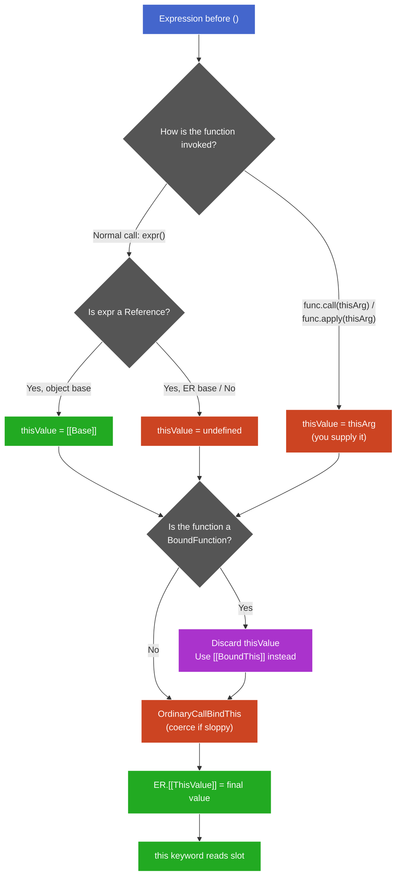

# Explicit Overrides: `call`, `apply`, `bind` — Draft

## Plan (teaching order)

- [x] `call` and `apply` — mechanism: bypass Reference-base rule by supplying `thisValue` directly
- [x] `bind` — mechanism: BoundFunction exotic object, `[[BoundThis]]` + `[[BoundArguments]]`
- [x] Priority / interaction — why `bind` beats `call`/`apply` (wrapper intercepts)
- [x] Partial application — `bind` with pre-filled arguments
- [x] Edge cases and gotchas

---

## Part 1: `call` and `apply` — supplying `this` directly

### Where they fit in the pipeline

Recall the `this`-determination pipeline from the previous chunk:

```
call site → thisValue (from Reference base) → OrdinaryCallBindThis → ER.[[ThisValue]]
```

`call` and `apply` **replace step 1**. Instead of the engine reading `[[Base]]` from a Reference, *you* supply `thisValue` explicitly. The rest of the pipeline (OrdinaryCallBindThis coercion, ER slot storage) runs identically.

### The spec mechanism

`Function.prototype.call(thisArg, ...args)` does:

```
1. Let func = this (the function .call was invoked on)
2. Call func.[[Call]](thisArg, args)
```

That's it. It invokes the function's internal `[[Call]]` method directly — the same internal method the `()` operator uses, but with a `thisValue` you chose instead of one derived from a Reference.

`apply` is identical except arguments come as a single array-like:

```js
func.call(thisArg, arg1, arg2)    // spread args
func.apply(thisArg, [arg1, arg2]) // array-like args
```

The `this`-binding mechanism is the same. The only difference is argument delivery shape.

### Why this works

The call operator's job is:

1. Determine `thisValue` (from Reference base)
2. Invoke `[[Call]](thisValue, args)` on the function

`call`/`apply` skip step 1 and go straight to step 2 with your supplied value. They don't "override" anything — they just enter the pipeline at a different point.

```js
"use strict";
function greet(greeting) { return `${greeting}, ${this.name}`; }

const obj = { name: "obj" };

// Normal call — Reference base rule:
obj.greet = greet;
obj.greet("Hi");           // Ref { base: obj } → this = obj → "Hi, obj"

// call — you supply thisValue directly:
greet.call(obj, "Hi");     // thisValue = obj → "Hi, obj"

// Same result, different entry point into the pipeline.
```

### OrdinaryCallBindThis still runs

`call`/`apply` don't skip the coercion step:

```js
// sloppy mode
function sloppy() { return this; }
sloppy.call(undefined);  // → globalThis (coerced)
sloppy.call(null);       // → globalThis (coerced)
sloppy.call(42);         // → Number {42} (wrapped)

// strict mode
function strict() { "use strict"; return this; }
strict.call(undefined);  // → undefined (pass-through)
strict.call(null);       // → null (pass-through)
strict.call(42);         // → 42 (pass-through, no wrapping)
```

Same coercion rules as normal calls — `call`/`apply` only replace the *source* of `thisValue`, not the downstream processing.

> **Aside —** `apply`'s main historical use case (spreading an array into arguments) is largely obsolete since ES6 spread syntax. You'll still see it in older code and in one niche: forwarding an `arguments` object without knowing its length.

---

## Part 2: `bind` — the BoundFunction wrapper

### Teaser

```js
"use strict";
function greet() { return this.name; }

const bound = greet.bind({ name: "A" });

bound.call({ name: "B" });  // → "A"
```

`call` faithfully delivers `{ name: "B" }` — but it delivers it to the *wrapper*, not to `greet`. The wrapper intercepts and substitutes.

### What `bind` actually returns

`Function.prototype.bind(thisArg, ...args)` does **not** mutate or annotate the original function. It creates and returns a new object — a **BoundFunction exotic object**. "Exotic" means it has a custom `[[Call]]` internal method (unlike ordinary functions which all share the same `[[Call]]` algorithm).

The BoundFunction stores three internal slots:

| Slot | Value | Purpose |
|------|-------|---------|
| `[[BoundTargetFunction]]` | The original function (`greet`) | What to actually invoke |
| `[[BoundThis]]` | The `thisArg` you passed to `bind` | Replaces any incoming `thisValue` |
| `[[BoundArguments]]` | Any extra args passed to `bind` | Prepended to call-time arguments (partial application) |

### The BoundFunction `[[Call]]` algorithm

When anything invokes a BoundFunction (normal call, `call`, `apply`, another `bind`, doesn't matter):

```
BoundFunction.[[Call]](thisArgument, argumentsList):
    1. Let target = [[BoundTargetFunction]]
    2. Let boundThis = [[BoundThis]]           ← ignores thisArgument entirely
    3. Let boundArgs = [[BoundArguments]]
    4. Let args = concat(boundArgs, argumentsList)
    5. Return target.[[Call]](boundThis, args)  ← calls the real function
```

Step 2 is the key: `thisArgument` (whatever the caller supplied) is **never read**. The wrapper unconditionally uses `[[BoundThis]]`. This isn't a priority system — it's structural interception. The incoming `this` is discarded before it can reach the target.

### Why `call`/`apply` can't override `bind`

```js
"use strict";
function greet() { return this.name; }
const bound = greet.bind({ name: "A" });

bound.call({ name: "B" });
```

Trace:

```
1. .call invokes bound.[[Call]]({ name: "B" }, [])
2. bound is a BoundFunction → its [[Call]] runs:
   - Ignores { name: "B" }
   - Uses [[BoundThis]] = { name: "A" }
   - Calls greet.[[Call]]({ name: "A" }, [])
3. greet runs with this = { name: "A" }
4. → "A"
```

`call` did its job correctly — it passed `{ name: "B" }` as `thisArgument` to the function it was called on. But the function it was called on is the *wrapper*, and the wrapper's `[[Call]]` doesn't forward that argument.

### Double-bind: same principle

```js
const bound1 = greet.bind({ name: "first" });
const bound2 = bound1.bind({ name: "second" });

bound2();  // → "first"
```

`bound2` is a BoundFunction wrapping `bound1`. When called:
- `bound2.[[Call]]` → uses its `[[BoundThis]]` = `{ name: "second" }`, calls `bound1.[[Call]]({ name: "second" }, [])`
- `bound1.[[Call]]` → ignores `{ name: "second" }`, uses its `[[BoundThis]]` = `{ name: "first" }`, calls `greet.[[Call]]({ name: "first" }, [])`
- `greet` sees `this = { name: "first" }`

The innermost `bind` (closest to the original function) always wins — each wrapper discards whatever the outer wrapper passed.

### `bind` doesn't affect the original

```js
const original = greet;
const bound = greet.bind({ name: "bound" });

original();  // TypeError (this = undefined, strict mode)
bound();     // "bound"

original === bound;  // false — different objects entirely
```

`bind` is pure — it returns a new object, leaves the original untouched. No mutation, no shared state.

### The full `this`-determination pipeline (with overrides)



**† Legend:**
- Blue: starting point
- Green: `this` successfully bound from object base / stored in ER
- Red: `undefined` path or coercion step
- Purple: `bind` interception — unconditionally replaces whatever came before
- Grey: decision nodes

**Abbreviations:** ER = Environment Record, BF = BoundFunction

`bind` sits *after* both the Reference-base rule and `call`/`apply`. No matter which path produces `thisValue`, if the function is a BoundFunction, that value gets discarded and replaced with `[[BoundThis]]`.

---

## Part 3: Partial application — `bind` with pre-filled arguments

### The mechanism

`bind(thisArg, arg1, arg2, ...)` stores extra arguments in `[[BoundArguments]]`. When the BoundFunction is called, its `[[Call]]` prepends them:

```
BoundFunction.[[Call]](thisArgument, callArgs):
    args = concat([[BoundArguments]], callArgs)
    target.[[Call]]([[BoundThis]], args)
```

The target function sees one flat argument list — it has no way to tell which args were pre-filled and which came at call time.

### Basic example

```js
"use strict";
function log(level, msg) {       // L1
  return `[${level}] ${msg}`;    // L2
}

const warn = log.bind(null, "WARN");  // L3 — [[BoundArguments]] = ["WARN"]

warn("disk full");              // L4 — args = ["WARN", "disk full"] → "[WARN] disk full"
warn("WARN", "disk full");     // L5 — args = ["WARN", "WARN", "disk full"] → "[WARN] WARN"
```

L5 shows the trap: `"WARN"` is already baked in. Passing it again just shifts everything — `msg` receives the second `"WARN"`, and `"disk full"` falls off (no third parameter).

### `this`-free partial application

When you only want to fix arguments (not `this`), pass `null` as `thisArg`:

```js
"use strict";
const double = (x) => x * 2;                // L1 — arrow, no this concern
const addTen = ((a, b) => a + b).bind(null, 10);  // L2 — fix first arg

addTen(5);   // L3 — concat([10], [5]) → (10, 5) → 15
```

In strict mode, `this = null` passes through unchanged — harmless if the function never reads `this`. With arrows, `this` isn't even relevant (they ignore it structurally).

### Stacking partial application

Each `bind` wraps the previous result. Arguments accumulate:

```js
"use strict";
function sum(a, b, c) { return a + b + c; }  // L1

const add5 = sum.bind(null, 5);       // L2 — [[BoundArgs]] = [5]
const add5and10 = add5.bind(null, 10); // L3 — [[BoundArgs]] = [10], wraps add5

add5and10(20);  // L4
// add5and10.[[Call]]: concat([10], [20]) → calls add5 with (10, 20)
// add5.[[Call]]:      concat([5], [10, 20]) → calls sum with (5, 10, 20)
// sum(5, 10, 20) → 35
```

Each wrapper prepends its own `[[BoundArguments]]` before forwarding. The innermost wrapper's args end up first in the final list.

### Partial application vs currying

| | Partial application (`bind`) | Currying |
|---|---|---|
| What it does | Fix N args now, supply the rest in one call | Transform `f(a,b,c)` into `f(a)(b)(c)` |
| Number of remaining calls | 1 | N (one per arg) |
| Built into JS? | Yes (`bind`) | No (library or manual) |
| Knows arity? | No — extra args silently ignored | Yes — returns next function until all args received |

`bind` does partial application. It doesn't know or care how many parameters the target expects — it just prepends and forwards.

---

## Part 4: Edge cases and gotchas

### `new` overrides `[[BoundThis]]`

`bind` locks `this` against all *call-time* overrides — `call`, `apply`, Reference base. But `new` is a different invocation mode (construction, not calling). BoundFunction has a separate `[[Construct]]` method:

```
BoundFunction.[[Construct]](argumentsList, newTarget):
    1. Let target = [[BoundTargetFunction]]
    2. Let args = concat([[BoundArguments]], argumentsList)  ← args still prepended
    3. Return target.[[Construct]](args, newTarget)          ← [[BoundThis]] IGNORED
```

No step reads `[[BoundThis]]`. Construction creates a fresh object — using the bound `this` would corrupt the prototype chain.

```js
"use strict";
function Foo(x) {          // L1
  this.x = x;              // L2
}

const BoundFoo = Foo.bind({ name: "ignored" }, 42);  // L3

const obj = new BoundFoo();  // L4
obj.x;                       // L5 → 42 (arg was prepended)
obj.name;                    // L6 → undefined ({ name: "ignored" } was never used)
obj instanceof Foo;          // L7 → true (prototype chain is correct)
```

**Mental model:** `bind` locks `this` for *calls*. `new` isn't a call — it's construction. `[[BoundArguments]]` still apply (they're about arguments, not `this`), but `[[BoundThis]]` is irrelevant in construction mode.

### `.name` and `.length` on bound functions

```js
function original(a, b, c) {}           // L1 — .name = "original", .length = 3
const bound = original.bind(null, "x"); // L2

bound.name;    // L3 → "bound original"
bound.length;  // L4 → max(0, 3 - 1) = 2
```

- `.name`: prefixed with `"bound "` — helps debugging (you can tell it's a wrapper in stack traces).
- `.length`: `max(0, target.length - boundArgs.length)` — reports remaining expected arguments.

### `bind` on already-bound functions (stacking)

```js
"use strict";
function f() { return this.x; }       // L1

const b1 = f.bind({ x: 1 });          // L2
const b2 = b1.bind({ x: 2 });         // L3

b2();  // L4 → 1 (not 2)
```

Each `bind` wraps the previous. `b2.[[Call]]` passes `{ x: 2 }` to `b1.[[Call]]`, which ignores it and uses `{ x: 1 }`. The innermost (first) `bind` always wins for `this`.

### `call`/`apply` with `null`/`undefined` in sloppy mode

```js
function sloppy() { return this; }     // L1

sloppy.call(null);       // L2 → globalThis (coerced)
sloppy.call(undefined);  // L3 → globalThis (coerced)
```

OrdinaryCallBindThis coerces `null`/`undefined` → `globalThis` in sloppy mode. This is a common source of accidental global pollution. Strict mode passes through unchanged — one more reason to always use strict.

### `apply` with non-array iterables

```js
"use strict";
function show(...args) { return args; }  // L1

show.apply(null, "abc");     // L2 → ["a", "b", "c"] (string is array-like)
show.apply(null, { 0: "x", 1: "y", length: 2 });  // L3 → ["x", "y"]
```

`apply` accepts any array-like (has `.length` and indexed properties), not just arrays. It uses `CreateListFromArrayLike` internally.
