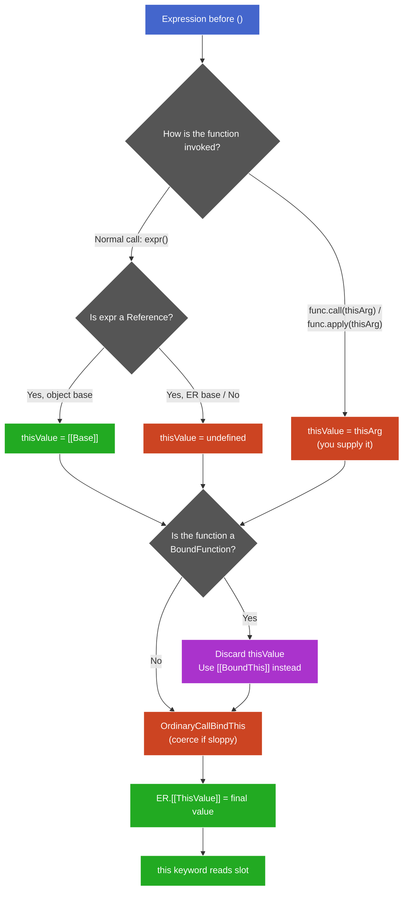

# Explicit Overrides: `call`, `apply`, `bind`

**TL;DR:** `call`/`apply` bypass the Reference-base rule by supplying `thisValue` directly to `[[Call]]` — they enter the pipeline at a different point, not override it. `bind` returns a BoundFunction exotic object — a wrapper with its own `[[Call]]` that unconditionally discards incoming `thisValue` and substitutes its stored `[[BoundThis]]`. Because it's a structural interception (wrapper, not flag), nothing that operates through `[[Call]]` can override it. `new` is the sole exception — it invokes `[[Construct]]`, a separate algorithm that never consults `[[BoundThis]]`.

## `call` and `apply` — entering the pipeline directly

> **Aside —** `[[Call]]` is the internal method that every function object has. When you write `fn()`, the engine doesn't "run the body" directly — it invokes `fn.[[Call]](thisValue, args)`, which creates a new Execution Context, binds `this`, sets up the Environment Record, and *then* runs the body. Every invocation path (`()` operator, `call`, `apply`, `Reflect.apply`) ultimately goes through `[[Call]]`. It's the single entry point for calling a function. Construction (`new`) uses a parallel `[[Construct]]` method instead — covered in the constructor chunk.

Recall the `this`-determination pipeline:

```
call site → thisValue (from Reference base) → OrdinaryCallBindThis → ER.[[ThisValue]]
```

`call`/`apply` replace step 1. Instead of the engine reading `[[Base]]` from a Reference, you supply `thisValue` explicitly. The rest of the pipeline runs identically.

### The spec mechanism

`Function.prototype.call(thisArg, ...args)`:

```
1. Let func = this (the function .call was invoked on)
2. Call func.[[Call]](thisArg, args)
```

It invokes `[[Call]]` directly with your chosen `thisValue`. `apply` is identical except arguments come as a single array-like:

```js
func.call(thisArg, arg1, arg2)     // L1 — spread args
func.apply(thisArg, [arg1, arg2])  // L2 — array-like args
```

Same `this`-binding mechanism. Only argument delivery shape differs.

### OrdinaryCallBindThis still runs

`call`/`apply` don't skip coercion — they only replace the *source* of `thisValue`:

```js
// sloppy mode                          // strict mode
sloppy.call(undefined); // → globalThis  strict.call(undefined); // → undefined
sloppy.call(null);      // → globalThis  strict.call(null);      // → null
sloppy.call(42);        // → Number{42}  strict.call(42);        // → 42
```

> **Aside —** `apply`'s historical use case (spreading an array into arguments) is largely obsolete since ES6 spread syntax. Still seen in older code and one niche: forwarding an `arguments` object without knowing its length. `apply` accepts any array-like (has `.length` and indexed properties) via `CreateListFromArrayLike`.

## `bind` — the BoundFunction wrapper

### What `bind` returns

`Function.prototype.bind(thisArg, ...args)` does **not** mutate the original. It creates a **BoundFunction exotic object** — a different object with a custom `[[Call]]`:

| Slot | Value | Purpose |
|------|-------|---------|
| `[[BoundTargetFunction]]` | The original function | What to actually invoke |
| `[[BoundThis]]` | The `thisArg` passed to `bind` | Replaces any incoming `thisValue` |
| `[[BoundArguments]]` | Extra args passed to `bind` | Prepended to call-time arguments (partial application) |

### The `[[Call]]` algorithm

```
BoundFunction.[[Call]](thisArgument, argumentsList):
    1. target = [[BoundTargetFunction]]
    2. boundThis = [[BoundThis]]           ← ignores thisArgument
    3. args = concat([[BoundArguments]], argumentsList)
    4. Return target.[[Call]](boundThis, args)
```

Step 2: `thisArgument` is **never read**. The wrapper unconditionally substitutes `[[BoundThis]]`. This isn't a priority system — it's structural interception.

### Why `call`/`apply` can't override `bind`

```js
"use strict";
function greet() { return this.name; }       // L1
const bound = greet.bind({ name: "A" });     // L2

bound.call({ name: "B" });                   // L3 → "A"
```

Trace of L3:
1. `.call` invokes `bound.[[Call]]({ name: "B" }, [])`
2. `bound` is a BoundFunction → discards `{ name: "B" }`, uses `[[BoundThis]]` = `{ name: "A" }`
3. Calls `greet.[[Call]]({ name: "A" }, [])`
4. `greet` sees `this = { name: "A" }`

`call` faithfully delivers `{ name: "B" }` to the thing it's calling — but the thing it's calling is the wrapper, not `greet`.

### Why this design?

`call`/`apply` are for the **caller** to choose `this`. `bind` is for the **author** to lock `this` before handing the function away. The use case: pass a function to code you don't control (callbacks, event handlers, third-party libraries) with a guarantee they can't change `this`. If `call`/`apply` could override `bind`, that guarantee would be worthless.

Author's lock beats caller's choice — otherwise the lock is meaningless.

### Double-bind

```js
"use strict";
function f() { return this.x; }    // L1
const b1 = f.bind({ x: 1 });       // L2
const b2 = b1.bind({ x: 2 });      // L3

b2();  // L4 → 1
```

`b2.[[Call]]` passes `{ x: 2 }` to `b1.[[Call]]`, which ignores it and uses `{ x: 1 }`. The innermost `bind` (closest to the original) always wins — each wrapper discards whatever the outer wrapper passed.

## The full `this`-determination pipeline (with overrides)



**† Legend:**
- Blue: starting point
- Green: `this` successfully bound / stored in ER
- Red: `undefined` path or coercion step
- Purple: `bind` interception — unconditionally replaces whatever came before
- Grey: decision nodes

**Abbreviations:** ER = Environment Record, BF = BoundFunction

This diagram covers the `[[Call]]` world only. `new` invokes `[[Construct]]` — a parallel path that creates a fresh object as `this` and never consults `[[BoundThis]]`.

## Partial application

`[[BoundArguments]]` enables partial application — fix some arguments now, supply the rest at call time:

```js
"use strict";
function log(level, msg) {                    // L1
  return `[${level}] ${msg}`;                 // L2
}

const warn = log.bind(null, "WARN");          // L3 — [[BoundArguments]] = ["WARN"]

warn("disk full");           // L4 → "[WARN] disk full"
warn("WARN", "disk full");  // L5 → "[WARN] WARN" (extra "disk full" falls off)
```

The target sees one flat argument list: `concat([[BoundArguments]], callArgs)`. It can't tell which args were pre-filled. Extra args silently fall off if there aren't enough parameters.

### Stacking

Each `bind` wraps the previous. Arguments accumulate through the wrapper chain:

```js
"use strict";
function sum(a, b, c) { return a + b + c; }  // L1

const add5 = sum.bind(null, 5);        // L2 — [[BoundArgs]] = [5]
const add5and10 = add5.bind(null, 10); // L3 — [[BoundArgs]] = [10], wraps add5

add5and10(20);  // L4 → 35
// L4 trace: concat([10], [20]) → add5 gets (10, 20)
//           concat([5], [10, 20]) → sum gets (5, 10, 20)
```

### Partial application vs currying

| | Partial application (`bind`) | Currying |
|---|---|---|
| What it does | Fix N args, supply rest in one call | Transform `f(a,b,c)` into `f(a)(b)(c)` |
| Remaining calls | 1 | N (one per arg) |
| Built into JS? | Yes | No (library or manual) |
| Arity-aware? | No — extra args silently ignored | Yes — returns next fn until all received |

## Edge cases

### `new` ignores `[[BoundThis]]`

`new` invokes `[[Construct]]`, not `[[Call]]`. BoundFunction's `[[Construct]]` forwards `[[BoundArguments]]` but never reads `[[BoundThis]]`:

```js
"use strict";
function Foo(x) { this.x = x; }              // L1
const BoundFoo = Foo.bind({ name: "ignored" }, 42);  // L2

const obj = new BoundFoo();  // L3
obj.x;             // L4 → 42 (arg prepended)
obj.name;          // L5 → undefined ([[BoundThis]] never used)
obj instanceof Foo; // L6 → true (correct prototype)
```

`[[Construct]]` doesn't "override" `[[BoundThis]]` — it never consults it. Construction creates a fresh object as `this`; there's no slot where `[[BoundThis]]` could inject.

### `.name` and `.length`

```js
function original(a, b, c) {}            // L1
const bound = original.bind(null, "x");  // L2

bound.name;    // L3 → "bound original"
bound.length;  // L4 → max(0, 3 - 1) = 2
```

- `.name`: prefixed with `"bound "` — visible in stack traces.
- `.length`: `max(0, target.length - boundArgs.length)` — reports remaining expected arguments.

### `call`/`apply` with `null`/`undefined` in sloppy mode

```js
function sloppy() { return this; }  // L1

sloppy.call(null);       // L2 → globalThis (coerced)
sloppy.call(undefined);  // L3 → globalThis (coerced)
```

OrdinaryCallBindThis coerces `null`/`undefined` → `globalThis` in sloppy mode. Common source of accidental global pollution. Strict mode passes through unchanged.

## Quick reference

- **`call`/`apply`** — supply `thisValue` directly to `[[Call]]`, bypassing the Reference-base rule. Same coercion still applies. Only argument shape differs between them.
- **`bind`** — returns a BoundFunction exotic object (wrapper). Its `[[Call]]` unconditionally discards incoming `thisValue` and uses `[[BoundThis]]`. Structural interception, not a priority flag.
- **`bind` beats `call`/`apply`** — `call`/`apply` deliver to the wrapper, which intercepts. Author's lock beats caller's choice.
- **`new` beats `bind`** — `new` invokes `[[Construct]]`, which never reads `[[BoundThis]]`. Different invocation mode, not a priority override.
- **Partial application** — `[[BoundArguments]]` prepended to call-time args. Flat concat, arity-unaware, extras silently ignored.
- **`.length`** — `max(0, target.length - boundArgs.length)`. Reports unfilled parameter slots.
