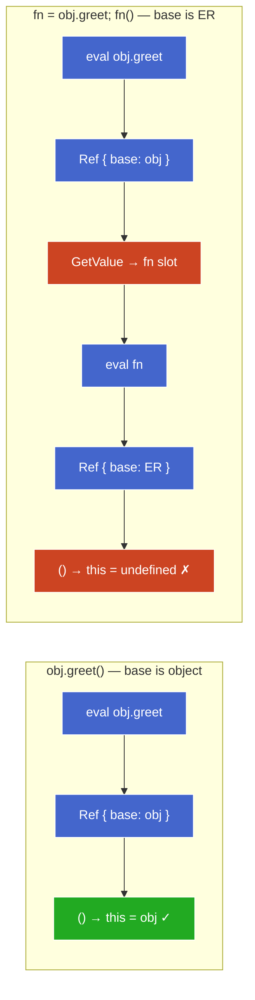
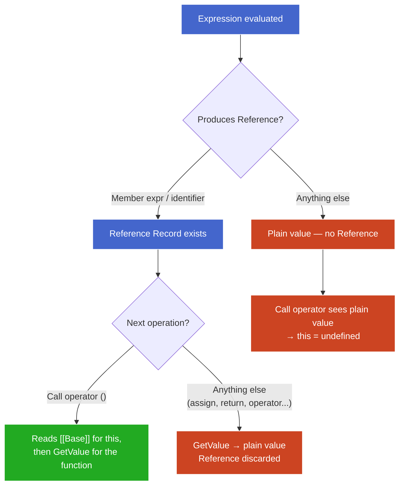
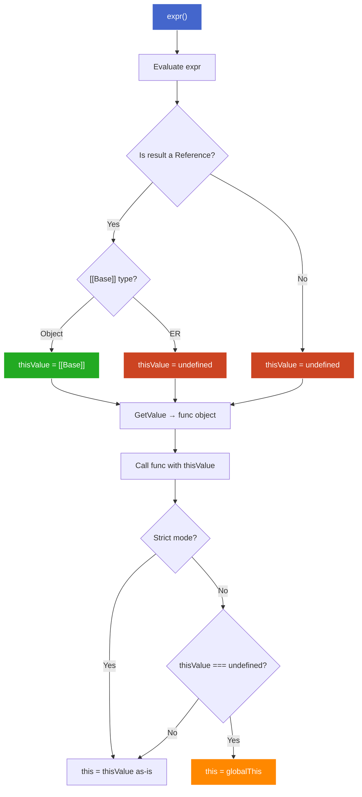

# 1. The Reference Type — Draft

## 1.1. Plan (teaching order)

- [x] What problem the Reference type solves (the gap between expression evaluation and call)
- [x] Reference Record structure: base, name, strict
- [x] How References are produced (one rule, two cases)
- [x] GetValue — when the Reference collapses to a plain value
- [x] How the call operator uses the Reference to set `this`

---

## 1.2. The problem: expression evaluation loses context

The same function object can produce different `this` depending on how it's called:

```js
const obj = {
  name: "obj",
  greet() { return this.name; }
};

const fn = obj.greet;

obj.greet();  // "obj"  — this === obj
fn();         // undefined (strict) or globalThis (sloppy) — this !== obj
```

Both calls invoke the exact same function object. The engine needs two things at the call site:

1. **What function do I call?** (the function object itself)
2. **What `this` do I pass?** (depends on *how* the function was referenced)

Question 2 needs context about the expression that produced the value — was it `obj.greet` (property access on `obj`) or just `fn` (plain variable)? But once you evaluate `obj.greet` down to the function object, `obj` is gone. The function object doesn't carry "I came from obj."

The **Reference Record** is the spec's solution — a transient internal value that preserves both the value's *address* (where it lives + what name) and the context needed by the next operation.

> **A Reference is not a JS value.** You can never hold one in a variable, pass it to a function, or inspect it. It exists between expression evaluation and the operation that consumes it (call, assignment, `typeof`). In `obj.greet()`: evaluating `obj.greet` produces the Reference (expression evaluation), then `()` reads its `[[Base]]` and discards it (the consuming operation). The entire lifespan is within that one expression. Think of it as a "sticky note" the engine attaches to an expression result — "this value came from *here*." The call operator reads the sticky note to determine `this`, then discards it.

> **Aside — terminology.** The spec defines a specification type called "the Reference type." Each instance is a "Reference Record." Same concept, two levels — like "the Number type" vs "the number `42`." In this note, "Reference" (capitalized) means a Reference Record instance.

---

## 1.3. Reference Record structure

A Reference Record is a struct with three fields:

| Field                | What it holds                                  | Purpose                                     |
| -------------------- | ---------------------------------------------- | ------------------------------------------- |
| `[[Base]]`           | The thing the property lives on (object or ER) | Becomes `this` at call time                 |
| `[[ReferencedName]]` | The property name (string or Symbol)           | Used to look up the actual value (GetValue) |
| `[[Strict]]`         | `true` / `false`                               | Whether the code is in strict mode          |

The Reference carries an *address* (base + name), not the value itself. `GetValue` follows the address to extract the value when needed.

**Why each field exists:**

- `[[Base]]` — the call operator reads this to determine `this`.
- `[[ReferencedName]]` — `GetValue` needs it to do the actual property lookup (`base[name]`).
- `[[Strict]]` — determines whether an ER-based `this` stays `undefined` (strict) or gets coerced to `globalThis` (sloppy).

---

## 1.4. How References are produced

### 1.4.1. How a Reference is born

Every expression that names something produces a Reference Record the same way:

> **Find where the name lives → `[[Base]]`.**
> **The name itself → `[[ReferencedName]]`.**
> **Current strictness → `[[Strict]]`.**

The engine records the *address* — it does **not** look up the value yet. The `[[Base]]` is determined based on where the name lives:

| Expression type      | Example     | Where the name lives     | `[[Base]]` becomes         |
| -------------------- | ----------- | ------------------------ | -------------------------- |
| Member expression    | `obj.greet` | On an object             | The object (`obj`)         |
| Plain identifier     | `fn`        | In an Environment Record | The ER where `fn` was found |

### 1.4.2. The `this`-determination rule

The call operator applies one rule to the `[[Base]]`:

> **Base is an object → `this` = that object.**
> **Base is an ER → `this` = `undefined` (strict) / `globalThis` (sloppy).**

That's the entire `this`-determination mechanism for normal calls. Everything else (`call`/`apply`/`bind`, arrow functions, `new`) are overrides layered on top.

### 1.4.3. Case 1 — member expression: `obj.greet()`

```js
const obj = {
  name: "obj",
  greet() { return this.name; }
};

obj.greet();
```

The engine evaluates `obj.greet` — a member expression. `"greet"` lives on the object `obj`:

```
Reference Record {
  [[Base]]: obj,               ← object → will become this
  [[ReferencedName]]: "greet",
  [[Strict]]: false
}
```

The call operator: `GetValue` extracts the function object → `[[Base]]` is an object → `this = obj` → `this.name` → `"obj"`.

### 1.4.4. Case 2 — plain identifier: `fn()`

```js
const fn = obj.greet;  // copies the function object into fn's slot
fn();
```

**The assignment — Reference consumed and lost:**

`obj.greet` produces a Reference (base = `obj`). The assignment calls `GetValue` → extracts the function object → stores it in `fn`'s slot. The Reference is gone — `obj` is nowhere in `fn`'s binding.

**The call — fresh Reference from `fn`:**

The engine evaluates `fn` — a plain identifier. It walks the scope chain until it finds an ER with a binding for `"fn"`:

```
Reference Record {
  [[Base]]: <the ER where "fn" was found>,  ← ER → this = undefined
  [[ReferencedName]]: "fn",
  [[Strict]]: false
}
```

The call operator: `GetValue` extracts the same function object → `[[Base]]` is an ER → `this = undefined` (strict) or `globalThis` (sloppy).

**Why `this` is "lost":** the assignment called `GetValue`, which discarded the Reference. From that point, `obj` only ever existed in the old Reference's `[[Base]]`. The fresh Reference from `fn` has no memory that this function once came from `obj`.

### 1.4.5. Chained access: `a.b.c()`

```js
const a = { b: { c() { return this; } } };
a.b.c();  // this === a.b (not a)
```

The engine evaluates left-to-right:
1. `a.b` → Reference (base = `a`, name = `"b"`). `GetValue` extracts the inner object.
2. `<inner>.c` → **new** Reference (base = the object `a.b` points to, name = `"c"`).

Only the last dot determines the base. `[[Base]]` is always the immediate object — the one directly left of the final property access.

### 1.4.6. Visual summary



**† Legend:**
- Blue: expression evaluation producing a Reference
- Green: `this` successfully bound (base is object)
- Red: the point where `obj` is lost (GetValue consumes Reference) / failed binding (ER base)

**Abbreviations:** ER = Environment Record, Ref = Reference Record

---

## 1.5. GetValue — when the Reference collapses

### 1.5.1. Teaser

```js
function getMethod(obj) {
  return obj.greet;
}

const obj = { name: "obj", greet() { return this.name; } };

getMethod(obj)();  // what is this? why?
```

Inside `getMethod`, `obj.greet` produces a Reference with `base: obj`. So `obj` is right there. Why doesn't it survive to the outer call site?

The answer: **`return` calls GetValue** — it needs the value to pass back. The Reference (and its `base: obj`) is consumed inside the function. The call expression `getMethod(obj)` then produces a plain value — not a Reference. The outer `()` sees no Reference, no `[[Base]]` → `this = undefined`.

This sub-part is about exactly when that stripping happens and which expressions preserve vs destroy References.

### 1.5.2. What GetValue does

`GetValue` is the spec operation that extracts the value from a Reference Record:

```
GetValue( Reference { base: obj, name: "greet", strict: false } )
  → obj["greet"]
  → <the function object>
```

It follows the address (base + name), performs the property lookup, and returns a **plain JS value**. The Reference is consumed — gone after this point.

### 1.5.3. Which expressions produce References (and which don't)

Only two expression forms produce Reference Records:

| Produces a Reference | Example | `[[Base]]` |
|---|---|---|
| Member expression | `obj.greet`, `arr[0]` | The object |
| Plain identifier | `fn`, `console` | The ER where the binding lives |

**Everything else evaluates to a plain value directly** — no Reference, no `[[Base]]`, nothing for the call operator to read:

- Call expressions: `getMethod(obj)` → plain value (the return value)
- Arithmetic / logical: `a + b`, `x && y` → plain value
- Comma operator: `(0, obj.greet)` → calls GetValue, returns plain value
- Conditional: `cond ? obj.greet : other` → calls GetValue on the chosen branch
- Assignment expression: `x = obj.greet` → calls GetValue, stores result

### 1.5.4. When GetValue fires

The rule: **any operation that needs the value (not the address) calls GetValue.** That's almost everything:

- Assignment RHS: `let x = expr` — needs value to store in slot
- `return expr` — needs value to pass back to caller
- Function arguments: `fn(expr)` — needs value to copy into parameter slot
- Operators: `+`, `-`, `===`, `&&`, etc. — need values to operate on
- Comma operator: evaluates and discards via GetValue
- Conditional branches: `? :` — GetValue on the selected branch

### 1.5.5. The one exception: grouping `( )`

The grouping operator is defined to **pass through** whatever its inner expression produces — including a Reference. It does *not* call GetValue.

```js
(obj.greet)();   // this === obj ✓ — grouping preserves the Reference
(0, obj.greet)(); // this === undefined — comma calls GetValue, strips it
```

The parentheses in `(obj.greet)()` are truly no-ops. The Reference survives, the call operator reads `base: obj`, and `this = obj`.

### 1.5.6. The teaser explained: `getMethod(obj)()`

```js
function getMethod(obj) {
  return obj.greet;  // L1 — return calls GetValue → plain function object
}
getMethod(obj)();    // L2 — call expr produces plain value → no Reference
```

Two GetValue calls kill the Reference:
1. **Inside:** `return obj.greet` — `return` calls GetValue on the Reference (base = `obj`). The function object is returned as a plain value.
2. **Outside:** `getMethod(obj)` is a call expression — its result is inherently a plain value. No Reference is produced at all.

The outer `()` sees a plain value → no `[[Base]]` → `this = undefined`.

### 1.5.7. Summary: the Reference lifecycle



**† Legend:**
- Blue: Reference exists and is alive
- Green: Reference successfully consumed by call operator (this bound)
- Red: Reference stripped or never existed (this = undefined)

The critical path for `this` to work: the expression **must** be a Reference-producing form, **and** the very next operation must be the call operator. Any intervening operation calls GetValue and kills the Reference.

---

## 1.6. How the call operator uses the Reference to set `this`

### 1.6.1. Teaser

```js
"use strict";

const obj = {
  name: "obj",
  greet() { return this.name; }
};

const calls = [
  () => obj.greet(),                         // L1
  () => (obj.greet)(),                       // L2
  () => (0, obj.greet)(),                    // L3
  () => { let g = obj.greet; return g(); }   // L4
];

calls.forEach((fn, i) => {
  try { console.log(`L${i+1}: ${fn()}`); }
  catch (e) { console.log(`L${i+1}: ${e.message}`); }
});
```

Output:
```
L1: obj                — Reference, base is object → this = obj
L2: obj                — grouping preserves Reference → same as L1
L3: TypeError          — comma calls GetValue → plain value → this = undefined
L4: TypeError          — g is identifier → Reference with ER base → this = undefined
```

All four cases reduce to one decision tree inside the call operator.

### 1.6.2. The call operator's algorithm (EvaluateCall)

When the engine encounters `expr()`, it runs this logic:

```
1. Let ref = result of evaluating expr
2. Let func = GetValue(ref)          ← always extracts the function object
3. Determine thisValue:
   a. If ref is a Reference Record:
      - If [[Base]] is an object       → thisValue = [[Base]]
      - If [[Base]] is an ER           → thisValue = undefined
   b. If ref is NOT a Reference Record → thisValue = undefined
4. Call func with thisValue
```

Step 2 always happens — the engine needs the function object to call it. The key is step 3: the engine checks what `ref` was *before* GetValue consumed it. It reads `[[Base]]` from the Reference to determine `this`, then uses the function object from step 2 to actually invoke.

### 1.6.3. The three outcomes

| What the call operator sees | `[[Base]]` | `this` becomes |
|---|---|---|
| Reference with object base | The object | That object |
| Reference with ER base | An Environment Record | `undefined` |
| Plain value (not a Reference) | — | `undefined` |

In sloppy mode, `undefined` is then coerced to `globalThis` (the legacy "default binding"). Strict mode leaves it as `undefined`.

### 1.6.4. Applying to the teaser

| Line | Expression before `()` | What call operator sees | `this` |
|---|---|---|---|
| L1 | `obj.greet` | Reference { base: obj } | `obj` |
| L2 | `(obj.greet)` | Reference { base: obj } — grouping is transparent | `obj` |
| L3 | `(0, obj.greet)` | Plain value — comma called GetValue | `undefined` |
| L4 | `g` | Reference { base: ER } — identifier | `undefined` |

### 1.6.5. The complete picture: from expression to `this`



**† Legend:**
- Blue: entry point
- Green: successful `this` binding (object base)
- Red: `this` = `undefined` (ER base or no Reference)
- Orange: sloppy-mode coercion to `globalThis`

### 1.6.6. Why this design?

The Reference type exists so the call operator can answer "what object was this method accessed on?" without the function object needing to carry that information. The function is a reusable value — it doesn't know or care where it lives. The Reference is the ephemeral context that connects a specific access path to a specific call.

This is why `this` is determined **at the call site, not at definition time** (for regular functions). The same function object can have different `this` values depending on the expression that precedes `()` — because different expressions produce different References (or no Reference at all).
