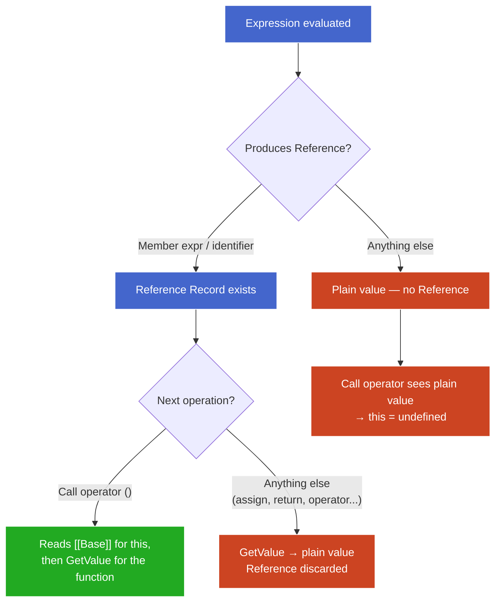

# The Reference Type

**TL;DR:** When the engine evaluates a member expression (`obj.greet`) or a plain identifier (`fn`), it produces a Reference Record — a transient struct holding `{ base, name, strict }`. The call operator reads `[[Base]]` to determine `this`: object base → `this` = that object; Environment Record base → `this` = `undefined`. Any intervening operation (assignment, `return`, operators) calls GetValue, which extracts the value and discards the Reference — killing the `this` connection. That's the entire `this`-determination mechanism for normal calls.

## The problem: expression evaluation loses context

```js
const obj = {
  name: "obj",
  greet() { return this.name; }
};

const fn = obj.greet;

obj.greet();  // "obj"  — this === obj
fn();         // undefined (strict) / globalThis (sloppy)
```

Both calls invoke the same function object. The engine needs two things at the call site:

1. **What function do I call?** (the function object)
2. **What `this` do I pass?** (depends on *how* the function was referenced)

Once you evaluate `obj.greet` down to the function object, `obj` is gone — the function doesn't carry "I came from obj." The **Reference Record** is the spec's solution: a transient internal value that preserves the address (where the value lives + what name) alongside the context the call operator needs.

> **Aside — a Reference is not a JS value.** You can never hold one in a variable, pass it to a function, or inspect it. It exists only between expression evaluation and the operation that consumes it. Think of it as a "sticky note" the engine attaches to an expression result — "this value came from *here*." The call operator reads the sticky note, then discards it.

## Reference Record structure

| Field                | What it holds                                  | Purpose                                     |
| -------------------- | ---------------------------------------------- | ------------------------------------------- |
| `[[Base]]`           | The thing the property lives on (object or ER) | Becomes `this` at call time                 |
| `[[ReferencedName]]` | The property name (string or Symbol)           | Used by GetValue to do the actual lookup    |
| `[[Strict]]`         | `true` / `false`                               | Determines sloppy-mode `this` coercion      |

The Reference carries an *address* (base + name), not the value itself. GetValue follows the address to extract the value when needed.

## How References are produced

Every expression that designates a storage location produces a Reference Record. JS has exactly two such forms:

- **Identifiers:** `fn`, `x`, `console` — name a binding in an Environment Record.
- **Member expressions:** `obj.greet`, `arr[0]` — name a property on an object.

Everything else (arithmetic, call expressions, comma, conditional) evaluates to a plain value directly — no Reference.

When the engine evaluates one of these forms, it builds the Reference without looking up the value:

> **Find where the name lives → `[[Base]]`.**
> **The name itself → `[[ReferencedName]]`.**
> **Current strictness → `[[Strict]]`.**

The syntax determines which resolution mechanism runs:

| Expression type  | Example     | Resolution mechanism  | `[[Base]]` becomes          |
| ---------------- | ----------- | --------------------- | --------------------------- |
| Plain identifier | `fn`        | Identifier resolution | The ER where `fn` was found |
| Member expression| `obj.greet` | Property lookup       | The object (`obj`)          |

In `obj.greet`, both mechanisms fire in sequence: identifier resolution finds `obj` in an ER (one Reference), GetValue extracts the object, then property lookup finds `"greet"` on that object (a *new* Reference with the object as base). The Reference that reaches the call operator is always from the **final** resolution step.

### Chained access: `a.b.c()`

```js
const a = { b: { c() { return this; } } };
a.b.c();  // this === a.b (not a)
```

Each dot produces a new Reference. Only the last dot determines the base — `[[Base]]` is always the immediate object directly left of the final property access.

## GetValue — when the Reference collapses

GetValue is the spec operation that extracts the value from a Reference:

```
GetValue( Reference { base: obj, name: "greet", strict: false } )
  → obj["greet"]
  → <the function object>
```

It follows the address, performs the lookup, returns a plain JS value. The Reference is consumed — gone.

### When GetValue fires

**Any operation that needs the value (not the address) calls GetValue:**

- Assignment RHS: `let x = expr`
- `return expr`
- Function arguments: `fn(expr)`
- Operators: `+`, `-`, `===`, `&&`, etc.
- Comma operator: `(0, expr)`
- Conditional branches: `cond ? a : b`

### The one exception: grouping `( )`

The grouping operator passes through whatever its inner expression produces — including a Reference. It does *not* call GetValue.

```js
(obj.greet)();    // this === obj ✓ — grouping preserves the Reference
(0, obj.greet)(); // this === undefined — comma calls GetValue, strips it
```

### Why method extraction loses `this`

```js
function getMethod(obj) {
  return obj.greet;  // return calls GetValue → plain function object
}
getMethod(obj)();    // call expr produces plain value → no Reference → this = undefined
```

`return` needs the value to pass back — it calls GetValue, consuming the Reference (and its `base: obj`) inside the function. The outer call expression `getMethod(obj)` then produces a plain value, not a Reference. The outer `()` sees no `[[Base]]` → `this = undefined`.

## How the call operator uses the Reference

When the engine encounters `expr()`, it runs EvaluateCall:

```
1. Let ref = result of evaluating expr
2. Let func = GetValue(ref)          ← always extracts the function object
3. Determine thisValue:
   a. If ref is a Reference Record:
      - [[Base]] is an object  → thisValue = [[Base]]
      - [[Base]] is an ER      → thisValue = undefined
   b. If ref is NOT a Reference   → thisValue = undefined
4. Call func with thisValue
```

The engine checks what `ref` was *before* GetValue consumed it. It reads `[[Base]]` from the Reference to determine `this`, then uses the extracted function object to invoke.

### The three outcomes

| What the call operator sees       | `[[Base]]`          | `this` becomes  |
| --------------------------------- | ------------------- | --------------- |
| Reference with object base        | The object          | That object     |
| Reference with ER base            | An Environment Record | `undefined`   |
| Plain value (not a Reference)     | —                   | `undefined`     |

In sloppy mode, `undefined` is coerced to `globalThis` (legacy "default binding"). Strict mode leaves it as `undefined`.

### Applied: four patterns

```js
"use strict";
const obj = { name: "obj", greet() { return this.name; } };

obj.greet();          // Reference { base: obj }       → this = obj
(obj.greet)();        // grouping preserves Reference  → this = obj
(0, obj.greet)();     // comma calls GetValue          → this = undefined → TypeError
let g = obj.greet; g(); // g is identifier, base = ER → this = undefined → TypeError
```

All four reduce to the same decision tree — what does the call operator see?

## The Reference lifecycle



**† Legend:**
- Blue: Reference exists and is alive
- Green: Reference successfully consumed by call operator (`this` bound)
- Red: Reference stripped or never existed (`this` = `undefined`)

The critical path for `this` to work: the expression **must** be a Reference-producing form, **and** the very next operation must be the call operator. Any intervening operation calls GetValue and kills the Reference.

## Why this design?

The Reference type exists so the call operator can answer "what object was this method accessed on?" without the function object carrying that information. The function is a reusable value — it doesn't know or care where it lives. The Reference is the ephemeral context that connects a specific access path to a specific call.

This is why `this` is determined **at the call site, not at definition time** (for regular functions). The same function object can have different `this` values depending on the expression that precedes `()` — because different expressions produce different References (or no Reference at all).

## Quick reference

- **Why Reference Records exist** — the function object doesn't carry "where I was accessed from." The Reference preserves that context so the call operator can set `this`.
- **When created** — every identifier (`fn`) or member expression (`obj.greet`) evaluation produces one. Nothing else does.
- **When consumed (GetValue)** — any operation that needs the value: assignment, `return`, operators, arguments, comma, conditional. Grouping `()` is the sole exception (passes through).
- **How `this` is determined** — call operator reads `[[Base]]`: object → `this` = that object; ER → `this` = `undefined`; no Reference at all → `this` = `undefined`.
