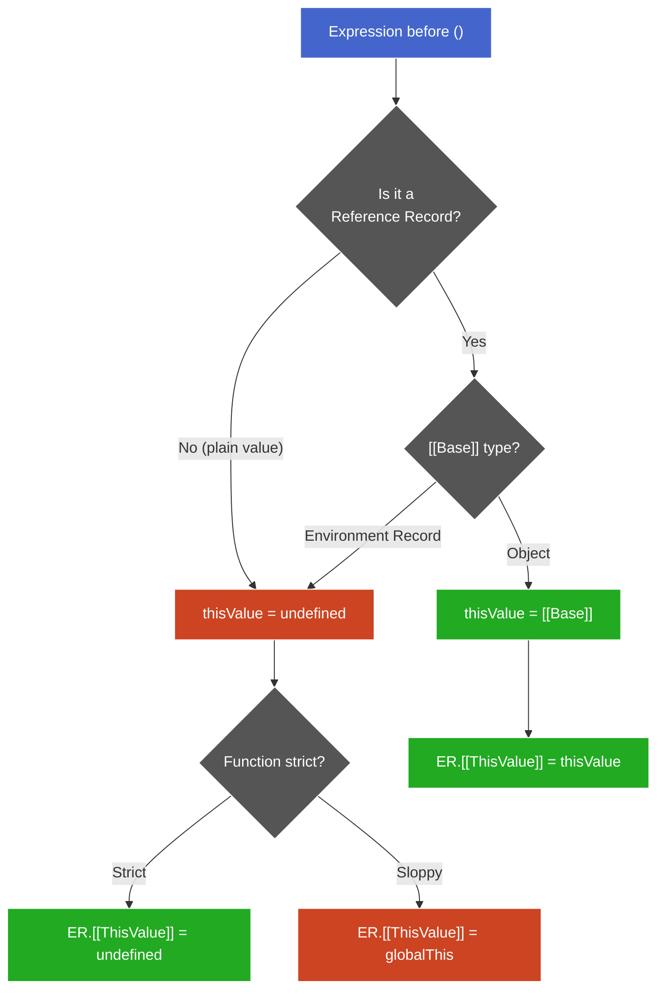

# `this` Determination

**TL;DR:** `this` in a normal call is determined by one rule: the call operator reads `[[Base]]` from the Reference Record that the expression before `()` produced. Object base → `this` = that object. ER base → `this` = `undefined`. No Reference at all → `this` = `undefined`. The result passes through OrdinaryCallBindThis (sloppy mode coerces `undefined` → `globalThis`; strict passes through unchanged), then lands in the Function ER's `[[ThisValue]]` slot, which the `this` keyword reads directly.

## The single rule: EvaluateCall

When the engine encounters `expr()`:

```
1. ref  = evaluate(expr)           — may be a Reference or a plain value
2. func = GetValue(ref)            — extracts the function object
3. thisValue:
     ref is Reference, [[Base]] is object  → thisValue = [[Base]]
     ref is Reference, [[Base]] is ER      → thisValue = undefined
     ref is NOT a Reference                → thisValue = undefined
4. Call func, passing thisValue
```

Three branches, one decision point: **what did the call operator see as `ref`?**

### Why ER base → `undefined`

An Environment Record is a spec-internal construct — not a JS value. The spec explicitly says: ER base → `thisValue = undefined`. This is the mechanism behind "plain calls don't have a `this`."

```js
"use strict";
function standalone() { return this; }

standalone();  // undefined
// ref = Reference { base: globalER, name: "standalone" }
// [[Base]] is an ER → thisValue = undefined
```

## Three terms, three layers

| Term | What it is | Layer |
|------|-----------|-------|
| `thisValue` | Temporary value computed by EvaluateCall (reading `[[Base]]`). A local in the spec algorithm — not stored yet. | Call-site evaluation (transient) |
| `[[ThisValue]]` | Internal slot on the Function Environment Record. `thisValue` is written here when the new EC is created. Persists for the call's lifetime. | Storage (per-call ER slot) |
| `this` | Source-code keyword. `ResolveThisBinding()` reads `[[ThisValue]]` from the current Function ER. | Source-level access (read-only) |

The pipeline:


**† Legend:**
- Blue: determination — Reference base rule decides `thisValue`
- Red: coercion — OrdinaryCallBindThis; only mutates in sloppy mode
- Green: storage and read — `[[ThisValue]]` slot, `this` keyword

## `this` is per-call, not per-function

`[[ThisValue]]` lives in the ER, created fresh per call. The function object has no `this` slot — it doesn't carry or remember `this`.

```js
"use strict";
function show() { return this; }

const a = { show };
const b = { show };

a.show();  // Ref { base: a } → new ER₁, [[ThisValue]] = a
b.show();  // Ref { base: b } → new ER₂, [[ThisValue]] = b
show();    // Ref { base: scriptER } → new ER₃, [[ThisValue]] = undefined
```

Same function object, three different `this` values. Each `()` creates its own ER with its own `[[ThisValue]]`. This is the structural reason method extraction loses `this` — the old ER (with its `[[ThisValue]]`) no longer exists; the new call site produces a new Reference with a different base.

## OrdinaryCallBindThis — strict vs sloppy coercion

Between "call site computes `thisValue`" and "ER stores it," one more step runs:

```
OrdinaryCallBindThis(F, thisValue):
    if F.[[ThisMode]] is "strict":
        actualThis = thisValue                    // pass through
    else:  // sloppy
        if thisValue is undefined or null:
            actualThis = globalThis               // coerce
        else:
            actualThis = ToObject(thisValue)      // wrap primitives
```

`[[ThisMode]]` is a slot on the function object, set at creation time:

| Function type | `[[ThisMode]]` |
|---|---|
| Strict-mode function | `"strict"` |
| Sloppy-mode function | `"global"` |
| Arrow function | `"lexical"` (skips OrdinaryCallBindThis entirely) |

> **Aside —** This coercion is genuinely arbitrary — a legacy ES1 decision ("methods should always have an object as `this`"). Strict mode removed it. Modules and classes are strict by default, so in modern code the coercion never fires.

## The decision tree — all normal-call cases



### What produces each case

| `ref` state | How you get there | Example |
|---|---|---|
| Reference with object base | Member expression directly before `()` | `obj.method()`, `arr[0]()`, `obj["m"]()` |
| Reference with ER base | Identifier directly before `()` | `fn()`, `myFunc()` |
| Not a Reference (plain value) | Any operation called GetValue before `()` reached the result | `(0, obj.m)()`, `fn()` after `const fn = obj.m` |

### Reference killers (call GetValue, discard the Reference)

- **Assignment** (`=`, `+=`, destructuring)
- **Argument passing**
- **Comma operator**
- **Conditional operator** (`? :`)
- **Logical operators** (`&&`, `||`, `??`)
- **`return`**

### Reference preservers

- **Grouping `( )`** — transparent, returns operand as-is (spec-defined)
- **Optional chaining `?.`** — preserves the Reference for the call; designed as a drop-in null guard
- **Member access** (`.` / `[]`) — consumes the *previous* Reference but produces a *new* one with the resolved object as base

## Worked example: method extraction traced through the pipeline

```js
"use strict";
const obj = { name: "obj", greet() { return this.name; } };

// --- Direct call ---
obj.greet();
// 1. obj.greet → Ref { base: obj, name: "greet" }
// 2. Call operator: [[Base]] = obj (object) → thisValue = obj
// 3. OrdinaryCallBindThis: strict → pass through
// 4. New ER: [[ThisValue]] = obj
// 5. this keyword → obj → this.name → "obj"

// --- Extraction via assignment ---
const fn = obj.greet;  // assignment calls GetValue → plain function, Ref consumed
fn();
// 1. fn → Ref { base: scriptER, name: "fn" }
// 2. Call operator: [[Base]] = scriptER (ER) → thisValue = undefined
// 3. OrdinaryCallBindThis: strict → pass through
// 4. New ER: [[ThisValue]] = undefined
// 5. this keyword → undefined → this.name → TypeError

// --- Extraction via comma ---
(0, obj.greet)();
// 1. Comma evaluates obj.greet → Ref { base: obj } → GetValue → plain function
// 2. Call operator sees plain value (not a Reference) → thisValue = undefined
// 3–5. Same as above → TypeError

// --- Grouping (no extraction) ---
(obj.greet)();
// 1. Grouping passes through → Ref { base: obj, name: "greet" } survives
// 2. Call operator: [[Base]] = obj → thisValue = obj
// 3–5. Same as direct call → "obj"
```

## Quick reference

- **The one rule** — call operator reads `[[Base]]` from the Reference: object → `this` = that object; ER or no Reference → `this` = `undefined`.
- **Three terms** — `thisValue` (transient computation), `[[ThisValue]]` (ER slot storage), `this` (keyword read accessor). Same value, different lifecycle stages.
- **Per-call, not per-function** — `[[ThisValue]]` lives in the ER (fresh per call). The function object carries no `this`.
- **Sloppy coercion** — OrdinaryCallBindThis replaces `undefined`/`null` with `globalThis` in sloppy mode. Strict mode passes through. Arbitrary legacy behavior.
- **Reference killers** — assignment, argument passing, comma, conditional, logical operators, `return`. All call GetValue.
- **Reference preservers** — grouping `()`, optional chaining `?.()`, member access (produces a new Reference).
