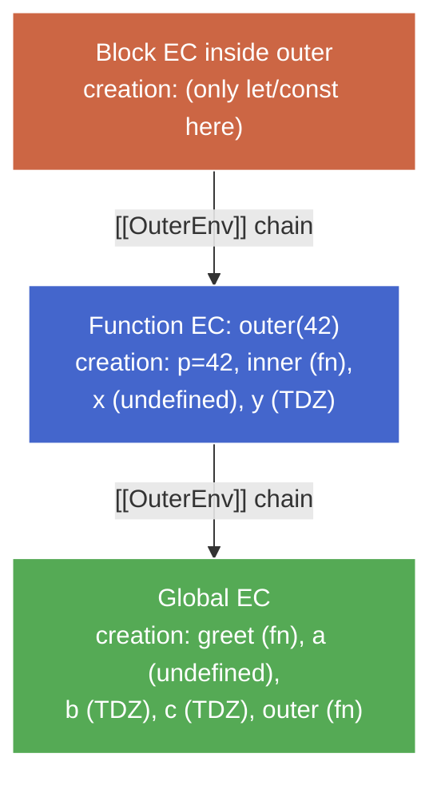

# Creation & Execution Phases — Draft

_Teaching draft. Will be rewritten into final note after chunk confirmation._

## Where we are

We have the container (EC + ERs from `execution-context.md`) and the 3-stage lifecycle (`variable-lifecycle.md`). Now we zoom in on the two-phase algorithm that fills the container — what _actually_ happens when a script starts or a function is called.

## The axiom

**Every EC executes in two phases: creation, then execution.** Nothing runs during creation. Everything runs during execution. All hoisting, TDZ, and scope-entry behavior are _consequences_ of what happens in creation.

## Part 1 — Creation phase: the setup pass

When an EC is pushed onto the stack (script starts, function called, block entered), the engine runs a **setup pass** before executing any statements.

The setup pass does three things, in order:

1. **Create the top-level ER** for this EC (Function ER for a function call, Global ER for a script). Block ERs are _not_ created here — they're created later, during execution, when control flow reaches the `{`. A block inside `if (false)` never creates an ER at all.
2. **Scan the scope** for declarations (the engine already knows these from parsing — it's not re-parsing).
3. **Register each declared name** in the appropriate ER, applying the per-keyword rule below.

### The per-keyword rule — what each declaration does in creation

| Declaration form    | In creation phase, the binding is…                        |
| ------------------- | --------------------------------------------------------- |
| `function foo() {}` | **declared AND initialized to the function object**       |
| `var x`             | declared AND initialized to `undefined`                   |
| `let x` / `const x` | declared ONLY (uninitialized → TDZ)                       |
| `class C {}`        | declared ONLY (uninitialized → TDZ)                       |
| function params     | declared AND initialized to the argument (in Function ER) |

This table is the _entire_ hoisting story. "Hoisting" is just the name for the consequence of this setup pass. No code moves. No magic. The engine walks the scope once, registers names per keyword.

### Why the asymmetry between `function foo() {}` and `var foo = function() {}`

Both textually look like "a function named `foo`." But:

- `function foo() {}` is a **function declaration** — a single syntactic unit. The engine can bind the name and the function object in one shot.
- `var foo = function() {}` is **two things** — a `var` declaration _and_ an assignment expression. The declarator hoists (stage 1+2 → `undefined`); the `= function() {...}` is a statement that only runs in the execution phase.

The second form's RHS can be _anything_ — `var x = computeIt()`. The engine can't evaluate arbitrary expressions during creation (no code runs then). So all `var` declarators uniformly initialize to `undefined` in creation, and the assignment happens later.

## Part 2 — Execution phase: the runtime pass

After the setup pass finishes, the engine executes statements top-to-bottom. This is where:

- `var` assignments fire — stage 3 (assignment)
- `let`/`const` initializations fire at the declarator line — stage 2 (initialization), closes TDZ
- Function calls push new ECs (each runs its own creation phase)
- Control flow, expressions, side effects happen

## Worked example — a complete trace

```js
// Script EC created — creation phase about to run

console.log(a); // L1
console.log(b); // L2
console.log(c); // L3
greet(); // L4

var a = 1; // L5
let b = 2; // L6
const c = 3; // L7

function greet() {
  // L8
  console.log("hi");
}
```

### Creation phase (before L1 runs)

The Global EC is created. Its pointers:

- **LexicalEnvironment** → Global ER
- **VariableEnvironment** → Global ER

(At global level, both point to the same Global ER. They only diverge when blocks are entered.)

The engine scans the whole script top-level. Names registered in the Global ER:

| Name    | Kind                 | Goes to                        | Initial state       |
| ------- | -------------------- | ------------------------------ | ------------------- |
| `greet` | function declaration | Object ER (`globalThis.greet`) | the function object |
| `a`     | `var`                | Object ER (`globalThis.a`)     | `undefined`         |
| `b`     | `let`                | Declarative ER (hidden table)  | uninitialized (TDZ) |
| `c`     | `const`              | Declarative ER (hidden table)  | uninitialized (TDZ) |

Note: the ER-routing half of each row is from chunk 2 (`execution-context.md`) — Declarative vs Object ER components of the Global ER. The "initial state" column is the creation-phase rule for this chunk.

### Execution phase (statements now run top-to-bottom)

- **L1** `console.log(a)` → `a` is in the Object ER with value `undefined` → prints `undefined`
- **L2** `console.log(b)` → `b` is declared but uninitialized in the Declarative ER → **`ReferenceError`** (TDZ)

Execution halts at L2. Nothing after runs. If we comment out L2 and L3:

- **L4** `greet()` → `greet` is already the function object → prints `hi`
- **L5** `a = 1` → stage 3 (assignment), overwrites `undefined` with `1`
- **L6** `let b = 2` → stage 2 (initialization), TDZ for `b` ends, value becomes `2`
- **L7** `const c = 3` → stage 2 (initialization), TDZ for `c` ends, value becomes `3`

## Part 3 — Function calls push new ECs (each with its own creation phase)

Every function call creates a **new Function EC** and runs its own creation phase before executing the body.

```js
function outer(p) {
  // L1
  console.log(inner); // L2
  var x = 1; // L3
  let y = 2; // L4
  function inner() {} // L5
  return x + y; // L6
}

outer(42); // L8
```

When L8 calls `outer(42)`:

1. **A new Function EC is pushed** onto the call stack.
2. **A new Function ER** is created (Declarative ER + `[[ThisValue]]` / `arguments` / `new.target`). Its `[[OuterEnv]]` points to the Global ER (because `outer` was _defined_ at global scope — lexical scoping). The EC's pointers are set:
   - **LexicalEnvironment** → this Function ER
   - **VariableEnvironment** → this Function ER

   (Both start at the same ER. LexicalEnvironment will move if a block is entered; VariableEnvironment stays here for the function's lifetime.)

3. **Creation phase runs** over `outer`'s body. All bindings land in the Function ER:
   - `p` → parameter, initialized to `42`
   - `inner` → function declaration, initialized to the function object
   - `x` → `var`, initialized to `undefined` (registered via VariableEnvironment)
   - `y` → `let`, uninitialized / TDZ (registered via LexicalEnvironment)
4. **Execution phase runs:**
   - L2 → `inner` is already the function object → prints `[Function: inner]` (no error)
   - L3 → `x = 1`
   - L4 → `let y = 2` initializes `y`, TDZ ends
   - L6 → returns `3`
5. When `outer` returns, its EC is **popped**. The Function ER becomes unreachable and eligible for GC — _unless_ a closure is holding a reference to it (deferred to `scope-lexical.md`).

## Part 4 — Blocks get their own setup too (but only for `let`/`const`/`function` in strict)

Entering a block `{ ... }`:

1. A new **Declarative ER** is created for the block, `[[OuterEnv]]` → enclosing ER.
2. The EC's **LexicalEnvironment** pointer updates to this new ER (VariableEnvironment does not move).
3. A setup pass registers `let`/`const`/`class` declarations from the block (stage 1 / declaration only — TDZ starts here).
4. Block statements execute.
5. On block exit, LexicalEnvironment reverts. The block ER becomes unreachable (unless captured by a closure).

`var` declarations inside a block skip the block ER entirely — they register in the VariableEnvironment (the enclosing function or global ER). That's _why_ `var` is function-scoped, not block-scoped.

```js
function f() {
  {
    var a = 1;
    let b = 2;
  }
  console.log(a); // 1 — a is in f's Function ER
  console.log(b); // ReferenceError — b was in the block ER, gone
}
```

## The full picture — one call stack snapshot



Every frame on the call stack went through creation → execution. The `[[OuterEnv]]` chain is fixed at creation time by lexical position (where the function was _defined_), not call position.

## Compressed takeaway

- **Creation = setup pass.** Names get registered per keyword-specific rule. No code runs.
- **Execution = runtime pass.** Statements run top-to-bottom using the bindings created above.
- **Per-keyword rule in creation:** `function` → declared + initialized to fn; `var`/params → declared + initialized to `undefined`/arg; `let`/`const`/`class` → declared only.
- **Every EC (script, function, block) gets its own creation phase.**
- **Hoisting is not a mechanism** — it's the observable name for the creation phase's effect on names.
