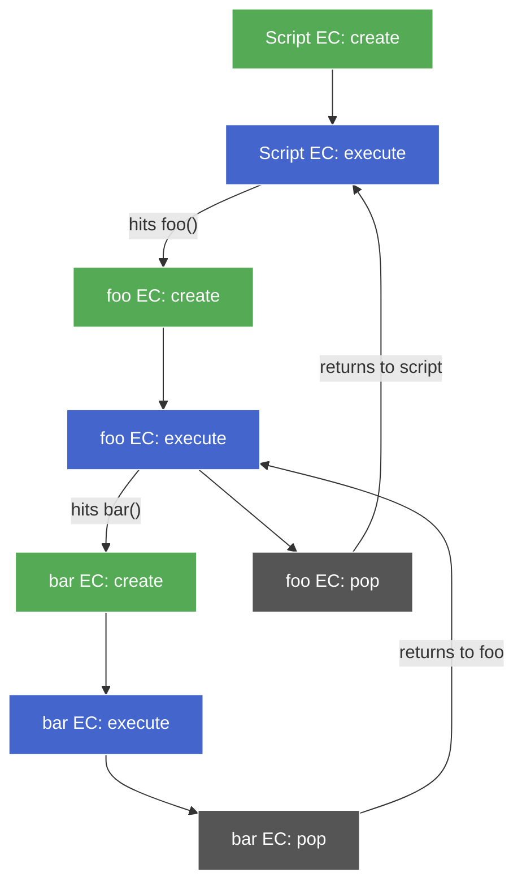
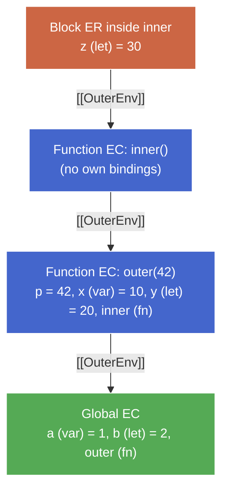

# Creation & Execution Phases

**TL;DR:** Every Execution Context runs in two passes — a **creation phase** that registers bindings (no code runs) followed by an **execution phase** that runs statements top-to-bottom. The per-keyword rule applied during creation (`function` → declared + initialized; `var`/params → declared + initialized to `undefined`/arg; `let`/`const`/`class` → declared only) is the entire hoisting story. Every EC — script, function, block — gets its own create→execute pair, and nested calls produce nested pairs. That nesting _is_ the call stack.

## The axiom

> **Every EC executes in two phases: creation, then execution. Nothing runs during creation. Everything runs during execution.**

All hoisting, TDZ, and scope-entry behavior are _consequences_ of this. No code movement. No magic. A single setup pass walks the scope and registers names; then a runtime pass executes statements using those pre-registered bindings.

The 3-stage lifecycle (declaration → initialization → assignment) from [variable-lifecycle.md](variable-lifecycle.md) maps directly onto these phases — stage 1 always fires in creation; stages 2 and 3 fire in either phase depending on the keyword. The EC and ER machinery ([execution-context.md](execution-context.md)) is the container; this note is the algorithm that fills it.

## Creation phase — the setup pass

When an EC is pushed (script starts, function called, block entered), the engine runs a setup pass before executing any statements. Three things happen in order:

1. **Create the top-level ER for this EC** — Function ER for a function call, Declarative ER for a block, Global ER for a script. Block ERs are _not_ created eagerly for every `{...}` in source — they're created when control flow actually reaches the `{`. A block inside `if (false)` never creates an ER at all.
2. **Scan the scope for declarations.** The engine already knows these from parsing — it's not re-parsing the source.
3. **Register each declared name** in the appropriate ER, applying the per-keyword rule below.

### The per-keyword rule

This table is the entire mental model for what the creation phase does:

| Declaration form    | In creation phase, the binding is…                        |
| ------------------- | --------------------------------------------------------- |
| `function foo() {}` | **declared AND initialized to the function object**       |
| `var x`             | declared AND initialized to `undefined`                   |
| `let x` / `const x` | declared ONLY (uninitialized → TDZ until declarator runs) |
| `class C {}`        | declared ONLY (uninitialized → TDZ until declarator runs) |
| function params     | declared AND initialized to the argument (in Function ER) |

"Hoisting" is just the observable name for this table's effect on names. Nothing moves; names simply exist (with keyword-specific initial state) before the first statement runs.

### Why the asymmetry — `function foo() {}` vs `var foo = function() {}`

Both textually look like "a function named `foo`," but they behave very differently at call time before their line:

```js
console.log(typeof a); // "function" — a is already the function object
console.log(typeof b); // "undefined" — b exists but holds undefined

function a() {}
var b = function () {};
```

The difference falls directly out of the per-keyword rule:

- `function foo() {}` is a **function declaration** — one syntactic unit. Creation registers the name _and_ initializes it to the function object in one shot.
- `var foo = function() {}` is **two things** — a `var` declaration _and_ an assignment expression. Creation handles the declarator (stage 1+2 → `undefined`); the `= function() {...}` is a statement that only runs in the execution phase.

The second form's RHS could be any expression — `var x = computeIt()`. Since no code runs during creation, the engine can't evaluate the RHS early. So all `var` declarators uniformly initialize to `undefined` in creation, and any assignment waits for execution.

## Execution phase — the runtime pass

After creation finishes, statements execute top-to-bottom. This is where:

- `var` assignments fire — stage 3.
- `let`/`const` initializations fire at the declarator line — stage 2, TDZ ends.
- Function calls push new ECs (each runs its own creation phase).
- Control flow, expressions, side effects happen.

## Worked example — a complete trace

```js
console.log(a); // L1
console.log(b); // L2
console.log(c); // L3
greet(); // L4

var a = 1; // L5
let b = 2; // L6
const c = 3; // L7

function greet() {
  // L8
  console.log("hi");
}
```

### Creation phase (before L1 runs)

The Global EC is created. Its pointers:

- **LexicalEnvironment** → Global ER
- **VariableEnvironment** → Global ER

(At global level, both point to the same Global ER — they diverge only when a block is entered.)

The engine scans the script's top level and registers names in the Global ER:

| Name    | Kind                 | Routed to                      | Initial state       |
| ------- | -------------------- | ------------------------------ | ------------------- |
| `greet` | function declaration | Object ER (`globalThis.greet`) | the function object |
| `a`     | `var`                | Object ER (`globalThis.a`)     | `undefined`         |
| `b`     | `let`                | Declarative ER (hidden table)  | uninitialized (TDZ) |
| `c`     | `const`              | Declarative ER (hidden table)  | uninitialized (TDZ) |

The "routed to" column is Global ER internals from [execution-context.md](execution-context.md); the "initial state" column is the per-keyword rule for this chunk.

### Execution phase

- **L1** `console.log(a)` → `a` is in the Object ER with value `undefined` → prints `undefined`.
- **L2** `console.log(b)` → `b` is declared but uninitialized → **`ReferenceError`** (TDZ). Execution halts here; nothing after runs.

If we comment out L2 and L3:

- **L4** `greet()` → `greet` is already the function object → prints `hi`.
- **L5** `a = 1` → stage 3, overwrites `undefined`.
- **L6** `let b = 2` → stage 2, TDZ ends for `b`.
- **L7** `const c = 3` → stage 2, TDZ ends for `c`.

## Nested ECs — create→execute as a pair

Each EC does create→execute _as a pair_. It's not "all creation phases first, then all execution." A function call _during_ execution triggers a new create→execute pair for the callee — recursively nested inside the caller's execution phase:



Green = creation, blue = execution, grey = pop. Each call is a nested create→execute pair inside the caller's execution phase. This _is_ the call stack — every "push a frame" is "create→execute a new EC."

## Function calls — new EC with its own creation phase

```js
function outer(p) {
  // L1
  console.log(inner); // L2
  var x = 1; // L3
  let y = 2; // L4
  function inner() {} // L5
  return x + y; // L6
}

outer(42); // L8
```

When L8 calls `outer(42)`:

1. **A new Function EC is pushed.**
2. **A new Function ER is created** (Declarative ER + `[[ThisValue]]`, `arguments`, `new.target`). Its `[[OuterEnv]]` → Global ER — always set to the ER of the scope where the function's _source text lives_, not where it's called from (lexical scoping). EC pointers:
   - **LexicalEnvironment** → this Function ER
   - **VariableEnvironment** → this Function ER
3. **Creation phase runs** over `outer`'s body:
   - `p` → parameter, initialized to `42`.
   - `inner` → function declaration, initialized to the function object.
   - `x` → `var`, initialized to `undefined`.
   - `y` → `let`, uninitialized (TDZ).
4. **Execution phase:**
   - L2 → `inner` is already the function object → prints `[Function: inner]` (no error).
   - L3 → `x = 1`.
   - L4 → `let y = 2` initializes `y`, TDZ ends.
   - L6 → returns `3`.
5. When `outer` returns, the EC is popped. The Function ER is eligible for GC — unless a closure captures it (covered in `scope-lexical.md`).

## Block entry — LexEnv moves, VarEnv stays

Blocks get their own lightweight version of the same setup:

1. A new **Declarative ER** is created for the block. `[[OuterEnv]]` → enclosing ER.
2. The EC's **LexicalEnvironment** pointer updates to this new ER. VariableEnvironment does _not_ move.
3. A setup pass registers `let`/`const`/`class` declarations from the block (declaration only — TDZ starts).
4. Block statements execute.
5. On block exit, LexicalEnvironment reverts. The block ER is eligible for GC unless captured.

`var` declarations inside a block still register via the VariableEnvironment pointer — which points to the enclosing function or global ER, not the block ER. That pointer routing is _why_ `var` is function-scoped, not block-scoped:

```js
function f() {
  {
    var a = 1;
    let b = 2;
  }
  console.log(a); // 1 — a lives in f's Function ER
  console.log(b); // ReferenceError: b is not defined — block ER is gone
}
```

## Full picture — call stack snapshot

Execution paused inside the `if` block of `inner()`:

```js
var a = 1;
let b = 2;

function outer(p) {
  var x = 10;
  let y = 20;

  function inner() {
    if (true) {
      let z = 30; // ← execution is here
    }
  }

  inner();
}

outer(42);
```



Every frame on the call stack went through creation → execution. The `[[OuterEnv]]` chain is fixed at creation time by lexical position (where the function was _defined_), not call position.

## Compressed takeaway

- **Creation = setup pass.** Names registered per keyword-specific rule. No code runs.
- **Execution = runtime pass.** Statements run top-to-bottom using the pre-registered bindings.
- **Per-keyword creation rule:** `function` → declared + initialized to fn; `var`/params → declared + initialized to `undefined`/arg; `let`/`const`/`class` → declared only.
- **Every EC (script, function, block) gets its own create→execute pair.** Nested calls = nested pairs.
- **Block entry moves LexEnv, not VarEnv.** That's the mechanism behind `var`'s function-scoping.
- **Hoisting is not a mechanism** — it's the observable name for the creation phase's effect on names.
