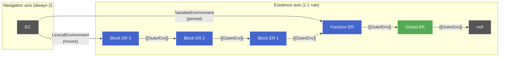
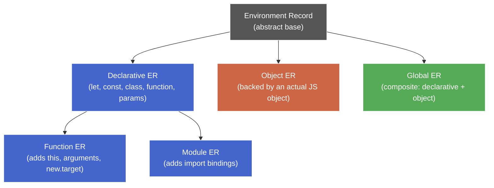
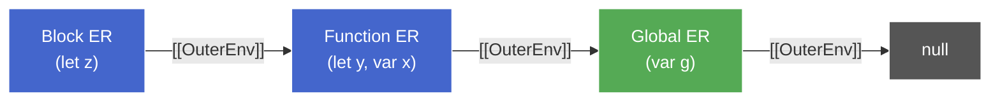
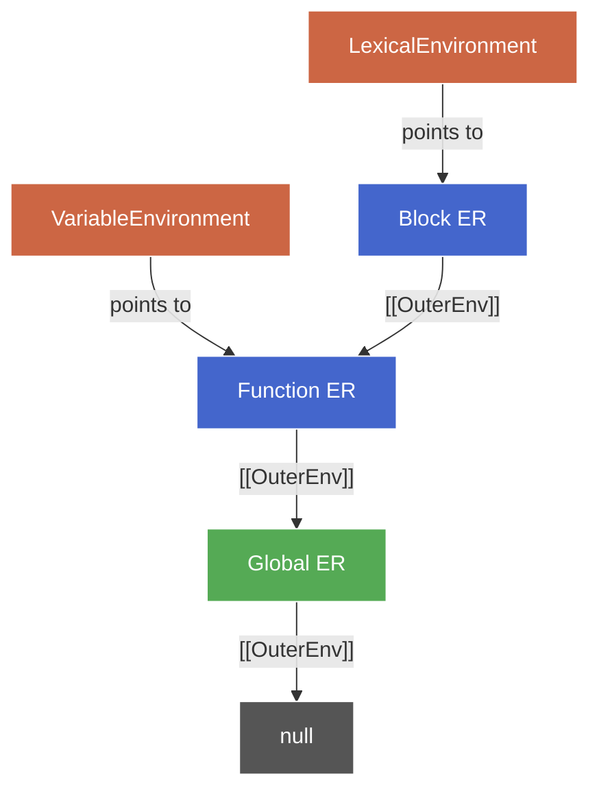
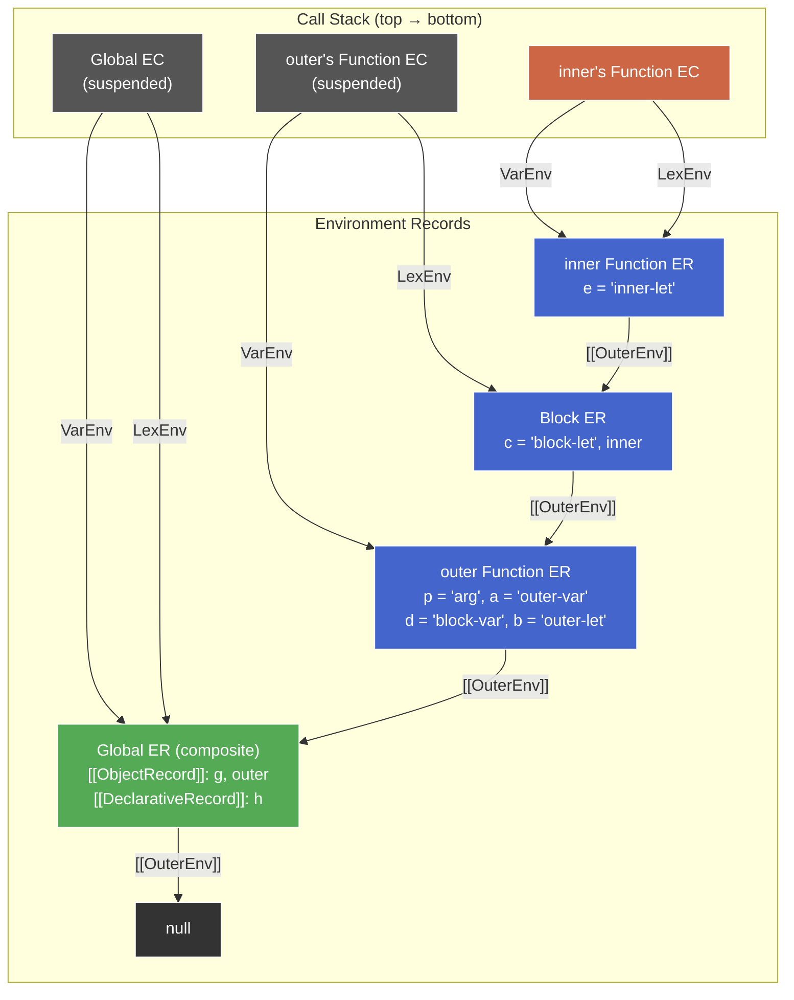

# Execution Context Internals

**TL;DR:** Every piece of JS code runs inside an Execution Context (EC) — a spec-level structure holding everything needed to execute: which realm it belongs to, and pointers to Environment Records (ERs) where bindings live. Name resolution is a walk up the `[[OuterEnv]]` chain of ERs. The differences between `var`, `let`/`const`, and global declarations all reduce to _which ER_ a binding lands in and _how that ER stores it_.

## Two axioms everything follows from

1. **Every unit of code runs inside an Execution Context** — the EC is the complete environment needed to execute: what names are visible, what `this` is, what realm it belongs to. Concretely: an EC is what the call stack stores — each frame is an EC. See [Connection to async-js](#connection-to-async-js).
2. **Name resolution is a lookup in a chain of Environment Records** — each EC holds pointers to ERs, and each ER has an `[[OuterEnv]]` link forming a chain. Resolving a name = walking that chain.

Hoisting, TDZ, scope chains, closures, and `this`-binding all follow from these two. This note builds the container; [creation-execution.md](creation-execution.md) fills it with the step-by-step walkthrough.

> **Aside — what is a spec-level data structure?**
>
> An EC is a **spec-level data structure** — a formally defined shape with named fields that exists only in the ECMAScript specification's model of execution. It's not a JS object you can `console.log`, and it doesn't prescribe how engines implement it internally. V8 may compile the equivalent of an EC lookup into a single machine instruction with no struct ever allocated.
>
> The double-bracket notation (`[[Realm]]`, `[[OuterEnv]]`, `[[ThisValue]]`) marks internal fields that no JS code can directly access. They exist so the spec can define behavior unambiguously. Some have JS-visible reflections (e.g. `Object.getPrototypeOf()` exposes `[[Prototype]]`), but the slot itself is spec-level.

## Execution Context types

The spec defines three kinds:

| EC type      | Created when…                                | Example                              |
| ------------ | -------------------------------------------- | ------------------------------------ |
| **Global**   | Script/module starts executing               | Top-level code in a `<script>` tag   |
| **Function** | A function is called                         | `foo()`, `obj.method()`, `new Bar()` |
| **Eval**     | `eval()` is called (rare, mostly irrelevant) | `eval("var x = 1")`                  |

Every running program has exactly one _running_ EC at any moment (single-threaded engine). The stack of suspended ECs is the call stack from async-js — now you can see what each "frame" actually is.

## Components of an Execution Context

```
EC.Realm                = <Realm Record>              -- held directly
EC.LexicalEnvironment   = <pointer to an ER>          -- let/const/class/function declarations
EC.VariableEnvironment  = <pointer to an ER>          -- var declarations
EC.PrivateEnvironment   = <pointer to an ER>          -- (ES2022+) class #private fields
(Function ECs also have: Generator, ScriptOrModule, etc.)
```

`Realm` is a direct value — the EC holds the Realm Record itself. `LexicalEnvironment` and `VariableEnvironment` are **pointers** — they don't hold bindings directly, they point to Environment Record instances that do. The ERs are separate structures; the EC just holds references to them.

This pointer-vs-instance distinction matters: when you enter a block, `LexicalEnvironment` is updated to point to a new block ER — the pointer moves, the old ER doesn't change. `VariableEnvironment` never moves within a function. See [LexicalEnvironment vs VariableEnvironment](#lexicalenvironment-vs-variableenvironment--why-two-pointers) below.

## Realm Record — the universe a script lives in

A **Realm Record** is the complete JS universe for a script:

| Field              | What it is                                                                         |
| ------------------ | ---------------------------------------------------------------------------------- |
| `[[Intrinsics]]`   | The built-in objects for this realm (`Object.prototype`, `Array`, `Promise`, etc.) |
| `[[GlobalObject]]` | The global object — the same object as `globalThis`/`window`/`global`              |
| `[[GlobalEnv]]`    | The Global Environment Record (top-level scope)                                    |

Each `<iframe>` gets its own Realm. That's why `[] instanceof Array` can be `false` across frames — the `Array` in one realm is a different object than in another.

> **Aside — why does the Realm hold `[[GlobalEnv]]` when the `[[OuterEnv]]` chain already reaches it? ** Two reasons: (1) O(1) access — the chain can be arbitrarily deep, and spec algorithms that need the Global ER (e.g. `var` hoisting checks in `eval`, script-level declaration instantiation) shouldn't walk N links every time. (2) The Realm owns the Global ER — it's created at Realm initialization, before any EC exists. Some algorithms (script setup, module linking) need it when the EC stack is empty and no chain is available to walk.

**How `globalThis` enters the picture:** `globalThis`, `window` (browser), and `global` (Node) are all the same object — `[[GlobalObject]]` from the Realm Record. The Global Environment Record uses this object as backing storage for certain declarations (`var`, `function`). How that routing works is covered in [Global Environment Record](#global-environment-record) below.

## Environment Records — where bindings actually live

An **Environment Record** (ER) is a spec-level structure that holds name→value bindings.

Two independent questions govern how ERs work. Mixing them up is the most common source of confusion — they look related but operate on different axes:

**Axis 1 — Existence (the 1:1 rule):** every scope boundary (block, function, global) creates exactly one fresh ER. One scope, one ER — no sharing, no reuse. Nesting depth determines how many ERs exist: a function with three nested blocks means four ERs (function + three blocks). The Global ER is no exception; its only wrinkle is _internal_ storage (details in [Global Environment Record](#global-environment-record)).

**Axis 2 — Navigation (always two pointers):** the EC doesn't contain ERs — it holds exactly two pointers that navigate among however many ERs exist:

- `LexicalEnvironment` → points to the ER of the **innermost scope currently executing**. Moves when entering/exiting blocks.
- `VariableEnvironment` → pinned to the **function-scope ER**. Never moves within a function.

The pointer count is fixed at two regardless of how many ERs exist. `LexicalEnvironment` moves to track the current block; `VariableEnvironment` stays put.



Name resolution walks the `[[OuterEnv]]` chain from whichever ER the relevant pointer targets — so bindings from enclosing scopes are visible, but new bindings are only _created_ in the ER targeted by the relevant pointer (`let`/`const` → `LexicalEnvironment`, `var` → `VariableEnvironment`).

The spec defines a type hierarchy — think of it like a class inheritance hierarchy, where each subtype adds fields or changes storage behavior:



### Declarative Environment Record

The normal case. Holds bindings in an internal hidden table — not a JS object, not enumerable, not accessible via any API. `let`, `const`, function params, `class` declarations all go here. Function scopes and block scopes both use this type.

### Object Environment Record

A thin spec-level wrapper around a real JS object. It holds a `[[BindingObject]]` field — a reference to the JS object it delegates to. Every ER operation forwards to a property operation on that object:

| ER operation        | Property operation on `[[BindingObject]]` |
| ------------------- | ----------------------------------------- |
| Create binding `x`  | `DefineOwnProperty("x", ...)`             |
| Set `x = 1`         | `Set("x", 1)`                             |
| Read `x`            | `Get("x")`                                |
| Check if `x` exists | `HasProperty("x")`                        |

No hidden table — the binding table _is_ the object's properties. Used for `with` statements (legacy, ignore) and the object component of the Global ER, where `[[BindingObject]]` is `globalThis`.

### Global Environment Record

A composite — not itself backed by a JS object, but a router that delegates to two sub-ER instances:

```
Global Environment Record  (composite router, not itself an object)
├── [[DeclarativeRecord]]  →  instance of Declarative ER (hidden table)
├── [[ObjectRecord]]       →  instance of Object ER backed by globalThis
└── [[VarNames]]           →  bookkeeping list (see below)
```

The Global ER never stores bindings directly. Every operation (create, read, write) is forwarded to one sub-ER or the other based on the declaration keyword.

`[[DeclarativeRecord]]` and `[[ObjectRecord]]` are **fields on the Global ER**, each holding an instance of the corresponding type (Declarative ER and Object ER respectively). Bindings live inside those instances:

- `let x` at global scope → lives in the **Declarative ER instance** referenced by `[[DeclarativeRecord]]`.
- `var y` at global scope → lives in the **Object ER instance** referenced by `[[ObjectRecord]]` — backed by `globalThis`.

At global scope, declarations are routed to one component or the other based on keyword:

| Declaration         | Routed to               | Consequence                              |
| ------------------- | ----------------------- | ---------------------------------------- |
| `var x = 1`         | `[[ObjectRecord]]`      | Property on `window` → `window.x === 1`  |
| `function foo() {}` | `[[ObjectRecord]]`      | `window.foo` exists                      |
| `let y = 2`         | `[[DeclarativeRecord]]` | Hidden table — `window.y` is `undefined` |
| `const z = 3`       | `[[DeclarativeRecord]]` | Hidden table — `window.z` is `undefined` |
| `class C {}`        | `[[DeclarativeRecord]]` | Hidden table — `window.C` is `undefined` |

This is why `var x = 1` at global level creates `window.x` but `let y = 2` does not — they land in different components of the same Global ER.

> **Aside — why the composite design?** In ES3, all global declarations were `var`/`function` and the global scope _was_ the global object. When ES6 added `let`/`const`, they needed block scoping and TDZ — which don't work if the binding is a plain object property. So the Declarative ER component was added alongside the existing Object ER. Legacy declarations still route to the object (backward compat); new ones route to the hidden table.

### Function Environment Record

Extends Declarative ER with `[[ThisValue]]`, `arguments`, and `new.target`. Created fresh on every function call — each call gets its own instance. When the function returns, the EC is popped and the ER becomes unreachable, eligible for GC. Exception: if a closure captures a variable, it holds a reference to the ER, keeping it alive. See [scope-lexical.md](scope-lexical.md).

Inside a function, no Object ER exists in the local scope — declarations here never create properties on `globalThis`. All local bindings land in Declarative ERs. The difference is which one:

- `var` → Function ER (via `VariableEnvironment`, never moves)
- `let`/`const` → current block ER (via `LexicalEnvironment` — which is the Function ER itself if there's no enclosing block)

### Module Environment Record

Extends Declarative ER with import bindings — live links to the exporting module's bindings (not copies).

## The `[[OuterEnv]]` chain

Every ER has an `[[OuterEnv]]` field — either `null` (Global ER, the top) or a reference to the enclosing ER. This is the scope chain.



Name resolution: start at the current ER, check if the name exists. If not, follow `[[OuterEnv]]` and repeat. Hit `null` → `ReferenceError`. This is the formal mechanism behind lexical scoping — the chain is fixed at the point where a function is _defined_, not where it's _called_. Full treatment in [scope-lexical.md](scope-lexical.md).

## LexicalEnvironment vs VariableEnvironment — why two pointers?

In a simple function with no blocks, both pointers point to the same Function ER. They diverge when a block is entered:

```js
function outer() {
  // L1
  var a = 1; // L2
  let b = 2; // L3
  {
    // L4 — block starts
    var c = 3; // L5
    let d = 4; // L6
  } // L7 — block ends
}
```

When `outer()` is called:

- **VariableEnvironment** → Function ER (will hold `a` and `c`)
- **LexicalEnvironment** → same Function ER (holds `b`)

When execution enters the block at L4:

- A new Declarative ER is created for the block, `[[OuterEnv]]` → Function ER
- **LexicalEnvironment** updates to point to the new block ER (holds `d`)
- **VariableEnvironment** stays at the Function ER

`var c` at L5 goes into the Function ER via VariableEnvironment. `let d` at L6 goes into the block ER via LexicalEnvironment. When the block ends at L7, LexicalEnvironment reverts to the Function ER.

**The invariant:** VariableEnvironment never moves within a function. LexicalEnvironment tracks current block depth. This is the mechanism behind `var` being function-scoped and `let`/`const` being block-scoped — they're stored via different pointers.

### Pointer behavior summary

| Pointer               | Points to                                         | Moves?                                    |
| --------------------- | ------------------------------------------------- | ----------------------------------------- |
| `VariableEnvironment` | Nearest function-or-global scope ER               | Never (pinned for the lifetime of the EC) |
| `LexicalEnvironment`  | Innermost scope currently executing (any ER type) | Yes — updates on block entry/exit         |

Both pointers can (and do) point to the same ER — this is the default state at function entry before any block is entered. They diverge only when execution enters a block scope, at which point `LexicalEnvironment` moves to the new block ER while `VariableEnvironment` stays put.

Note that `VariableEnvironment` doesn't always target a Function ER specifically — in the Global EC it points to the Global ER. The invariant is about scope level (function-or-global), not ER subtype.

### One chain, two entry points

`VariableEnvironment` is not a parallel lookup structure — it's always one of the ERs reachable by walking the `[[OuterEnv]]` chain from `LexicalEnvironment`. The two pointers are two entry points into the **same** chain:



`LexicalEnvironment` is a **moving cursor** — it slides to the innermost block ER as blocks open and reverts as they close. `VariableEnvironment` is a **stable anchor** — pinned at the function-level ER further down that same chain.

The consequence for name resolution: all reads and writes during execution start from `LexicalEnvironment` and walk `[[OuterEnv]]`. `VariableEnvironment` is consulted only during the **creation phase** to know where to *install* `var` bindings. Once installed, those bindings are found by the normal chain walk — the engine doesn't use `VariableEnvironment` as a runtime lookup shortcut.

## `[[VarNames]]` and the `delete` behavior

The Global ER maintains a `[[VarNames]]` list — all names created via `var` or `function` at global level.

Every property on a JS object has a **property descriptor** with a `configurable` flag:

- `configurable: true` → `delete` works, property can be redefined
- `configurable: false` → `delete` returns `false`, property is permanent

When `var x = 1` routes to the Object ER (backed by `globalThis`), the spec creates the property with `configurable: false` — a declaration signals intent for a stable binding. A plain assignment (`window.y = 1`) uses `configurable: true`.

```js
var x = 1;
window.y = 1;

Object.getOwnPropertyDescriptor(window, "x");
// { value: 1, writable: true, enumerable: true, configurable: false }

Object.getOwnPropertyDescriptor(window, "y");
// { value: 1, writable: true, enumerable: true, configurable: true }

delete window.x; // false — non-configurable
delete window.y; // true
```

`[[VarNames]]` is the spec's own internal record on top of this — used by re-declaration checks and `eval` conflict detection algorithms that operate at the spec level, not the property level.

## Full walkthrough — EC and ER state at every line

The following sample exercises every scope boundary type: global, function, nested block, nested function. We trace the full spec-level state at each line.

```js
var g = "global"; // L1
let h = "hidden"; // L2

function outer(p) {
  // L3
  var a = "outer-var"; // L4
  let b = "outer-let"; // L5
  {
    // L6 — block opens
    let c = "block-let"; // L7
    var d = "block-var"; // L8

    function inner() {
      // L9
      let e = "inner-let"; // L10
      console.log(e, c, a, g); // L11
    } // L12

    inner(); // L13
  } // L14 — block closes
  console.log(a, d, b); // L15
} // L16

outer("arg"); // L17
```

### ER inventory (existence axis — 1:1 rule)

Before tracing pointers, count the ERs that will exist when execution reaches the deepest point (L11):

| ER instance           | Type                           | Holds bindings                                                                               | `[[OuterEnv]]`    |
| --------------------- | ------------------------------ | -------------------------------------------------------------------------------------------- | ----------------- |
| **Global ER**         | Global (composite)             | `g`, `outer` → `[[ObjectRecord]]`; `h` → `[[DeclarativeRecord]]`                             | `null`            |
| **outer Function ER** | Function (extends Declarative) | `p`, `a`, `d`, `arguments`, `[[ThisValue]]` (via VarEnv); `b` (via LexEnv at function level) | Global ER         |
| **Block ER** (L6–L14) | Declarative                    | `c`, `inner` (block-scoped function¹)                                                        | outer Function ER |
| **inner Function ER** | Function (extends Declarative) | `e`, `arguments`, `[[ThisValue]]`                                                            | Block ER          |

> ¹ In strict mode, `function` declarations inside blocks are block-scoped (`let`-like). In sloppy mode the behavior is more complex (legacy web compat). This walkthrough assumes strict mode.

### Line-by-line state

Each entry shows the **running EC** and its two pointers, plus the full `[[OuterEnv]]` chain from each pointer. Realm is the same throughout (single `<script>`, one realm) — noted once.

---

#### L1 — `var g = "global";`

| Field                   | Value                                                                                                              |
| ----------------------- | ------------------------------------------------------------------------------------------------------------------ |
| **Running EC**          | Global EC                                                                                                          |
| **Realm**               | The page's Realm Record (`[[GlobalObject]]` = `window`, `[[Intrinsics]]` = built-ins, `[[GlobalEnv]]` = Global ER) |
| **VariableEnvironment** | → Global ER (composite)                                                                                            |
| **LexicalEnvironment**  | → Global ER (same — no block entered)                                                                              |

`var g` routes through `VariableEnvironment` → Global ER → `[[ObjectRecord]]` (Object ER backed by `globalThis`). Result: `window.g === "global"`.

**Chain from both pointers:** `Global ER → null`

---

#### L2 — `let h = "hidden";`

| Field                   | Value       |
| ----------------------- | ----------- |
| **Running EC**          | Global EC   |
| **VariableEnvironment** | → Global ER |
| **LexicalEnvironment**  | → Global ER |

`let h` routes through `LexicalEnvironment` → Global ER → `[[DeclarativeRecord]]` (Declarative ER, hidden table). Result: `window.h === undefined`, but `h` resolves to `"hidden"` via the chain.

**Chain from both pointers:** `Global ER → null`

---

#### L3 — `function outer(p) {` (declaration hoisted, but call at L17 creates the EC)

The `function` declaration is hoisted during Global Declaration Instantiation — `outer` is created as a binding in `[[ObjectRecord]]` of the Global ER (so `window.outer` exists). No new EC yet — that happens at the call site (L17).

---

#### L17 — `outer("arg");` (call — new EC pushed)

A new **Function EC** is created and pushed onto the call stack.

| Field                   | Value                                     |
| ----------------------- | ----------------------------------------- |
| **Running EC**          | outer's Function EC                       |
| **Realm**               | Same Realm Record (inherited from caller) |
| **VariableEnvironment** | → outer Function ER (fresh instance)      |
| **LexicalEnvironment**  | → outer Function ER (same — no block yet) |

**outer Function ER contents (after creation phase):**

- `p` = `"arg"` (parameter binding)
- `a` = `undefined` (var, hoisted)
- `d` = `undefined` (var from L8, hoisted to function scope)
- `arguments` = Arguments object
- `b` = `<uninitialized>` (let, in TDZ until L5 executes)

**Chain from both pointers:** `outer Function ER → Global ER → null`

---

#### L4 — `var a = "outer-var";`

| Field                   | Value               |
| ----------------------- | ------------------- |
| **Running EC**          | outer's Function EC |
| **VariableEnvironment** | → outer Function ER |
| **LexicalEnvironment**  | → outer Function ER |

Assignment goes through `VariableEnvironment` → outer Function ER. `a` already exists (hoisted), now set to `"outer-var"`.

**Chain:** `outer Function ER → Global ER → null`

---

#### L5 — `let b = "outer-let";`

| Field                   | Value               |
| ----------------------- | ------------------- |
| **Running EC**          | outer's Function EC |
| **VariableEnvironment** | → outer Function ER |
| **LexicalEnvironment**  | → outer Function ER |

`let b` goes through `LexicalEnvironment` → outer Function ER (since no block is active, both pointers target the same ER). `b` exits TDZ, set to `"outer-let"`.

**Chain:** `outer Function ER → Global ER → null`

---

#### L6 — `{` (block opens)

A new **Declarative ER** (Block ER) is created:

- `[[OuterEnv]]` → outer Function ER
- Bindings: `c` = `<uninitialized>`, `inner` (block-scoped function)

**LexicalEnvironment moves.** VariableEnvironment stays.

| Field                   | Value                             |
| ----------------------- | --------------------------------- |
| **Running EC**          | outer's Function EC               |
| **VariableEnvironment** | → outer Function ER _(unchanged)_ |
| **LexicalEnvironment**  | → **Block ER** _(moved!)_         |

**Chain from LexicalEnvironment:** `Block ER → outer Function ER → Global ER → null`
**Chain from VariableEnvironment:** `outer Function ER → Global ER → null`

---

#### L7 — `let c = "block-let";`

| Field                   | Value               |
| ----------------------- | ------------------- |
| **Running EC**          | outer's Function EC |
| **VariableEnvironment** | → outer Function ER |
| **LexicalEnvironment**  | → Block ER          |

`let c` goes through `LexicalEnvironment` → Block ER. `c` exits TDZ, set to `"block-let"`.

---

#### L8 — `var d = "block-var";`

| Field                   | Value               |
| ----------------------- | ------------------- |
| **Running EC**          | outer's Function EC |
| **VariableEnvironment** | → outer Function ER |
| **LexicalEnvironment**  | → Block ER          |

`var d` goes through `VariableEnvironment` → outer Function ER (not the Block ER!). `d` was already hoisted there; now set to `"block-var"`. This is why `var` "escapes" blocks — it always targets the pinned pointer.

---

#### L13 — `inner();` (call — new EC pushed)

A new **Function EC** is created for `inner` and pushed on top.

| Field                   | Value                                              |
| ----------------------- | -------------------------------------------------- |
| **Running EC**          | inner's Function EC                                |
| **Realm**               | Same Realm Record                                  |
| **VariableEnvironment** | → inner Function ER (fresh instance)               |
| **LexicalEnvironment**  | → inner Function ER (same — no block inside inner) |

**inner Function ER contents:**

- `e` = `<uninitialized>` (let, TDZ)
- `arguments` = Arguments object
- `[[ThisValue]]` = `undefined` (strict mode, plain call)

**Critical: `[[OuterEnv]]` of inner Function ER** → Block ER (where `inner` was _defined_, not where it's _called_ — lexical scoping).

**Chain from both pointers:** `inner Function ER → Block ER → outer Function ER → Global ER → null`

---

#### L10 — `let e = "inner-let";`

| Field                   | Value               |
| ----------------------- | ------------------- |
| **Running EC**          | inner's Function EC |
| **VariableEnvironment** | → inner Function ER |
| **LexicalEnvironment**  | → inner Function ER |

`e` exits TDZ, set to `"inner-let"`.

---

#### L11 — `console.log(e, c, a, g);`

Name resolution demonstrates the chain walk:

| Name      | Lookup path                                                                               | Found in                        | Value              |
| --------- | ----------------------------------------------------------------------------------------- | ------------------------------- | ------------------ |
| `console` | inner Function ER → Block ER → outer Function ER → Global ER → `[[ObjectRecord]]`         | Object ER (globalThis property) | the console object |
| `e`       | inner Function ER                                                                         | inner Function ER               | `"inner-let"`      |
| `c`       | inner Function ER ✗ → Block ER ✓                                                          | Block ER                        | `"block-let"`      |
| `a`       | inner Function ER ✗ → Block ER ✗ → outer Function ER ✓                                    | outer Function ER               | `"outer-var"`      |
| `g`       | inner Function ER ✗ → Block ER ✗ → outer Function ER ✗ → Global ER → `[[ObjectRecord]]` ✓ | Object ER (globalThis)          | `"global"`         |

Output: `"inner-let" "block-let" "outer-var" "global"`

---

#### L12 — `}` (inner returns)

inner's Function EC is popped from the call stack. inner Function ER becomes eligible for GC (no closure captures it).

| Field                   | Value                               |
| ----------------------- | ----------------------------------- |
| **Running EC**          | outer's Function EC (restored)      |
| **VariableEnvironment** | → outer Function ER                 |
| **LexicalEnvironment**  | → Block ER (still inside the block) |

---

#### L14 — `}` (block closes)

Block ER is no longer reachable from the EC. **LexicalEnvironment reverts** to outer Function ER.

| Field                   | Value                                 |
| ----------------------- | ------------------------------------- |
| **Running EC**          | outer's Function EC                   |
| **VariableEnvironment** | → outer Function ER                   |
| **LexicalEnvironment**  | → **outer Function ER** _(reverted!)_ |

**Chain from both pointers:** `outer Function ER → Global ER → null`

`c` is now unreachable — it lived in the Block ER which is eligible for GC. `d` survives — it was in the Function ER all along.

---

#### L15 — `console.log(a, d, b);`

| Name | Found in          | Value         |
| ---- | ----------------- | ------------- |
| `a`  | outer Function ER | `"outer-var"` |
| `d`  | outer Function ER | `"block-var"` |
| `b`  | outer Function ER | `"outer-let"` |

All three live in the same ER (outer Function ER) — `a` and `d` via var hoisting, `b` via let at function level (no block was active when `b` was declared, so LexicalEnvironment pointed to the Function ER).

Output: `"outer-var" "block-var" "outer-let"`

---

#### L16 — `}` (outer returns)

outer's Function EC is popped. Control returns to the Global EC.

| Field                   | Value       |
| ----------------------- | ----------- |
| **Running EC**          | Global EC   |
| **VariableEnvironment** | → Global ER |
| **LexicalEnvironment**  | → Global ER |

### Summary diagram — all ERs and chains at deepest point (L11)



Note how outer's Function EC (suspended on the stack) has its `LexicalEnvironment` pointing to the Block ER — it was suspended mid-block. The `VariableEnvironment` still points to the Function ER, as always.

## Connection to async-js

From async-js: each function call pushes a frame onto the call stack, return pops it. That "frame" is an Execution Context — carrying its Realm pointer and its ER pointers. When `await` suspends a function, this entire EC structure is shelved and later restored. The call stack is a stack of ECs.
