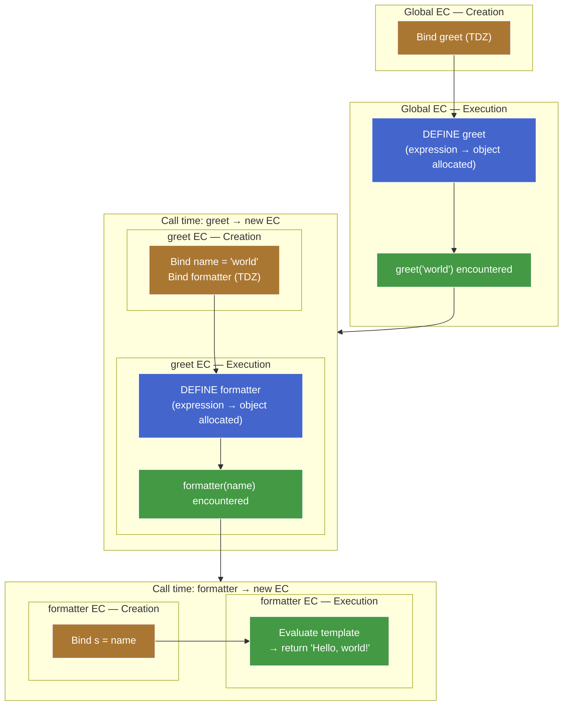
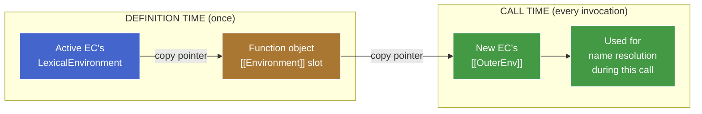

# Lexical Scoping & Shadowing — Draft

## Phase 1: The capture mechanism

### Two timelines, two events

A function in JS has two distinct lifecycle moments where scope-related state gets written:

1. **Definition time** — the function object is allocated. Happens when the engine processes `function f() {}` (creation phase) or `function() {}`/`() => {}` (execution phase, when the expression is evaluated).
2. **Call time** — every time the function is invoked, a fresh EC is pushed onto the call stack.

```js
let greet = function (name) {
  const formatter = (s) => `Hello, ${s}!`;
  console.log(formatter(name));
};

greet("world"); // "Hello, world!"
```



**Reading the diagram:**

- Orange nodes = creation phase of an EC (bindings set up, no values yet).
- Blue nodes = definition time (function object allocated).
- Green nodes = execution phase statements running.

Both `greet` and `formatter` are expressions — both get their blue "definition time" node inside a green "execution phase" zone. The creation phase (orange) only registers the *binding* (`greet` in TDZ) — the function object doesn't exist yet. This makes the three-way split visible at every level: creation phase ≠ definition time ≠ call time.

At each event, *different* fields get set with *different* sources. Conflating them is the canonical "lexical vs dynamic" trap.

### Definition time — the `[[Environment]]` slot

Every function object has an internal slot called `[[Environment]]`. When the function object is allocated, this slot is filled with **the value of the currently-active `LexicalEnvironment` pointer** — i.e. the ER instance that the active EC's `LexicalEnvironment` is aimed at *right now*.

```js
let mode = "production";

function logMode() {          // ◀── function object allocated here.
  console.log(mode);          //     Active EC: Global EC.
}                             //     Active LexicalEnvironment → Global ER.
                              //     ∴ logMode.[[Environment]] = Global ER.
```

That's the capture. One pointer copy. It happens *once*, when the function object comes into existence, and never updates.

> **Aside —** It's a *reference* to the ER, not a snapshot of its bindings. Mutations to the ER (`mode = "test"` later) are visible through the captured pointer. This is the precise meaning of "closures capture references, not values."

### Call time — the new EC's `[[OuterEnv]]`

When a function is called, the engine creates a fresh EC for the call. The new EC needs an `[[OuterEnv]]` to anchor the scope chain. Where does it get one?

**The rule:** `newEC.[[OuterEnv]] ← thisFunction.[[Environment]]`.

The new EC copies its `[[OuterEnv]]` from the *function object's* `[[Environment]]` slot — which was set at definition time, possibly long ago, in a possibly-unrelated part of the program.

```js
debugScope();                 // ◀── logMode() will be called from here.
                              //     The active EC at this moment is debugScope's EC.
                              //     But we don't look at debugScope's ER.
                              //     We look at logMode.[[Environment]] → Global ER.
                              //     ∴ logMode's new EC.[[OuterEnv]] = Global ER.
```

The caller's ER is **never consulted**. The call stack and the scope chain are two different data structures.

### The bridge — the one diagram



The function object is the **persistence layer** between the two timelines. It carries the captured pointer through time so the call-time setup can use it.

### Why this forces lexical scoping

JS is lexically scoped *because* the call-time rule is `newEC.[[OuterEnv]] ← function.[[Environment]]` instead of `newEC.[[OuterEnv]] ← caller.LexicalEnvironment`.

If the rule were the latter, JS would be **dynamically** scoped — every function would look up names in whatever scope was active at the call site, and the result of `logMode()` would depend on *who called it*, not where it was written. (Phase 4 will show what that alternative actually looks like in Bash.)

The choice of which pointer to copy at call time **is the choice of scoping discipline.** One assignment, one consequence — everything else falls out.

### Traced through the teaser

```js
let mode = "production";

function logMode() {
  console.log(mode);
}

function debugScope() {
  let mode = "debug";
  logMode();
}

debugScope();
```

Step-by-step, with the two timelines made visible:

| Moment | What happens | Resulting state |
|---|---|---|
| Creation phase of script | `logMode` and `debugScope` function objects allocated. Active `LexicalEnvironment` → Global ER. | `logMode.[[Environment]] = Global ER`<br/>`debugScope.[[Environment]] = Global ER` |
| Execution phase: `debugScope()` call | New EC pushed. Its `[[OuterEnv]] ← debugScope.[[Environment]] = Global ER`. | debugScope EC: `LexicalEnvironment → debugScope ER`, `[[OuterEnv]] → Global ER` |
| Inside `debugScope`: `let mode = "debug"` | New binding `mode = "debug"` in debugScope's ER. | debugScope ER: `{ mode: "debug" }` |
| Inside `debugScope`: `logMode()` call | New EC pushed. Its `[[OuterEnv]] ← logMode.[[Environment]] = Global ER`. **Not** debugScope's ER. | logMode EC: `LexicalEnvironment → logMode ER`, `[[OuterEnv]] → Global ER |
| Inside `logMode`: `console.log(mode)` | Resolve `mode`. Walk `[[OuterEnv]]` chain: logMode ER (miss) → Global ER (hit: `"production"`). | Prints `"production"` |

The `mode = "debug"` binding sits in debugScope's ER. debugScope's ER is on the **call stack** (its EC is alive while logMode runs) but it's **not on logMode's scope chain** — because logMode's `[[OuterEnv]]` was set from `logMode.[[Environment]]`, which was the *Global ER snapshot* taken when logMode was defined.

The call stack and the scope chain are different graphs. They overlap when caller-defines-callee, but they diverge whenever a function is passed somewhere and called elsewhere.
