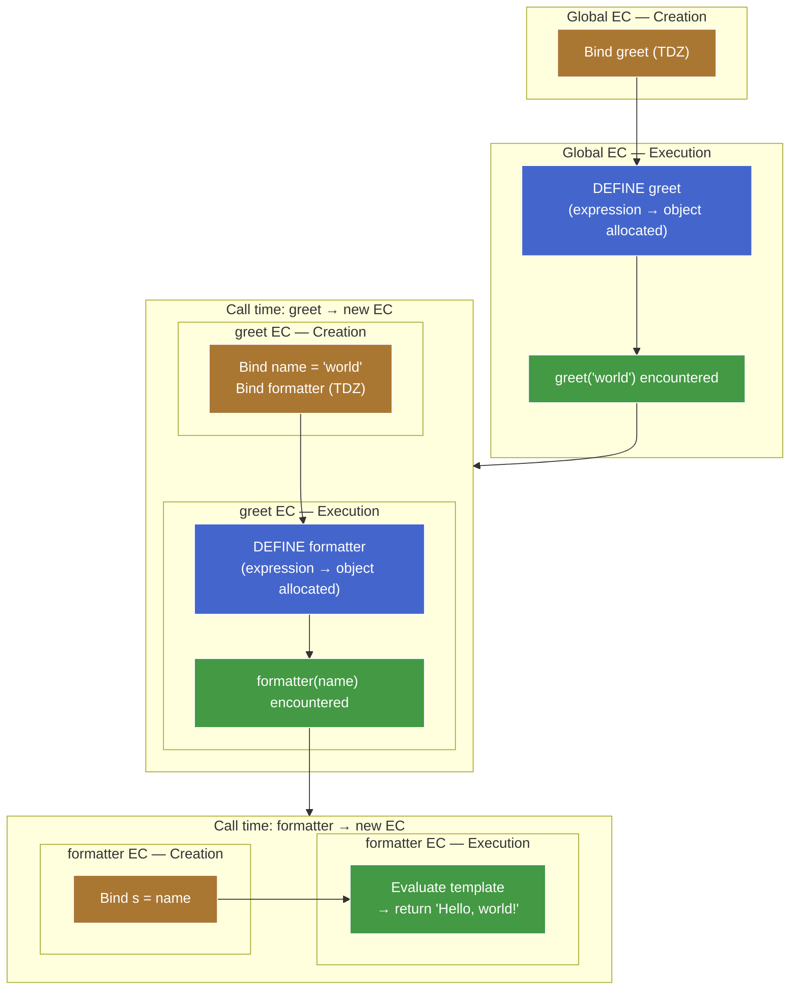
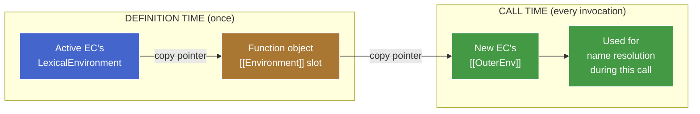
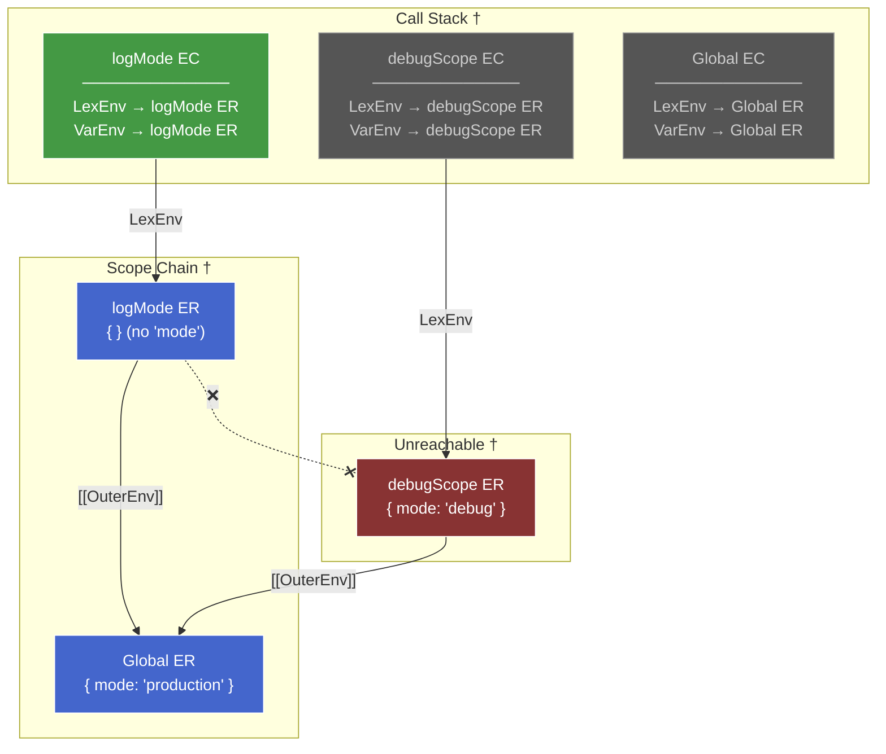

# 1. Lexical Scoping & Shadowing

**TL;DR** — JS is lexically scoped because at every call, the engine sets `newEC.[[OuterEnv]] ← thisFunction.[[Environment]]` — the function object's captured pointer — instead of `← caller.LexicalEnvironment`. That one assignment, plus the heap-allocated ER + reachability-based GC model from earlier chunks, derives every behavior in this note: the scope chain, shadowing, closures, and the contrast with dynamic scoping.

Terms used below: **EC** = Execution Context, **ER** = Environment Record, `LexicalEnvironment` / `VariableEnvironment` = pointers on the EC (covered in [execution-context.md](execution-context.md)), `[[Environment]]` = internal slot on every function object, `[[OuterEnv]]` = pointer on every ER linking to its enclosing ER.

---

## 1.1. The axiom

> At call time, the engine sets `newEC.[[OuterEnv]] ← thisFunction.[[Environment]]`.

The function object's `[[Environment]]` slot was filled at **definition time** with whatever `LexicalEnvironment` was active *then*. So `[[OuterEnv]]` at call time traces back to the function's **source location**, not its **call site**.

If the rule were instead `newEC.[[OuterEnv]] ← caller.LexicalEnvironment`, JS would be **dynamically** scoped — same machinery, different anchor point, completely different language behavior. We'll see exactly that in Bash below.

Everything in this note is downstream of this one pointer-copy choice.

---

## 1.2. The capture mechanism — definition time vs call time

Two distinct lifecycle moments write scope-related state:

1. **Definition time** — the function object is allocated. For `function f() {}`, this happens in the surrounding EC's creation phase. For `function() {}` / `() => {}`, it happens during the execution phase, when the expression is evaluated.
2. **Call time** — every invocation pushes a fresh EC. That EC needs its `[[OuterEnv]]`.

### 1.2.1. Definition time — the `[[Environment]]` slot

Every function object has an internal slot `[[Environment]]`. At allocation, the slot is filled with **the value of the currently-active `LexicalEnvironment` pointer** — the ER the active EC is aimed at right now.

```js
let mode = "production";

function logMode() {          // ◀── function object allocated here.
  console.log(mode);          //     Active EC: Global EC.
}                             //     Active LexicalEnvironment → Global ER.
                              //     ∴ logMode.[[Environment]] = Global ER.
```

One pointer copy. Happens **once**, when the function object comes into existence. Never updates.

> **Aside —** It's a *reference* to the ER, not a snapshot of its bindings. Later mutations through the ER (`mode = "test"`) are visible through the captured pointer. This is the precise meaning of "closures capture references, not values."

### 1.2.2. Call time — the new EC's `[[OuterEnv]]`

```js
function debugScope() {
  let mode = "debug";
  logMode();                  // ◀── caller is debugScope, but we don't look here.
}                             //     We look at logMode.[[Environment]] → Global ER.
                              //     ∴ logMode's new EC.[[OuterEnv]] = Global ER.

debugScope();                 // prints "production", not "debug"
```

The caller's ER is **never consulted**. The function object is the persistence layer between definition time and call time — it carries the captured pointer across time so call-time setup can use it.

### 1.2.3. The three-way split — creation phase ≠ definition time ≠ call time

The following diagram traces a nested call (`greet` → `formatter`) to show where each event fires. Both are expressions — their "definition time" (blue) happens inside an execution phase (green), not during creation phase (orange).



**Reading the diagram:**

- Orange = creation phase (bindings registered, no values yet).
- Blue = definition time (function object allocated). For expressions/arrows this happens *during* execution phase.
- Green = execution phase running a statement (including hitting a call, which triggers a new EC).

At each event, *different* fields get set with *different* sources. Conflating them is the canonical "lexical vs dynamic" trap.

### 1.2.4. The bridge — one diagram



### 1.2.5. Capture-lifecycle trace

Step-by-step trace through the teaser (capture/setup events only — the actual `mode` resolution walk is in the Resolution section):

```js
let mode = "production";

function logMode() {
  console.log(mode);
}

function debugScope() {
  let mode = "debug";
  logMode();
}

debugScope();
```

| Moment | What happens | Resulting state |
|---|---|---|
| Creation phase of script | `logMode` and `debugScope` function objects allocated. Active `LexicalEnvironment` → Global ER. | `logMode.[[Environment]] = Global ER`<br/>`debugScope.[[Environment]] = Global ER` |
| Execution phase: `debugScope()` call | New EC pushed. Its `[[OuterEnv]] ← debugScope.[[Environment]] = Global ER`. | debugScope EC: `LexicalEnvironment → debugScope ER`, `[[OuterEnv]] → Global ER` |
| Inside `debugScope`: `let mode = "debug"` | New binding `mode = "debug"` in debugScope's ER. | debugScope ER: `{ mode: "debug" }` |
| Inside `debugScope`: `logMode()` call | New EC pushed. Its `[[OuterEnv]] ← logMode.[[Environment]] = Global ER`. **Not** debugScope's ER. | logMode EC: `LexicalEnvironment → logMode ER`, `[[OuterEnv]] → Global ER` |

The capture/setup story ends here: every EC on the stack has its pointers in place. What happens when `console.log(mode)` actually runs is the resolution walk — covered next.

---

## 1.3. Resolution — `ResolveBinding`

Every name reference in source code runs an algorithm called `ResolveBinding`:

```
ResolveBinding(name, env = activeEC.LexicalEnvironment):
  if env has a binding for `name`:
    return that binding
  if env.[[OuterEnv]] is null:
    throw ReferenceError(`${name} is not defined`)
  return ResolveBinding(name, env.[[OuterEnv]])
```

Three properties:

1. **Per-reference at runtime.** Every `mode` in the source runs the walk afresh. Engines optimize hot paths with inline caches, but that's optimization, not spec.
2. **Entry point is `LexicalEnvironment`.** `VariableEnvironment` is never consulted at lookup time.
3. **First match wins.** Greedy, one-shot — no "outer would have been more specific" tiebreaker.

### 1.3.1. Pointer roles — `LexicalEnvironment` vs `VariableEnvironment`

Both are pointers on the EC, not on the ER. They decide *which ER you enter the chain from* — the ER `[[OuterEnv]]` links *are* the chain.

| Pointer | Lives on | Role | Moves? |
|---|---|---|---|
| `LexicalEnvironment` | EC | **Read entry point.** Resolution starts here. | Yes — advances into block ERs, rewinds on block exit. |
| `VariableEnvironment` | EC | **Write target for `var` / function declarations.** | No — pinned to the function-level ER for the EC's lifetime. |

`VariableEnvironment` is a write-time shortcut: during creation phase, `var` bindings need to land in the function-level ER without walking the chain to find it. At lookup time, the function-level ER is *already* reachable from any nested block ER via the normal `[[OuterEnv]]` walk — no special read path needed.

```js
function example() {
  var x = 1;         // placed in function ER (via VariableEnvironment)

  if (true) {
    // LexicalEnvironment advances → block ER
    let z = 3;       // placed in block ER (via LexicalEnvironment)
    console.log(x);  // resolve x: block ER (miss) → [[OuterEnv]] → function ER (hit: 1)
    var w = 4;       // placed in function ER (via VariableEnvironment — skips block)
  }
  // LexicalEnvironment rewinds → function ER
  console.log(w);    // 4 — w is in function ER, reachable
  // console.log(z); // ReferenceError — block ER is unreachable
}
```

### 1.3.2. Worked example — call stack ≠ scope chain

```js
let mode = "production";

function logMode() {              // logMode.[[Environment]] = Global ER
  console.log(mode);
}

function debugScope() {
  let mode = "debug";
  logMode();                      // called here, but its [[OuterEnv]] traces to Global ER
}

debugScope();
```

At the moment `console.log(mode)` runs inside `logMode`:



**† Legend:**

- **Call Stack** — all ECs alive when `console.log(mode)` runs.
- **Scope Chain** — the `[[OuterEnv]]` path resolution actually walks.
- **Unreachable** — `debugScope`'s ER is on the call stack but has no link into logMode's scope chain.
- Green EC = active (currently executing). Grey ECs = alive but not running.
- Blue ERs = on resolution path. Red ER = unreachable from that path.

**Abbreviations:** LexEnv = `LexicalEnvironment`, VarEnv = `VariableEnvironment`, ER = Environment Record.

Resolution walk for `mode`:

1. `LexicalEnvironment` → **logMode ER**. No binding. Miss.
2. `[[OuterEnv]]` → **Global ER**. Hit: `"production"`. Done.

`debugScope ER` (with `mode = "debug"`) is alive on the call stack but has **zero links** into logMode's scope chain. The two structures only coincide when the caller happens to *be* the definition site — they diverge whenever a function is passed somewhere and called elsewhere. **The scope chain is built from `[[OuterEnv]]`, which traces to the definition site, not the call site.**

### 1.3.3. `ReferenceError` vs `undefined`

Two spec-distinct failure modes when reading a name:

- **Binding doesn't exist** → walker reaches `null`, throws `ReferenceError: not defined`.
- **Binding exists, value is `undefined`** → walker hits the binding, returns it. No error; the value just *is* `undefined`.

The `[[OuterEnv]]` of the Global ER (or Module ER chained to it) is `null` — there's no scope further out.

---

## 1.4. Shadowing — first-match consequence

Shadowing isn't a separate rule. It's what `ResolveBinding`'s first-match-wins clause looks like when an inner ER holds a binding with the same name as one in an outer ER.

```js
let x = "global";

function outer() {
  let x = "outer";

  function inner() {
    let x = "inner";
    console.log(x);     // "inner"
  }

  inner();
}
```

Trace: `LexicalEnvironment` → inner's Function ER. Has `x`. **Hit. Done.** The walker never even looks at outer's or global's `x`.

### 1.4.1. Shadowing requires a different ER

Two same-name bindings only shadow if they live in *different* ERs. Same-ER cases aren't shadowing — they're either errors or overwrites depending on keyword:

```js
function f() {
  let x = 1;
  {                   // ◀── new Block ER pushed
    let x = 2;        // OK — different ER. Shadowing.
    console.log(x);   // 2
  }                   // ◀── Block ER discarded
  console.log(x);     // 1
}
```

```js
function f() {
  let x = 1;
  let x = 2;          // SyntaxError — same ER. let forbids redeclaration.
}
```

```js
function f() {
  var x = 1;
  var x = 2;          // No error — same ER. var allows redeclaration.
  console.log(x);     // 2
}
```

The deciding question is always *"which ER does each binding live in?"* — the same question chunk 6 reduced everything to.

### 1.4.2. Cross-keyword trap — `let` + nested-block `var`

`var` hoists to the Function ER regardless of where it appears in source. If the function level already has a `let` with the same name, the `var` collides in the *same* ER — SyntaxError, even though the `var` is visually inside a nested block.

```js
function f() {
  let x = 1;          // function-level let → Function ER
  {
    var x = 2;        // var hoists to Function ER → collides with the let
                      // SyntaxError: Identifier 'x' has already been declared
  }
}
```

The reverse is fine — they land in different ERs:

```js
function f() {
  {
    let x = 1;        // Block ER
  }
  var x = 2;          // Function ER — different ER, no collision
}
```

The trap: `var`-in-block *looks* block-scoped, isn't. Always ask: which ER does it land in?

---

## 1.5. Closures — ER survival via `[[Environment]]`

A closure is the **consequence** of two facts already in place:

1. `[[Environment]]` captures the active ER at definition time. Set once, never updates.
2. Reachability-based GC: any field of a reachable object is reachable. Function object reachable → captured ER reachable → that ER's `[[OuterEnv]]` reachable → the whole chain stays alive.

The function object pins its entire captured scope chain. The capture isn't special; the GC consequence is.

### 1.5.1. The classic counter

```js
function makeCounter() {
  let count = 0;             // ◀── binding in makeCounter's Function ER

  return function () {       // ◀── inner fn allocated.
    count += 1;              //     [[Environment]] = makeCounter's Function ER.
    return count;
  };
}

const c1 = makeCounter();
console.log(c1()); // 1
console.log(c1()); // 2
console.log(c1()); // 3
```

Step by step:

1. `makeCounter()` is called. Fresh Function ER for that call, with `count = 0`. The active EC's `LexicalEnvironment` pointer aims at this ER.
2. Inner function expression evaluated. Function object allocated; its `[[Environment]]` slot is filled with the currently-active `LexicalEnvironment` — i.e. `makeCounter`'s Function ER.
3. Inner function returned. `c1` holds it.
4. `makeCounter()`'s EC pops from the call stack. **The Function ER does NOT get GC'd** — `c1.[[Environment]]` still references it.
5. `c1()` pushes a new EC. Its `LexicalEnvironment.[[OuterEnv]]` is set from `c1.[[Environment]]` — which points to `makeCounter`'s Function ER (captured at definition time, not call time). Body resolves `count` via the chain, increments, returns.
6. Next `c1()` walks the *same* ER again — sees the updated `count = 1`, increments to `2`. The binding mutates; the ER stays put.

The noteworthy fact isn't the output (1, 2, 3) — that's just incrementing. It's that `makeCounter`'s Function ER **survives after `makeCounter()` returns and its EC pops** from the stack. Capture keeps the ER reachable (via `[[Environment]]`); GC simply respects that reachability and doesn't reclaim it. Nothing about closures is bolted on top of the EC model — heap-allocated ERs + normal GC rules are sufficient.

### 1.5.2. Each call captures a fresh ER

```js
const c1 = makeCounter();
const c2 = makeCounter();

c1(); c1(); c1();  // 1, 2, 3
c2();              // 1 — independent of c1
```

Every call to `makeCounter()` allocates a fresh Function ER. Each returned inner function captures its own ER. Independent state, no sharing.

### 1.5.3. Captures references, not values

```js
let mode = "production";

function makeReader() {
  return function () {
    return mode;            // resolves mode via the chain — read at call time
  };
}

const read = makeReader();
console.log(read()); // "production"

mode = "debug";
console.log(read()); // "debug"
```

`read.[[Environment]] = Global ER`. Each call walks to Global ER and reads `mode` *afresh*. The captured thing is the ER *reference*; `ResolveBinding` reads through it every time. No snapshot.

> **Aside —** Python's closure rules differ: it closes over names by reference but treats *assignment* in the inner function as creating a new local — hence the `nonlocal` keyword to escape that default. JS has no such complication: one binding in one ER, every reference reads/writes it.

### 1.5.4. Connection to `for (let ...)` per-iteration ER

```js
for (var i = 0; i < 3; i++) {
  setTimeout(() => console.log(i), 0);
}
// 3, 3, 3 — one `i` in the surrounding scope; all three arrows capture the same ER.

for (let i = 0; i < 3; i++) {
  setTimeout(() => console.log(i), 0);
}
// 0, 1, 2 — for (let ...) spec-mandates a fresh Block ER per iteration; each arrow captures its own.
```

Same closure mechanism in both cases. The difference is purely scope-model topology — how many ERs got allocated. The closure rule (`[[Environment]]` pins the ER) is unchanged.

### 1.5.5. Closures can leak

A closure pins its *entire* captured chain. Heavy data in the captured ER stays alive as long as the closure does, even if the closure body never reads it.

```js
function attachHandler() {
  const bigData = new Array(1_000_000).fill("…");

  document.addEventListener("click", () => {
    console.log("clicked");   // never references bigData
  });
}
```

The handler's `[[Environment]] = attachHandler`'s Function ER, which holds `bigData`. The ER reference keeps `bigData` alive as long as the listener is registered. Spec model is "whole ER is reachable" — engines do some escape-analysis optimizations, but you can't *rely* on them.

Mitigation: keep captured scopes small (factor heavy data into a sibling scope the closure doesn't capture; or null out references after use).

### 1.5.6. The big picture

Closures aren't a third concept added to JS. They fall out of:

- **Lexical capture** (the `[[Environment]]` rule above)
- **First-class functions** (functions can be returned, stored, passed)
- **Reachability-based GC** (the runtime invariant of any GC'd language)

Remove any one and closures disappear. Bash has first-class strings but no captured environment → no closures. C has functions but no GC and no environment-capture → no closures. JS has all three → closures are free.

---

## 1.6. Lexical vs dynamic scoping — the formal contrast

Both disciplines are coherent — they just answer "where does a function find its free variables?" differently.

| | Lexical scoping | Dynamic scoping |
|---|---|---|
| Lookup uses | The scope active at **definition time** | The scope active at **call time** |
| Spec mechanism (JS-style) | `newEC.[[OuterEnv]] ← function.[[Environment]]` | `newEC.[[OuterEnv]] ← caller.LexicalEnvironment` |
| Determined by | Source location of the function | The call stack at runtime |
| Static analysis | Possible | Not possible — depends on who calls whom |

Lexical: JS, Python, Java, C#, Rust, Haskell, Scheme, modern Common Lisp.
Dynamic: Bash, awk, Perl-with-`local`, original Lisp, Emacs Lisp (default).

### 1.6.1. Bash — same structure, opposite answer

```bash
#!/bin/bash
mode="production"

log_mode() {
  echo "$mode"
}

debug_scope() {
  local mode="debug"
  log_mode
}

debug_scope            # prints: debug
```

Structurally identical to the JS teaser above. Output differs because Bash resolves `$mode` *at the call site* — when `log_mode` runs, the active call is `debug_scope`, whose `local mode="debug"` is in scope. No per-function captured environment; just a stack of scopes walked at each lookup.

| | JS (lexical) | Bash (dynamic) |
|---|---|---|
| Where lookup starts | logMode's ER | active shell scope (= debug_scope's locals) |
| Walk direction | `[[OuterEnv]]` chain (set from `[[Environment]]`) | caller stack (top → bottom) |
| First hit | Global ER's `mode = "production"` | debug_scope's `local mode = "debug"` |
| Result | `production` | `debug` |

Same source structure. Opposite answer. The deciding factor: which pointer the runtime walks.

### 1.6.2. Why every modern general-purpose language picked lexical

All four downstream benefits trace to one root — *a function's free-variable resolution can be determined from the source alone*:

1. **Static analysis.** Linters, type checkers, "go to definition," dead-code elimination — all require knowing which binding a name refers to without running the program.
2. **Optimization.** With lexical scoping, the engine can analyze every function's capture set at compile time. Non-captured variables live on the stack; captured ones can be packed into flat closure records; inline caches specialize on resolved binding locations. Dynamic scoping forces a full runtime walk at every lookup.
3. **Encapsulation.** A lexically-scoped function depends only on its own source + what its enclosing scopes provide. Callers can refactor freely without silently rebinding the callee's free variables. With dynamic scoping, every function is implicitly parameterized by *everyone's* locals — a library function's behavior can change because some caller five frames up renamed a local.
4. **Refactor safety.** Renaming a local in your own function can't accidentally shadow a name a callee was relying on.

The cost of dynamic scoping: a function's behavior is no longer a property of the function — it's a property of the function plus its entire call context. That breaks composition.

### 1.6.3. Niche corners where dynamic survives

- **Shell scripting.** The "env-var override" idiom (`HTTPS_PROXY=… my_cmd`) is dynamic scoping at the process level — convenient for ad-hoc configuration.
- **Emacs Lisp** defaults to dynamic for historical reasons.
- **JS `this`.** Dynamically bound for regular functions — set at call time based on invocation pattern, not source location. JS's one major dynamic-scoping concession, and the source of an outsized share of JS gotchas. Arrow functions opted *out* — they don't get their own `this`; it resolves lexically up the chain.
- **JS `with`** (banned in strict mode) inserts an Object ER into the chain at runtime — a localized form of dynamic scoping. Strict mode bans it precisely because it breaks static analysis.
- **React Context** has a dynamic-scoping flavor: a value is determined by the calling render tree, not by where the consumer is defined. But it's an opt-in, narrow channel — not the default lookup discipline.

---

## 1.7. Mental model recap

> JS is lexically scoped because at call time the runtime uses `newEC.[[OuterEnv]] ← function.[[Environment]]` — not `← caller.LexicalEnvironment`.

That single pointer-copy rule generates everything in this note: definition-time capture, the scope chain, shadowing, closures, GC-survival behavior, and the contrast with Bash. Take it as the chunk's axiom — the rest is derivation.

Related notes:

- [scope-model.md](scope-model.md) — the four scope types as ER instances, and the pointer-pin vs pointer-move distinction `var`/`let` exploit. This note builds directly on that one.
- [execution-context.md](execution-context.md) — the EC structure (`LexicalEnvironment` / `VariableEnvironment` pointers, `[[OuterEnv]]` chain) underlying everything here.
- [creation-execution.md](creation-execution.md) — when function objects are allocated (and thus when `[[Environment]]` is set).
