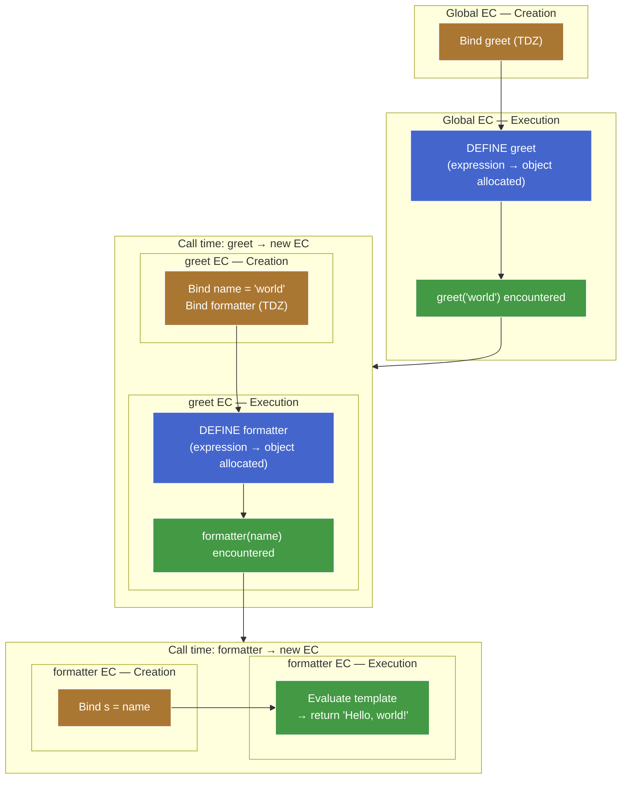
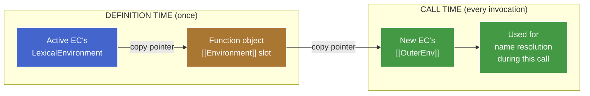
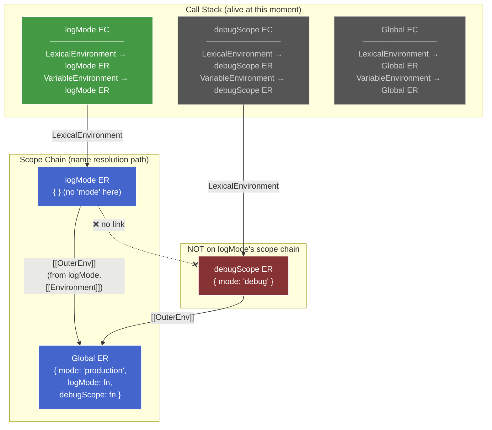

# Lexical Scoping & Shadowing — Draft

> Section order below is teaching order, not final-note order. Final note will reorganize around the mental model.

## Capture: definition time vs call time

### Two timelines, two events

A function in JS has two distinct lifecycle moments where scope-related state gets written:

1. **Definition time** — the function object is allocated. Happens when the engine processes `function f() {}` (creation phase) or `function() {}`/`() => {}` (execution phase, when the expression is evaluated).
2. **Call time** — every time the function is invoked, a fresh EC is pushed onto the call stack.

```js
let greet = function (name) {
  const formatter = (s) => `Hello, ${s}!`;
  console.log(formatter(name));
};

greet("world"); // "Hello, world!"
```



**Reading the diagram:**

- Orange nodes = creation phase of an EC (bindings set up, no values yet).
- Blue nodes = definition time (function object allocated).
- Green nodes = execution phase running a statement (including hitting a call expression, which then triggers a new EC).

Both `greet` and `formatter` are expressions — both get their blue "definition time" node inside a green "execution phase" zone. The creation phase (orange) only registers the *binding* (`greet` in TDZ) — the function object doesn't exist yet. This makes the three-way split visible at every level: creation phase ≠ definition time ≠ call time.

At each event, *different* fields get set with *different* sources. Conflating them is the canonical "lexical vs dynamic" trap.

### Definition time — the `[[Environment]]` slot

Every function object has an internal slot called `[[Environment]]`. When the function object is allocated, this slot is filled with **the value of the currently-active `LexicalEnvironment` pointer** — i.e. the ER instance that the active EC's `LexicalEnvironment` is aimed at *right now*.

```js
let mode = "production";

function logMode() {          // ◀── function object allocated here.
  console.log(mode);          //     Active EC: Global EC.
}                             //     Active LexicalEnvironment → Global ER.
                              //     ∴ logMode.[[Environment]] = Global ER.
```

That's the capture. One pointer copy. It happens *once*, when the function object comes into existence, and never updates.

> **Aside —** It's a *reference* to the ER, not a snapshot of its bindings. Mutations to the ER (`mode = "test"` later) are visible through the captured pointer. This is the precise meaning of "closures capture references, not values."

### Call time — the new EC's `[[OuterEnv]]`

When a function is called, the engine creates a fresh EC for the call. The new EC needs an `[[OuterEnv]]` to anchor the scope chain. Where does it get one?

**The rule:** `newEC.[[OuterEnv]] ← thisFunction.[[Environment]]`.

The new EC copies its `[[OuterEnv]]` from the *function object's* `[[Environment]]` slot — which was set at definition time, possibly long ago, in a possibly-unrelated part of the program.

```js
let mode = "production";

function logMode() {          // logMode.[[Environment]] = Global ER (from earlier).
  console.log(mode);
}

function debugScope() {
  let mode = "debug";
  logMode();                  // ◀── logMode() is called from here.
}                             //     The active EC at this moment is debugScope's EC.
                              //     But we don't look at debugScope's ER.
                              //     We look at logMode.[[Environment]] → Global ER.
                              //     ∴ logMode's new EC.[[OuterEnv]] = Global ER.

debugScope();
```

The caller's ER is **never consulted**. The call stack and the scope chain are two different data structures.

### The bridge — the one diagram



The function object is the **persistence layer** between the two timelines. It carries the captured pointer through time so the call-time setup can use it.

### Why this forces lexical scoping

JS is lexically scoped *because* the call-time rule is `newEC.[[OuterEnv]] ← function.[[Environment]]` instead of `newEC.[[OuterEnv]] ← caller.LexicalEnvironment`.

If the rule were the latter, JS would be **dynamically** scoped — every function would look up names in whatever scope was active at the call site, and the result of `logMode()` would depend on *who called it*, not where it was written. (We'll see what that alternative actually looks like in Bash later in this chunk.)

The choice of which pointer to copy at call time **is the choice of scoping discipline.** One assignment, one consequence — everything else falls out.

### Traced through the teaser

```js
let mode = "production";

function logMode() {
  console.log(mode);
}

function debugScope() {
  let mode = "debug";
  logMode();
}

debugScope();
```

Step-by-step, with the two timelines made visible:

| Moment | What happens | Resulting state |
|---|---|---|
| Creation phase of script | `logMode` and `debugScope` function objects allocated. Active `LexicalEnvironment` → Global ER. | `logMode.[[Environment]] = Global ER`<br/>`debugScope.[[Environment]] = Global ER` |
| Execution phase: `debugScope()` call | New EC pushed. Its `[[OuterEnv]] ← debugScope.[[Environment]] = Global ER`. | debugScope EC: `LexicalEnvironment → debugScope ER`, `[[OuterEnv]] → Global ER` |
| Inside `debugScope`: `let mode = "debug"` | New binding `mode = "debug"` in debugScope's ER. | debugScope ER: `{ mode: "debug" }` |
| Inside `debugScope`: `logMode()` call | New EC pushed. Its `[[OuterEnv]] ← logMode.[[Environment]] = Global ER`. **Not** debugScope's ER. | logMode EC: `LexicalEnvironment → logMode ER`, `[[OuterEnv]] → Global ER` |
| Inside `logMode`: `console.log(mode)` | Resolve `mode`. Walk `[[OuterEnv]]` chain: logMode ER (miss) → Global ER (hit: `"production"`). | Prints `"production"` |

### Resolving `mode` inside `logMode` — the full pointer walk

When `console.log(mode)` executes inside `logMode`, the engine resolves `mode` by walking the Environment Record chain. Here's the complete picture — including where `LexicalEnvironment` and `VariableEnvironment` sit, and why `debugScope`'s ER is invisible:



**Resolution algorithm for `mode`:**

1. Start at the active EC's `LexicalEnvironment` → **logMode ER**. Look up `mode`. Miss (no such binding).
2. Follow `[[OuterEnv]]` → **Global ER**. Look up `mode`. Hit: `"production"`. Done.

`debugScope ER` (with `mode: "debug"`) is alive on the call stack but has **zero links** into logMode's scope chain. The scope chain is built from `[[OuterEnv]]` pointers — which trace back to *definition site*, not *call site*.

### Where `LexicalEnvironment` and `VariableEnvironment` fit in resolution

Both are **pointers on the EC**, not on the ER. They decide *which ER you enter the chain from* — the ER links (`[[OuterEnv]]`) are the chain itself.

| Pointer | Lives on | Role | Moves? |
|---|---|---|---|
| `LexicalEnvironment` | EC | **Read entry point.** Resolution starts here. | Yes — advances into block ERs, rewinds on block exit. |
| `VariableEnvironment` | EC | **Write target for `var`/function decls.** | No — pinned to the function-level ER for the EC's lifetime. |

Resolution never consults `VariableEnvironment`. The algorithm is: start at `currentEC.LexicalEnvironment`, walk `[[OuterEnv]]` until found. That's it.

`VariableEnvironment` exists so the engine knows *where to place* a `var` binding during creation phase — it jumps directly to the function ER without walking the chain backwards. A write-time shortcut, not a read-time participant.

**Why `var` bindings are still reachable via normal resolution:** the function-level ER (what `VariableEnvironment` points at) is *always* an ancestor on the `[[OuterEnv]]` chain of any block ER inside that function. Block ERs are nested inside the function, so the chain is:

```
innermost block ER → [[OuterEnv]] → ... → function ER → [[OuterEnv]] → outer scope
```

Every block ER chains back up to the function ER. So `var` bindings placed there are found by the normal walk — no special read path needed.

```js
function example() {
  var x = 1;         // placed in function ER (via VariableEnvironment)

  if (true) {
    // LexicalEnvironment advances → block ER
    let z = 3;       // placed in block ER (via LexicalEnvironment)
    console.log(x);  // resolve x: block ER (miss) → [[OuterEnv]] → function ER (hit: 1)
    var w = 4;       // placed in function ER (via VariableEnvironment — skips block)
  }
  // LexicalEnvironment rewinds → function ER
  console.log(w);    // 4 — w is in function ER, reachable
  // console.log(z); // ReferenceError — block ER is unreachable (GC-eligible)
}
```

The `mode = "debug"` binding sits in debugScope's ER. debugScope's ER is on the **call stack** (its EC is alive while logMode runs) but it's **not on logMode's scope chain** — because logMode's `[[OuterEnv]]` was set from `logMode.[[Environment]]`, which was the *Global ER snapshot* taken when logMode was defined.

The call stack and the scope chain are different graphs. They overlap when caller-defines-callee, but they diverge whenever a function is passed somewhere and called elsewhere.
