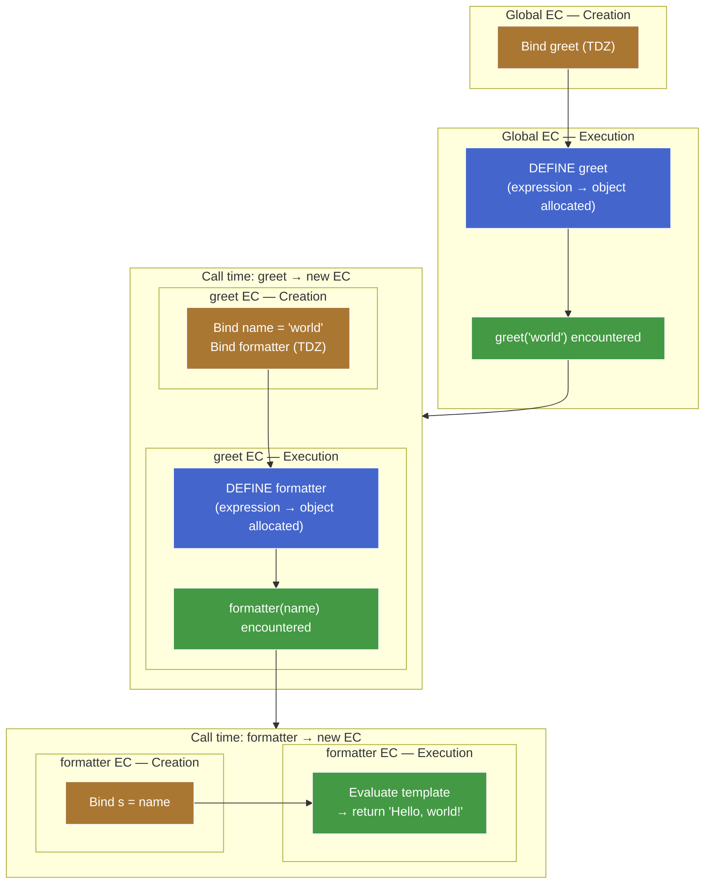
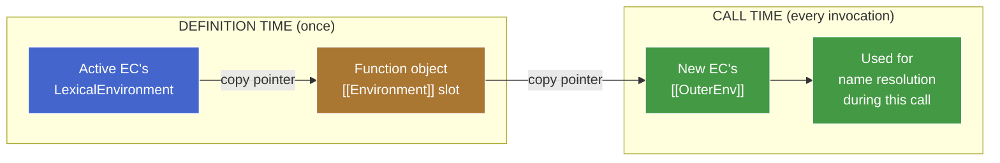
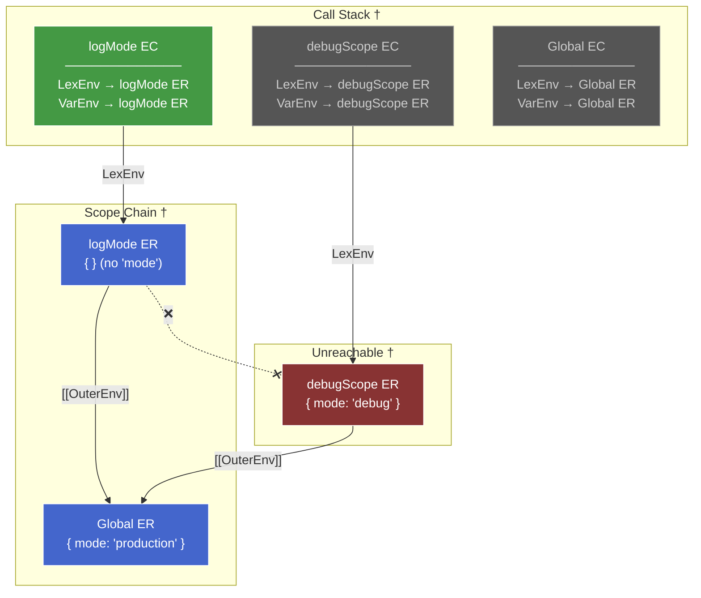

# 1. Lexical Scoping & Shadowing — Draft

> Section order below is teaching order, not final-note order. Final note will reorganize around the mental model.

## 1.1. Plan (teaching order)

- [x] Capture: definition-time → call-time bridge
- [x] Scope chain resolution (`ResolveBinding`, pointer roles)
- [x] Shadowing — first-match consequence
- [x] Closures — ER survival via `[[Environment]]`
- [ ] Lexical vs dynamic scoping — Bash contrast

## 1.2. Capture: definition time vs call time

### 1.2.1. Two timelines, two events

A function in JS has two distinct lifecycle moments where scope-related state gets written:

1. **Definition time** — the function object is allocated. Happens when the engine processes `function f() {}` (creation phase) or `function() {}`/`() => {}` (execution phase, when the expression is evaluated).
2. **Call time** — every time the function is invoked, a fresh EC is pushed onto the call stack.

```js
let greet = function (name) {
  const formatter = (s) => `Hello, ${s}!`;
  console.log(formatter(name));
};

greet("world"); // "Hello, world!"
```



**Reading the diagram:**

- Orange nodes = creation phase of an EC (bindings set up, no values yet).
- Blue nodes = definition time (function object allocated). This happens during creation phase for declarations, execution phase for expressions/arrows.
- Green nodes = execution phase running a statement (including hitting a call expression, which then triggers a new EC).

Both `greet` and `formatter` are expressions — both get their blue "definition time" node inside a green "execution phase" zone. The creation phase (orange) only registers the *binding* (`greet` in TDZ) — the function object doesn't exist yet. This makes the three-way split visible at every level: creation phase ≠ definition time ≠ call time.

At each event, *different* fields get set with *different* sources. Conflating them is the canonical "lexical vs dynamic" trap.

### 1.2.2. Definition time — the `[[Environment]]` slot

Every function object has an internal slot called `[[Environment]]`. When the function object is allocated, this slot is filled with **the value of the currently-active `LexicalEnvironment` pointer** — i.e. the ER instance that the active EC's `LexicalEnvironment` is aimed at *right now*.

```js
let mode = "production";

function logMode() {          // ◀── function object allocated here.
  console.log(mode);          //     Active EC: Global EC.
}                             //     Active LexicalEnvironment → Global ER.
                              //     ∴ logMode.[[Environment]] = Global ER.
```

That's the capture. One pointer copy. It happens *once*, when the function object comes into existence, and never updates.

> **Aside —** It's a *reference* to the ER, not a snapshot of its bindings. Mutations to the ER (`mode = "test"` later) are visible through the captured pointer. This is the precise meaning of "closures capture references, not values."

### 1.2.3. Call time — the new EC's `[[OuterEnv]]`

When a function is called, the engine creates a fresh EC for the call. The new EC needs an `[[OuterEnv]]` to anchor the scope chain. Where does it get one?

**The rule:** `newEC.[[OuterEnv]] ← thisFunction.[[Environment]]`.

The new EC copies its `[[OuterEnv]]` from the *function object's* `[[Environment]]` slot — which was set at definition time, possibly long ago, in a possibly-unrelated part of the program.

```js
let mode = "production";

function logMode() {          // logMode.[[Environment]] = Global ER (from earlier).
  console.log(mode);
}

function debugScope() {
  let mode = "debug";
  logMode();                  // ◀── logMode() is called from here.
}                             //     The active EC at this moment is debugScope's EC.
                              //     But we don't look at debugScope's ER.
                              //     We look at logMode.[[Environment]] → Global ER.
                              //     ∴ logMode's new EC.[[OuterEnv]] = Global ER.

debugScope();
```

The caller's ER is **never consulted**. The call stack and the scope chain are two different data structures (we'll see them side-by-side in the resolution section below).

### 1.2.4. The bridge — the one diagram



The function object is the **persistence layer** between the two timelines. It carries the captured pointer through time so the call-time setup can use it.

### 1.2.5. Why this forces lexical scoping

JS is lexically scoped *because* the call-time rule is `newEC.[[OuterEnv]] ← function.[[Environment]]` instead of `newEC.[[OuterEnv]] ← caller.LexicalEnvironment`.

If the rule were the latter, JS would be **dynamically** scoped — every function would look up names in whatever scope was active at the call site, and the result of `logMode()` would depend on *who called it*, not where it was written. (We'll see what that alternative actually looks like in Bash later in this chunk.)

The choice of which pointer to copy at call time **is the choice of scoping discipline.** One assignment, one consequence — everything else falls out.

### 1.2.6. Capture-lifecycle trace through the teaser

```js
let mode = "production";

function logMode() {
  console.log(mode);
}

function debugScope() {
  let mode = "debug";
  logMode();
}

debugScope();
```

Step-by-step (capture/setup events only — the actual `mode` resolution walk is detailed in the next section):

| Moment | What happens | Resulting state |
|---|---|---|
| Creation phase of script | `logMode` and `debugScope` function objects allocated. Active `LexicalEnvironment` → Global ER. | `logMode.[[Environment]] = Global ER`<br/>`debugScope.[[Environment]] = Global ER` |
| Execution phase: `debugScope()` call | New EC pushed. Its `[[OuterEnv]] ← debugScope.[[Environment]] = Global ER`. | debugScope EC: `LexicalEnvironment → debugScope ER`, `[[OuterEnv]] → Global ER` |
| Inside `debugScope`: `let mode = "debug"` | New binding `mode = "debug"` in debugScope's ER. | debugScope ER: `{ mode: "debug" }` |
| Inside `debugScope`: `logMode()` call | New EC pushed. Its `[[OuterEnv]] ← logMode.[[Environment]] = Global ER`. **Not** debugScope's ER. | logMode EC: `LexicalEnvironment → logMode ER`, `[[OuterEnv]] → Global ER` |

The capture/setup story ends here: every EC on the stack has its pointers in place. What happens when `console.log(mode)` actually runs is the resolution walk — covered next.

---

## 1.3. Scope chain resolution — the formal walk

Now that every EC has its `[[OuterEnv]]` set, what does the engine *do* with it when it sees a name like `mode` in the source?

It runs an algorithm called `ResolveBinding`. Spec-equivalent pseudocode:

```
ResolveBinding(name, env = activeEC.LexicalEnvironment):
  if env has a binding for `name`:
    return that binding
  if env.[[OuterEnv]] is null:
    throw ReferenceError(`${name} is not defined`)
  return ResolveBinding(name, env.[[OuterEnv]])
```

In words: start at the **innermost ER** (whatever `LexicalEnvironment` currently aims at), check for the name, follow `[[OuterEnv]]` if not found, stop at the first hit or at `null`.

Three properties worth highlighting:

1. **Runtime, per reference.** Every `mode` in the source code runs `ResolveBinding` afresh. Bindings aren't "looked up once and cached" — though engines do optimize hot paths with inline caches, that's an engine optimization, not a spec guarantee.
2. **Entry point is `LexicalEnvironment`.** `VariableEnvironment` is never consulted at lookup time. Full pointer-role breakdown in the next subsection.
3. **First match wins.** No "outer match would have given a more specific result" tiebreaker. Greedy, one-shot.

### 1.3.1. How `LexicalEnvironment` and `VariableEnvironment` fit in

Both are **pointers on the EC**, not on the ER. They decide *which ER you enter the chain from* — the ER links (`[[OuterEnv]]`) are the chain itself.

| Pointer | Lives on | Role | Moves? |
|---|---|---|---|
| `LexicalEnvironment` | EC | **Read entry point.** Resolution starts here. | Yes — advances into block ERs, rewinds on block exit. |
| `VariableEnvironment` | EC | **Write target for `var`/function decls.** | No — pinned to the function-level ER for the EC's lifetime. |

Resolution never consults `VariableEnvironment`. The algorithm is: start at `currentEC.LexicalEnvironment`, walk `[[OuterEnv]]` until found. That's it.

`VariableEnvironment` exists so the engine knows *where to place* a `var` binding during creation phase — it jumps directly to the function ER without walking the chain. A write-time shortcut, not a read-time participant.

**Why `var` bindings are still reachable via normal resolution:** the function-level ER (what `VariableEnvironment` points at) is *always* an ancestor on the `[[OuterEnv]]` chain of any block ER inside that function. Block ERs are nested inside the function, so the chain is:

```
innermost block ER → [[OuterEnv]] → ... → function ER → [[OuterEnv]] → outer scope
```

Every block ER chains back up to the function ER. So `var` bindings placed there are found by the normal walk — no special read path needed.

```js
function example() {
  var x = 1;         // placed in function ER (via VariableEnvironment)

  if (true) {
    // LexicalEnvironment advances → block ER
    let z = 3;       // placed in block ER (via LexicalEnvironment)
    console.log(x);  // resolve x: block ER (miss) → [[OuterEnv]] → function ER (hit: 1)
    var w = 4;       // placed in function ER (via VariableEnvironment — skips block)
  }
  // LexicalEnvironment rewinds → function ER
  console.log(w);    // 4 — w is in function ER, reachable
  // console.log(z); // ReferenceError — block ER is unreachable (GC-eligible)
}
```

### 1.3.2. Worked trace — resolving `mode` inside `logMode`
```js
// Recopy code for reference
let mode = "production";

function logMode() {          // logMode.[[Environment]] = Global ER (from earlier).
  console.log(mode);
}

function debugScope() {
  let mode = "debug";
  logMode();                  // ◀── logMode() is called from here.
}                             //     The active EC at this moment is debugScope's EC.
                              //     But we don't look at debugScope's ER.
                              //     We look at logMode.[[Environment]] → Global ER.
                              //     ∴ logMode's new EC.[[OuterEnv]] = Global ER.

debugScope();
```

When `console.log(mode)` executes inside `logMode` (in the teaser above), the engine resolves `mode` by walking the chain. The picture below shows the call stack and the scope chain *side by side* at the moment of the lookup — note that `debugScope`'s ER is alive on the call stack but has no link into logMode's scope chain.



**† Legend:**

- **Call Stack** — all ECs alive when `console.log(mode)` runs inside `logMode`.
- **Scope Chain** — the `[[OuterEnv]]` path resolution actually walks.
- **Unreachable** — `debugScope`'s ER is on the call stack but has no link into logMode's scope chain.
- Green EC = the active one (currently executing). Grey ECs = alive but not running.
- Blue ERs = on the resolution path. Red ER = unreachable from that path.

**Abbreviations:** LexEnv = `LexicalEnvironment`, VarEnv = `VariableEnvironment`, ER = Environment Record.

**Resolution walk for `mode`:**

1. Start at the active EC's `LexicalEnvironment` → **logMode ER**. Look up `mode`. Miss (no binding).
2. Follow `[[OuterEnv]]` → **Global ER**. Look up `mode`. Hit: `"production"`. Done.

`debugScope ER` (holding `mode = "debug"`) is alive on the call stack but has **zero links** into logMode's scope chain. The scope chain is built from `[[OuterEnv]]` pointers — which trace back to the *definition site*, not the *call site*. **Call stack and scope chain are different graphs** — they only overlap when the caller happens to be the definition site, and diverge whenever a function is passed somewhere and called elsewhere.

### 1.3.3. Why the chain ends at `null`

The `[[OuterEnv]]` of the Global ER (or Module ER chained to it) is `null` — there is no scope further out. A name not found by the time the walker reaches `null` is `ReferenceError: not defined`. Compare to the "undefined" case — these are spec-distinct failure modes:

- **Binding doesn't exist** → walker reaches `null` → `ReferenceError`.
- **Binding exists, value is `undefined`** → walker hits, returns binding holding `undefined` → no error, value is `undefined`.

---

## 1.4. Shadowing — the first-match consequence

Shadowing isn't a separate rule. It's what `ResolveBinding`'s first-match-wins clause looks like when an inner ER has a binding with the same name as one in an outer ER.

```js
let x = "global";

function outer() {
  let x = "outer";

  function inner() {
    let x = "inner";
    console.log(x);     // ?
  }

  inner();
}

outer();
```

Trace `console.log(x)` inside `inner`:

1. `LexicalEnvironment` → inner's Function ER. Has `x = "inner"`. **Hit. Done.**

The walker never looks at outer's `x` or global's `x`. They still exist, are still reachable from other code, are still consulted by name resolutions starting in *their own* scope — but they're invisible to this particular lookup because something closer matched first.

### 1.4.1. Shadowing requires a different ER

**Shadowing:** an inner binding with the same name making the outer one unreachable from that scope. It requires the two bindings to live in *different* ERs — same-name bindings in the *same* ER aren't shadowing, they're either an error or an overwrite depending on keyword:

```js
function f() {
  let x = 1;
  {                   // ◀── new Block ER pushed
    let x = 2;        // OK — different ER. Shadowing.
    console.log(x);   // 2
  }                   // ◀── Block ER discarded
  console.log(x);     // 1
}
```

```js
function f() {
  let x = 1;
  let x = 2;          // SyntaxError — same ER. let forbids redeclaration.
}
```

```js
function f() {
  var x = 1;
  var x = 2;          // No error — same ER. var allows redeclaration.
  console.log(x);     // 2
}
```

The deciding question is always *"which ER does each binding live in?"* — which is the same question chunk 6 reduced everything to. Shadowing is just two ERs in a parent-child chain, each holding their own copy of the name.

### 1.4.2. Cross-keyword shadowing trap

`let` at function level + `var` inside a nested block don't coexist safely — `var` hoists to the Function ER, colliding with the `let` that already lives there. That's a SyntaxError. The reverse (`var` at function level + `let` in a nested block) is fine because they land in different ERs. The deciding factor is whether both bindings end up in the *same* ER:

```js
function f() {
  let x = 1;          // function-level let → Function ER
  {
    var x = 2;        // var hoists to Function ER → collides with the let
                      // SyntaxError: Identifier 'x' has already been declared
  }
}
```

```js
function f() {
  {
    let x = 1;        // Block ER
  }
  var x = 2;          // Function ER — different ER, no collision
  console.log(x);     // 2
}
```

The trap is that `var`-in-block *looks* like it should land in the block — visually it does, syntactically it doesn't. Always ask: which ER does it land in?

---

## 1.5. Closures — captured ERs that outlive their creator

You've already seen the structural setup. A closure is the *consequence* of two facts you already have, applied to the situation where the function escapes its creating call:

1. A function object's `[[Environment]]` slot points to whatever ER was active at definition time. Set once, never updates.
2. The reachability rule of GC: as long as an object is reachable, every field it holds is reachable. Function object reachable → captured ER reachable → that ER's `[[OuterEnv]]` reachable → the whole chain stays alive.

Combine them: a function object pins the entire captured scope chain. The capture isn't special; the GC consequence is.

### 1.5.1. The classic counter

```js
function makeCounter() {
  let count = 0;             // ◀── binding in makeCounter's Function ER

  return function () {       // ◀── inner fn allocated.
    count += 1;              //     [[Environment]] = makeCounter's Function ER.
    return count;
  };
}

const c1 = makeCounter();
console.log(c1()); // 1
console.log(c1()); // 2
console.log(c1()); // 3
```

Step by step:

1. `makeCounter()` is called. Fresh Function ER for that call, with `count = 0`. The active EC's `LexicalEnvironment` pointer now aims at this ER.
2. Inner function expression evaluated. Function object allocated; its `[[Environment]]` slot is filled with the value of the currently-active `LexicalEnvironment` pointer — i.e. `makeCounter`'s Function ER (the ER the active EC is aimed at right now).
3. Inner function returned. `c1` holds it.
4. `makeCounter()`'s EC pops from the call stack. **The Function ER does NOT get GC'd** — `c1.[[Environment]]` still references it.
5. `c1()` pushes a new EC. Its `LexicalEnvironment.[[OuterEnv]]` is set from `c1.[[Environment]]` — which points to `makeCounter`'s Function ER (captured at definition time, not call time). Body resolves `count` via the chain, increments, returns.
6. Next `c1()` walks the *same* ER again — sees the updated `count = 1`, increments to `2`. The binding mutates; the ER stays put.

The noteworthy fact isn't the output (1, 2, 3) — that's just incrementing. It's that the Function ER survived after `makeCounter()` returned and its EC popped. Capture keeps the ER reachable (via `[[Environment]]`); GC simply respects that reachability and doesn't reclaim it. Nothing about closures is bolted on top of the EC model — heap-allocated ERs + normal GC rules are enough.

### 1.5.2. Each closure has its own captured ER

```js
const c1 = makeCounter();
const c2 = makeCounter();

c1(); c1(); c1();  // 1, 2, 3
c2();              // 1 — independent of c1
```

Each *call* to `makeCounter()` produces a fresh Function ER (every function call always does). Each returned inner function captures its own ER. `c1` and `c2` walk different ERs with different `count` bindings.

### 1.5.3. Captures references, not values

```js
let mode = "production";

function makeReader() {
  return function () {
    return mode;            // resolves mode via the chain — read at call time
  };
}

const read = makeReader();
console.log(read()); // "production"

mode = "debug";
console.log(read()); // "debug"
```

`read.[[Environment]] = Global ER`. Each call walks to Global ER and reads `mode` *afresh* — there's no snapshot. So mutations to the captured ER's bindings are visible.

This is the precise meaning of "closures capture references, not values": what's captured is the *ER reference*, and `ResolveBinding` reads through it at call time.

> **Aside —** Python's closure rules differ here: Python closes over names by reference but treats *assignment* in the inner function as creating a new local — hence the `nonlocal` keyword to escape that default. JS has no such complication: one binding in one ER, every reference reads/writes it.

### 1.5.4. Connection to `for (let ...)` (chunk 6 recap)

The closure-in-loop bug:

```js
for (var i = 0; i < 3; i++) {
  setTimeout(() => console.log(i), 0);
}
// 3, 3, 3
```

`var i` lives in *one* ER (the surrounding function or global). All three arrows capture the *same* ER. By the time setTimeout fires them, `i === 3` (loop exit). Three reads of the same binding → `3, 3, 3`.

The `let` fix:

```js
for (let i = 0; i < 3; i++) {
  setTimeout(() => console.log(i), 0);
}
// 0, 1, 2
```

`for (let ...)` spec-mandates a *fresh Block ER per iteration*, each with its own `i` bound to that iteration's value. Each arrow's `[[Environment]]` captures the iteration's own Block ER. Three ERs, three `i`s, three reads.

**Same closure mechanism in both cases.** The difference is purely the scope-model topology — how many ERs got allocated. Closure and scope-model interact, but the closure rule (`[[Environment]]` pins ER) is unchanged.

### 1.5.5. GC implication — closures can leak

A closure pins its *entire* captured chain. If something heavy lives in the captured ER, it stays alive as long as the closure does.

```js
function attachHandler() {
  const bigData = new Array(1_000_000).fill("…");

  document.addEventListener("click", () => {
    console.log("clicked");   // never references bigData
  });
}
```

The handler's `[[Environment]] = attachHandler's Function ER`, which holds `bigData`. Even though the handler body never reads `bigData`, the ER reference keeps it alive as long as the listener is registered. The spec model is "whole ER is reachable" — engines do some escape-analysis optimizations, but you can't *rely* on them.

Mitigation: keep the captured scope small (factor heavy data into a sibling scope the closure doesn't capture; or null out references after use).

### 1.5.6. The big picture

Closures aren't a third concept added to JS — they're what falls out when you combine:

- **Lexical capture** (the `[[Environment]]` rule from the Capture section)
- **First-class functions** (functions can be returned, stored, passed)
- **Reachability-based GC** (the runtime invariant of any GC'd language)

Take any one of those three away and closures disappear. Bash has first-class strings but no captured environment → no closures. C has functions but no GC and no environment-capture → no closures. JS has all three → closures are free.

---

## 1.6. Lexical vs dynamic scoping — the formal contrast

So far this chunk has built up *one* discipline: lexical. The other formal option is dynamic. Both are coherent — they just answer "where does a function find its free variables?" differently.

| | Lexical scoping | Dynamic scoping |
|---|---|---|
| Lookup uses | The scope active at **definition time** | The scope active at **call time** |
| Spec mechanism (JS-style) | `newEC.[[OuterEnv]] ← function.[[Environment]]` | `newEC.[[OuterEnv]] ← caller.LexicalEnvironment` |
| Determined by | Source location of the function | The call stack at runtime |
| Static analysis | Possible | Not possible (depends on who calls whom) |

JS, Python, Java, C#, Rust, Haskell, Scheme, modern Common Lisp — all lexical. Bash, awk, Perl-with-`local`, original Lisp, Emacs Lisp (default) — dynamic.

### 1.6.1. Bash — same structure, opposite answer

Take the original JS teaser and translate it to Bash:

```bash
#!/bin/bash
mode="production"

log_mode() {
  echo "$mode"
}

debug_scope() {
  local mode="debug"
  log_mode
}

debug_scope
```

Output: `debug`.

The structure is identical to the JS teaser. The output differs because Bash resolves `$mode` *at the call site*: when `log_mode` runs, the active call is `debug_scope`, whose `local mode="debug"` is in scope. The shell has no per-function "captured environment" — just one stack of variable scopes, walked top-down at each lookup.

Side-by-side trace at the moment `log_mode` reads `mode`:

| | JS (lexical) | Bash (dynamic) |
|---|---|---|
| Where lookup starts | logMode's ER | active shell scope (= debug_scope's locals) |
| Walk direction | `[[OuterEnv]]` chain (set from `[[Environment]]`) | caller stack (top → bottom) |
| First hit | Global ER's `mode = "production"` | debug_scope's `local mode = "debug"` |
| Result | `production` | `debug` |

Same source structure. Opposite answer. The deciding factor: *which pointer the runtime uses to walk*.

### 1.6.2. Why every modern general-purpose language picked lexical

Four downstream benefits that all come from the same root — *a function's free-variable resolution can be determined from the source alone*:

1. **Static analysis.** Linters, type checkers, "go to definition," dead-code elimination — all require knowing which binding a name refers to without running the program. Dynamic scoping makes this impossible: the same `foo` in `log_mode` can refer to a thousand different bindings depending on who calls it.
2. **Optimization.** With lexical scoping, the engine can analyze the capture set of every function at compile time. Variables that aren't captured can live on the stack (no heap allocation). Captured variables can be hoisted into a flat closure record. Inline caches can specialize on the resolved binding's location. Dynamic scoping forces every lookup to do a full runtime walk.
3. **Modularity / encapsulation.** A lexically-scoped function's behavior depends only on its own source + what its enclosing scopes provide. You can refactor a caller without worrying about silently rebinding the callee's free variables. With dynamic scoping, every function is implicitly parameterized by *everyone's* locals.
4. **Refactor safety.** Renaming a local in your own function can't accidentally shadow a name that some callee was relying on. In dynamic scoping, `local result=...` in your function can silently change the behavior of every nested call.

The cost of dynamic scoping is: a function's behavior is no longer a property of the function. It's a property of the function plus its entire call context. That breaks composition.

### 1.6.3. Niche corners where dynamic survives

- **Shell scripting** (Bash, etc.). The "env-var override" idiom (`HTTPS_PROXY=… my_cmd`) is dynamic scoping at the process level — convenient for ad-hoc configuration.
- **Emacs Lisp** uses dynamic scoping by default for historical reasons (Common Lisp later introduced lexical via `let`, keeping `defvar` dynamic).
- **JS `this`** is dynamically bound for regular functions — it's set at call time based on how the function is invoked, *not* where it's defined. This is JS's one major dynamic-scoping concession, and it's the source of an outsized share of JS gotchas. Arrow functions opted *out* (they don't get their own `this` — `this` resolves lexically up the chain).
- **JS `with`** (banned in strict mode) inserts an Object ER into the chain at runtime — a localized form of dynamic scoping. Strict mode bans it precisely because it breaks static analysis.
- **React Context** has a dynamic-scoping flavor (a value is determined by the calling render tree, not by where the consumer is defined) — but it's an opt-in, narrow channel, not the default lookup discipline.

### 1.6.4. The compact mental model for chunk 7

> JS is lexically scoped because at call time the runtime uses `newEC.[[OuterEnv]] ← function.[[Environment]]` — not `← caller.LexicalEnvironment`.

That single pointer-copy rule generates everything in this chunk: capture, the scope chain, shadowing, closures, the GC-survival behavior, and the comparison with Bash. Take it as the chunk's axiom — the rest is derivation.
