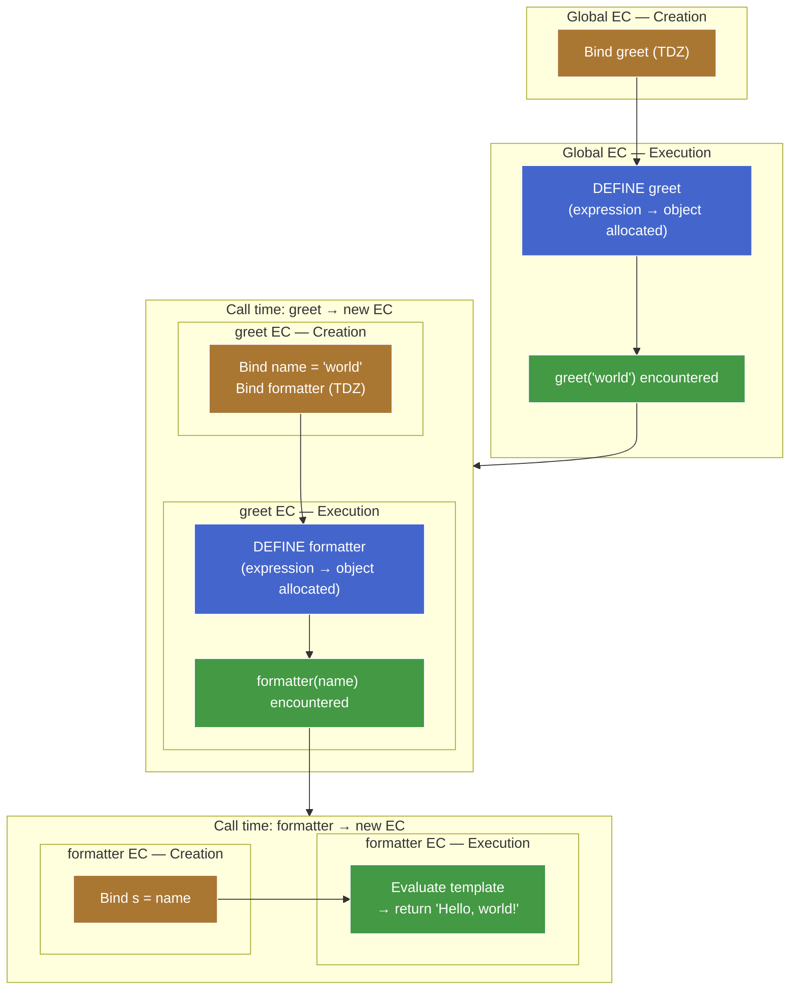
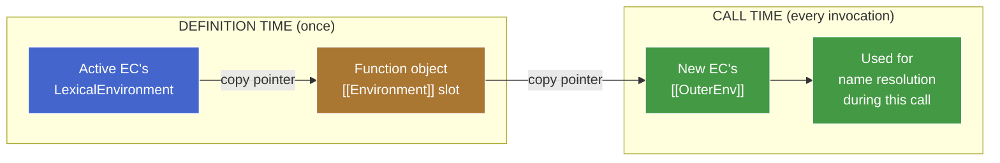
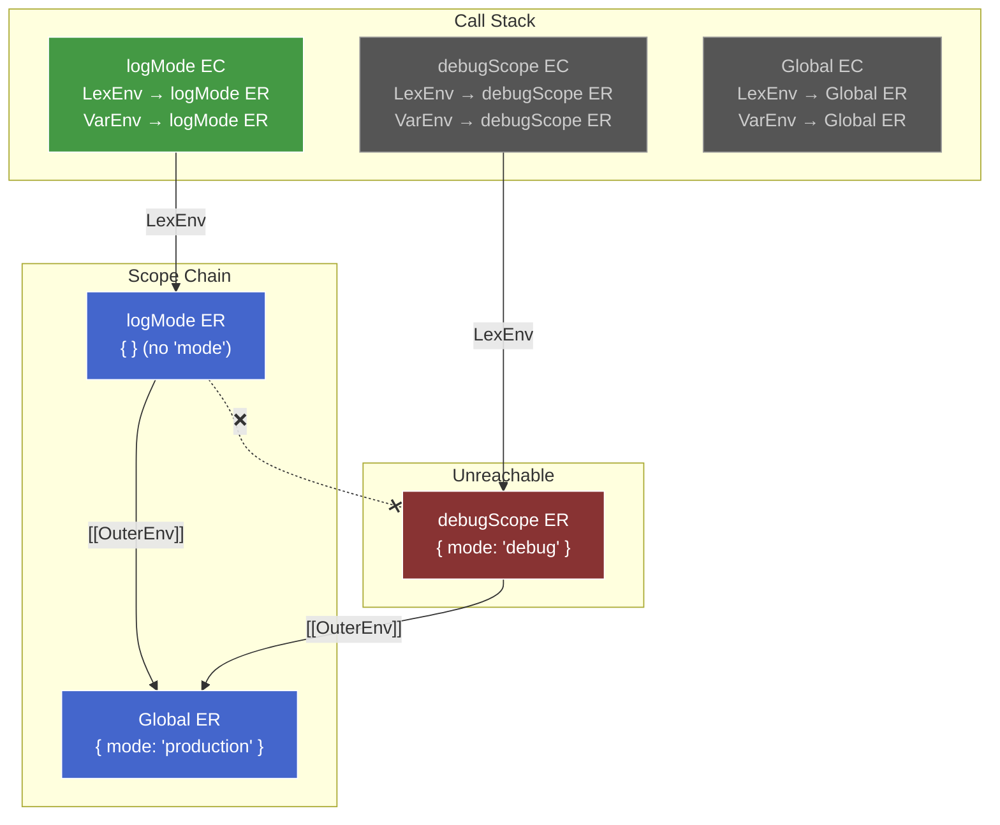

# 1. Lexical Scoping & Shadowing — Draft

> Section order below is teaching order, not final-note order. Final note will reorganize around the mental model.

## 1.1. Plan (teaching order)

- [x] Capture: definition-time → call-time bridge
- [x] Scope chain resolution (`ResolveBinding`, pointer roles)
- [x] Shadowing — first-match consequence
- [ ] Closures — ER survival via `[[Environment]]`
- [ ] Lexical vs dynamic scoping — Bash contrast

## 1.2. Capture: definition time vs call time

### 1.2.1. Two timelines, two events

A function in JS has two distinct lifecycle moments where scope-related state gets written:

1. **Definition time** — the function object is allocated. Happens when the engine processes `function f() {}` (creation phase) or `function() {}`/`() => {}` (execution phase, when the expression is evaluated).
2. **Call time** — every time the function is invoked, a fresh EC is pushed onto the call stack.

```js
let greet = function (name) {
  const formatter = (s) => `Hello, ${s}!`;
  console.log(formatter(name));
};

greet("world"); // "Hello, world!"
```



**Reading the diagram:**

- Orange nodes = creation phase of an EC (bindings set up, no values yet).
- Blue nodes = definition time (function object allocated). This happens during creation phase for declarations, execution phase for expressions/arrows.
- Green nodes = execution phase running a statement (including hitting a call expression, which then triggers a new EC).

Both `greet` and `formatter` are expressions — both get their blue "definition time" node inside a green "execution phase" zone. The creation phase (orange) only registers the *binding* (`greet` in TDZ) — the function object doesn't exist yet. This makes the three-way split visible at every level: creation phase ≠ definition time ≠ call time.

At each event, *different* fields get set with *different* sources. Conflating them is the canonical "lexical vs dynamic" trap.

### 1.2.2. Definition time — the `[[Environment]]` slot

Every function object has an internal slot called `[[Environment]]`. When the function object is allocated, this slot is filled with **the value of the currently-active `LexicalEnvironment` pointer** — i.e. the ER instance that the active EC's `LexicalEnvironment` is aimed at *right now*.

```js
let mode = "production";

function logMode() {          // ◀── function object allocated here.
  console.log(mode);          //     Active EC: Global EC.
}                             //     Active LexicalEnvironment → Global ER.
                              //     ∴ logMode.[[Environment]] = Global ER.
```

That's the capture. One pointer copy. It happens *once*, when the function object comes into existence, and never updates.

> **Aside —** It's a *reference* to the ER, not a snapshot of its bindings. Mutations to the ER (`mode = "test"` later) are visible through the captured pointer. This is the precise meaning of "closures capture references, not values."

### 1.2.3. Call time — the new EC's `[[OuterEnv]]`

When a function is called, the engine creates a fresh EC for the call. The new EC needs an `[[OuterEnv]]` to anchor the scope chain. Where does it get one?

**The rule:** `newEC.[[OuterEnv]] ← thisFunction.[[Environment]]`.

The new EC copies its `[[OuterEnv]]` from the *function object's* `[[Environment]]` slot — which was set at definition time, possibly long ago, in a possibly-unrelated part of the program.

```js
let mode = "production";

function logMode() {          // logMode.[[Environment]] = Global ER (from earlier).
  console.log(mode);
}

function debugScope() {
  let mode = "debug";
  logMode();                  // ◀── logMode() is called from here.
}                             //     The active EC at this moment is debugScope's EC.
                              //     But we don't look at debugScope's ER.
                              //     We look at logMode.[[Environment]] → Global ER.
                              //     ∴ logMode's new EC.[[OuterEnv]] = Global ER.

debugScope();
```

The caller's ER is **never consulted**. The call stack and the scope chain are two different data structures (we'll see them side-by-side in the resolution section below).

### 1.2.4. The bridge — the one diagram



The function object is the **persistence layer** between the two timelines. It carries the captured pointer through time so the call-time setup can use it.

### 1.2.5. Why this forces lexical scoping

JS is lexically scoped *because* the call-time rule is `newEC.[[OuterEnv]] ← function.[[Environment]]` instead of `newEC.[[OuterEnv]] ← caller.LexicalEnvironment`.

If the rule were the latter, JS would be **dynamically** scoped — every function would look up names in whatever scope was active at the call site, and the result of `logMode()` would depend on *who called it*, not where it was written. (We'll see what that alternative actually looks like in Bash later in this chunk.)

The choice of which pointer to copy at call time **is the choice of scoping discipline.** One assignment, one consequence — everything else falls out.

### 1.2.6. Capture-lifecycle trace through the teaser

```js
let mode = "production";

function logMode() {
  console.log(mode);
}

function debugScope() {
  let mode = "debug";
  logMode();
}

debugScope();
```

Step-by-step (capture/setup events only — the actual `mode` resolution walk is detailed in the next section):

| Moment | What happens | Resulting state |
|---|---|---|
| Creation phase of script | `logMode` and `debugScope` function objects allocated. Active `LexicalEnvironment` → Global ER. | `logMode.[[Environment]] = Global ER`<br/>`debugScope.[[Environment]] = Global ER` |
| Execution phase: `debugScope()` call | New EC pushed. Its `[[OuterEnv]] ← debugScope.[[Environment]] = Global ER`. | debugScope EC: `LexicalEnvironment → debugScope ER`, `[[OuterEnv]] → Global ER` |
| Inside `debugScope`: `let mode = "debug"` | New binding `mode = "debug"` in debugScope's ER. | debugScope ER: `{ mode: "debug" }` |
| Inside `debugScope`: `logMode()` call | New EC pushed. Its `[[OuterEnv]] ← logMode.[[Environment]] = Global ER`. **Not** debugScope's ER. | logMode EC: `LexicalEnvironment → logMode ER`, `[[OuterEnv]] → Global ER` |

The capture/setup story ends here: every EC on the stack has its pointers in place. What happens when `console.log(mode)` actually runs is the resolution walk — covered next.

---

## 1.3. Scope chain resolution — the formal walk

Now that every EC has its `[[OuterEnv]]` set, what does the engine *do* with it when it sees a name like `mode` in the source?

It runs an algorithm called `ResolveBinding`. Spec-equivalent pseudocode:

```
ResolveBinding(name, env = activeEC.LexicalEnvironment):
  if env has a binding for `name`:
    return that binding
  if env.[[OuterEnv]] is null:
    throw ReferenceError(`${name} is not defined`)
  return ResolveBinding(name, env.[[OuterEnv]])
```

In words: start at the **innermost ER** (whatever `LexicalEnvironment` currently aims at), check for the name, follow `[[OuterEnv]]` if not found, stop at the first hit or at `null`.

Three properties worth highlighting:

1. **Runtime, per reference.** Every `mode` in the source code runs `ResolveBinding` afresh. Bindings aren't "looked up once and cached" — though engines do optimize hot paths with inline caches, that's an engine optimization, not a spec guarantee.
2. **Entry point is `LexicalEnvironment`.** `VariableEnvironment` is never consulted at lookup time. Full pointer-role breakdown in the next subsection.
3. **First match wins.** No "outer match would have given a more specific result" tiebreaker. Greedy, one-shot.

### 1.3.1. How `LexicalEnvironment` and `VariableEnvironment` fit in

Both are **pointers on the EC**, not on the ER. They decide *which ER you enter the chain from* — the ER links (`[[OuterEnv]]`) are the chain itself.

| Pointer | Lives on | Role | Moves? |
|---|---|---|---|
| `LexicalEnvironment` | EC | **Read entry point.** Resolution starts here. | Yes — advances into block ERs, rewinds on block exit. |
| `VariableEnvironment` | EC | **Write target for `var`/function decls.** | No — pinned to the function-level ER for the EC's lifetime. |

Resolution never consults `VariableEnvironment`. The algorithm is: start at `currentEC.LexicalEnvironment`, walk `[[OuterEnv]]` until found. That's it.

`VariableEnvironment` exists so the engine knows *where to place* a `var` binding during creation phase — it jumps directly to the function ER without walking the chain. A write-time shortcut, not a read-time participant.

**Why `var` bindings are still reachable via normal resolution:** the function-level ER (what `VariableEnvironment` points at) is *always* an ancestor on the `[[OuterEnv]]` chain of any block ER inside that function. Block ERs are nested inside the function, so the chain is:

```
innermost block ER → [[OuterEnv]] → ... → function ER → [[OuterEnv]] → outer scope
```

Every block ER chains back up to the function ER. So `var` bindings placed there are found by the normal walk — no special read path needed.

```js
function example() {
  var x = 1;         // placed in function ER (via VariableEnvironment)

  if (true) {
    // LexicalEnvironment advances → block ER
    let z = 3;       // placed in block ER (via LexicalEnvironment)
    console.log(x);  // resolve x: block ER (miss) → [[OuterEnv]] → function ER (hit: 1)
    var w = 4;       // placed in function ER (via VariableEnvironment — skips block)
  }
  // LexicalEnvironment rewinds → function ER
  console.log(w);    // 4 — w is in function ER, reachable
  // console.log(z); // ReferenceError — block ER is unreachable (GC-eligible)
}
```

### 1.3.2. Worked trace — resolving `mode` inside `logMode`
```js
// Recopy code for reference
let mode = "production";

function logMode() {          // logMode.[[Environment]] = Global ER (from earlier).
  console.log(mode);
}

function debugScope() {
  let mode = "debug";
  logMode();                  // ◀── logMode() is called from here.
}                             //     The active EC at this moment is debugScope's EC.
                              //     But we don't look at debugScope's ER.
                              //     We look at logMode.[[Environment]] → Global ER.
                              //     ∴ logMode's new EC.[[OuterEnv]] = Global ER.

debugScope();
```

When `console.log(mode)` executes inside `logMode` (in the teaser above), the engine resolves `mode` by walking the chain. The picture below shows the call stack and the scope chain *side by side* at the moment of the lookup — note that `debugScope`'s ER is alive on the call stack but has no link into logMode's scope chain.



| Abbrev | Meaning |
|---|---|
| CS | Call Stack — all ECs alive when `console.log(mode)` runs |
| SC | Scope Chain — the `[[OuterEnv]]` path resolution actually walks |
| LexEnv | `LexicalEnvironment` — EC pointer; read entry point |
| VarEnv | `VariableEnvironment` — EC pointer; write target for `var` |
| ER | Environment Record — holds bindings |
| Unreachable | debugScope's ER is alive on the stack but has no `[[OuterEnv]]` link from logMode's chain |

**Resolution walk for `mode`:**

1. Start at the active EC's `LexicalEnvironment` → **logMode ER**. Look up `mode`. Miss (no binding).
2. Follow `[[OuterEnv]]` → **Global ER**. Look up `mode`. Hit: `"production"`. Done.

`debugScope ER` (holding `mode = "debug"`) is alive on the call stack but has **zero links** into logMode's scope chain. The scope chain is built from `[[OuterEnv]]` pointers — which trace back to the *definition site*, not the *call site*. **Call stack and scope chain are different graphs** — they only overlap when the caller happens to be the definition site, and diverge whenever a function is passed somewhere and called elsewhere.

### 1.3.3. Why the chain ends at `null`

The `[[OuterEnv]]` of the Global ER (or Module ER chained to it) is `null` — there is no scope further out. A name not found by the time the walker reaches `null` is `ReferenceError: not defined`. Compare to the "undefined" case — these are spec-distinct failure modes:

- **Binding doesn't exist** → walker reaches `null` → `ReferenceError`.
- **Binding exists, value is `undefined`** → walker hits, returns binding holding `undefined` → no error, value is `undefined`.

---

## 1.4. Shadowing — the first-match consequence

Shadowing isn't a separate rule. It's what `ResolveBinding`'s first-match-wins clause looks like when an inner ER has a binding with the same name as one in an outer ER.

```js
let x = "global";

function outer() {
  let x = "outer";

  function inner() {
    let x = "inner";
    console.log(x);     // ?
  }

  inner();
}

outer();
```

Trace `console.log(x)` inside `inner`:

1. `LexicalEnvironment` → inner's Function ER. Has `x = "inner"`. **Hit. Done.**

The walker never looks at outer's `x` or global's `x`. They still exist, are still reachable from other code, are still consulted by name resolutions starting in *their own* scope — but they're invisible to this particular lookup because something closer matched first.

### 1.4.1. Shadowing requires a different ER

Same-name bindings in the *same* ER aren't shadowing — they're either an error or an overwrite, depending on keyword:

```js
function f() {
  let x = 1;
  {                   // ◀── new Block ER pushed
    let x = 2;        // OK — different ER. Shadowing.
    console.log(x);   // 2
  }                   // ◀── Block ER discarded
  console.log(x);     // 1
}
```

```js
function f() {
  let x = 1;
  let x = 2;          // SyntaxError — same ER. let forbids redeclaration.
}
```

```js
function f() {
  var x = 1;
  var x = 2;          // No error — same ER. var allows redeclaration.
  console.log(x);     // 2
}
```

The deciding question is always *"which ER does each binding live in?"* — which is the same question chunk 6 reduced everything to. Shadowing is just two ERs in a parent-child chain, each holding their own copy of the name.

### 1.4.2. Cross-keyword shadowing trap

`var` at function level + `let` in an enclosing block don't shadow safely — `var` hoists to the Function ER, and if a `let` *with the same name* already exists in that same Function ER (declared elsewhere in the body), it's a SyntaxError. But a `var` inside a block can coexist with a `let` of the same name in an *outer* function only if they actually land in different ERs:

```js
function f() {
  let x = 1;          // function-level let → Function ER
  {
    var x = 2;        // var hoists to Function ER → collides with the let
                      // SyntaxError: Identifier 'x' has already been declared
  }
}
```

```js
function f() {
  {
    let x = 1;        // Block ER
  }
  var x = 2;          // Function ER — different ER, no collision
  console.log(x);     // 2
}
```

The trap is that `var`-in-block *looks* like it should land in the block — visually it does, syntactically it doesn't. Always ask: which ER does it land in?
