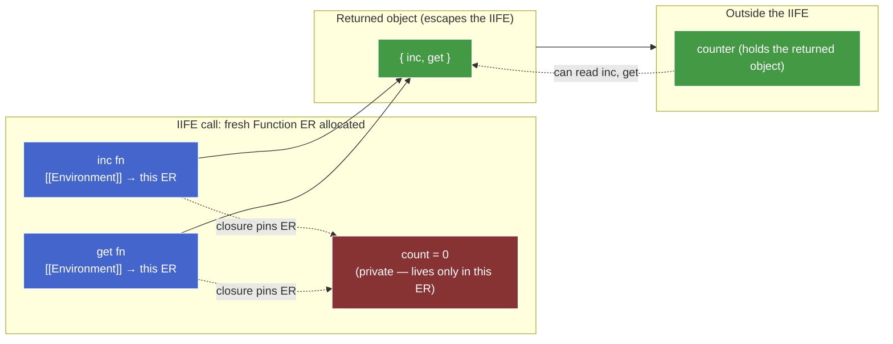

# `var` quirks & historical patterns — draft

## Plan (teaching order)

- [x] **Chunk opener** — IIFE module pattern teaser, surface the gap pre-`let` JS had to fill
- [x] **Reveal + frame** — the one axiom this chunk derives from (function = only pre-ES6 scope primitive)
- [x] **IIFE deep-dive** — parse-trick parens, the two channels (private/public), variants
- [x] **Re-declaration** — why `var x = 1; var x = 2` is legal; idempotent registration during creation phase
- [x] **Implicit globals & `"use strict"`** — failed `ResolveBinding` + sloppy fallback vs strict `ReferenceError`
- [x] **When `var` is still appropriate** — honest list: legacy code, top-level scripts, hoisted decls; mostly "almost never in new code"
- [x] **Understanding check** — 2–3 questions

---

## Chunk opener — teaser

You've been writing JS in 2010. There is no `let`, no `const`, no modules. You want a counter with a private `count` that nothing outside can touch. The pattern below was *the* idiom:

```js
var counter = (function () {       // L1
  var count = 0;                   // L2
  return {                         // L3
    inc: function () { count++; }, // L4
    get: function () { return count; }, // L5
  };                               // L6
})();                              // L7

counter.inc();                     // L8
counter.inc();                     // L9
console.log(counter.get());        // L10  — (a) ?
console.log(counter.count);        // L11  — (b) ?
console.log(typeof count);         // L12  — (c) ?
```

Three predictions:

- **(a)** what does `counter.get()` print on L10?
- **(b)** what does `counter.count` print on L11?
- **(c)** what does `typeof count` print on L12?

And one why-question to follow:

- **(d)** Pre-`let`, why was this `(function () { ... })()` wrapping the *only* way to get a "private scope" for `count`? What does the wrapping function do that `let` would do today?

Reason through using only what we've already covered — function scope, closures, `[[Environment]]` capture. No new concepts needed yet.

---

## Reveal — what the teaser was doing

| Line | Result | Mechanism |
|---|---|---|
| (a) `counter.get()` | `2` | `get` was allocated inside the IIFE call → its `[[Environment]] =` IIFE's Function ER. Each call walks that ER, reads `count`, returns the current value (`2` after two `inc()`s). |
| (b) `counter.count` | `undefined` | `counter` is the object literal on L3–L6 — it has only the keys `inc` and `get`. `count` is a *variable* in the IIFE's Function ER, not a *property* of the returned object. Property access ≠ scope-chain walk. |
| (c) `typeof count` | `"undefined"` | Top-level `count` resolution walks `LexicalEnvironment → Global ER → null` and misses. Bare `count` would `ReferenceError`; `typeof count` doesn't, because `typeof` is the one operator spec'd to swallow `ReferenceError` and return `"undefined"`. |

The interesting line is (b) — it shows the **two channels** the IIFE pattern uses:

- **Scope chain** (private channel): `count` is bound in the IIFE's Function ER. The closures inside `inc` / `get` keep that ER alive after the IIFE returns (their `[[Environment]]` pins it). Nobody outside has a reference to that ER, so nobody outside can read or write `count`.
- **Returned object** (public channel): the object literal `{ inc, get }` is the *only* thing that escapes the IIFE. It exposes exactly the operations the author chose to expose.

The pattern's payoff is the gap between those two channels — the closure captures `count` so the methods work, but `count` is never copied onto the returned object, so it's invisible from outside. That's "encapsulation via closure," and it's the entire purpose of the module pattern.

---

## The frame — one axiom this chunk derives from

> **Pre-ES6, the function was the *only* construct in JS that creates a new scope.**

That's it. Almost every `var` quirk and every pre-ES6 historical pattern is a direct consequence:

| Consequence | Mechanism |
|---|---|
| `var` has no block scope | Blocks don't create ERs for `var` — `VariableEnvironment` is pinned at the Function ER (or Global ER). Already proved in [scope-model.md](scope-model.md). |
| Loop-closure bug (`var i` shared across iterations) | Same as above — the loop body's `{ }` is a block, not a scope for `var`. |
| IIFE pattern exists at all | Need a new scope but only have one tool (the function). Build a function whose *purpose* is its scope, not its later reuse. |
| Implicit globals (`x = 42` without declaration) | Failed `ResolveBinding` walks to the Global ER and *creates* a property there (sloppy mode). The fallback target is global because there's nowhere else to fall back to. |
| `"use strict"` was added | To opt into stricter rules that would have been the default if the language had been designed from scratch with block scope. |
| `let` / `const` / modules were added later | To finally give the language scope primitives *other* than the function. |

Mental model for the rest of this chunk: every quirk and every pattern below traces back to **"function is the only scope tool you have."** When `let` / `const` / modules arrived, they didn't *fix* `var` — they made it irrelevant by giving you new scope primitives that don't have its quirks.

---

## IIFE — the pattern in detail

An IIFE (Immediately Invoked Function Expression) is a function that's defined and called in a single expression — it runs once, right where it's written, and its only purpose is to create a fresh Function ER (scope) on the spot. You never store the function or call it again; you store its *return value*. Pre-ES6, this was the sole way to manufacture a scope boundary without polluting the surrounding namespace with a named function declaration.

### Why the parens? (the parse trick)

At statement position, the JS parser commits to a `function` keyword's meaning *immediately*:

```js
function name() { ... }    // FunctionDeclaration — requires a name
function () { ... }        // SyntaxError — no name at statement position
```

So you can't just write:

```js
function () { ... }();     // SyntaxError — "function" at statement position
                           // is parsed as a declaration, which needs a name
```

The fix: force the parser into **expression** position. In expression position, `function` becomes a `FunctionExpression`, which doesn't need a name. Wrapping in parens does it:

```js
(function () { ... })();   // ✓ parens make it an expression → FunctionExpression
                           // → can be anonymous → can be invoked right away
```

Two equivalent forms in the wild:

```js
(function () { ... })();   // Crockford style — call outside the parens
(function () { ... }());   // Douglas Crockford preferred this; call inside the parens
```

Both work; both produce a `FunctionExpression`. The outer parens are the only thing that matters.

Other ways to push into expression position (rarely used, but illustrative — they all work for the same reason):

```js
!function () { ... }();    // unary ! — operand must be an expression
+function () { ... }();    // unary + — same
void function () { ... }();
```

Arrow functions, since ES6, don't have this problem — they're already expressions:

```js
(() => { ... })();         // works; arrows are expressions by syntax
```

> **Aside —** A *named* function expression also works without outer parens because the name puts it in expression form: `var x = function foo() { ... }();`. But naming is rare in IIFE practice — the function is throwaway.

### The two channels — what the IIFE buys



- **Red** = private. Lives in the IIFE's Function ER. Survives via closures' `[[Environment]]` pin, but no reference to the ER escapes.
- **Blue** = bridging closures. They have keys on the returned object (public), but their bodies read/write the private ER.
- **Green** = public surface. The only thing the outside world sees.

> **Aside — scope chain vs property chain are independent systems.** `ResolveBinding` walks ER → `[[OuterEnv]]` (handles bare identifiers like `count`). Property access walks own props → `[[Prototype]]` (handles `obj.x`). They never share state, with one exception: the Global ER's `[[ObjectRecord]]` is backed by `globalThis`, so a script-level `var x = 1` is reachable through *both* paths. For Function / Block / Module ERs (all purely Declarative), there's no backing object — bindings are invisible to any `.x` lookup. That's the structural reason `counter.count` can't reach `count` in the IIFE's Function ER, no matter what closure tricks are in play.

The two-channel separation is what `let` + modules eventually replaced. A modern equivalent:

```js
// counter.mjs
let count = 0;
export function inc() { count++; }
export function get() { return count; }
```

- Module ER replaces the IIFE's Function ER as the "private" scope.
- `export` replaces the "build an object and return it" public channel.
- No parens, no immediate invocation. The scope just *is*.

### Variants that show up in old code

- **Pass globals in for safety / minification:**
  ```js
  (function (window, document, undefined) {
    // window / document are the parameters, not free vars
    // — minifiers can rename them; engine doesn't need to walk the chain
    // — `undefined` as a param can't be shadowed (pre-ES5 globalThis.undefined was writable!)
  })(window, document);
  ```
- **Module-pattern + namespace (jQuery, Underscore-era):**
  ```js
  var MyLib = MyLib || {};
  (function (ns) {
    ns.version = "1.0";
    ns.greet = function (n) { return "Hi, " + n; };
  })(MyLib);
  ```
  Mutating a single passed-in namespace object kept the global surface to one name.
- **Configure-on-load pattern:**
  ```js
  var config = (function () {
    var env = location.hostname === "localhost" ? "dev" : "prod";
    return { env: env, apiBase: env === "dev" ? "/api" : "https://api.x.com" };
  })();
  ```
  Run setup logic once, return the result, throw the function away. Same job a top-level `const config = { ... }` does today.

---

## Re-declaration — `var x; var x;` is legal

```js
var x = 1;
var x = 2;
console.log(x);    // 2 — no error
```

Two `var x` statements in the same scope. No `SyntaxError`. Why?

During the **creation phase** (covered in [creation-execution.md](creation-execution.md)), the engine walks the source and registers `var` bindings. For each `var x` it encounters:

1. Is there already a binding named `x` in this ER? If yes, **leave it alone** (idempotent — registration is a no-op).
2. If no, create the binding and initialize it to `undefined`.

So `var x; var x;` registers `x` once and then re-registers it as a no-op. Both statements' *initializer* runs at execution time (`= 1`, then `= 2`), but the *binding* is one.

Compare:

```js
let x = 1;
let x = 2;         // SyntaxError: Identifier 'x' has already been declared
```

`let` uses a different creation-phase rule: re-binding the same name in the same ER is a static error caught at parse time, before any code runs.

> **Aside —** "Caught at parse time" means the *whole* script fails to load, not just the offending line. A `let x = 1; let x = 2;` halfway down the file means `console.log("loaded")` at line 1 never runs either. Static rule, static failure.

> **Aside — Early Errors are set-based, not line-based.** The spec's check for `let`/`var` collisions reads "it is a Syntax Error if any element of `BoundNames(LexicalDeclarations)` also appears in `VarDeclaredNames` of the same scope." `BoundNames` and `VarDeclaredNames` are static functions over the *entire* parsed AST of the scope — they enumerate every binding the scope contains, not "what's been declared so far up to line N." Set intersection is symmetric, so order doesn't matter:
>
> ```js
> var x; let x;       // SyntaxError
> let x; var x;       // SyntaxError — same sets, same intersection
> { var x; } let x;   // SyntaxError — var hoists to enclosing scope, same set
> ```
>
> This is the distinguishing property of Early Errors (a.k.a. Static Semantics): computed on the AST, position-independent. Runtime errors (`ReferenceError`, TDZ, `TypeError`) are the opposite — they depend on the order execution reaches each statement.

**Why was `var` re-declaration allowed?** Two pressures:

1. **Cross-script compatibility.** Early web pages loaded many `<script>` tags into one Global ER. If two scripts both declared `var $`, you didn't want the page to error out — last-write-wins on the value, single binding on the identifier.
2. **Function declaration semantics.** A `function f() {...}` is a `var`-like binding that's re-registered every time the source is re-evaluated (e.g. `eval`, repeated `<script>` tags). Making `var` follow the same idempotent rule kept the language consistent.

The cost: bugs hide silently. If you write `var user = {...}` at line 10 and `var user = {...}` (a different shape) at line 200 — no warning. `let` was designed to surface that.

---

## Implicit globals — the silent-assignment foot-gun

```js
function setup() {
  config = { debug: true };   // no var/let/const
}
setup();
console.log(globalThis.config); // { debug: true } — created on globalThis
```

What just happened: `config = ...` is an **assignment expression**, not a declaration. Spec mechanism:

1. **Evaluate the left-hand side.** `config` is a bare identifier → `ResolveBinding("config")`.
2. **Walk the scope chain.** Local ER (no `config`), `[[OuterEnv]]` to Global ER (no `config`), `[[OuterEnv]]` is `null`.
3. **Sloppy-mode fallback:** the assignment *creates* a property on the Global ER's `[[ObjectRecord]]` (i.e. on `globalThis`) and assigns to it. With `configurable: true`, `enumerable: true`, `writable: true`.

This isn't a `var` declaration — `var`'s rules say *function-scope or global-scope based on where you write it*. This is a **failed `ResolveBinding`** that the spec recovers from by minting a global property. The two paths look similar from outside (both end up as `globalThis.config`) but the mechanism is different.

Real-world bugs this creates:

```js
function compute() {
  for (i = 0; i < 100; i++) {   // forgot `let` / `var` — `i` is now global!
    // ...
  }
}
compute();                       // creates globalThis.i = 100
// Now any other function reading `i` sees this leaked value.
```

Or worse:

```js
function authenticate(user) {
  isAdmin = user.role === "admin";    // forgot `let` — isAdmin is global
  return token(user);
}
authenticate({role: "viewer"});       // globalThis.isAdmin = false
// Later, somewhere unrelated:
if (isAdmin) { deleteEverything(); }  // reads the leaked global
```

Silent. No error. The only signal is behavior going wrong in some other part of the program.

---

## `"use strict"` — opt into the strictness ES1 should have had

```js
"use strict";

function setup() {
  config = { debug: true };   // ReferenceError: config is not defined
}
```

`"use strict"` (the literal string as the first statement of a script or function body) flips a flag in the Realm / function that the spec calls *strict mode*. Strict mode is a list of about a dozen behavior changes — the relevant ones for this chunk:

| Sloppy mode | Strict mode |
|---|---|
| `x = 1` with undeclared `x` → creates `globalThis.x` | `ReferenceError: x is not defined` |
| Duplicate parameters `function f(a, a) {}` → silently allowed (last wins) | `SyntaxError` |
| `delete identifier;` → silently fails or behaves oddly | `SyntaxError` |
| `this` in a bare function call → `globalThis` | `this` → `undefined` |
| `with (obj) { ... }` → allowed | `SyntaxError` |
| Octal literals `0123` | `SyntaxError` |
| `eval` and `arguments` writable as identifiers | binding-illegal as identifiers |

**Scope of the directive:**

- **`"use strict";` at file top of a script** → whole script is strict.
- **`"use strict";` at function-body top** → that function and everything lexically inside it is strict.
- **Modules** are strict by default — no directive needed (`<script type="module">` or `.mjs`).
- **`class` bodies** are strict by default — no directive needed.

> **Aside —** The string-literal hack (`"use strict";`) was chosen for *forward compatibility*. An old ES3 engine that didn't know about strict mode would see the line as a no-op string expression — silently ignored. New engines treat it as a flag. The same trick is used for `"use asm";` and a few other directives.

**Practical takeaway:** in 2026, you should virtually never write a top-level non-module `<script>` without strict mode. Modules give you strict mode for free. The only place you might see sloppy mode in production today is legacy global `<script>` tags or `eval`'d strings (and `eval` is itself avoided).

---

## When is `var` still appropriate?

Short answer: **almost never in new code.** `let` / `const` cover every case `var` was the right tool for, with stricter rules and no quirks. The remaining niches:

1. **Maintaining a legacy codebase that already uses `var`.** Don't mix — consistency beats local optimization. A `let`-shaped variable in a sea of `var`-shaped variables is a code-review distraction without functional benefit.
2. **Targeting pre-ES6 runtimes without a transpiler.** Vanishingly rare in 2026 (IE11 is dead; even Node 4 had `let`). Mentioned only because it's the original use case.
3. **Intentional global attachment in a script.** If you actually *want* `var x = 1` to become `globalThis.x` (e.g. wiring up a debugging hook from a `<script>` tag), `var` does that and `let` doesn't. But `globalThis.x = 1` does the same thing more explicitly.
4. **Cross-`<script>` redeclaration.** If you have multiple `<script>` tags loading sequentially and they share a Global ER, `var x` in script A and `var x` in script B doesn't error. With `let`, the second one is a `SyntaxError`. Niche; almost always better solved with modules.

What `var` is **not** the right tool for, despite folk wisdom:

- **"Hoisting to use before declare."** A `function` declaration hoists *with its value*; a `var` hoists as `undefined`. The pattern "I want to read the variable before its declaration line" is almost never genuinely desirable — it's just `var` punning on a feature that belongs to `function` declarations. Modern style: declare at top of scope (with `const` / `let`) or factor into a function.
- **"Looser, more forgiving syntax."** Looser rules = bugs surface later, in production, with worse stack traces.

**Default in new code:** `const` first; downgrade to `let` only when you genuinely need to reassign; never `var`.

