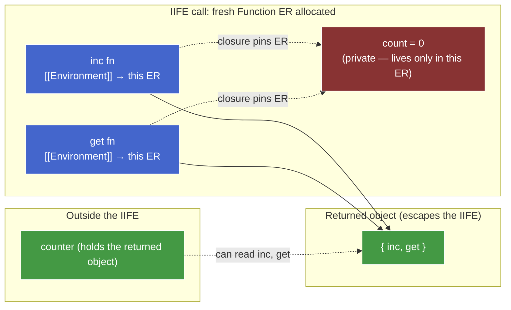

# `var` Quirks & Historical Patterns

**TL;DR** — Pre-ES6, **the function was the only construct in JS that creates a new scope.** Every `var` quirk (re-declaration, no block scope, implicit globals) and every pre-`let` pattern (IIFE, `"use strict"`) is a direct consequence of that single fact. `let` / `const` / modules didn't *fix* `var` — they added scope primitives that don't have its quirks, making `var` obsolete for new code.

Terms used: **ER** = Environment Record, `[[OuterEnv]]` = ER chain link, `ResolveBinding` = the algorithm that walks the ER chain for a name (see [lexical-scoping.md](lexical-scoping.md)), `[[ObjectRecord]]` / `[[DeclarativeRecord]]` = the two sub-records of the composite Global ER (see [scope-model.md](scope-model.md)).

---

## 1. The axiom

> Pre-ES6, the function was the *only* construct in JS that creates a new scope.

Blocks `{ }` exist syntactically but don't create new ERs for `var`. `VariableEnvironment` is pinned at the Function ER (or Global ER) and never moves. Every `var` quirk follows from this.

| Consequence | Mechanism |
|---|---|
| `var` has no block scope | Blocks don't create ERs for `var`. Already proved in [scope-model.md](scope-model.md). |
| Loop-closure bug (`var i` shared across iterations) | Loop body's `{ }` is a block, not a scope for `var`. One `i` in the Function ER, captured by every iteration's closure. |
| IIFE pattern exists at all | Need a new scope, but only have one tool (the function). Build a function whose *purpose* is its scope, not its later reuse. |
| Implicit globals (`x = 42` without declaration) | Failed `ResolveBinding` walks to Global ER, then *creates* a property on `[[ObjectRecord]]`. The fallback target is global because there's nowhere else to fall back to. |
| `"use strict"` was added | To opt into the rules the language would have had if designed from scratch with block scope. |
| `let` / `const` / modules added later | To finally give the language scope primitives *other* than the function. |

---

## 2. Re-declaration — `var x; var x;` is legal

```js
var x = 1;
var x = 2;
console.log(x);    // 2 — no error
```

**Why no error?** During the creation phase (covered in [creation-execution.md](creation-execution.md)), the engine walks the source and registers `var` bindings. For each `var x`:

1. If a binding named `x` already exists in this ER → **leave it alone** (idempotent — registration is a no-op).
2. Otherwise → create the binding, initialize to `undefined`.

So `var x; var x;` registers `x` once and re-registers it as a no-op. Both initializers (`= 1`, `= 2`) run at execution time, but there is only **one binding**.

Compare `let`:

```js
let x = 1;
let x = 2;         // SyntaxError: Identifier 'x' has already been declared
```

Different rule: `let` forbids re-binding in the same ER as a **Static Semantics Early Error**, caught at parse time.

> **Aside — Early Errors are set-based, not line-based.** The cross-keyword collision rule reads: *"It is a Syntax Error if any element of `BoundNames(LexicalDeclarations)` also appears in `VarDeclaredNames` of the same scope."* `BoundNames` and `VarDeclaredNames` are static functions over the *entire* parsed AST — they enumerate every binding in the scope, not "what's been declared so far up to line N." Set intersection is symmetric, so order doesn't matter:
>
> ```js
> var x; let x;       // SyntaxError
> let x; var x;       // SyntaxError — same sets, same intersection
> { var x; } let x;   // SyntaxError — var hoists to enclosing scope, same set
> ```
>
> This is the distinguishing property of Early Errors (a.k.a. Static Semantics): computed on the AST, position-independent. Runtime errors (`ReferenceError`, TDZ, `TypeError`) are the opposite — they depend on the order execution reaches each statement.

> **Aside — file-killer vs line-killer.** A Static Semantics error fails the *whole* script at parse time. `console.log("hi"); let x; let x;` never prints `"hi"` — parsing fails before any code runs.

**Why was `var` re-declaration allowed in the first place?**

- **Cross-script compatibility.** Early web pages loaded many `<script>` tags into one Global ER. If two scripts both declared `var $`, you didn't want the page to error out.
- **Function declaration semantics.** A `function f() {…}` is re-registered every time the source is re-evaluated (e.g. `eval`, repeated `<script>` tags). Idempotent `var` kept consistency.

The cost: silent bugs. Write `var user = {…}` at line 10 and (a different shape) at line 200 — no warning. `let` was designed to surface that.

---

## 3. Implicit globals — the silent-assignment foot-gun

```js
function setup() {
  config = { debug: true };   // no var/let/const
}
setup();
console.log(globalThis.config); // { debug: true } — created on globalThis
```

`config = …` is an **assignment expression**, not a declaration. Spec mechanism:

1. Evaluate the LHS. `config` is a bare identifier → `ResolveBinding("config")`.
2. Walk the scope chain. Local ER (miss), Global ER (miss), `[[OuterEnv]]` is `null`.
3. **Sloppy-mode fallback:** the assignment *creates* a property on Global ER's `[[ObjectRecord]]` (i.e. on `globalThis`) and assigns to it. `configurable: true, enumerable: true, writable: true`.

This is **not** a `var` declaration — it's a *failed `ResolveBinding`* that the spec recovers from by minting a global property. The two paths look similar from outside (both end up as `globalThis.config`), but the mechanism is different:

| Path | Trigger | Spec step |
|---|---|---|
| `var x = 1` at script top level | Creation-phase registration | Binding added to Global ER → `[[ObjectRecord]]` |
| `x = 1` (no declaration) at runtime | Failed runtime lookup | `ResolveBinding` falls through to Global ER, *creates* a new property on `[[ObjectRecord]]` |

Real-world bugs from path 2:

```js
function compute() {
  for (i = 0; i < 100; i++) {  // forgot `let` / `var` — `i` is now global!
    // ...
  }
}
compute();                      // creates globalThis.i = 100
// Any other function reading bare `i` now sees this leaked value.
```

Or:

```js
function authenticate(user) {
  isAdmin = user.role === "admin";   // forgot `let` — isAdmin is global
  return token(user);
}
authenticate({role: "viewer"});       // globalThis.isAdmin = false
// Later, somewhere unrelated:
if (isAdmin) { deleteEverything(); }  // reads the leaked global
```

Silent. No error. The only signal is downstream behavior going wrong.

---

## 4. `"use strict"` — opt into the strictness ES1 should have had

```js
"use strict";

function setup() {
  config = { debug: true };   // ReferenceError: config is not defined
}
```

`"use strict"` (the literal string as the first statement of a script or function body) flips a flag in the Realm / function that the spec calls *strict mode*. About a dozen behavior changes; the relevant ones for this chunk:

| Sloppy mode | Strict mode |
|---|---|
| `x = 1` with undeclared `x` → creates `globalThis.x` | `ReferenceError` |
| Duplicate parameters `function f(a, a) {}` → silently allowed (last wins) | `SyntaxError` |
| `delete identifier;` → silently fails or behaves oddly | `SyntaxError` |
| `this` in a bare function call → `globalThis` | `this` → `undefined` |
| `with (obj) { … }` → allowed | `SyntaxError` |
| Octal literals `0123` | `SyntaxError` |
| `eval` / `arguments` writable as identifiers | binding-illegal as identifiers |
| Direct `eval("var x = 1")` leaks `x` into enclosing scope | `eval` gets its own scope; `x` doesn't leak |

**Scope of the directive:**

- **At file top of a script** → whole script is strict.
- **At function-body top** → that function and everything lexically inside it is strict.
- **Modules** are strict by default — no directive needed.
- **`class` bodies** are strict by default — no directive needed.

> **Aside — why a string literal?** Forward compatibility. An old ES3 engine that didn't know about strict mode would see `"use strict";` as a no-op string expression — silently ignored. New engines treat it as a flag. The same trick is used for `"use asm";` and other directives.

**Practical takeaway:** in 2026, you should virtually never write a top-level non-module `<script>` without strict mode. Modules give you strict mode for free.

---

## 5. The IIFE pattern — function as scope primitive

The classic module pattern:

```js
const counter = (function () {     // L1 — outer parens force expression position
  let count = 0;                   // L2 — private
  return {                         // L3
    inc: function () { count++; }, // L4
    get: function () { return count; }, // L5
  };
})();                              // L6 — invoke immediately

counter.inc();
counter.inc();
console.log(counter.get());   // 2
console.log(counter.count);   // undefined — not a property of the returned object
```

Three things to see:

1. **The parens are a parse trick** — they push `function` from statement position into expression position.
2. **The IIFE produces a fresh Function ER** — that ER is the scope you wanted but couldn't otherwise have.
3. **The two-channel separation** — closures keep `count` reachable to `inc` / `get`; the returned object exposes only what the author chose to expose.

### 5.1. The parse trick

At statement position, the parser sees `function` and commits to `FunctionDeclaration`. Its grammar requires a `BindingIdentifier` after `function`:

```js
function () { … }();    // SyntaxError — `function` at statement position needs a name
```

The fix: push the parse into **expression position**, where `FunctionExpression` allows an anonymous function:

```js
(function () { … })();   // ✓ — parens force expression position
(function () { … }());   // ✓ — equivalent; Crockford preferred this form
```

Other expression-position triggers work too (illustrative; rarely used):

```js
!function () { … }();
+function () { … }();
void function () { … }();
```

Arrow functions don't need the trick — they're expressions by syntax:

```js
(() => { … })();
```

> **Aside — fix is positional, not cosmetic.** The parens don't add behavior; they change which grammar rule applies. Same anonymous-function tokens, different production, valid parse.

### 5.2. The two-channel separation



- **Red** = private. Lives in the IIFE's Function ER. Stays alive because `inc.[[Environment]]` and `get.[[Environment]]` pin the ER.
- **Blue** = bridging closures. Their bodies read/write `count` via the scope chain; they themselves are reachable as properties of the returned object.
- **Green** = public surface. The only thing the outside world holds a reference to.

> **Aside — scope chain vs property chain are independent systems.** `ResolveBinding` walks ER → `[[OuterEnv]]` (handles bare identifiers like `count`). Property access walks own props → `[[Prototype]]` (handles `obj.x`). They never share state, with one exception: the Global ER's `[[ObjectRecord]]` is backed by `globalThis`, so a script-level `var x = 1` is reachable through *both* paths. For Function / Block / Module ERs (all purely Declarative), there is no backing object — bindings are invisible to any `.x` lookup. That's the structural reason `counter.count` can't reach `count` in the IIFE's Function ER, no matter what closure tricks are in play.

### 5.3. The modern equivalent

```js
// counter.mjs
let count = 0;
export function inc() { count++; }
export function get() { return count; }
```

- Module ER replaces the IIFE's Function ER as the "private" scope.
- `export` replaces the "build an object and return it" public channel.
- No parens, no immediate invocation. The scope just *is*.

### 5.4. Variants you'll see in old code

- **Pass globals in for safety / minification:**
  ```js
  (function (window, document, undefined) {
    // window / document are parameters → minifier-renameable
    // `undefined` as a param can't be shadowed (pre-ES5 globalThis.undefined was writable!)
  })(window, document);
  ```
- **Module-pattern + namespace (jQuery / Underscore era):**
  ```js
  var MyLib = MyLib || {};
  (function (ns) {
    ns.version = "1.0";
    ns.greet = function (n) { return "Hi, " + n; };
  })(MyLib);
  ```
  Mutating a single passed-in namespace object kept the global surface to one name.
- **Configure-on-load:**
  ```js
  var config = (function () {
    var env = location.hostname === "localhost" ? "dev" : "prod";
    return { env: env, apiBase: env === "dev" ? "/api" : "https://api.x.com" };
  })();
  ```
  Run setup once, return the result, throw the function away. Top-level `const config = { … }` does the same job today.

---

## 6. When is `var` still appropriate?

Short answer: **almost never in new code.** `let` / `const` cover every case `var` was the right tool for, with stricter rules and no quirks. Remaining niches:

1. **Maintaining a legacy codebase that already uses `var`.** Consistency beats local optimization.
2. **Targeting pre-ES6 runtimes without a transpiler.** Vanishingly rare in 2026.
3. **Intentional global attachment in a script.** `var x = 1` at script top level creates `globalThis.x`; `let` doesn't. But `globalThis.x = 1` is more explicit.
4. **Cross-`<script>` redeclaration.** Multiple `<script>` tags loading sequentially share a Global ER. `var x` in script A and `var x` in script B doesn't error; `let x` does. Niche; better solved with modules.

What `var` is **not** the right tool for, despite folk wisdom:

- **"Hoisting to use before declare."** A `function` declaration hoists with its value; a `var` hoists as `undefined`. "Read before declaration" is almost never genuinely useful — it just punning `var` on a feature that belongs to `function` declarations.
- **"Looser, more forgiving."** Looser rules = bugs surface later in production with worse stack traces.

**Default in new code:** `const` first; downgrade to `let` only when you genuinely need to reassign; never `var`.

---

## 7. Takeaway

- **One axiom:** pre-ES6, the function was the only construct that creates a new scope. Every quirk and historical pattern in this note is a consequence.
- **Re-declaration is idempotent registration** at creation phase — not "overwrite." Spec invariant: one binding per name per ER for `var`.
- **Early Errors are set-based** (whole-scope AST analysis), not line-based. The `let` / `var` collision rule applies symmetrically regardless of declaration order.
- **Implicit globals are failed `ResolveBinding` + sloppy-mode fallback.** Different mechanism than `var`; same end result on `globalThis`. Strict mode turns the fallback into `ReferenceError`.
- **IIFE = "use a function for its scope, not its callability."** The parens are a parse-position fix; the closure-vs-object two-channel split is what makes encapsulation work.
- **`let` / `const` / modules made `var` obsolete** — not by fixing it, but by giving the language scope primitives that don't share its quirks.
