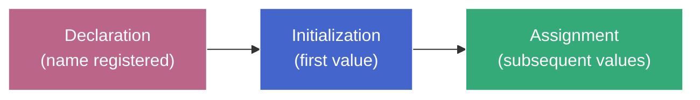

# Variable Lifecycle — The 3-Stage Model

**TL;DR:** Every JS variable goes through three stages: declaration (name registered), initialization (first value), assignment (subsequent values). The differences between `var`, `let`, and `const` reduce to _when_ each stage fires and _whether_ stage 3 is allowed. The gap between stages 1 and 2 for `let`/`const` is the TDZ (Temporal Dead Zone).

## Two phases (just enough to read the table)

When a scope is entered, the engine works in two passes:

1. **Creation phase** — scans the scope for declarations and sets up bindings. No code runs yet.
2. **Execution phase** — runs statements top-to-bottom. Assignments, function calls, expressions happen here.

The full machinery behind these phases (execution contexts, Environment Records) is covered in [execution-context.md](execution-context.md) and [creation-execution.md](creation-execution.md). For now, "creation = setup pass, execution = runtime pass" is enough.

## The three stages

Every variable goes through up to three stages in order: declaration → initialization → assignment. Not every keyword permits all three, and they fire at different times — that's the entire source of `var`/`let`/`const` behavioral differences.

| Stage              | What happens                                                                                                                                                                               | When it's "done"                                          |
| ------------------ | ------------------------------------------------------------------------------------------------------------------------------------------------------------------------------------------ | --------------------------------------------------------- |
| **Declaration**    | The engine registers the name in the current scope's Environment Record. The binding exists but has no value — not even `undefined`.                                                       | Creation phase                                            |
| **Initialization** | The binding receives its first value. For `var` this is auto-initialized to `undefined`; for `let`/`const` it stays uninitialized until the engine reaches the declarator in source order. | Creation phase (`var`) or execution phase (`let`/`const`) |
| **Assignment**     | A new value is written to an already-initialized binding.                                                                                                                                  | Execution phase (any subsequent `=`)                      |

## Why separate declaration from initialization?

The engine needs to know at creation time which names exist in a scope, but it doesn't have to give them a value yet. Separating the two stages gives the spec a slot to enforce "you declared it, but you can't use it yet" — which is exactly TDZ.

- `var` collapses stages 1 and 2 into one atomic operation during creation: declare + initialize to `undefined`. No gap → no TDZ.
- `let` and `const` perform only stage 1 during creation. Stage 2 is deferred to the point in execution where the declarator appears in source text. Between creation and that point, the binding is in the TDZ — it exists (you can't re-declare it) but accessing it throws `ReferenceError`.

### Why not just throw like Python?

Python throws `NameError` on use-before-assignment because it has no creation phase that pre-registers names. JS _does_ pre-register names — it needs to for **static scope resolution**:

1. Detect duplicate declarations (`let x; let x;` → `SyntaxError`)
2. Resolve the scope chain at compile time without running code
3. Distinguish "undeclared" (`ReferenceError: x is not defined`) from "declared but uninitialized" (`ReferenceError: Cannot access 'x' before initialization`)

Since JS can't remove pre-registration without losing these capabilities, TDZ is the mechanism that achieves "use-before-initialization = error" (the Python-like safety) while preserving the two-phase architecture that static scope resolution depends on.

## How each keyword maps to the stages

| Keyword | Stage 1 (declaration) | Stage 2 (initialization)             | Stage 3 (assignment)        |
| ------- | --------------------- | ------------------------------------ | --------------------------- |
| `var`   | Creation phase        | Creation phase (auto → `undefined`)  | Execution phase, repeatable |
| `let`   | Creation phase        | Execution phase (at declarator line) | Execution phase, repeatable |
| `const` | Creation phase        | Execution phase (at declarator line) | **Never** — `TypeError`     |

`const` and `let` are identical through stages 1 and 2. The only difference: `const` makes stage 3 permanently forbidden.

## Worked example — all three keywords

```js
console.log(a); // undefined                          // L1
console.log(b); // ReferenceError (TDZ)               // L2
console.log(c); // ReferenceError (TDZ)               // L3

var a = 1; // L4 — assignment (stage 3)
let b = 2; // L5 — initialization + assignment
const c = 3; // L6 — initialization (stage 2). No stage 3 ever.
```

**Creation phase** scans the scope:

| Binding | Stage 1       | Stage 2                    | State after creation        |
| ------- | ------------- | -------------------------- | --------------------------- |
| `a`     | ✅ registered | ✅ auto-set to `undefined` | usable (value: `undefined`) |
| `b`     | ✅ registered | ❌ deferred                | in TDZ                      |
| `c`     | ✅ registered | ❌ deferred                | in TDZ                      |

**Execution phase** runs top-to-bottom:

- L1: `a` is initialized → reads `undefined`.
- L2: `b` is uninitialized → `ReferenceError`.
- L3: `c` is uninitialized → `ReferenceError` (same as `let` in TDZ).
- L4: assigns `1` to `a` (stage 3).
- L5: initializes `b` to `2` (stage 2).
- L6: initializes `c` to `3` (stage 2). Any later `c = 5` → `TypeError`.

## `let` moving through all three stages

```js
// --- Creation phase has already run ---
// `x` is declared (stage 1 done), but uninitialized. TDZ active.

console.log(x); // L1 — ReferenceError: x is in TDZ (stage 1 only)

let x = 10; // L2 — initialization to 10 (stage 2). TDZ ends.

console.log(x); // L3 — 10

x = 20; // L4 — assignment (stage 3). New value written.

console.log(x); // L5 — 20
```

| Point                | Stage           | Binding state         | Access result    |
| -------------------- | --------------- | --------------------- | ---------------- |
| After creation phase | 1 (declared)    | exists, uninitialized | `ReferenceError` |
| After L2 executes    | 2 (initialized) | holds `10`            | `10`             |
| After L4 executes    | 3 (assigned)    | holds `20`            | `20`             |

Stage 3 is repeatable — each `x = ...` writes a new value to the already-initialized binding.

## The mental model



- `var`: A and B happen together at creation. C at runtime.
- `let`: A at creation. B at the declarator line. C anytime after.
- `const`: A at creation. B at the declarator line. C **never**.

The gap between A and B for `let`/`const` _is_ the TDZ. No gap for `var` → no TDZ.

Everything else in this course — hoisting, TDZ details, scope rules — will be consequences of _where_ and _when_ these three stages fire for each declaration kind.
