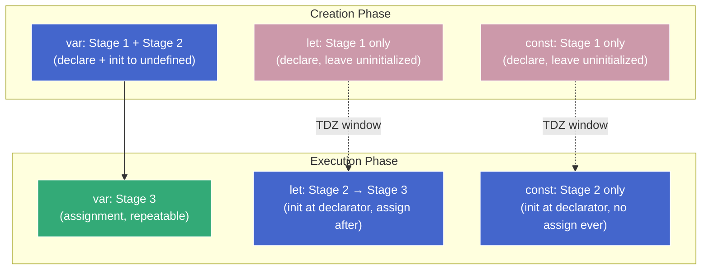

# Variable Lifecycle — The 3-Stage Model

**TL;DR:** Every JS variable goes through three stages: declaration (name registered), initialization (first value), assignment (subsequent values). The differences between `var`, `let`, and `const` reduce to _when_ each stage fires and _whether_ stage 3 is allowed. The gap between stages 1 and 2 for `let`/`const` is the TDZ (Temporal Dead Zone — accessing a declared-but-uninitialized binding throws `ReferenceError`).

## Two phases (just enough to read the rest)

When a scope is entered, the engine works in two passes:

1. **Creation phase** — scans the scope for declarations and sets up bindings. No code runs yet.
2. **Execution phase** — runs statements top-to-bottom. Assignments, function calls, expressions happen here.

The full machinery behind these phases (execution contexts, Environment Records) is covered in [execution-context.md](execution-context.md) and [creation-execution.md](creation-execution.md). For now, "creation = setup pass, execution = runtime pass" is enough.

## The three stages

Every variable goes through up to three stages in order: declaration → initialization → assignment. Not every keyword permits all three, and they fire at different times — that's the entire source of `var`/`let`/`const` behavioral differences.

| Stage              | What happens                                                                                                                                                                               |
| ------------------ | ------------------------------------------------------------------------------------------------------------------------------------------------------------------------------------------ |
| **Declaration**    | The engine registers the name in the current scope's Environment Record. The binding exists but has no value — not even `undefined`.                                                       |
| **Initialization** | The binding receives its first value. For `var` this is auto-initialized to `undefined`; for `let`/`const` it stays uninitialized until the engine reaches the declarator in source order. |
| **Assignment**     | A new value is written to an already-initialized binding.                                                                                                                                  |

## How each keyword maps to the stages

The grid — all six declarator forms, what fires in each phase:

| Form           | Stage 1 (creation)             | Stage 2 (execution, at declarator line)                                                                                    | Stage 3 (execution, later)  |
| -------------- | ------------------------------ | -------------------------------------------------------------------------------------------------------------------------- | --------------------------- |
| `let x = 5;`   | declare                        | initialize to `5`                                                                                                          | repeatable assignment       |
| `let x;`       | declare                        | initialize to `undefined`                                                                                                  | repeatable assignment       |
| `const x = 5;` | declare                        | initialize to `5`                                                                                                          | **never** — `TypeError`     |
| `const x;`     | **SyntaxError** at parse time — `const` requires an initializer (no stage 3 means a missing initializer would leave it permanently uninitialized) | —                           | —                           |
| `var x = 5;`   | declare + initialize to `undefined` | nothing (stage 2 already fired in creation); the `= 5` is stage 3, not stage 2                                         | runs `x = 5` here, then repeatable |
| `var x;`       | declare + initialize to `undefined` | nothing                                                                                                                | repeatable assignment       |

Compressed version for the essentials:

| Keyword | Stage 1 (declaration) | Stage 2 (initialization)             | Stage 3 (assignment)        |
| ------- | --------------------- | ------------------------------------ | --------------------------- |
| `var`   | Creation phase        | Creation phase (auto → `undefined`)  | Execution phase, repeatable |
| `let`   | Creation phase        | Execution phase (at declarator line) | Execution phase, repeatable |
| `const` | Creation phase        | Execution phase (at declarator line) | **Never** — `TypeError`     |

`const` and `let` are identical through stages 1 and 2. The only difference: `const` makes stage 3 permanently forbidden.



Solid arrow (`var`) = no gap between phases — stages 1+2 collapse, so the binding is immediately usable. Dashed arrows (`let`/`const`) = TDZ window — stage 1 fires in creation but stage 2 waits for execution, leaving a gap where the binding is declared but uninitialized.

## Why separate declaration from initialization?

The split isn't a free design choice. Static scoping forces declaration (stage 1) into the creation phase — it must happen before execution begins. Without that pressure, stages 1 and 2 would fuse into a single event at the declarator line (the Python model: name springs into existence at assignment, no gap). But because JS pulls declaration forward while leaving initialization behind, a temporal window opens between them. That window is the TDZ. Follow the chain:

### 1. JS has features that force declaration in creation

JS resolves scope _statically_ — every name-to-scope binding is determined before any code runs. This isn't optional; two features force it:

- **Hoisting** (`var` + function declarations) — names (and for functions, values) must be available before their textual position. The engine must know a `var` name belongs to the function even if its declarator sits inside an `if (false)` branch. See [hoisting.md](hoisting.md).
- **Block-scoped shadowing** — `{ console.log(x); let x = 2; }` must know at compile time that the inner `x` shadows any outer `x`. See [scope-lexical.md](scope-lexical.md).

Both need the engine to "know what names exist where" before execution starts. That's what the **creation phase** does — it walks the scope and registers every declared name.

### 2. When does initialization happen?

Declaration (stage 1) must happen in the creation phase. The design question is: when does stage 2 (initialization) happen? Two approaches:

- **Collapse stages 1+2 in creation** — the `var` approach: auto-initialize to `undefined` immediately. The binding is always usable, but silent bugs slip through:

  ```js
  if (!user) {
    // L1 — runs, because user is undefined
    redirectToLogin(); // L2 — wrong branch taken
  }
  var user = getUser(); // L3
  ```

  Python doesn't have this problem because it throws `NameError` on use-before-assignment — but Python has no creation phase to leave a window in.

- **Defer stage 2 to execution** — the `let`/`const` approach: stage 1 runs in creation, stage 2 waits until the declarator line. Between them, the binding exists but is marked uninitialized — any read throws `ReferenceError: Cannot access 'x' before initialization`.

### 3. TDZ is option 2

TDZ is the name for that "declared but uninitialized" window. It's how JS gets Python-like use-before-init errors while keeping the creation phase that hoisting and block shadowing require. Full treatment in [tdz.md](tdz.md).

The lifecycle mapping falls out of this:

- `var` → option 1. Stages 1+2 collapse during creation; no window exists.
- `let`/`const` → option 2. Only stage 1 runs in creation; stage 2 is deferred; the window is the TDZ.

**The principle:** JS is a _statically scoped language with dynamic execution_. Static scoping requires the creation phase. Deferring initialization creates a window. TDZ is the cheapest mechanism for making that window safe.

## Worked examples — each keyword through its stages

### `var` — stages 1+2 collapse, stage 3 repeatable

```js
// --- Creation phase: `y` declared AND initialized to undefined (stages 1+2) ---

console.log(y); // L1 — undefined (no TDZ, already initialized)

var y = 10; // L2 — assignment (stage 3). Overwrites undefined with 10.

console.log(y); // L3 — 10

y = 20; // L4 — assignment (stage 3 again). New value written.

console.log(y); // L5 — 20
```

| Point                | Stage              | Binding state     | Access result |
| -------------------- | ------------------ | ----------------- | ------------- |
| After creation phase | 1+2 (initialized)  | holds `undefined` | `undefined`   |
| After L2 executes    | 3 (assigned)       | holds `10`        | `10`          |
| After L4 executes    | 3 (assigned again) | holds `20`        | `20`          |

No TDZ — stages 1 and 2 happen together, so there's never a window where the binding is uninitialized.

### `let` — stage 1 at creation, stages 2+3 at execution

```js
// --- Creation phase: `x` declared but NOT initialized (stage 1 only). TDZ active. ---

console.log(x); // L1 — ReferenceError: x is in TDZ (stage 1 only)

let x = 10; // L2 — initialization to 10 (stage 2). TDZ ends.

console.log(x); // L3 — 10

x = 20; // L4 — assignment (stage 3). New value written.

console.log(x); // L5 — 20
```

| Point                | Stage           | Binding state         | Access result    |
| -------------------- | --------------- | --------------------- | ---------------- |
| After creation phase | 1 (declared)    | exists, uninitialized | `ReferenceError` |
| After L2 executes    | 2 (initialized) | holds `10`            | `10`             |
| After L4 executes    | 3 (assigned)    | holds `20`            | `20`             |

Stage 3 is repeatable — each `x = ...` writes a new value to the already-initialized binding.

### `const` — stage 1 at creation, stage 2 at execution, stage 3 never

```js
// --- Creation phase: `z` declared but NOT initialized (stage 1 only). TDZ active. ---

console.log(z); // L1 — ReferenceError: z is in TDZ (stage 1 only)

const z = 10; // L2 — initialization to 10 (stage 2). TDZ ends.

console.log(z); // L3 — 10

z = 20; // L4 — TypeError: Assignment to constant variable (stage 3 forbidden)
```

| Point                | Stage           | Binding state         | Access result    |
| -------------------- | --------------- | --------------------- | ---------------- |
| After creation phase | 1 (declared)    | exists, uninitialized | `ReferenceError` |
| After L2 executes    | 2 (initialized) | holds `10`            | `10`             |
| L4 attempted         | 3 (blocked)     | still holds `10`      | `TypeError`      |

Stage 3 is permanently locked. The binding holds its initialization value forever — but the _value itself_ can still be mutated if it's an object (e.g. `const arr = []; arr.push(1)` works fine).

---

Everything else in this course — hoisting, TDZ details, scope rules — will be consequences of _where_ and _when_ these three stages fire for each declaration kind.
