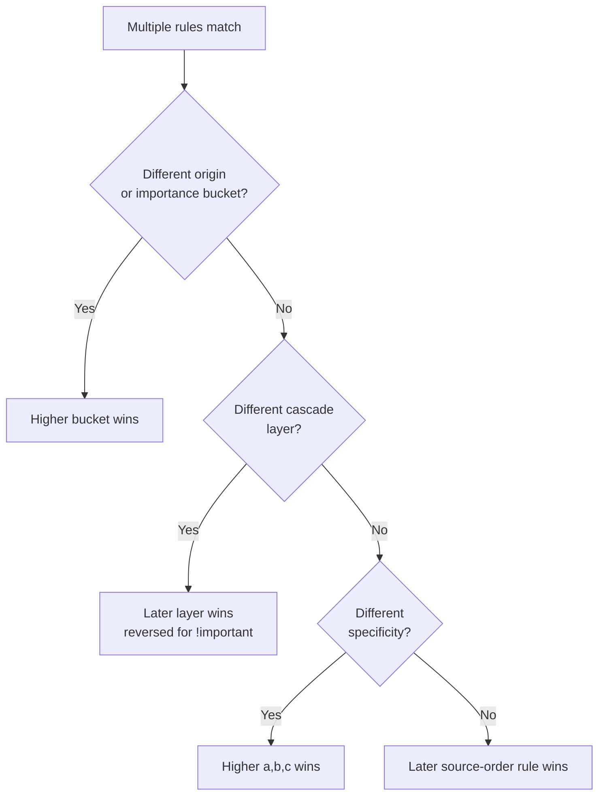

# Specificity & The Cascade

**TL;DR**

- When multiple rules match, the browser resolves in this order: **origin & importance → cascade layers → specificity → source order**. First difference decides.
- Specificity is an `(a, b, c)` tuple: a = IDs, b = classes/attrs/pseudo-classes, c = tags/pseudo-elements. Compared left-to-right like a version number.
- `!important` flips a declaration into a separate bucket with **reversed** origin order — this is why a user's `!important` can beat an author's.
- `@layer` lets you declare priority explicitly; later layers win **regardless of specificity**. Unlayered styles beat all layered ones.
- `:where()` is the modern low-specificity escape hatch (always contributes 0).

---

## The full resolution order



## Origin — who wrote the CSS

Three sources, in ascending default priority:

1. **User-agent** — the browser's built-in defaults.
2. **User** — end-user overrides (extensions, accessibility settings).
3. **Author** — your stylesheet.

## Importance — `!important` and the reversed bucket

`!important` moves a declaration into the "important" bucket, which is resolved in **reverse** origin order:

| Priority (low → high) | Bucket |
|---|---|
| 1 | user-agent *normal* |
| 2 | user *normal* |
| 3 | author *normal* |
| 4 | author `!important` |
| 5 | user `!important` |
| 6 | user-agent `!important` |

The reversal exists so that a user with accessibility needs can always override an author — the author cannot lock them out. Within the same bucket, later steps (layers, specificity, order) take over.

Rule of thumb: don't reach for `!important` to win a specificity fight. Refactor the selector or use `@layer`.

## Cascade Layers — `@layer`

Groups rules into explicitly ordered priority tiers:

```css
@layer reset, base, components, utilities;

@layer components {
  .btn { background: blue; }   /* (0,1,0) */
}
@layer utilities {
  button { background: red; }  /* (0,0,1) — but wins */
}
```

Rules to remember:

- Later layers beat earlier layers, **regardless of specificity**.
- **Unlayered styles beat all layered styles** of the same origin.
- For `!important`, layer order **reverses** — earlier layers win. Same reasoning as origin reversal: lets reset/base enforce non-negotiables.

Why it exists: before `@layer`, the only ways to guarantee an override were higher specificity or `!important`, which escalated into arms races.

## Specificity — the `(a, b, c)` tuple

Count three things in the selector:

| Slot | Counts | Example |
|---|---|---|
| **a** | IDs | `#header` |
| **b** | classes, attributes, pseudo-**classes** | `.btn`, `[type=text]`, `:hover` |
| **c** | types, pseudo-**elements** | `div`, `::before` |

Universal `*` and combinators contribute **nothing**.

Compared left-to-right like a version number: `(1,0,0)` beats `(0,99,99)`. One ID outweighs any number of classes.

```css
#main .card h2    /* (1,1,1) */
.card.featured h2 /* (0,2,1) */
h2.title          /* (0,1,1) */
h2                /* (0,0,1) */
```

### Inline styles

Inline `style="..."` is effectively `(1,0,0,0)` — above any selector. Override only with `!important` (or a more important bucket).

### Logical pseudo-classes twist the count

| Function | Specificity contribution |
|---|---|
| `:is(a, b, c)` | the **highest** among its arguments |
| `:where(a, b, c)` | **always 0** |
| `:not(a, b, c)` | the **highest** among its arguments |
| `:has(a, b, c)` | the **highest** among its arguments |

```css
:is(#sidebar, .menu) a     /* (1,0,1) — takes #sidebar */
:where(#sidebar, .menu) a  /* (0,0,1) — :where zeros it */
```

`:where()` is the go-to for library/reset styles: consumers override without a fight.

## Source order — the final tiebreaker

Identical origin, layer, and specificity → **later rule wins**. "Later" includes later in the file, later `<link>`, later `@import`, later `<style>` block.

```css
.btn { color: blue; }
.btn { color: red; }   /* wins */
```

This is also why "put overrides last" works — it literally exploits this step.

## Intuition to carry

- Specificity measures how *precisely* a selector points at an element, not how "important" the author intends.
- **IDs in stylesheets are a trap** — the specificity cliff is painful to override. Prefer classes.
- `:where()` + `@layer` are the modern tools for managing overrides without escalation.

## Debugging flow

1. DevTools Styles panel: the winning rule is on top; losers are struck through.
2. Check `!important` and layer badges *before* blaming specificity.
3. Raise specificity naturally (add a class, scope the selector) before adding `!important`.
4. Recurring cascade fights = introduce `@layer`, don't escalate.

## See also

- [selectors-basics.md](./selectors-basics.md) — what builds up the specificity count.
- [modern-selectors.md](./modern-selectors.md) — `:is()`, `:where()`, `:not()`, `:has()` in depth.
