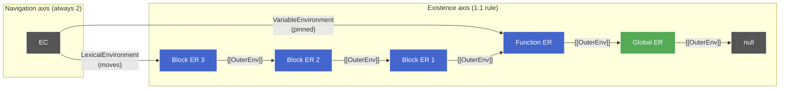

# ER Confusion: Existence vs Navigation

**TL;DR:** Two questions that look similar but are completely different: (1) "how many ERs exist?" — answered by the 1:1 rule, and (2) "how does the EC find them?" — answered by the two pointers. Mixing them up makes the model feel contradictory when it isn't.

## The 1:1 rule applies to all ERs

Every scope boundary creates exactly one fresh ER. This holds uniformly:

| Scope boundary            | ER created     |
| ------------------------- | -------------- |
| Block (`{}`, `for`, `if`) | Declarative ER |
| Function call             | Function ER    |
| Module top-level          | Module ER      |
| Global                    | Global ER      |

`VariableEnvironment` doesn't break this rule — it just points to the function-scope ER from inside a nested block. That ER still belongs to exactly one scope (the function). It's not "shared across scopes"; it's being _accessed_ from a nested scope via a pointer.

## The source of confusion

The confusion arises from mixing two independent questions:

1. **How many ERs exist?** — One per scope boundary. The 1:1 rule. Could be 1, 3, 10 — depends on nesting depth.
2. **How does the EC find them?** — Always exactly two pointers (`LexicalEnvironment` and `VariableEnvironment`), regardless of how many ERs exist.

These axes are independent. Three nested blocks inside a function means four ERs exist (function + three blocks), but the EC still has exactly two pointers — `LexicalEnvironment` just moves to point at whichever block ER is current, while `VariableEnvironment` stays pinned to the function ER. The pointer count is fixed; the ER count grows with nesting.

Left side: four ERs exist (one per scope boundary entered). Right side: the EC always has exactly two pointers. `LexicalEnvironment` currently targets the innermost block; `VariableEnvironment` never left the function ER. The `[[OuterEnv]]` chain connects the ERs independently of the EC's pointers.

## ER type depends on scope type

"Fresh ER" means a new instance of the appropriate subtype for that kind of scope — not a generic container. The type determines what extra fields are available (`[[ThisValue]]` on Function ER, import bindings on Module ER, the composite routing on Global ER).

See [execution-context.md](execution-context.md) for the full type hierarchy and how each pointer behaves.
