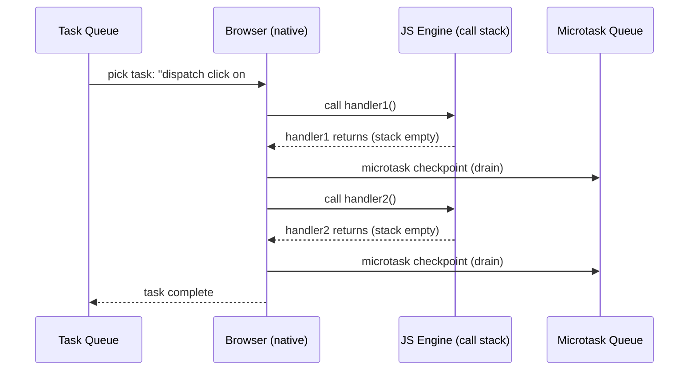

# Event Dispatch: Tasks, the Native Boundary, and Further Study

**TL;DR:** A task is a unit of browser work, not "one callback." For click events, the single task is "dispatch click on this element" — the browser's native dispatch algorithm walks the listener list, entering and exiting JS for each handler. Microtask checkpoints happen between handlers because the JS stack is genuinely empty between those native→JS transitions. This note captures the mental model and maps out where to go deeper (specs, V8 internals, modern scheduling APIs).

## The Core Reframe: Tasks Are Jobs

The simplified "1 task = 1 callback" model works for `setTimeout` — a timer task's job really is "call this one function." But a task is a **unit of work the browser needs to do**:

- Sometimes that's calling one JS function (timer callback).
- Sometimes it's calling several (event dispatch with multiple listeners).
- Sometimes it's calling none (purely internal browser work — layout, GC, navigation).

For a click event with two listeners:

```
Task queue: [ "dispatch click on #btn" ]   ← one task
```

Not two tasks. Not two callbacks in the queue. One job: "dispatch this event."

## The Native Dispatch Algorithm

When the event loop picks the "dispatch click" task, the browser (C++/Rust, not JS) runs its dispatch algorithm:

```
for each listener registered on this element:
    call listener()        ← enters JS (fresh top-level invocation)
    listener returns       ← exits JS, stack empty
    // microtask checkpoint: stack is empty, drain microtask queue
```

Key insight: **the dispatch loop is native code.** It doesn't occupy a JS stack frame. Each `call listener()` is a fresh entry into JS from the native side — the handler's frame is the only thing on the stack. When it returns, the stack is truly empty, triggering the microtask checkpoint.



## Physical Click vs Scripted Dispatch

The difference is entirely about **what's on the JS stack**:

| Dispatch method                   | Stack during handler          | Stack between handlers           | Microtasks drain between? |
| --------------------------------- | ----------------------------- | -------------------------------- | ------------------------- |
| Physical click (user action)      | `[handler]` only              | `[]` (empty)                     | Yes                       |
| `btn.click()` / `dispatchEvent()` | `[caller, .click(), handler]` | `[caller, .click()]` (not empty) | No                        |

Scripted dispatch is a synchronous JS call — the caller stays on the stack. The stack never empties between handlers, so no microtask checkpoint fires. Same rule applied to different stack shapes.

## Where You Are vs Where to Go

### What's already solid

From `courses/async-js/`: event loop two-queue model, microtask drain semantics, promise scheduling from first principles, `await` desugaring, task-based yielding, the dispatch model above. This is beyond "Hard Parts" / YDKJS level — you're reasoning at the spec/implementation boundary.

### Deeper study paths (in order of ROI)

#### 1. WHATWG HTML Spec — Event Loop Processing Model

The actual algorithm the browser implements. Formalizes what you already reason about informally.

- **What:** [HTML §8.1.7 — Event loop processing model](https://html.spec.whatwg.org/multipage/webappapis.html#event-loop-processing-model)
- **Focus on:** the full task → microtask → render cycle, "perform a microtask checkpoint" algorithm, how "update the rendering" is optional (browsers skip frames if nothing changed)
- **Why it's useful now:** you'll see that "microtask checkpoint" isn't just "stack empty" — it's a specific algorithm with re-entrancy guards. The spec also defines task sources (not just one queue — multiple task queues with browser-chosen priority).

#### 2. DOM Spec — Event Dispatch Algorithm

The formal version of the "walk the listener list" pseudocode above.

- **What:** [DOM Living Standard §2.9 — Dispatching events](https://dom.spec.whatwg.org/#dispatching-events)
- **Focus on:** the inner invoke algorithm (step-by-step listener invocation), what happens when a listener calls `stopImmediatePropagation`, listener removal mid-dispatch (snapshot semantics), and the capture/bubble phase mechanics
- **Why it's useful now:** answers edge cases like "if handler1 removes handler2, does handler2 still fire?" (yes — the listener list is snapshotted at dispatch start in most implementations, though the spec is subtler)

#### 3. V8 Internals — Microtask Checkpoint Implementation

How the C++ side actually decides "is it time to drain microtasks?"

- **What:** V8 blog posts + source (`src/execution/microtask-queue.cc`)
- **Key concept:** `MicrotasksScope` — V8 doesn't just check "is the stack empty." The embedder (browser/Node) controls when microtask checkpoints happen via scoping. The browser opens a scope before calling into JS and closes it after — the close triggers the drain.
- **Why it's useful now:** explains why `btn.click()` doesn't drain between handlers at the implementation level (the scope opened by the caller hasn't closed), not just the spec-level "stack isn't empty" explanation.

#### 4. Scheduler API — `scheduler.yield()` and Task Priorities

The modern evolution of "yield to the task queue."

- **What:** [Prioritized Task Scheduling API](https://wicg.github.io/scheduling-apis/) — `scheduler.postTask()`, `scheduler.yield()`
- **Why it matters:** `setTimeout(fn, 0)` has a 4ms clamp after nesting. `scheduler.yield()` yields without the clamp and preserves task priority. This is the platform catching up to the problem you already understand (task-based yielding for responsiveness).
- **Status:** shipping in Chrome, behind flags elsewhere. The concepts are stable even if the API is still rolling out.

#### 5. Chromium Source — Event Dispatch (optional, deep end)

If you want to see the actual C++ that implements "for each listener, call into JS":

- `third_party/blink/renderer/core/dom/events/event_dispatcher.cc`
- `third_party/blink/renderer/core/dom/events/event_target.cc` → `FireEventListeners()`

This is where the native loop lives. You'll see the snapshot of listeners, the propagation-stopped checks, and the V8 entry points.

### What to skip

- Frontend Masters "Hard Parts" — you're past this level
- YDKJS Async & Performance — already covered at deeper depth
- General "event loop explainer" articles — you wrote one
- ECMAScript spec for event loop — it only defines Jobs (microtasks); the event loop itself is HTML/host-defined

## Reading Strategy

These aren't "courses to take" — they're specs and source to read selectively:

1. **Start with the HTML event loop processing model** (30 min). Read it with your existing mental model as a decoder ring. Note where the spec is more precise than your notes.
2. **DOM dispatch algorithm** (20 min). Focus on the "inner invoke" steps. Try to predict what the spec says before reading each step.
3. **V8 microtask scope** — read one or two blog posts, then skim the source if curious. The blog posts are enough for the mental model; the source is for confirmation.
4. **Scheduler API** — read the explainer doc, try `scheduler.yield()` in Chrome DevTools. This is practical, not theoretical.

## Related

- [js-engine-runtime.md](./js-engine-runtime.md) — the engine/runtime split that makes the native boundary meaningful.
- [events-targets.md](./events-targets.md) — `EventTarget` as the interface; this note covers what happens _inside_ dispatch.
